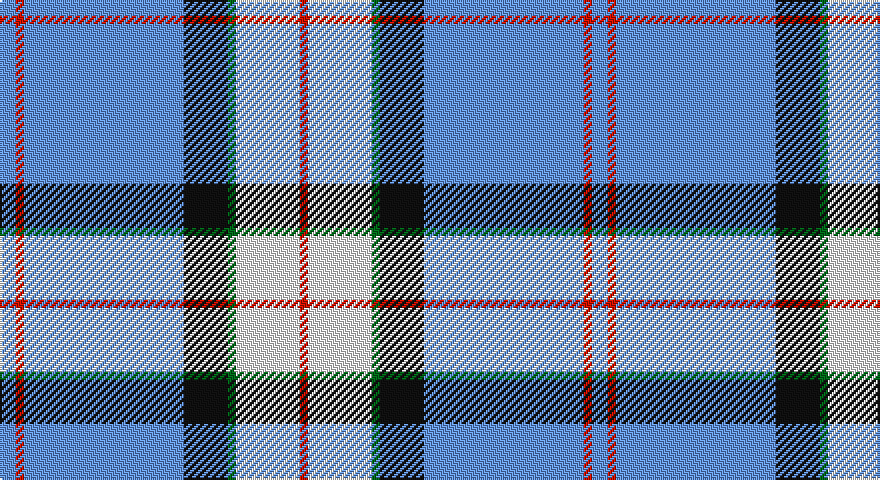

This page is one **sett** — a single exact thread-count. It belongs to the [tartan](/setts/b4r2b40k11g2w16r2/)
(the same proportion at any scale), whose colour order is pattern [BRBKGWR](/stripes/brbkgwr/).

Sourced from register-of-tartans.  It is a [7 stripe tartan](/stripes/stripes7/).

Original link https://www.tartanregister.gov.uk/tartanDetails.aspx?ref=3793

## Also known as

This cloth is also recorded under:

- Sinclair, Blue

## Register references

External register numbers recorded for this tartan.

- Scottish Register of Tartans: [3793](https://www.tartanregister.gov.uk/tartanDetails.aspx?ref=3793)
- Scottish Tartans Authority (ITI): 2047
- Scottish Tartans World Register: 2047

## Thread count
B/8 R4 B80 K22 G4 W32 R/4

One full sett is **296 threads**.

## Palette

Palette: <strong>Tartan Register</strong> <small style="color:#888">(4 of 6 colours)</small>
<table><thead><tr><th>Colour</th><th>Threads</th><th>Shade</th><th>Base</th><th>OKLCh</th></tr></thead><tbody><tr><td>B/</td><td style="text-align:right;font-variant-numeric:tabular-nums">8</td><td><code style="background-color:#6495ED;">#6495ED</code> <small style="color:#888">#6495ED</small></td><td>B <code style="background-color:#2A418A;">#2A418A</code></td><td><small style="color:#888">oklch(67.5% 0.141 261.3)</small></td></tr><tr><td>R</td><td style="text-align:right;font-variant-numeric:tabular-nums">4</td><td><code style="background-color:#CC1100;">#CC1100</code> <small style="color:#888">#CC1100</small></td><td>R <code style="background-color:#CC0000;">#CC0000</code></td><td><small style="color:#888">oklch(53.5% 0.214 30.2)</small></td></tr><tr><td>B</td><td style="text-align:right;font-variant-numeric:tabular-nums">80</td><td><code style="background-color:#6495ED;">#6495ED</code> <small style="color:#888">#6495ED</small></td><td>B <code style="background-color:#2A418A;">#2A418A</code></td><td><small style="color:#888">oklch(67.5% 0.141 261.3)</small></td></tr><tr><td>K</td><td style="text-align:right;font-variant-numeric:tabular-nums">22</td><td><code style="background-color:#101010;">#101010</code> <small style="color:#888">#101010</small></td><td>K <code style="background-color:#000000;">#000000</code></td><td><small style="color:#888">oklch(17.3% 0.000 89.9)</small></td></tr><tr><td>G</td><td style="text-align:right;font-variant-numeric:tabular-nums">4</td><td><code style="background-color:#006818;">#006818</code> <small style="color:#888">#006818</small></td><td>G <code style="background-color:#006100;">#006100</code></td><td><small style="color:#888">oklch(45.0% 0.142 145.0)</small></td></tr><tr><td>W</td><td style="text-align:right;font-variant-numeric:tabular-nums">32</td><td><code style="background-color:#F8F8F8;">#F8F8F8</code> <small style="color:#888">#F8F8F8</small></td><td>W <code style="background-color:#F7F7F7;">#F7F7F7</code></td><td><small style="color:#888">oklch(97.9% 0.000 89.9)</small></td></tr><tr><td>R/</td><td style="text-align:right;font-variant-numeric:tabular-nums">4</td><td><code style="background-color:#CC1100;">#CC1100</code> <small style="color:#888">#CC1100</small></td><td>R <code style="background-color:#CC0000;">#CC0000</code></td><td><small style="color:#888">oklch(53.5% 0.214 30.2)</small></td></tr></tbody></table>

# Sample pattern

## Nearest tartans

The nearest existing variants by ΔTartan distance, with this tartan at the top so the swatches line up against it.

ΔTartan

Tartan

Sett

—

<a href="/ttd/edit/#slug=b4r2b40k11g2w16r2~x2">Jack Sinclair (Personal)</a> <a class="nn-out" href="/variants/s7/b4r2b40k11g2w16r2~x2/" title="open its dictionary page">↗</a>

0.91

<a href="/ttd/edit/#slug=lt25db11r5w1k1~x4&amp;base=b4r2b40k11g2w16r2~x2">Mount Vernon Primary School</a> <a class="nn-out" href="/variants/s5/lt25db11r5w1k1~x4/" title="open its dictionary page">↗</a>

0.97

<a href="/ttd/edit/#slug=lb25db11r5w1k1~x4&amp;base=b4r2b40k11g2w16r2~x2">Mount Vernon Primary School (Corp)</a> <a class="nn-out" href="/variants/s5/lb25db11r5w1k1~x4/" title="open its dictionary page">↗</a>

1.16

<a href="/ttd/edit/#slug=db41t2w2t2db5b12w31db4~x2&amp;base=b4r2b40k11g2w16r2~x2">Harmony, Eildon</a> <a class="nn-out" href="/variants/s8/db41t2w2t2db5b12w31db4~x2/" title="open its dictionary page">↗</a>

1.19

<a href="/ttd/edit/#slug=b26w28b14ly3k1ly2k1~x2&amp;base=b4r2b40k11g2w16r2~x2">Gothenburg</a> <a class="nn-out" href="/variants/s7/b26w28b14ly3k1ly2k1~x2/" title="open its dictionary page">↗</a>

1.25

<a href="/ttd/edit/#slug=db41ti2w2ti2db5t12w31db4~x2&amp;base=b4r2b40k11g2w16r2~x2">Harmony Eildon (Dance)</a> <a class="nn-out" href="/variants/s8/db41ti2w2ti2db5t12w31db4~x2/" title="open its dictionary page">↗</a>

1.25

<a href="/ttd/edit/#slug=w3dbi2w30db30k2db2ly3~x2&amp;base=b4r2b40k11g2w16r2~x2">Torridon, Saphire (Dance)</a> <a class="nn-out" href="/variants/s7/w3dbi2w30db30k2db2ly3~x2/" title="open its dictionary page">↗</a>

1.27

<a href="/ttd/edit/#slug=w15ly2k5lb3b40k10&amp;base=b4r2b40k11g2w16r2~x2">Herriot New Zealand</a> <a class="nn-out" href="/variants/s6/w15ly2k5lb3b40k10/" title="open its dictionary page">↗</a>

1.28

<a href="/ttd/edit/#slug=db26w28db14ly3k1ly2k1~x2&amp;base=b4r2b40k11g2w16r2~x2">Gothenburg/Goteborg</a> <a class="nn-out" href="/variants/s7/db26w28db14ly3k1ly2k1~x2/" title="open its dictionary page">↗</a>

1.32

<a href="/ttd/edit/#slug=r3g2k9lb2k2lb24ly2lb2ly1~x2&amp;base=b4r2b40k11g2w16r2~x2">Bell Family Tartan</a> <a class="nn-out" href="/variants/s9/r3g2k9lb2k2lb24ly2lb2ly1~x2/" title="open its dictionary page">↗</a>

1.34

<a href="/ttd/edit/#slug=t2db1k1db20w20db1w2~x4&amp;base=b4r2b40k11g2w16r2~x2">Cunningham, Dress Blue (Dance) Fashion Tartan</a> <a class="nn-out" href="/variants/s7/t2db1k1db20w20db1w2~x4/" title="open its dictionary page">↗</a>

## Neighbour map

Every grey dot is one of 14360 variants placed by the first two principal components of the ΔTartan feature space (44% of its variance). Red is this tartan; blue dots are its nearest — click one to open its page.

<svg viewBox="0 0 640 380" role="img" style="max-width:100%;height:auto;border:1px solid #e0e0e0;border-radius:4px;display:block" xmlns="http://www.w3.org/2000/svg"><image href="/nn/cloud.v1.png" width="640" height="380"/><a href="/variants/s5/lt25db11r5w1k1~x4/"><circle cx="299.8" cy="133.4" r="4" fill="#3465a4"><title>Mount Vernon Primary School</title></circle></a><a href="/variants/s5/lb25db11r5w1k1~x4/"><circle cx="314.1" cy="136.4" r="4" fill="#3465a4"><title>Mount Vernon Primary School (Corp)</title></circle></a><a href="/variants/s8/db41t2w2t2db5b12w31db4~x2/"><circle cx="285.9" cy="135.9" r="4" fill="#3465a4"><title>Harmony, Eildon</title></circle></a><a href="/variants/s7/b26w28b14ly3k1ly2k1~x2/"><circle cx="312.4" cy="134.6" r="4" fill="#3465a4"><title>Gothenburg</title></circle></a><a href="/variants/s8/db41ti2w2ti2db5t12w31db4~x2/"><circle cx="278.5" cy="134.5" r="4" fill="#3465a4"><title>Harmony Eildon (Dance)</title></circle></a><a href="/variants/s7/w3dbi2w30db30k2db2ly3~x2/"><circle cx="238.7" cy="122.5" r="4" fill="#3465a4"><title>Torridon, Saphire (Dance)</title></circle></a><a href="/variants/s6/w15ly2k5lb3b40k10/"><circle cx="251.6" cy="139.1" r="4" fill="#3465a4"><title>Herriot New Zealand</title></circle></a><a href="/variants/s7/db26w28db14ly3k1ly2k1~x2/"><circle cx="308.0" cy="132.9" r="4" fill="#3465a4"><title>Gothenburg/Goteborg</title></circle></a><a href="/variants/s9/r3g2k9lb2k2lb24ly2lb2ly1~x2/"><circle cx="318.0" cy="91.9" r="4" fill="#3465a4"><title>Bell Family Tartan</title></circle></a><a href="/variants/s7/t2db1k1db20w20db1w2~x4/"><circle cx="288.4" cy="129.3" r="4" fill="#3465a4"><title>Cunningham, Dress Blue (Dance) Fashion Tartan</title></circle></a><circle cx="286.2" cy="119.9" r="5" fill="#c00000"/></svg>

ID: /variants/s7/b4r2b40k11g2w16r2~x2/
