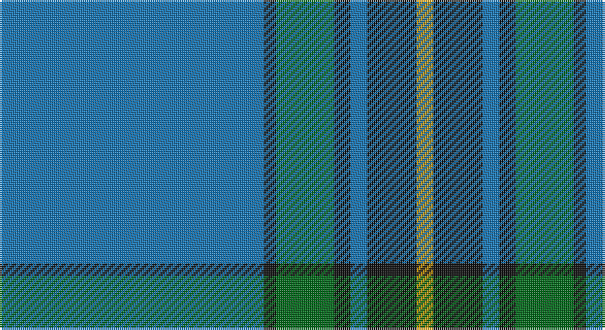

This page is one **sett** — a single exact thread-count. It belongs to the [tartan](/setts/b64k3g14k4b4k12lo4/)
(the same proportion at any scale), whose colour order is pattern [BKGKBKY](/stripes/bkgkbky/).

Part of the [Murray of Elibank](/tartans/murray-of-elibank/) tartan — the named design grouping this sett with its other cloths.

Sourced from register-of-tartans.  It is a [7 stripe tartan](/stripes/stripes7/).

Original link https://www.tartanregister.gov.uk/tartanDetails.aspx?ref=3066

2 attestations — the source records this cloth was collapsed from (oldest owns this page)

<ul>
<li>01/01/1930 — Murray of Elibank (register-of-tartans, <a href="https://www.tartanregister.gov.uk/tartanDetails.aspx?ref=3066">record</a>)</li>
<li>1930 — Murray of Elibank (Personal) (tartans-authority, <a href="http://www.tartansauthority.com/tartan-ferret/display/340/">record</a>)</li>
</ul>

## Register references

External register numbers recorded for this tartan.

- Scottish Register of Tartans: [3066](https://www.tartanregister.gov.uk/tartanDetails.aspx?ref=3066)
- Scottish Tartans Authority (ITI): 340
- Scottish Tartans World Register: 340

## Thread count
B/128 K6 G28 K8 B8 K24 DY/8

One full sett is **284 threads**.

## Palette

Palette: <strong>Tartan Register</strong> <small style="color:#888">(3 of 4 colours)</small>
<table><thead><tr><th>Colour</th><th>Threads</th><th>Shade</th><th>Base</th><th>OKLCh</th></tr></thead><tbody><tr><td>B/</td><td style="text-align:right;font-variant-numeric:tabular-nums">128</td><td><code style="background-color:#1474B4;">#1474B4</code> <small style="color:#888">#1474B4</small></td><td>B <code style="background-color:#2A418A;">#2A418A</code></td><td><small style="color:#888">oklch(54.0% 0.129 245.1)</small></td></tr><tr><td>K</td><td style="text-align:right;font-variant-numeric:tabular-nums">6</td><td><code style="background-color:#101010;">#101010</code> <small style="color:#888">#101010</small></td><td>K <code style="background-color:#000000;">#000000</code></td><td><small style="color:#888">oklch(17.3% 0.000 89.9)</small></td></tr><tr><td>G</td><td style="text-align:right;font-variant-numeric:tabular-nums">28</td><td><code style="background-color:#006818;">#006818</code> <small style="color:#888">#006818</small></td><td>G <code style="background-color:#006100;">#006100</code></td><td><small style="color:#888">oklch(45.0% 0.142 145.0)</small></td></tr><tr><td>K</td><td style="text-align:right;font-variant-numeric:tabular-nums">8</td><td><code style="background-color:#101010;">#101010</code> <small style="color:#888">#101010</small></td><td>K <code style="background-color:#000000;">#000000</code></td><td><small style="color:#888">oklch(17.3% 0.000 89.9)</small></td></tr><tr><td>B</td><td style="text-align:right;font-variant-numeric:tabular-nums">8</td><td><code style="background-color:#1474B4;">#1474B4</code> <small style="color:#888">#1474B4</small></td><td>B <code style="background-color:#2A418A;">#2A418A</code></td><td><small style="color:#888">oklch(54.0% 0.129 245.1)</small></td></tr><tr><td>K</td><td style="text-align:right;font-variant-numeric:tabular-nums">24</td><td><code style="background-color:#101010;">#101010</code> <small style="color:#888">#101010</small></td><td>K <code style="background-color:#000000;">#000000</code></td><td><small style="color:#888">oklch(17.3% 0.000 89.9)</small></td></tr><tr><td>DY/</td><td style="text-align:right;font-variant-numeric:tabular-nums">8</td><td><code style="background-color:#D09800;">#D09800</code> <small style="color:#888">#D09800</small></td><td>Y <code style="background-color:#F2BF00;">#F2BF00</code></td><td><small style="color:#888">oklch(71.4% 0.147 82.1)</small></td></tr></tbody></table>

# Sample pattern

## Nearest tartans

The nearest existing variants by ΔTartan distance, with this tartan at the top so the swatches line up against it.

ΔTartan

Tartan

Sett

—

<a href="/ttd/edit/#slug=b64k3g14k4b4k12lo4~x2">Murray of Elibank</a> <a class="nn-out" href="/variants/s7/b64k3g14k4b4k12lo4~x2/" title="open its dictionary page">↗</a>

1.10

<a href="/ttd/edit/#slug=db40g3db2g12k2g2ly2g2k3~x2&amp;base=b64k3g14k4b4k12lo4~x2">Oliver, hunting</a> <a class="nn-out" href="/variants/s9/db40g3db2g12k2g2ly2g2k3~x2/" title="open its dictionary page">↗</a>

1.18

<a href="/ttd/edit/#slug=db16w1db1w1db8g16r1db2~x2&amp;base=b64k3g14k4b4k12lo4~x2">Roxburgh</a> <a class="nn-out" href="/variants/s8/db16w1db1w1db8g16r1db2~x2/" title="open its dictionary page">↗</a>

1.18

<a href="/ttd/edit/#slug=g23db3k8db4g4db56ly8&amp;base=b64k3g14k4b4k12lo4~x2">Tern House</a> <a class="nn-out" href="/variants/s7/g23db3k8db4g4db56ly8/" title="open its dictionary page">↗</a>

1.27

<a href="/ttd/edit/#slug=r2t21r2db6ly1r1~x4&amp;base=b64k3g14k4b4k12lo4~x2">Lauder Primary School (Corporate)</a> <a class="nn-out" href="/variants/s6/r2t21r2db6ly1r1~x4/" title="open its dictionary page">↗</a>

1.29

<a href="/ttd/edit/#slug=lb5dy6w2g7w2b44w2~x2&amp;base=b64k3g14k4b4k12lo4~x2">Leblant-Macqueron (Personal)</a> <a class="nn-out" href="/variants/s7/lb5dy6w2g7w2b44w2~x2/" title="open its dictionary page">↗</a>

1.35

<a href="/ttd/edit/#slug=db40g8k1ly2k1g8db5~x4&amp;base=b64k3g14k4b4k12lo4~x2">Salvation Army, Hunting</a> <a class="nn-out" href="/variants/s7/db40g8k1ly2k1g8db5~x4/" title="open its dictionary page">↗</a>

1.40

<a href="/ttd/edit/#slug=dt1r1dt10t1dt1t5dt1w1~x6&amp;base=b64k3g14k4b4k12lo4~x2">A2 (Personal)</a> <a class="nn-out" href="/variants/s8/dt1r1dt10t1dt1t5dt1w1~x6/" title="open its dictionary page">↗</a>

1.41

<a href="/ttd/edit/#slug=db23w1db1w1db8g22r1db3~x4&amp;base=b64k3g14k4b4k12lo4~x2">Roxburgh, Green (District)</a> <a class="nn-out" href="/variants/s8/db23w1db1w1db8g22r1db3~x4/" title="open its dictionary page">↗</a>

1.43

<a href="/ttd/edit/#slug=k2db36g12w3r2~x2&amp;base=b64k3g14k4b4k12lo4~x2">Cleland</a> <a class="nn-out" href="/variants/s5/k2db36g12w3r2~x2/" title="open its dictionary page">↗</a>

1.43

<a href="/ttd/edit/#slug=n42db2n2db17lo8db4~x2&amp;base=b64k3g14k4b4k12lo4~x2">Connecticut State Police PB (Cor.)</a> <a class="nn-out" href="/variants/s6/n42db2n2db17lo8db4~x2/" title="open its dictionary page">↗</a>

## Neighbour map

Every grey dot is one of 14360 variants placed by the first two principal components of the ΔTartan feature space (44% of its variance). Red is this tartan; blue dots are its nearest — click one to open its page.

<svg viewBox="0 0 640 380" role="img" style="max-width:100%;height:auto;border:1px solid #e0e0e0;border-radius:4px;display:block" xmlns="http://www.w3.org/2000/svg"><image href="/nn/cloud.v1.png" width="640" height="380"/><a href="/variants/s9/db40g3db2g12k2g2ly2g2k3~x2/"><circle cx="397.4" cy="139.8" r="4" fill="#3465a4"><title>Oliver, hunting</title></circle></a><a href="/variants/s8/db16w1db1w1db8g16r1db2~x2/"><circle cx="368.9" cy="181.2" r="4" fill="#3465a4"><title>Roxburgh</title></circle></a><a href="/variants/s7/g23db3k8db4g4db56ly8/"><circle cx="370.7" cy="175.4" r="4" fill="#3465a4"><title>Tern House</title></circle></a><a href="/variants/s6/r2t21r2db6ly1r1~x4/"><circle cx="413.5" cy="165.4" r="4" fill="#3465a4"><title>Lauder Primary School (Corporate)</title></circle></a><a href="/variants/s7/lb5dy6w2g7w2b44w2~x2/"><circle cx="398.8" cy="138.3" r="4" fill="#3465a4"><title>Leblant-Macqueron (Personal)</title></circle></a><a href="/variants/s7/db40g8k1ly2k1g8db5~x4/"><circle cx="486.5" cy="143.3" r="4" fill="#3465a4"><title>Salvation Army, Hunting</title></circle></a><a href="/variants/s8/dt1r1dt10t1dt1t5dt1w1~x6/"><circle cx="371.9" cy="194.4" r="4" fill="#3465a4"><title>A2 (Personal)</title></circle></a><a href="/variants/s8/db23w1db1w1db8g22r1db3~x4/"><circle cx="374.5" cy="158.4" r="4" fill="#3465a4"><title>Roxburgh, Green (District)</title></circle></a><a href="/variants/s5/k2db36g12w3r2~x2/"><circle cx="387.2" cy="169.2" r="4" fill="#3465a4"><title>Cleland</title></circle></a><a href="/variants/s6/n42db2n2db17lo8db4~x2/"><circle cx="380.8" cy="179.7" r="4" fill="#3465a4"><title>Connecticut State Police PB (Cor.)</title></circle></a><circle cx="413.1" cy="162.1" r="5" fill="#c00000"/></svg>

ID: /variants/s7/b64k3g14k4b4k12lo4~x2/
