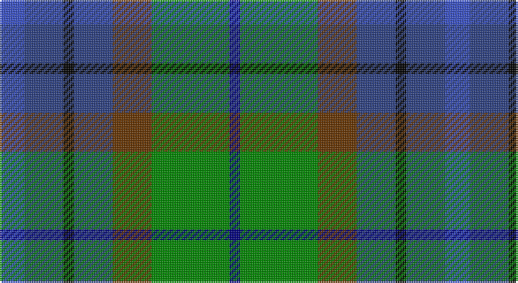

This page is one **sett** — a single exact thread-count. It belongs to the [tartan](/setts/b7dbi11k3dbi11dy11g22db3/)
(the same proportion at any scale), whose colour order is pattern [BBKBGGB](/stripes/bbkbggb/).

Part of the [Scottish Odyssey](/tartans/scottish-odyssey/) tartan — the named design grouping this sett with its other cloths.

Sourced from register-of-tartans.  It is a [7 stripe tartan](/stripes/stripes7/).

Original link https://www.tartanregister.gov.uk/tartanDetails.aspx?ref=3737

## Register references

External register numbers recorded for this tartan.

- Scottish Register of Tartans: [3737](https://www.tartanregister.gov.uk/tartanDetails.aspx?ref=3737)
- Scottish Tartans Authority (ITI): 4071

## Thread count
Ba/14 B22 K6 B22 T22 G44 DB/6

One full sett is **252 threads**.

## Palette

Palette: <strong>Tartan Register</strong> <small style="color:#888">(3 of 6 colours)</small>
<table><thead><tr><th>Colour</th><th>Threads</th><th>Shade</th><th>Base</th><th>OKLCh</th></tr></thead><tbody><tr><td>Ba/</td><td style="text-align:right;font-variant-numeric:tabular-nums">14</td><td><code style="background-color:#3850C8;">#3850C8</code> <small style="color:#888">#3850C8</small></td><td>B <code style="background-color:#2A418A;">#2A418A</code></td><td><small style="color:#888">oklch(48.8% 0.188 269.4)</small></td></tr><tr><td>B</td><td style="text-align:right;font-variant-numeric:tabular-nums">22</td><td><code style="background-color:#2C4084;">#2C4084</code> <small style="color:#888">#2C4084</small></td><td>B <code style="background-color:#2A418A;">#2A418A</code></td><td><small style="color:#888">oklch(39.4% 0.117 268.3)</small></td></tr><tr><td>K</td><td style="text-align:right;font-variant-numeric:tabular-nums">6</td><td><code style="background-color:#000000;">#000000</code> <small style="color:#888">#000000</small></td><td>K <code style="background-color:#000000;">#000000</code></td><td><small style="color:#888">oklch(0.0% 0.000 0.0)</small></td></tr><tr><td>B</td><td style="text-align:right;font-variant-numeric:tabular-nums">22</td><td><code style="background-color:#2C4084;">#2C4084</code> <small style="color:#888">#2C4084</small></td><td>B <code style="background-color:#2A418A;">#2A418A</code></td><td><small style="color:#888">oklch(39.4% 0.117 268.3)</small></td></tr><tr><td>T</td><td style="text-align:right;font-variant-numeric:tabular-nums">22</td><td><code style="background-color:#663300;">#663300</code> <small style="color:#888">#663300</small></td><td>G <code style="background-color:#006100;">#006100</code></td><td><small style="color:#888">oklch(38.0% 0.092 56.8)</small></td></tr><tr><td>G</td><td style="text-align:right;font-variant-numeric:tabular-nums">44</td><td><code style="background-color:#008800;">#008800</code> <small style="color:#888">#008800</small></td><td>G <code style="background-color:#006100;">#006100</code></td><td><small style="color:#888">oklch(54.3% 0.185 142.5)</small></td></tr><tr><td>DB/</td><td style="text-align:right;font-variant-numeric:tabular-nums">6</td><td><code style="background-color:#000080;">#000080</code> <small style="color:#888">#000080</small></td><td>B <code style="background-color:#2A418A;">#2A418A</code></td><td><small style="color:#888">oklch(27.1% 0.188 264.1)</small></td></tr></tbody></table>

# Sample pattern

## Nearest tartans

The nearest existing variants by ΔTartan distance, with this tartan at the top so the swatches line up against it.

ΔTartan

Tartan

Sett

—

<a href="/ttd/edit/#slug=b7dbi11k3dbi11dy11g22db3~x2">Scottish Odyssey</a> <a class="nn-out" href="/variants/s7/b7dbi11k3dbi11dy11g22db3~x2/" title="open its dictionary page">↗</a>

0.66

<a href="/ttd/edit/#slug=db7b12k3b12dy12g25dt3~x2&amp;base=b7dbi11k3dbi11dy11g22db3~x2">Scottish Odyssey (Fashion)</a> <a class="nn-out" href="/variants/s7/db7b12k3b12dy12g25dt3~x2/" title="open its dictionary page">↗</a>

0.76

<a href="/ttd/edit/#slug=r2dt3b12k11g11ly2~x2&amp;base=b7dbi11k3dbi11dy11g22db3~x2">Huntly Gordon 2000 (Commem)</a> <a class="nn-out" href="/variants/s6/r2dt3b12k11g11ly2~x2/" title="open its dictionary page">↗</a>

0.92

<a href="/ttd/edit/#slug=dt3b12k11g11ly2g11k11b12dt3r2~x2&amp;base=b7dbi11k3dbi11dy11g22db3~x2">Huntly Gordon 2000</a> <a class="nn-out" href="/variants/s10/dt3b12k11g11ly2g11k11b12dt3r2~x2/" title="open its dictionary page">↗</a>

0.99

<a href="/ttd/edit/#slug=w3db17o16dbi2dg17ly2~x2&amp;base=b7dbi11k3dbi11dy11g22db3~x2">Atlantic, Ancient</a> <a class="nn-out" href="/variants/s6/w3db17o16dbi2dg17ly2~x2/" title="open its dictionary page">↗</a>

1.08

<a href="/ttd/edit/#slug=dp2b6n1b3lb1b4k6g5k1g5dp2~x4&amp;base=b7dbi11k3dbi11dy11g22db3~x2">Smithers (Name)</a> <a class="nn-out" href="/variants/s11/dp2b6n1b3lb1b4k6g5k1g5dp2~x4/" title="open its dictionary page">↗</a>

1.12

<a href="/ttd/edit/#slug=k1ly1db8g10dbi7w1~x2&amp;base=b7dbi11k3dbi11dy11g22db3~x2">Porteous Family Tartan</a> <a class="nn-out" href="/variants/s6/k1ly1db8g10dbi7w1~x2/" title="open its dictionary page">↗</a>

1.12

<a href="/ttd/edit/#slug=w3dbi17dy16db2dg17ly2~x2&amp;base=b7dbi11k3dbi11dy11g22db3~x2">Atlantic Ancient Trade Tartan</a> <a class="nn-out" href="/variants/s6/w3dbi17dy16db2dg17ly2~x2/" title="open its dictionary page">↗</a>

1.19

<a href="/ttd/edit/#slug=dp11db2t4db21k16dg19ly4~x2&amp;base=b7dbi11k3dbi11dy11g22db3~x2">Ayrshire (International Tartans)</a> <a class="nn-out" href="/variants/s7/dp11db2t4db21k16dg19ly4~x2/" title="open its dictionary page">↗</a>

1.19

<a href="/ttd/edit/#slug=r3dp8g20k20db17k3lg3~x2&amp;base=b7dbi11k3dbi11dy11g22db3~x2">Gracey (2013)</a> <a class="nn-out" href="/variants/s7/r3dp8g20k20db17k3lg3~x2/" title="open its dictionary page">↗</a>

1.19

<a href="/variants/s11/r2k1g7k6n7ni2n7k6g7k1lo2~x4/">Smith (Clan)</a>

## Neighbour map

Every grey dot is one of 14360 variants placed by the first two principal components of the ΔTartan feature space (44% of its variance). Red is this tartan; blue dots are its nearest — click one to open its page.

<svg viewBox="0 0 640 380" role="img" style="max-width:100%;height:auto;border:1px solid #e0e0e0;border-radius:4px;display:block" xmlns="http://www.w3.org/2000/svg"><image href="/nn/cloud.v1.png" width="640" height="380"/><a href="/variants/s7/db7b12k3b12dy12g25dt3~x2/"><circle cx="132.5" cy="216.5" r="4" fill="#3465a4"><title>Scottish Odyssey (Fashion)</title></circle></a><a href="/variants/s6/r2dt3b12k11g11ly2~x2/"><circle cx="76.0" cy="218.6" r="4" fill="#3465a4"><title>Huntly Gordon 2000 (Commem)</title></circle></a><a href="/variants/s10/dt3b12k11g11ly2g11k11b12dt3r2~x2/"><circle cx="74.4" cy="215.2" r="4" fill="#3465a4"><title>Huntly Gordon 2000</title></circle></a><a href="/variants/s6/w3db17o16dbi2dg17ly2~x2/"><circle cx="119.5" cy="198.7" r="4" fill="#3465a4"><title>Atlantic, Ancient</title></circle></a><a href="/variants/s11/dp2b6n1b3lb1b4k6g5k1g5dp2~x4/"><circle cx="96.4" cy="208.0" r="4" fill="#3465a4"><title>Smithers (Name)</title></circle></a><a href="/variants/s6/k1ly1db8g10dbi7w1~x2/"><circle cx="165.0" cy="202.4" r="4" fill="#3465a4"><title>Porteous Family Tartan</title></circle></a><a href="/variants/s6/w3dbi17dy16db2dg17ly2~x2/"><circle cx="132.5" cy="207.4" r="4" fill="#3465a4"><title>Atlantic Ancient Trade Tartan</title></circle></a><a href="/variants/s7/dp11db2t4db21k16dg19ly4~x2/"><circle cx="111.3" cy="203.1" r="4" fill="#3465a4"><title>Ayrshire (International Tartans)</title></circle></a><a href="/variants/s7/r3dp8g20k20db17k3lg3~x2/"><circle cx="111.4" cy="213.5" r="4" fill="#3465a4"><title>Gracey (2013)</title></circle></a><a href="/variants/s11/r2k1g7k6n7ni2n7k6g7k1lo2~x4/"><circle cx="90.6" cy="205.9" r="4" fill="#3465a4"><title>Smith (Clan)</title></circle></a><circle cx="102.2" cy="216.9" r="5" fill="#c00000"/></svg>

ID: /variants/s7/b7dbi11k3dbi11dy11g22db3~x2/
