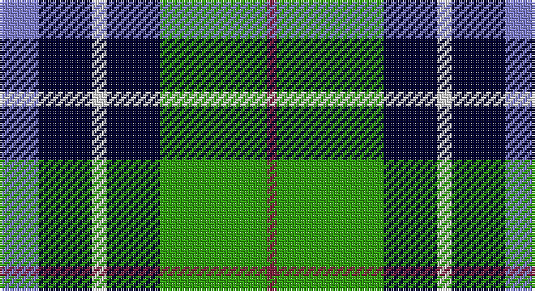

This page is one **sett** — a single exact thread-count. It belongs to the [tartan](/setts/b8k11w3k11g12g10m2/)
(the same proportion at any scale), whose colour order is pattern [BKWKGGR](/stripes/bkwkggr/).

Part of the [Loch Katrine](/tartans/loch-katrine/) tartan — the named design grouping this sett with its other cloths.

Sourced from weddslist.  It is a [7 stripe tartan](/stripes/stripes7/).

Original link http://www.weddslist.com/cgi-bin/tartans/pg.pl?source=sts

## Thread count
B/16 DB22 LN6 DB22 G24 G20 DR/4

One full sett is **208 threads**.

## Palette

Palette: <strong>Tartan Dictionary</strong> <small style="color:#888">(1 of 5 colours)</small>
<table><thead><tr><th>Colour</th><th>Threads</th><th>Shade</th><th>Base</th><th>OKLCh</th></tr></thead><tbody><tr><td>B/</td><td style="text-align:right;font-variant-numeric:tabular-nums">16</td><td><code style="background-color:#8080D0;">#8080D0</code> <small style="color:#888">#8080D0</small></td><td>B <code style="background-color:#2A418A;">#2A418A</code></td><td><small style="color:#888">oklch(63.4% 0.119 282.5)</small></td></tr><tr><td>DB</td><td style="text-align:right;font-variant-numeric:tabular-nums">22</td><td><code style="background-color:#000030;">#000030</code> <small style="color:#888">#000030</small></td><td>K <code style="background-color:#000000;">#000000</code></td><td><small style="color:#888">oklch(14.0% 0.097 264.1)</small></td></tr><tr><td>LN</td><td style="text-align:right;font-variant-numeric:tabular-nums">6</td><td><code style="background-color:#E0E0E0;">#E0E0E0</code> <small style="color:#888">#E0E0E0</small></td><td>W <code style="background-color:#F7F7F7;">#F7F7F7</code></td><td><small style="color:#888">oklch(90.7% 0.000 89.9)</small></td></tr><tr><td>DB</td><td style="text-align:right;font-variant-numeric:tabular-nums">22</td><td><code style="background-color:#000030;">#000030</code> <small style="color:#888">#000030</small></td><td>K <code style="background-color:#000000;">#000000</code></td><td><small style="color:#888">oklch(14.0% 0.097 264.1)</small></td></tr><tr><td>G</td><td style="text-align:right;font-variant-numeric:tabular-nums">24</td><td><code style="background-color:#30A010;">#30A010</code> <small style="color:#888">#30A010</small></td><td>G <code style="background-color:#006100;">#006100</code></td><td><small style="color:#888">oklch(61.9% 0.195 140.5)</small></td></tr><tr><td>G</td><td style="text-align:right;font-variant-numeric:tabular-nums">20</td><td><code style="background-color:#30A010;">#30A010</code> <small style="color:#888">#30A010</small></td><td>G <code style="background-color:#006100;">#006100</code></td><td><small style="color:#888">oklch(61.9% 0.195 140.5)</small></td></tr><tr><td>DR/</td><td style="text-align:right;font-variant-numeric:tabular-nums">4</td><td><code style="background-color:#802040;">#802040</code> <small style="color:#888">#802040</small></td><td>R <code style="background-color:#CC0000;">#CC0000</code></td><td><small style="color:#888">oklch(40.8% 0.132 5.2)</small></td></tr></tbody></table>

# Sample pattern

## Compared to the master

This cloth is one sett of its design; the master sett (the exemplar the design is anchored on) is below for comparison.

<figure style="margin:0"><figcaption style="color:#888;font-size:smaller">this sett</figcaption></figure>
<figure style="margin:0"><figcaption style="color:#888;font-size:smaller"><a href="/setts/t8dt11w3dt11db12g10r2/">master sett →</a></figcaption></figure>

## Nearest tartans

The nearest existing variants by ΔTartan distance, with this tartan at the top so the swatches line up against it.

ΔTartan

Tartan

Sett

—

<a href="/ttd/edit/#slug=b8k11w3k11g12g10m2~x2">Loch Katrine</a> <a class="nn-out" href="/variants/s7/b8k11w3k11g12g10m2~x2/" title="open its dictionary page">↗</a>

1.17

<a href="/ttd/edit/#slug=db4g6w1g6k6db6k2~x4&amp;base=b8k11w3k11g12g10m2~x2">MacNeil of Colonsay</a> <a class="nn-out" href="/variants/s7/db4g6w1g6k6db6k2~x4/" title="open its dictionary page">↗</a>

1.18

<a href="/ttd/edit/#slug=db8g8db1g8k8db8ly2~x2&amp;base=b8k11w3k11g12g10m2~x2">MacKay</a> <a class="nn-out" href="/variants/s7/db8g8db1g8k8db8ly2~x2/" title="open its dictionary page">↗</a>

1.22

<a href="/ttd/edit/#slug=t3g6k6t4r1t1~x2&amp;base=b8k11w3k11g12g10m2~x2">Wellington, or Waterloo</a> <a class="nn-out" href="/variants/s6/t3g6k6t4r1t1~x2/" title="open its dictionary page">↗</a>

1.32

<a href="/ttd/edit/#slug=k2g13k11t4w9k2~x2&amp;base=b8k11w3k11g12g10m2~x2">Loch Leven, Check</a> <a class="nn-out" href="/variants/s6/k2g13k11t4w9k2~x2/" title="open its dictionary page">↗</a>

1.33

<a href="/ttd/edit/#slug=k8dg8k1dg8k8b8w2~x2&amp;base=b8k11w3k11g12g10m2~x2">Unidentified No 31</a> <a class="nn-out" href="/variants/s7/k8dg8k1dg8k8b8w2~x2/" title="open its dictionary page">↗</a>

1.34

<a href="/ttd/edit/#slug=r2db10k5g12w2~x2&amp;base=b8k11w3k11g12g10m2~x2">Davidson of Tulloch</a> <a class="nn-out" href="/variants/s5/r2db10k5g12w2~x2/" title="open its dictionary page">↗</a>

1.34

<a href="/ttd/edit/#slug=w3dt10dt12gi11db3gi11g4gi2~x2&amp;base=b8k11w3k11g12g10m2~x2">Queen of the South</a> <a class="nn-out" href="/variants/s8/w3dt10dt12gi11db3gi11g4gi2~x2/" title="open its dictionary page">↗</a>

1.34

<a href="/ttd/edit/#slug=k8g8k1g8k8b8w2~x2&amp;base=b8k11w3k11g12g10m2~x2">Unnamed, No 31</a> <a class="nn-out" href="/variants/s7/k8g8k1g8k8b8w2~x2/" title="open its dictionary page">↗</a>

1.36

<a href="/ttd/edit/#slug=k6g6w1g6k6p6gi1~x4&amp;base=b8k11w3k11g12g10m2~x2">Wilson's, No 233</a> <a class="nn-out" href="/variants/s7/k6g6w1g6k6p6gi1~x4/" title="open its dictionary page">↗</a>

1.37

<a href="/ttd/edit/#slug=r1db6k3g6w1~x4&amp;base=b8k11w3k11g12g10m2~x2">Davidson</a> <a class="nn-out" href="/variants/s5/r1db6k3g6w1~x4/" title="open its dictionary page">↗</a>

## Neighbour map

Every grey dot is one of 14360 variants placed by the first two principal components of the ΔTartan feature space (44% of its variance). Red is this tartan; blue dots are its nearest — click one to open its page.

<svg viewBox="0 0 640 380" role="img" style="max-width:100%;height:auto;border:1px solid #e0e0e0;border-radius:4px;display:block" xmlns="http://www.w3.org/2000/svg"><image href="/nn/cloud.v1.png" width="640" height="380"/><a href="/variants/s7/db4g6w1g6k6db6k2~x4/"><circle cx="119.8" cy="262.7" r="4" fill="#3465a4"><title>MacNeil of Colonsay</title></circle></a><a href="/variants/s7/db8g8db1g8k8db8ly2~x2/"><circle cx="145.0" cy="249.4" r="4" fill="#3465a4"><title>MacKay</title></circle></a><a href="/variants/s6/t3g6k6t4r1t1~x2/"><circle cx="128.4" cy="245.2" r="4" fill="#3465a4"><title>Wellington, or Waterloo</title></circle></a><a href="/variants/s6/k2g13k11t4w9k2~x2/"><circle cx="112.8" cy="229.2" r="4" fill="#3465a4"><title>Loch Leven, Check</title></circle></a><a href="/variants/s7/k8dg8k1dg8k8b8w2~x2/"><circle cx="152.2" cy="253.5" r="4" fill="#3465a4"><title>Unidentified No 31</title></circle></a><a href="/variants/s5/r2db10k5g12w2~x2/"><circle cx="119.2" cy="226.1" r="4" fill="#3465a4"><title>Davidson of Tulloch</title></circle></a><a href="/variants/s8/w3dt10dt12gi11db3gi11g4gi2~x2/"><circle cx="141.6" cy="226.2" r="4" fill="#3465a4"><title>Queen of the South</title></circle></a><a href="/variants/s7/k8g8k1g8k8b8w2~x2/"><circle cx="128.3" cy="241.2" r="4" fill="#3465a4"><title>Unnamed, No 31</title></circle></a><a href="/variants/s7/k6g6w1g6k6p6gi1~x4/"><circle cx="99.4" cy="234.8" r="4" fill="#3465a4"><title>Wilson's, No 233</title></circle></a><a href="/variants/s5/r1db6k3g6w1~x4/"><circle cx="111.0" cy="231.0" r="4" fill="#3465a4"><title>Davidson</title></circle></a><circle cx="92.2" cy="236.7" r="5" fill="#c00000"/></svg>

ID: /variants/s7/b8k11w3k11g12g10m2~x2/
