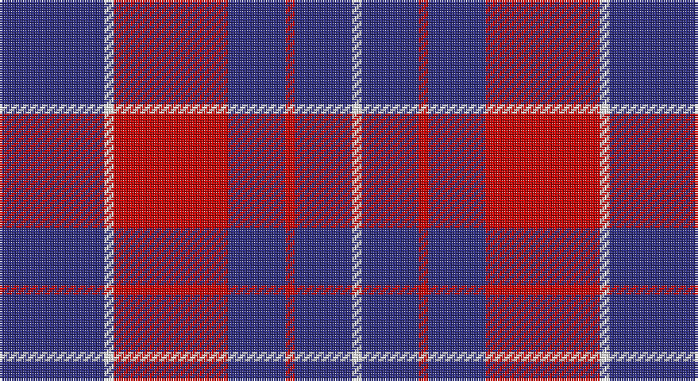

This page is one **sett** — a single exact thread-count. It belongs to the [tartan](/setts/db11w1r12db6r1db6w1/)
(the same proportion at any scale), whose colour order is pattern [BWRBRBW](/stripes/bwrbrbw/).

Part of the [Coronation](/tartans/coronation/) tartan — the named design grouping this sett with its other cloths.

Sourced from register-of-tartans.  It is a [7 stripe tartan](/stripes/stripes7/).

Original link https://www.tartanregister.gov.uk/tartanDetails.aspx?ref=771

## Also known as

This cloth is also recorded under:

- Coronation #2
- Coronation Commemorative

2 attestations — the source records this cloth was collapsed from (oldest owns this page)

<ul>
<li>01/01/2002 — Coronation (1936) #2 (register-of-tartans, <a href="https://www.tartanregister.gov.uk/tartanDetails.aspx?ref=771">record</a>)</li>
<li>pre 2002 — Coronation (1936) #2 (Commemorative) (tartans-authority, <a href="http://www.tartansauthority.com/tartan-ferret/display/2082/">record</a>)</li>
</ul>

## Register references

External register numbers recorded for this tartan.

- Scottish Register of Tartans: [771](https://www.tartanregister.gov.uk/tartanDetails.aspx?ref=771)
- Scottish Tartans Authority (ITI): 2082
- Scottish Tartans World Register: 2082

## Thread count
DB/44 W4 R48 DB24 R4 DB24 W/4

One full sett is **256 threads**.

## Palette

Palette: <strong>Tartan Register</strong>
<table><thead><tr><th>Colour</th><th>Threads</th><th>Shade</th><th>Base</th><th>OKLCh</th></tr></thead><tbody><tr><td>DB/</td><td style="text-align:right;font-variant-numeric:tabular-nums">44</td><td><code style="background-color:#2C2C80;">#2C2C80</code> <small style="color:#888">#2C2C80</small></td><td>B <code style="background-color:#2A418A;">#2A418A</code></td><td><small style="color:#888">oklch(35.0% 0.138 276.6)</small></td></tr><tr><td>W</td><td style="text-align:right;font-variant-numeric:tabular-nums">4</td><td><code style="background-color:#FCFCFC;">#FCFCFC</code> <small style="color:#888">#FCFCFC</small></td><td>W <code style="background-color:#F7F7F7;">#F7F7F7</code></td><td><small style="color:#888">oklch(99.1% 0.000 89.9)</small></td></tr><tr><td>R</td><td style="text-align:right;font-variant-numeric:tabular-nums">48</td><td><code style="background-color:#C80000;">#C80000</code> <small style="color:#888">#C80000</small></td><td>R <code style="background-color:#CC0000;">#CC0000</code></td><td><small style="color:#888">oklch(52.3% 0.215 29.2)</small></td></tr><tr><td>DB</td><td style="text-align:right;font-variant-numeric:tabular-nums">24</td><td><code style="background-color:#2C2C80;">#2C2C80</code> <small style="color:#888">#2C2C80</small></td><td>B <code style="background-color:#2A418A;">#2A418A</code></td><td><small style="color:#888">oklch(35.0% 0.138 276.6)</small></td></tr><tr><td>R</td><td style="text-align:right;font-variant-numeric:tabular-nums">4</td><td><code style="background-color:#C80000;">#C80000</code> <small style="color:#888">#C80000</small></td><td>R <code style="background-color:#CC0000;">#CC0000</code></td><td><small style="color:#888">oklch(52.3% 0.215 29.2)</small></td></tr><tr><td>DB</td><td style="text-align:right;font-variant-numeric:tabular-nums">24</td><td><code style="background-color:#2C2C80;">#2C2C80</code> <small style="color:#888">#2C2C80</small></td><td>B <code style="background-color:#2A418A;">#2A418A</code></td><td><small style="color:#888">oklch(35.0% 0.138 276.6)</small></td></tr><tr><td>W/</td><td style="text-align:right;font-variant-numeric:tabular-nums">4</td><td><code style="background-color:#FCFCFC;">#FCFCFC</code> <small style="color:#888">#FCFCFC</small></td><td>W <code style="background-color:#F7F7F7;">#F7F7F7</code></td><td><small style="color:#888">oklch(99.1% 0.000 89.9)</small></td></tr></tbody></table>

# Sample pattern

## Nearest tartans

The nearest existing variants by ΔTartan distance, with this tartan at the top so the swatches line up against it.

ΔTartan

Tartan

Sett

—

<a href="/ttd/edit/#slug=db11w1r12db6r1db6w1~x4">Coronation (1936) #2</a> <a class="nn-out" href="/variants/s7/db11w1r12db6r1db6w1~x4/" title="open its dictionary page">↗</a>

0.77

<a href="/ttd/edit/#slug=db11w1r12db6r1db6w1~x2&amp;base=db11w1r12db6r1db6w1~x4">Coronation</a> <a class="nn-out" href="/variants/s7/db11w1r12db6r1db6w1~x2/" title="open its dictionary page">↗</a>

0.96

<a href="/variants/s10/db60ly6db11r25db11ly6~x2/">South Australian Pipes &amp; Drums</a>

0.98

<a href="/ttd/edit/#slug=db2r7db2r7db22ly2~x2&amp;base=db11w1r12db6r1db6w1~x4">MacQueen variant</a> <a class="nn-out" href="/variants/s6/db2r7db2r7db22ly2~x2/" title="open its dictionary page">↗</a>

1.06

<a href="/ttd/edit/#slug=db48r18db6r13ly4r14~x2&amp;base=db11w1r12db6r1db6w1~x4">Butler</a> <a class="nn-out" href="/variants/s6/db48r18db6r13ly4r14~x2/" title="open its dictionary page">↗</a>

1.07

<a href="/ttd/edit/#slug=db12ly1r16db1r1db14r3db14ly1~x4&amp;base=db11w1r12db6r1db6w1~x4">Orlando Fire Department (Corporate)</a> <a class="nn-out" href="/variants/s9/db12ly1r16db1r1db14r3db14ly1~x4/" title="open its dictionary page">↗</a>

1.14

<a href="/ttd/edit/#slug=db12lb1r3lb1r3lb1db6~x4&amp;base=db11w1r12db6r1db6w1~x4">BC Corps of Commissionaires, The</a> <a class="nn-out" href="/variants/s7/db12lb1r3lb1r3lb1db6~x4/" title="open its dictionary page">↗</a>

1.16

<a href="/variants/s6/db60ly6db11r25~x2/">South Australian Pipes &amp; Drums (Corp</a>

1.23

<a href="/ttd/edit/#slug=db10r24db4r3db24w2r6db6~x2&amp;base=db11w1r12db6r1db6w1~x4">Embrace, The</a> <a class="nn-out" href="/variants/s8/db10r24db4r3db24w2r6db6~x2/" title="open its dictionary page">↗</a>

1.31

<a href="/ttd/edit/#slug=db6r1db6r9w1~x4&amp;base=db11w1r12db6r1db6w1~x4">Hamilton Red Clan Tartan</a> <a class="nn-out" href="/variants/s5/db6r1db6r9w1~x4/" title="open its dictionary page">↗</a>

1.31

<a href="/ttd/edit/#slug=g22dp22g3dp11w3dp4w3~x2&amp;base=db11w1r12db6r1db6w1~x4">O'Long (Personal)</a> <a class="nn-out" href="/variants/s7/g22dp22g3dp11w3dp4w3~x2/" title="open its dictionary page">↗</a>

## Neighbour map

Every grey dot is one of 14360 variants placed by the first two principal components of the ΔTartan feature space (44% of its variance). Red is this tartan; blue dots are its nearest — click one to open its page.

<svg viewBox="0 0 640 380" role="img" style="max-width:100%;height:auto;border:1px solid #e0e0e0;border-radius:4px;display:block" xmlns="http://www.w3.org/2000/svg"><image href="/nn/cloud.v1.png" width="640" height="380"/><a href="/variants/s7/db11w1r12db6r1db6w1~x2/"><circle cx="377.6" cy="219.0" r="4" fill="#3465a4"><title>Coronation</title></circle></a><a href="/variants/s10/db60ly6db11r25db11ly6~x2/"><circle cx="342.7" cy="191.0" r="4" fill="#3465a4"><title>South Australian Pipes &amp; Drums</title></circle></a><a href="/variants/s6/db2r7db2r7db22ly2~x2/"><circle cx="393.5" cy="207.5" r="4" fill="#3465a4"><title>MacQueen variant</title></circle></a><a href="/variants/s6/db48r18db6r13ly4r14~x2/"><circle cx="348.0" cy="214.1" r="4" fill="#3465a4"><title>Butler</title></circle></a><a href="/variants/s9/db12ly1r16db1r1db14r3db14ly1~x4/"><circle cx="419.3" cy="191.6" r="4" fill="#3465a4"><title>Orlando Fire Department (Corporate)</title></circle></a><a href="/variants/s7/db12lb1r3lb1r3lb1db6~x4/"><circle cx="405.8" cy="209.2" r="4" fill="#3465a4"><title>BC Corps of Commissionaires, The</title></circle></a><a href="/variants/s6/db60ly6db11r25~x2/"><circle cx="409.5" cy="215.7" r="4" fill="#3465a4"><title>South Australian Pipes &amp; Drums (Corp</title></circle></a><a href="/variants/s8/db10r24db4r3db24w2r6db6~x2/"><circle cx="352.3" cy="212.9" r="4" fill="#3465a4"><title>Embrace, The</title></circle></a><a href="/variants/s5/db6r1db6r9w1~x4/"><circle cx="320.0" cy="245.1" r="4" fill="#3465a4"><title>Hamilton Red Clan Tartan</title></circle></a><a href="/variants/s7/g22dp22g3dp11w3dp4w3~x2/"><circle cx="304.6" cy="223.9" r="4" fill="#3465a4"><title>O'Long (Personal)</title></circle></a><circle cx="360.6" cy="209.9" r="5" fill="#c00000"/></svg>

ID: /variants/s7/db11w1r12db6r1db6w1~x4/
