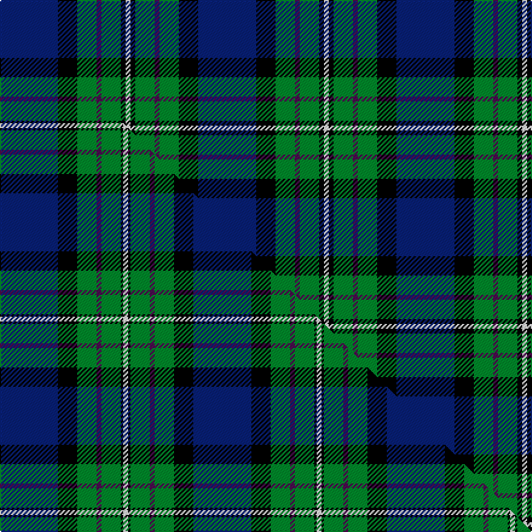

This page is one **sett** — a single exact thread-count. It belongs to the [tartan](/setts/db12k4g4dp1g4k1w1/)
(the same proportion at any scale), whose colour order is pattern [BKGBGKW](/stripes/bkgbgkw/).

Part of the [Alexander](/tartans/alexander/) tartan — the named design grouping this sett with its other cloths.

Sourced from tartans-authority.  It is a [7 stripe tartan](/stripes/stripes7/).

Original link http://www.tartansauthority.com/tartan-ferret/display/5686/

## Register references

External register numbers recorded for this tartan.

- Scottish Tartans Authority (ITI): 5686

## Thread count
DB/48 K16 G16 DP4 G16 K4 W/4

One full sett is **164 threads**.

## Palette
<table><thead><tr><th>Colour</th><th>Shade</th><th>OKLCh</th></tr></thead><tbody><tr><td>DB</td><td><code style="background-color:#082077;">#082077</code> <small style="color:#888">#082077</small></td><td><small style="color:#888">oklch(30.0% 0.149 265.1)</small></td></tr><tr><td>DP</td><td><code style="background-color:#4B0B4F;">#4B0B4F</code> <small style="color:#888">#4B0B4F</small></td><td><small style="color:#888">oklch(30.1% 0.125 325.4)</small></td></tr><tr><td>G</td><td><code style="background-color:#008B2A;">#008B2A</code> <small style="color:#888">#008B2A</small></td><td><small style="color:#888">oklch(55.4% 0.170 145.9)</small></td></tr><tr><td>K</td><td><code style="background-color:#000000;">#000000</code> <small style="color:#888">#000000</small></td><td><small style="color:#888">oklch(0.0% 0.000 0.0)</small></td></tr><tr><td>W</td><td><code style="background-color:#F7F7F7;">#F7F7F7</code> <small style="color:#888">#F7F7F7</small></td><td><small style="color:#888">oklch(97.6% 0.000 89.9)</small></td></tr></tbody></table>

# Sample pattern

## Compared to the master

This cloth is one sett of its design; the master sett (the exemplar the design is anchored on) is below for comparison.

Its **ΔTartan distance** from the master is **1.05** — the same measure the nearest-tartans table ranks by (0 is identical; a re-scale of the same cloth is near 0, a recolour or a different proportion further).

<figure class="master-compare" style="margin:0">

this sett
master sett ★

<figcaption style="color:#888;font-size:smaller">One weave of this sett against the <a href="/setts/db24k8g8dp2g8k1w2/">master sett ★</a>, split on the diagonal: a shared proportion runs seamlessly across it with only the shades shifting; a different proportion breaks on it.</figcaption>
</figure>

## Nearest variants

The nearest existing variants by ΔTartan distance, with this cloth at the top so the swatches line up against it.

ΔTartan

Threads

Variant

Sett

—

164

<a href="/variants/s7/db12k4g4dp1g4k1w1~x4/">Alexander - 2000 (Name)</a>

<a href="/ttd/edit/#slug=db24k8g8dp2g8k1w2~x2&amp;base=db12k4g4dp1g4k1w1~x4" title="compare in the TTD">0.49</a>

160

<a href="/variants/s7/db24k8g8dp2g8k1w2~x2/">Alexander</a>

<a href="/ttd/edit/#slug=db12k4g4r1g4k1lo1~x4&amp;base=db12k4g4dp1g4k1w1~x4" title="compare in the TTD">0.60</a>

164

<a href="/variants/s7/db12k4g4r1g4k1lo1~x4/">MacLaren (Clan)</a>

<a href="/ttd/edit/#slug=db12k4g4r1g4k1y1~x4&amp;base=db12k4g4dp1g4k1w1~x4" title="compare in the TTD">0.60</a>

164

<a href="/variants/s7/db12k4g4r1g4k1y1~x4/">MacLaren</a>

<a href="/ttd/edit/#slug=db24k8g8r2g8k1w2&amp;base=db12k4g4dp1g4k1w1~x4" title="compare in the TTD">0.79</a>

80

<a href="/variants/s7/db24k8g8r2g8k1w2/">Fergusson</a>

<a href="/ttd/edit/#slug=db24k8g8r2g8k1w2~x2&amp;base=db12k4g4dp1g4k1w1~x4" title="compare in the TTD">0.79</a>

160

<a href="/variants/s7/db24k8g8r2g8k1w2~x2/">Ferguson of Athol</a>

<a href="/ttd/edit/#slug=db24k8g8r2g8k1y2&amp;base=db12k4g4dp1g4k1w1~x4" title="compare in the TTD">1.09</a>

80

<a href="/variants/s7/db24k8g8r2g8k1y2/">MacLaren</a>

<a href="/ttd/edit/#slug=db24k8g8r2g8k1y2~x2&amp;base=db12k4g4dp1g4k1w1~x4" title="compare in the TTD">1.09</a>

160

<a href="/variants/s7/db24k8g8r2g8k1y2~x2/">MacLaren</a>

<a href="/ttd/edit/#slug=db22w2k10g11r3g4~x2&amp;base=db12k4g4dp1g4k1w1~x4" title="compare in the TTD">1.63</a>

156

<a href="/variants/s6/db22w2k10g11r3g4~x2/">Paterson Blue (Personal)</a>

<a href="/ttd/edit/#slug=r2db23k14g16k2w2~x2&amp;base=db12k4g4dp1g4k1w1~x4" title="compare in the TTD">1.90</a>

228

<a href="/variants/s6/r2db23k14g16k2w2~x2/">MacPhail Hunting</a>

<a href="/ttd/edit/#slug=r12db68w7k39g75r6g6&amp;base=db12k4g4dp1g4k1w1~x4" title="compare in the TTD">2.05</a>

408

<a href="/variants/s7/r12db68w7k39g75r6g6/">Rhun (Fashion)</a>

## Neighbour map

Every grey dot is one of 13620 variants placed by the first two principal components of the ΔTartan feature space (42% of its variance). Red is this tartan; blue dots are its nearest — click one to open its page.

<svg viewBox="0 0 640 380" role="img" style="max-width:100%;height:auto;border:1px solid #e0e0e0;border-radius:4px;display:block" xmlns="http://www.w3.org/2000/svg"><image href="/nn/cloud.v1.png" width="640" height="380"/><a href="/variants/s7/db24k8g8dp2g8k1w2~x2/"><circle cx="215.6" cy="136.3" r="4" fill="#3465a4"><title>Alexander</title></circle></a><a href="/variants/s7/db12k4g4r1g4k1lo1~x4/"><circle cx="188.1" cy="163.0" r="4" fill="#3465a4"><title>MacLaren (Clan)</title></circle></a><a href="/variants/s7/db12k4g4r1g4k1y1~x4/"><circle cx="194.1" cy="165.3" r="4" fill="#3465a4"><title>MacLaren</title></circle></a><a href="/variants/s7/db24k8g8r2g8k1w2/"><circle cx="211.5" cy="134.2" r="4" fill="#3465a4"><title>Fergusson</title></circle></a><a href="/variants/s7/db24k8g8r2g8k1w2~x2/"><circle cx="211.5" cy="134.2" r="4" fill="#3465a4"><title>Ferguson of Athol</title></circle></a><a href="/variants/s7/db24k8g8r2g8k1y2/"><circle cx="222.8" cy="137.7" r="4" fill="#3465a4"><title>MacLaren</title></circle></a><a href="/variants/s7/db24k8g8r2g8k1y2~x2/"><circle cx="222.8" cy="137.7" r="4" fill="#3465a4"><title>MacLaren</title></circle></a><a href="/variants/s6/db22w2k10g11r3g4~x2/"><circle cx="160.7" cy="182.3" r="4" fill="#3465a4"><title>Paterson Blue (Personal)</title></circle></a><a href="/variants/s6/r2db23k14g16k2w2~x2/"><circle cx="152.7" cy="176.0" r="4" fill="#3465a4"><title>MacPhail Hunting</title></circle></a><a href="/variants/s7/r12db68w7k39g75r6g6/"><circle cx="149.5" cy="161.7" r="4" fill="#3465a4"><title>Rhun (Fashion)</title></circle></a><circle cx="187.1" cy="164.0" r="5" fill="#c00000"/><text x="320" y="376" text-anchor="middle" font-size="11" fill="#999">ground</text><text x="11" y="190" text-anchor="middle" font-size="11" fill="#999" transform="rotate(-90 11 190)">complexity</text></svg>

ID: /variants/s7/db12k4g4dp1g4k1w1~x4/
