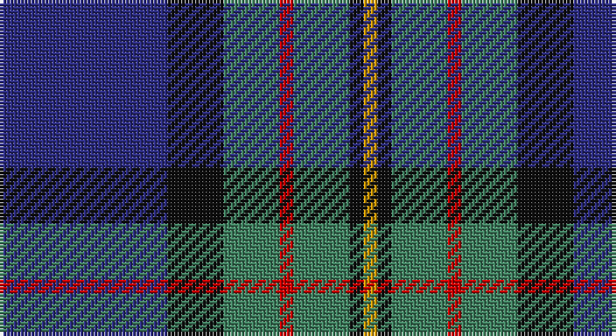

This page is one **sett** — a single exact thread-count. It belongs to the [tartan](/setts/db12k4g4r1g4k1lo1/)
(the same proportion at any scale), whose colour order is pattern [BKGRGKY](/stripes/bkgrgky/).

Part of the [MacLaren](/tartans/maclaren/) tartan — the named design grouping this sett with its other cloths.

Sourced from register-of-tartans.  It is a [7 stripe tartan](/stripes/stripes7/).

Original link https://www.tartanregister.gov.uk/tartanDetails.aspx?ref=2594

## Also known as

This cloth is also recorded under:

- MacLaren #2

2 attestations — the source records this cloth was collapsed from (oldest owns this page)

<ul>
<li>01/01/1819 — MacLaren (register-of-tartans, <a href="https://www.tartanregister.gov.uk/tartanDetails.aspx?ref=2594">record</a>)</li>
<li>1819 — MacLaren (Clan) (tartans-authority, <a href="http://www.tartansauthority.com/tartan-ferret/display/342/">record</a>)</li>
</ul>

## Register references

External register numbers recorded for this tartan.

- Scottish Register of Tartans: [2594](https://www.tartanregister.gov.uk/tartanDetails.aspx?ref=2594)
- Scottish Tartans Authority (ITI): 342
- Scottish Tartans World Register: 342

## Thread count
DB/48 K16 G16 R4 G16 K4 DY/4

One full sett is **164 threads**.

## Palette

Palette: <strong>Tartan Register</strong> <small style="color:#888">(4 of 5 colours)</small>
<table><thead><tr><th>Colour</th><th>Threads</th><th>Shade</th><th>Base</th><th>OKLCh</th></tr></thead><tbody><tr><td>DB/</td><td style="text-align:right;font-variant-numeric:tabular-nums">48</td><td><code style="background-color:#2C2C80;">#2C2C80</code> <small style="color:#888">#2C2C80</small></td><td>B <code style="background-color:#2A418A;">#2A418A</code></td><td><small style="color:#888">oklch(35.0% 0.138 276.6)</small></td></tr><tr><td>K</td><td style="text-align:right;font-variant-numeric:tabular-nums">16</td><td><code style="background-color:#101010;">#101010</code> <small style="color:#888">#101010</small></td><td>K <code style="background-color:#000000;">#000000</code></td><td><small style="color:#888">oklch(17.3% 0.000 89.9)</small></td></tr><tr><td>G</td><td style="text-align:right;font-variant-numeric:tabular-nums">16</td><td><code style="background-color:#408060;">#408060</code> <small style="color:#888">#408060</small></td><td>G <code style="background-color:#006100;">#006100</code></td><td><small style="color:#888">oklch(54.8% 0.084 160.1)</small></td></tr><tr><td>R</td><td style="text-align:right;font-variant-numeric:tabular-nums">4</td><td><code style="background-color:#C80000;">#C80000</code> <small style="color:#888">#C80000</small></td><td>R <code style="background-color:#CC0000;">#CC0000</code></td><td><small style="color:#888">oklch(52.3% 0.215 29.2)</small></td></tr><tr><td>G</td><td style="text-align:right;font-variant-numeric:tabular-nums">16</td><td><code style="background-color:#408060;">#408060</code> <small style="color:#888">#408060</small></td><td>G <code style="background-color:#006100;">#006100</code></td><td><small style="color:#888">oklch(54.8% 0.084 160.1)</small></td></tr><tr><td>K</td><td style="text-align:right;font-variant-numeric:tabular-nums">4</td><td><code style="background-color:#101010;">#101010</code> <small style="color:#888">#101010</small></td><td>K <code style="background-color:#000000;">#000000</code></td><td><small style="color:#888">oklch(17.3% 0.000 89.9)</small></td></tr><tr><td>DY/</td><td style="text-align:right;font-variant-numeric:tabular-nums">4</td><td><code style="background-color:#D09800;">#D09800</code> <small style="color:#888">#D09800</small></td><td>Y <code style="background-color:#F2BF00;">#F2BF00</code></td><td><small style="color:#888">oklch(71.4% 0.147 82.1)</small></td></tr></tbody></table>

# Sample pattern

## Nearest tartans

The nearest existing variants by ΔTartan distance, with this tartan at the top so the swatches line up against it.

ΔTartan

Tartan

Sett

—

<a href="/ttd/edit/#slug=db12k4g4r1g4k1lo1~x4">MacLaren</a> <a class="nn-out" href="/variants/s7/db12k4g4r1g4k1lo1~x4/" title="open its dictionary page">↗</a>

0.65

<a href="/ttd/edit/#slug=k6g15w2db22r2k4~x2&amp;base=db12k4g4r1g4k1lo1~x4">Leslie, Hebridean</a> <a class="nn-out" href="/variants/s6/k6g15w2db22r2k4~x2/" title="open its dictionary page">↗</a>

0.78

<a href="/ttd/edit/#slug=db22w2k10g11r3g4~x2&amp;base=db12k4g4r1g4k1lo1~x4">Paterson Blue (Personal)</a> <a class="nn-out" href="/variants/s6/db22w2k10g11r3g4~x2/" title="open its dictionary page">↗</a>

0.79

<a href="/ttd/edit/#slug=n6db8n8g12dt29w3dt4~x2&amp;base=db12k4g4r1g4k1lo1~x4">Dickson (Kirkcudbrightshire) (Name)</a> <a class="nn-out" href="/variants/s7/n6db8n8g12dt29w3dt4~x2/" title="open its dictionary page">↗</a>

0.82

<a href="/ttd/edit/#slug=db12k4g4dp1g4k1w1~x4&amp;base=db12k4g4r1g4k1lo1~x4">Alexander - 2000 (Name)</a> <a class="nn-out" href="/variants/s7/db12k4g4dp1g4k1w1~x4/" title="open its dictionary page">↗</a>

0.84

<a href="/ttd/edit/#slug=lb3db20k3db2k5db2k3y15r2~x2&amp;base=db12k4g4r1g4k1lo1~x4">Scottish Chamber Orchestra</a> <a class="nn-out" href="/variants/s9/lb3db20k3db2k5db2k3y15r2~x2/" title="open its dictionary page">↗</a>

0.85

<a href="/ttd/edit/#slug=dg5lp3dg32k16b32m3b5~x2&amp;base=db12k4g4r1g4k1lo1~x4">MacThomas (Clan)</a> <a class="nn-out" href="/variants/s7/dg5lp3dg32k16b32m3b5~x2/" title="open its dictionary page">↗</a>

0.86

<a href="/ttd/edit/#slug=db3m2db22k11g24lp2g3~x2&amp;base=db12k4g4r1g4k1lo1~x4">MacThomas Clan Tartan</a> <a class="nn-out" href="/variants/s7/db3m2db22k11g24lp2g3~x2/" title="open its dictionary page">↗</a>

0.88

<a href="/ttd/edit/#slug=k2w1k12g5db11r1~x2&amp;base=db12k4g4r1g4k1lo1~x4">New England (Fashion)</a> <a class="nn-out" href="/variants/s6/k2w1k12g5db11r1~x2/" title="open its dictionary page">↗</a>

0.88

<a href="/ttd/edit/#slug=b5dy28lb5k20lo5b47lo4~x2&amp;base=db12k4g4r1g4k1lo1~x4">State Seal of Washington (Fashion)</a> <a class="nn-out" href="/variants/s7/b5dy28lb5k20lo5b47lo4~x2/" title="open its dictionary page">↗</a>

0.88

<a href="/ttd/edit/#slug=r1k1g7k5db10k1ly1~x2&amp;base=db12k4g4r1g4k1lo1~x4">MacLeod Small Clan Tartan</a> <a class="nn-out" href="/variants/s7/r1k1g7k5db10k1ly1~x2/" title="open its dictionary page">↗</a>

## Neighbour map

Every grey dot is one of 14360 variants placed by the first two principal components of the ΔTartan feature space (44% of its variance). Red is this tartan; blue dots are its nearest — click one to open its page.

<svg viewBox="0 0 640 380" role="img" style="max-width:100%;height:auto;border:1px solid #e0e0e0;border-radius:4px;display:block" xmlns="http://www.w3.org/2000/svg"><image href="/nn/cloud.v1.png" width="640" height="380"/><a href="/variants/s6/k6g15w2db22r2k4~x2/"><circle cx="214.4" cy="198.6" r="4" fill="#3465a4"><title>Leslie, Hebridean</title></circle></a><a href="/variants/s6/db22w2k10g11r3g4~x2/"><circle cx="203.8" cy="205.8" r="4" fill="#3465a4"><title>Paterson Blue (Personal)</title></circle></a><a href="/variants/s7/n6db8n8g12dt29w3dt4~x2/"><circle cx="212.6" cy="203.7" r="4" fill="#3465a4"><title>Dickson (Kirkcudbrightshire) (Name)</title></circle></a><a href="/variants/s7/db12k4g4dp1g4k1w1~x4/"><circle cx="223.0" cy="186.9" r="4" fill="#3465a4"><title>Alexander - 2000 (Name)</title></circle></a><a href="/variants/s9/lb3db20k3db2k5db2k3y15r2~x2/"><circle cx="226.4" cy="177.7" r="4" fill="#3465a4"><title>Scottish Chamber Orchestra</title></circle></a><a href="/variants/s7/dg5lp3dg32k16b32m3b5~x2/"><circle cx="213.8" cy="201.7" r="4" fill="#3465a4"><title>MacThomas (Clan)</title></circle></a><a href="/variants/s7/db3m2db22k11g24lp2g3~x2/"><circle cx="233.7" cy="195.6" r="4" fill="#3465a4"><title>MacThomas Clan Tartan</title></circle></a><a href="/variants/s6/k2w1k12g5db11r1~x2/"><circle cx="238.3" cy="204.6" r="4" fill="#3465a4"><title>New England (Fashion)</title></circle></a><a href="/variants/s7/b5dy28lb5k20lo5b47lo4~x2/"><circle cx="218.6" cy="177.7" r="4" fill="#3465a4"><title>State Seal of Washington (Fashion)</title></circle></a><a href="/variants/s7/r1k1g7k5db10k1ly1~x2/"><circle cx="196.2" cy="195.4" r="4" fill="#3465a4"><title>MacLeod Small Clan Tartan</title></circle></a><circle cx="236.6" cy="187.8" r="5" fill="#c00000"/></svg>

ID: /variants/s7/db12k4g4r1g4k1lo1~x4/
