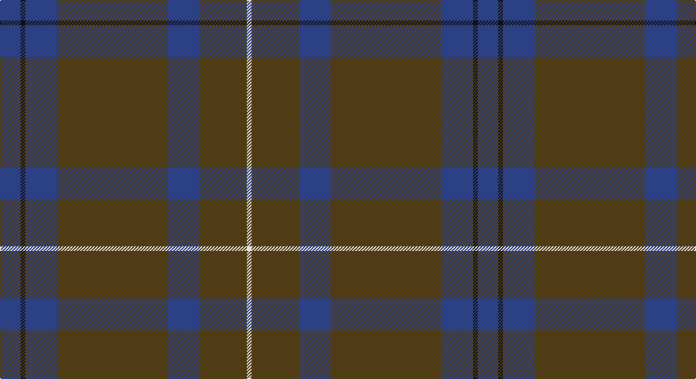

This page is one **sett** — a single exact thread-count. It belongs to the [tartan](/setts/db13k3db20dy70db20dy30w3/)
(the same proportion at any scale), whose colour order is pattern [BKBGBGW](/stripes/bkbgbgw/).

Part of the [Unidentified](/tartans/unidentified/) tartan — the named design grouping this sett with its other cloths.

Sourced from register-of-tartans.  It is a [7 stripe tartan](/stripes/stripes7/).

Original link https://www.tartanregister.gov.uk/tartanDetails.aspx?ref=4245

## Also known as

This cloth is also recorded under:

- Unidentified #10
- Unidentified #12
- Unidentified #14
- Unidentified #15
- Unidentified #16
- Unidentified #18
- Unidentified #2
- Unidentified #21
- Unidentified #22
- Unidentified #24
- Unidentified #25
- Unidentified #28
- Unidentified #29
- Unidentified #30
- Unidentified #31
- Unidentified #32
- Unidentified #36
- Unidentified #37
- Unidentified #38
- Unidentified #40
- Unidentified #43
- Unidentified #44
- Unidentified #45
- Unidentified #46
- Unidentified #47
- Unidentified #48
- Unidentified #49
- Unidentified #5
- Unidentified #50
- Unidentified #51
- Unidentified #52
- Unidentified #53
- Unidentified #54
- Unidentified #55
- Unidentified #56
- Unidentified #57
- Unidentified #58
- Unidentified #59
- Unidentified #60
- Unidentified #61
- Unidentified #62
- Unidentified #63
- Unidentified #64
- Unidentified #65
- Unidentified #66
- Unidentified #7
- Unidentified #8
- Unidentified #9
- Unidentified 16
- Unidentified Artifact
- Unidentified Plaid
- Unidentified Plaid #11
- Unidentified Plaid #13
- Unidentified Plaid #2
- Unidentified Plaid #3
- Unidentified Plaid #7
- Unidentified Plaid #8
- Unidentified Plaid #9
- Unidentified Portrait

## Register references

External register numbers recorded for this tartan.

- Scottish Register of Tartans: [4245](https://www.tartanregister.gov.uk/tartanDetails.aspx?ref=4245)
- Scottish Tartans World Register: 2017

## Thread count
B/26 K6 B40 T140 B40 T60 LN/6

One full sett is **604 threads**.

## Palette

Palette: <strong>Tartan Register</strong>
<table><thead><tr><th>Colour</th><th>Threads</th><th>Shade</th><th>Base</th><th>OKLCh</th></tr></thead><tbody><tr><td>B/</td><td style="text-align:right;font-variant-numeric:tabular-nums">26</td><td><code style="background-color:#2C4084;">#2C4084</code> <small style="color:#888">#2C4084</small></td><td>B <code style="background-color:#2A418A;">#2A418A</code></td><td><small style="color:#888">oklch(39.4% 0.117 268.3)</small></td></tr><tr><td>K</td><td style="text-align:right;font-variant-numeric:tabular-nums">6</td><td><code style="background-color:#101010;">#101010</code> <small style="color:#888">#101010</small></td><td>K <code style="background-color:#000000;">#000000</code></td><td><small style="color:#888">oklch(17.3% 0.000 89.9)</small></td></tr><tr><td>B</td><td style="text-align:right;font-variant-numeric:tabular-nums">40</td><td><code style="background-color:#2C4084;">#2C4084</code> <small style="color:#888">#2C4084</small></td><td>B <code style="background-color:#2A418A;">#2A418A</code></td><td><small style="color:#888">oklch(39.4% 0.117 268.3)</small></td></tr><tr><td>T</td><td style="text-align:right;font-variant-numeric:tabular-nums">140</td><td><code style="background-color:#503C14;">#503C14</code> <small style="color:#888">#503C14</small></td><td>G <code style="background-color:#006100;">#006100</code></td><td><small style="color:#888">oklch(37.0% 0.062 81.8)</small></td></tr><tr><td>B</td><td style="text-align:right;font-variant-numeric:tabular-nums">40</td><td><code style="background-color:#2C4084;">#2C4084</code> <small style="color:#888">#2C4084</small></td><td>B <code style="background-color:#2A418A;">#2A418A</code></td><td><small style="color:#888">oklch(39.4% 0.117 268.3)</small></td></tr><tr><td>T</td><td style="text-align:right;font-variant-numeric:tabular-nums">60</td><td><code style="background-color:#503C14;">#503C14</code> <small style="color:#888">#503C14</small></td><td>G <code style="background-color:#006100;">#006100</code></td><td><small style="color:#888">oklch(37.0% 0.062 81.8)</small></td></tr><tr><td>LN/</td><td style="text-align:right;font-variant-numeric:tabular-nums">6</td><td><code style="background-color:#E0E0E0;">#E0E0E0</code> <small style="color:#888">#E0E0E0</small></td><td>W <code style="background-color:#F7F7F7;">#F7F7F7</code></td><td><small style="color:#888">oklch(90.7% 0.000 89.9)</small></td></tr></tbody></table>

# Sample pattern

## Compared to the master

This cloth is one sett of its design; the master sett (the exemplar the design is anchored on) is below for comparison.

<figure style="margin:0"><figcaption style="color:#888;font-size:smaller">this sett</figcaption></figure>
<figure style="margin:0"><figcaption style="color:#888;font-size:smaller"><a href="/setts/dp4r3dp26r26dg26r4/">master sett →</a></figcaption></figure>

## Nearest tartans

The nearest existing variants by ΔTartan distance, with this tartan at the top so the swatches line up against it.

ΔTartan

Tartan

Sett

—

<a href="/ttd/edit/#slug=db13k3db20dy70db20dy30w3~x2">Unidentified #44</a> <a class="nn-out" href="/variants/s7/db13k3db20dy70db20dy30w3~x2/" title="open its dictionary page">↗</a>

1.14

<a href="/ttd/edit/#slug=db13k3db20o70db20o30w3~x2&amp;base=db13k3db20dy70db20dy30w3~x2">Unidentified 21</a> <a class="nn-out" href="/variants/s7/db13k3db20o70db20o30w3~x2/" title="open its dictionary page">↗</a>

1.40

<a href="/variants/s11/n12y3ni36k12ni8k8ni16k2ni18k4n10/">Bute Heather, Hunting (Fashion)</a>

1.49

<a href="/ttd/edit/#slug=n12lb3do36k12do8k8do16k2do16k4n10&amp;base=db13k3db20dy70db20dy30w3~x2">Bute Heather, Midnight</a> <a class="nn-out" href="/variants/s11/n12lb3do36k12do8k8do16k2do16k4n10/" title="open its dictionary page">↗</a>

1.51

<a href="/ttd/edit/#slug=dy3db3dy3db27dy40y3&amp;base=db13k3db20dy70db20dy30w3~x2">Keeper of the Quaich</a> <a class="nn-out" href="/variants/s6/dy3db3dy3db27dy40y3/" title="open its dictionary page">↗</a>

1.54

<a href="/variants/s11/ni12lp3n36k10n8k8n16k2n16k4ni10/">Bute Heather, Midnight (Fashion)</a>

1.60

<a href="/ttd/edit/#slug=dy11db1dy3dbi1db9r1~x4&amp;base=db13k3db20dy70db20dy30w3~x2">Dege of Saville Row</a> <a class="nn-out" href="/variants/s6/dy11db1dy3dbi1db9r1~x4/" title="open its dictionary page">↗</a>

1.64

<a href="/ttd/edit/#slug=dg2dy32dy12k10r1db16r2~x2&amp;base=db13k3db20dy70db20dy30w3~x2">MacWilliam Htg</a> <a class="nn-out" href="/variants/s7/dg2dy32dy12k10r1db16r2~x2/" title="open its dictionary page">↗</a>

1.68

<a href="/ttd/edit/#slug=do40n19k2n2lb2~x4&amp;base=db13k3db20dy70db20dy30w3~x2">National Ballet of Canada</a> <a class="nn-out" href="/variants/s5/do40n19k2n2lb2~x4/" title="open its dictionary page">↗</a>

1.69

<a href="/ttd/edit/#slug=dr6lr2dr30dg12dr3dg12dr3~x2&amp;base=db13k3db20dy70db20dy30w3~x2">Crawford</a> <a class="nn-out" href="/variants/s7/dr6lr2dr30dg12dr3dg12dr3~x2/" title="open its dictionary page">↗</a>

1.69

<a href="/ttd/edit/#slug=dr6lr2dr30dg12dr3dg12dr3&amp;base=db13k3db20dy70db20dy30w3~x2">Crawford</a> <a class="nn-out" href="/variants/s7/dr6lr2dr30dg12dr3dg12dr3/" title="open its dictionary page">↗</a>

## Neighbour map

Every grey dot is one of 14360 variants placed by the first two principal components of the ΔTartan feature space (44% of its variance). Red is this tartan; blue dots are its nearest — click one to open its page.

<svg viewBox="0 0 640 380" role="img" style="max-width:100%;height:auto;border:1px solid #e0e0e0;border-radius:4px;display:block" xmlns="http://www.w3.org/2000/svg"><image href="/nn/cloud.v1.png" width="640" height="380"/><a href="/variants/s7/db13k3db20o70db20o30w3~x2/"><circle cx="460.1" cy="203.3" r="4" fill="#3465a4"><title>Unidentified 21</title></circle></a><a href="/variants/s11/n12y3ni36k12ni8k8ni16k2ni18k4n10/"><circle cx="421.2" cy="227.7" r="4" fill="#3465a4"><title>Bute Heather, Hunting (Fashion)</title></circle></a><a href="/variants/s11/n12lb3do36k12do8k8do16k2do16k4n10/"><circle cx="395.7" cy="216.6" r="4" fill="#3465a4"><title>Bute Heather, Midnight</title></circle></a><a href="/variants/s6/dy3db3dy3db27dy40y3/"><circle cx="471.9" cy="248.1" r="4" fill="#3465a4"><title>Keeper of the Quaich</title></circle></a><a href="/variants/s11/ni12lp3n36k10n8k8n16k2n16k4ni10/"><circle cx="400.5" cy="213.2" r="4" fill="#3465a4"><title>Bute Heather, Midnight (Fashion)</title></circle></a><a href="/variants/s6/dy11db1dy3dbi1db9r1~x4/"><circle cx="399.4" cy="245.6" r="4" fill="#3465a4"><title>Dege of Saville Row</title></circle></a><a href="/variants/s7/dg2dy32dy12k10r1db16r2~x2/"><circle cx="412.2" cy="178.8" r="4" fill="#3465a4"><title>MacWilliam Htg</title></circle></a><a href="/variants/s5/do40n19k2n2lb2~x4/"><circle cx="463.6" cy="207.9" r="4" fill="#3465a4"><title>National Ballet of Canada</title></circle></a><a href="/variants/s7/dr6lr2dr30dg12dr3dg12dr3~x2/"><circle cx="492.2" cy="253.5" r="4" fill="#3465a4"><title>Crawford</title></circle></a><a href="/variants/s7/dr6lr2dr30dg12dr3dg12dr3/"><circle cx="492.2" cy="253.5" r="4" fill="#3465a4"><title>Crawford</title></circle></a><circle cx="481.5" cy="221.2" r="5" fill="#c00000"/></svg>

ID: /variants/s7/db13k3db20dy70db20dy30w3~x2/
