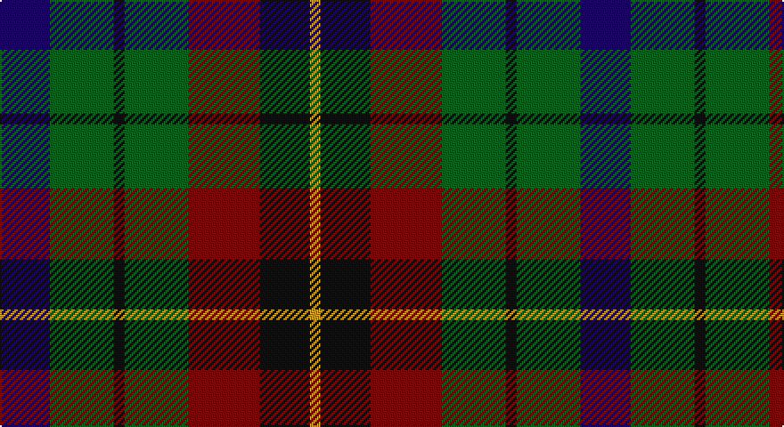

This page is one **sett** — a single exact thread-count. It belongs to the [tartan](/setts/db14g18k3g18r20k14lo3/)
(the same proportion at any scale), whose colour order is pattern [BGKGRKY](/stripes/bgkgrky/).

Part of the [Scottish Parliament](/tartans/scottish-parliament/) tartan — the named design grouping this sett with its other cloths.

Sourced from register-of-tartans.  It is a [7 stripe tartan](/stripes/stripes7/).

Original link https://www.tartanregister.gov.uk/tartanDetails.aspx?ref=3738

2 attestations — the source records this cloth was collapsed from (oldest owns this page)

<ul>
<li>01/01/1998 — Scottish Parliament (unofficial) (register-of-tartans, <a href="https://www.tartanregister.gov.uk/tartanDetails.aspx?ref=3738">record</a>)</li>
<li>1998 — Scottish Parliament (Unauthorised) (tartans-authority, <a href="http://www.tartansauthority.com/tartan-ferret/display/2477/">record</a>)</li>
</ul>

## Register references

External register numbers recorded for this tartan.

- Scottish Register of Tartans: [3738](https://www.tartanregister.gov.uk/tartanDetails.aspx?ref=3738)
- Scottish Tartans Authority (ITI): 2477
- Scottish Tartans World Register: 2477

## Thread count
DB/28 G36 K6 G36 DR40 K28 DY/6

One full sett is **326 threads**.

## Palette

Palette: <strong>Tartan Register</strong> <small style="color:#888">(4 of 5 colours)</small>
<table><thead><tr><th>Colour</th><th>Threads</th><th>Shade</th><th>Base</th><th>OKLCh</th></tr></thead><tbody><tr><td>DB/</td><td style="text-align:right;font-variant-numeric:tabular-nums">28</td><td><code style="background-color:#1C0070;">#1C0070</code> <small style="color:#888">#1C0070</small></td><td>B <code style="background-color:#2A418A;">#2A418A</code></td><td><small style="color:#888">oklch(26.3% 0.162 277.1)</small></td></tr><tr><td>G</td><td style="text-align:right;font-variant-numeric:tabular-nums">36</td><td><code style="background-color:#006818;">#006818</code> <small style="color:#888">#006818</small></td><td>G <code style="background-color:#006100;">#006100</code></td><td><small style="color:#888">oklch(45.0% 0.142 145.0)</small></td></tr><tr><td>K</td><td style="text-align:right;font-variant-numeric:tabular-nums">6</td><td><code style="background-color:#101010;">#101010</code> <small style="color:#888">#101010</small></td><td>K <code style="background-color:#000000;">#000000</code></td><td><small style="color:#888">oklch(17.3% 0.000 89.9)</small></td></tr><tr><td>G</td><td style="text-align:right;font-variant-numeric:tabular-nums">36</td><td><code style="background-color:#006818;">#006818</code> <small style="color:#888">#006818</small></td><td>G <code style="background-color:#006100;">#006100</code></td><td><small style="color:#888">oklch(45.0% 0.142 145.0)</small></td></tr><tr><td>DR</td><td style="text-align:right;font-variant-numeric:tabular-nums">40</td><td><code style="background-color:#880000;">#880000</code> <small style="color:#888">#880000</small></td><td>R <code style="background-color:#CC0000;">#CC0000</code></td><td><small style="color:#888">oklch(39.4% 0.162 29.2)</small></td></tr><tr><td>K</td><td style="text-align:right;font-variant-numeric:tabular-nums">28</td><td><code style="background-color:#101010;">#101010</code> <small style="color:#888">#101010</small></td><td>K <code style="background-color:#000000;">#000000</code></td><td><small style="color:#888">oklch(17.3% 0.000 89.9)</small></td></tr><tr><td>DY/</td><td style="text-align:right;font-variant-numeric:tabular-nums">6</td><td><code style="background-color:#D09800;">#D09800</code> <small style="color:#888">#D09800</small></td><td>Y <code style="background-color:#F2BF00;">#F2BF00</code></td><td><small style="color:#888">oklch(71.4% 0.147 82.1)</small></td></tr></tbody></table>

# Sample pattern

## Nearest tartans

The nearest existing variants by ΔTartan distance, with this tartan at the top so the swatches line up against it.

ΔTartan

Tartan

Sett

—

<a href="/ttd/edit/#slug=db14g18k3g18r20k14lo3~x2">Scottish Parliament (unofficial)</a> <a class="nn-out" href="/variants/s7/db14g18k3g18r20k14lo3~x2/" title="open its dictionary page">↗</a>

0.67

<a href="/ttd/edit/#slug=k11g12w2g12k12dp12r3~x2&amp;base=db14g18k3g18r20k14lo3~x2">Cunningham / Wilson's No 120</a> <a class="nn-out" href="/variants/s7/k11g12w2g12k12dp12r3~x2/" title="open its dictionary page">↗</a>

0.74

<a href="/variants/s8/k8t3g13dp12ly2~x2/">Wilson's No.176</a>

0.81

<a href="/variants/s8/dp11y2k10g10lo2~x2/">Selkirk (Personal) Original</a>

0.88

<a href="/variants/s8/dp11t2k10g10ly3~x2/">Wilson's No.217</a>

0.90

<a href="/ttd/edit/#slug=r1dy7g7k7b7dy7r1~x4&amp;base=db14g18k3g18r20k14lo3~x2">Tennant (Clan)</a> <a class="nn-out" href="/variants/s7/r1dy7g7k7b7dy7r1~x4/" title="open its dictionary page">↗</a>

0.92

<a href="/ttd/edit/#slug=r1dr7db7k7g7dr7r1~x4&amp;base=db14g18k3g18r20k14lo3~x2">Tennant</a> <a class="nn-out" href="/variants/s7/r1dr7db7k7g7dr7r1~x4/" title="open its dictionary page">↗</a>

1.01

<a href="/ttd/edit/#slug=r2k8lo1k8g8t8r2~x4&amp;base=db14g18k3g18r20k14lo3~x2">Brodie Hunting</a> <a class="nn-out" href="/variants/s7/r2k8lo1k8g8t8r2~x4/" title="open its dictionary page">↗</a>

1.07

<a href="/ttd/edit/#slug=dg24k4dg24k24t7r24t7~x2&amp;base=db14g18k3g18r20k14lo3~x2">Unidentified Pinafore</a> <a class="nn-out" href="/variants/s7/dg24k4dg24k24t7r24t7~x2/" title="open its dictionary page">↗</a>

1.10

<a href="/ttd/edit/#slug=k18db12k5g4r6g12k2lo4~x2&amp;base=db14g18k3g18r20k14lo3~x2">MacLeish</a> <a class="nn-out" href="/variants/s8/k18db12k5g4r6g12k2lo4~x2/" title="open its dictionary page">↗</a>

1.12

<a href="/ttd/edit/#slug=o8r1o8g8k8db8o8r2~x2&amp;base=db14g18k3g18r20k14lo3~x2">MacDuff, hunting</a> <a class="nn-out" href="/variants/s8/o8r1o8g8k8db8o8r2~x2/" title="open its dictionary page">↗</a>

## Neighbour map

Every grey dot is one of 14360 variants placed by the first two principal components of the ΔTartan feature space (44% of its variance). Red is this tartan; blue dots are its nearest — click one to open its page.

<svg viewBox="0 0 640 380" role="img" style="max-width:100%;height:auto;border:1px solid #e0e0e0;border-radius:4px;display:block" xmlns="http://www.w3.org/2000/svg"><image href="/nn/cloud.v1.png" width="640" height="380"/><a href="/variants/s7/k11g12w2g12k12dp12r3~x2/"><circle cx="131.2" cy="256.3" r="4" fill="#3465a4"><title>Cunningham / Wilson's No 120</title></circle></a><a href="/variants/s8/k8t3g13dp12ly2~x2/"><circle cx="150.3" cy="234.7" r="4" fill="#3465a4"><title>Wilson's No.176</title></circle></a><a href="/variants/s8/dp11y2k10g10lo2~x2/"><circle cx="118.9" cy="237.5" r="4" fill="#3465a4"><title>Selkirk (Personal) Original</title></circle></a><a href="/variants/s8/dp11t2k10g10ly3~x2/"><circle cx="106.4" cy="242.2" r="4" fill="#3465a4"><title>Wilson's No.217</title></circle></a><a href="/variants/s7/r1dy7g7k7b7dy7r1~x4/"><circle cx="151.6" cy="254.5" r="4" fill="#3465a4"><title>Tennant (Clan)</title></circle></a><a href="/variants/s7/r1dr7db7k7g7dr7r1~x4/"><circle cx="121.7" cy="238.9" r="4" fill="#3465a4"><title>Tennant</title></circle></a><a href="/variants/s7/r2k8lo1k8g8t8r2~x4/"><circle cx="155.3" cy="219.1" r="4" fill="#3465a4"><title>Brodie Hunting</title></circle></a><a href="/variants/s7/dg24k4dg24k24t7r24t7~x2/"><circle cx="192.4" cy="269.9" r="4" fill="#3465a4"><title>Unidentified Pinafore</title></circle></a><a href="/variants/s8/k18db12k5g4r6g12k2lo4~x2/"><circle cx="156.4" cy="211.0" r="4" fill="#3465a4"><title>MacLeish</title></circle></a><a href="/variants/s8/o8r1o8g8k8db8o8r2~x2/"><circle cx="155.5" cy="231.9" r="4" fill="#3465a4"><title>MacDuff, hunting</title></circle></a><circle cx="143.2" cy="247.0" r="5" fill="#c00000"/></svg>

ID: /variants/s7/db14g18k3g18r20k14lo3~x2/
