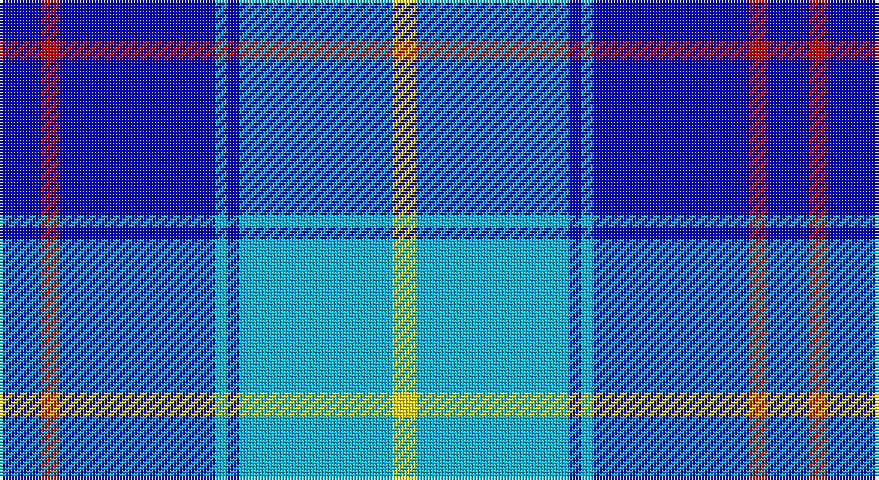

This page is one **sett** — a single exact thread-count. It belongs to the [tartan](/setts/db14r6db52lt4db4lt51ly8/)
(the same proportion at any scale), whose colour order is pattern [BRBWBWY](/stripes/brbwbwy/).

Part of the [International Police Association](/tartans/international-police-association/) tartan — the named design grouping this sett with its other cloths.

Sourced from register-of-tartans.  It is a [7 stripe tartan](/stripes/stripes7/).

Original link https://www.tartanregister.gov.uk/tartanDetails.aspx?ref=10174

## Register references

External register numbers recorded for this tartan.

- Scottish Register of Tartans: [10174](https://www.tartanregister.gov.uk/tartanDetails.aspx?ref=10174)

## Thread count
Ba/14 R6 Ba52 B4 Ba4 B51 Y/8

One full sett is **256 threads**.

## Palette

Palette: <strong>Tartan Register</strong> <small style="color:#888">(2 of 4 colours)</small>
<table><thead><tr><th>Colour</th><th>Threads</th><th>Shade</th><th>Base</th><th>OKLCh</th></tr></thead><tbody><tr><td>Ba/</td><td style="text-align:right;font-variant-numeric:tabular-nums">14</td><td><code style="background-color:#0000CD;">#0000CD</code> <small style="color:#888">#0000CD</small></td><td>B <code style="background-color:#2A418A;">#2A418A</code></td><td><small style="color:#888">oklch(38.3% 0.266 264.1)</small></td></tr><tr><td>R</td><td style="text-align:right;font-variant-numeric:tabular-nums">6</td><td><code style="background-color:#CD0000;">#CD0000</code> <small style="color:#888">#CD0000</small></td><td>R <code style="background-color:#CC0000;">#CC0000</code></td><td><small style="color:#888">oklch(53.3% 0.219 29.2)</small></td></tr><tr><td>Ba</td><td style="text-align:right;font-variant-numeric:tabular-nums">52</td><td><code style="background-color:#0000CD;">#0000CD</code> <small style="color:#888">#0000CD</small></td><td>B <code style="background-color:#2A418A;">#2A418A</code></td><td><small style="color:#888">oklch(38.3% 0.266 264.1)</small></td></tr><tr><td>B</td><td style="text-align:right;font-variant-numeric:tabular-nums">4</td><td><code style="background-color:#00B2EE;">#00B2EE</code> <small style="color:#888">#00B2EE</small></td><td>W <code style="background-color:#F7F7F7;">#F7F7F7</code></td><td><small style="color:#888">oklch(71.7% 0.146 231.7)</small></td></tr><tr><td>Ba</td><td style="text-align:right;font-variant-numeric:tabular-nums">4</td><td><code style="background-color:#0000CD;">#0000CD</code> <small style="color:#888">#0000CD</small></td><td>B <code style="background-color:#2A418A;">#2A418A</code></td><td><small style="color:#888">oklch(38.3% 0.266 264.1)</small></td></tr><tr><td>B</td><td style="text-align:right;font-variant-numeric:tabular-nums">51</td><td><code style="background-color:#00B2EE;">#00B2EE</code> <small style="color:#888">#00B2EE</small></td><td>W <code style="background-color:#F7F7F7;">#F7F7F7</code></td><td><small style="color:#888">oklch(71.7% 0.146 231.7)</small></td></tr><tr><td>Y/</td><td style="text-align:right;font-variant-numeric:tabular-nums">8</td><td><code style="background-color:#FFE600;">#FFE600</code> <small style="color:#888">#FFE600</small></td><td>Y <code style="background-color:#F2BF00;">#F2BF00</code></td><td><small style="color:#888">oklch(91.7% 0.192 101.4)</small></td></tr></tbody></table>

# Sample pattern

## Nearest tartans

The nearest existing variants by ΔTartan distance, with this tartan at the top so the swatches line up against it.

ΔTartan

Tartan

Sett

—

<a href="/ttd/edit/#slug=db14r6db52lt4db4lt51ly8">International Police Association (IPA 2010)</a> <a class="nn-out" href="/variants/s7/db14r6db52lt4db4lt51ly8/" title="open its dictionary page">↗</a>

1.39

<a href="/ttd/edit/#slug=w4db25b25db2b5w2~x2&amp;base=db14r6db52lt4db4lt51ly8">Douglas Variation</a> <a class="nn-out" href="/variants/s6/w4db25b25db2b5w2~x2/" title="open its dictionary page">↗</a>

1.50

<a href="/ttd/edit/#slug=w2b35k9w3k9ly2~x2&amp;base=db14r6db52lt4db4lt51ly8">Hannah (Personal)</a> <a class="nn-out" href="/variants/s6/w2b35k9w3k9ly2~x2/" title="open its dictionary page">↗</a>

1.55

<a href="/ttd/edit/#slug=dbi10r1ly1db3ly2~x5&amp;base=db14r6db52lt4db4lt51ly8">Lytley alias Parsons Hunting (Personal)</a> <a class="nn-out" href="/variants/s5/dbi10r1ly1db3ly2~x5/" title="open its dictionary page">↗</a>

1.70

<a href="/ttd/edit/#slug=r4b12db36w4db4b16w3db6b3~x2&amp;base=db14r6db52lt4db4lt51ly8">Callaway (Name)</a> <a class="nn-out" href="/variants/s9/r4b12db36w4db4b16w3db6b3~x2/" title="open its dictionary page">↗</a>

1.85

<a href="/ttd/edit/#slug=b12r4db4b42r6b6db11b6g19b8r4b6db6&amp;base=db14r6db52lt4db4lt51ly8">Bermuda Blue (1962) (District)</a> <a class="nn-out" href="/variants/s13/b12r4db4b42r6b6db11b6g19b8r4b6db6/" title="open its dictionary page">↗</a>

1.85

<a href="/ttd/edit/#slug=db12lb2db2t6db4lb3db4lb18r1~x4&amp;base=db14r6db52lt4db4lt51ly8">Thorburn #1 (Name)</a> <a class="nn-out" href="/variants/s9/db12lb2db2t6db4lb3db4lb18r1~x4/" title="open its dictionary page">↗</a>

1.86

<a href="/ttd/edit/#slug=k10db30g3db3g3db3r6~x2&amp;base=db14r6db52lt4db4lt51ly8">Kinding</a> <a class="nn-out" href="/variants/s7/k10db30g3db3g3db3r6~x2/" title="open its dictionary page">↗</a>

1.88

<a href="/ttd/edit/#slug=b12r4db4b42r6b6db11b6dg19b8r4b6db6&amp;base=db14r6db52lt4db4lt51ly8">Bermuda Blue</a> <a class="nn-out" href="/variants/s13/b12r4db4b42r6b6db11b6dg19b8r4b6db6/" title="open its dictionary page">↗</a>

1.92

<a href="/ttd/edit/#slug=db6lb2db2lb3db16b26r2~x2&amp;base=db14r6db52lt4db4lt51ly8">Federal Bureau of Investigation</a> <a class="nn-out" href="/variants/s7/db6lb2db2lb3db16b26r2~x2/" title="open its dictionary page">↗</a>

1.93

<a href="/ttd/edit/#slug=db7ly1db7b11r2~x6&amp;base=db14r6db52lt4db4lt51ly8">Brazell (Personal)</a> <a class="nn-out" href="/variants/s5/db7ly1db7b11r2~x6/" title="open its dictionary page">↗</a>

## Neighbour map

Every grey dot is one of 14360 variants placed by the first two principal components of the ΔTartan feature space (44% of its variance). Red is this tartan; blue dots are its nearest — click one to open its page.

<svg viewBox="0 0 640 380" role="img" style="max-width:100%;height:auto;border:1px solid #e0e0e0;border-radius:4px;display:block" xmlns="http://www.w3.org/2000/svg"><image href="/nn/cloud.v1.png" width="640" height="380"/><a href="/variants/s6/w4db25b25db2b5w2~x2/"><circle cx="274.2" cy="201.7" r="4" fill="#3465a4"><title>Douglas Variation</title></circle></a><a href="/variants/s6/w2b35k9w3k9ly2~x2/"><circle cx="320.8" cy="163.5" r="4" fill="#3465a4"><title>Hannah (Personal)</title></circle></a><a href="/variants/s5/dbi10r1ly1db3ly2~x5/"><circle cx="283.2" cy="197.8" r="4" fill="#3465a4"><title>Lytley alias Parsons Hunting (Personal)</title></circle></a><a href="/variants/s9/r4b12db36w4db4b16w3db6b3~x2/"><circle cx="303.5" cy="181.4" r="4" fill="#3465a4"><title>Callaway (Name)</title></circle></a><a href="/variants/s13/b12r4db4b42r6b6db11b6g19b8r4b6db6/"><circle cx="296.1" cy="170.2" r="4" fill="#3465a4"><title>Bermuda Blue (1962) (District)</title></circle></a><a href="/variants/s9/db12lb2db2t6db4lb3db4lb18r1~x4/"><circle cx="249.3" cy="157.8" r="4" fill="#3465a4"><title>Thorburn #1 (Name)</title></circle></a><a href="/variants/s7/k10db30g3db3g3db3r6~x2/"><circle cx="326.6" cy="191.4" r="4" fill="#3465a4"><title>Kinding</title></circle></a><a href="/variants/s13/b12r4db4b42r6b6db11b6dg19b8r4b6db6/"><circle cx="296.7" cy="170.6" r="4" fill="#3465a4"><title>Bermuda Blue</title></circle></a><a href="/variants/s7/db6lb2db2lb3db16b26r2~x2/"><circle cx="288.2" cy="191.5" r="4" fill="#3465a4"><title>Federal Bureau of Investigation</title></circle></a><a href="/variants/s5/db7ly1db7b11r2~x6/"><circle cx="241.6" cy="230.6" r="4" fill="#3465a4"><title>Brazell (Personal)</title></circle></a><circle cx="271.5" cy="180.0" r="5" fill="#c00000"/></svg>

ID: /variants/s7/db14r6db52lt4db4lt51ly8/
