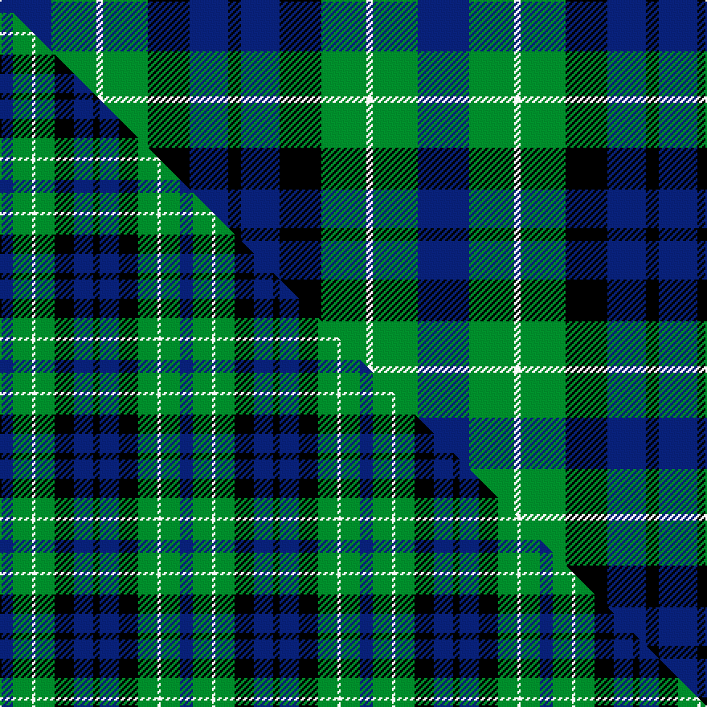

This is one **variant** — a specific cloth: this exact thread count and colourway, with its own
provenance below. It is one weaving of the [sett](/setts/db16g14w2g14k13db12k4/) (the scale-free proportion — the
same cloth at any scale or shade), whose colour order is pattern [BGWGKBK](/stripes/bgwgkbk/).

Part of the [MacNeil of Colonsay](/tartans/macneil-of-colonsay/) tartan — the named design grouping this sett with its other cloths.

Sourced from tartans-authority.  It is a [7 stripe tartan](/stripes/stripes7/).

Original link [https://www.tartanregister.gov.uk/tartanDetails.aspx?ref=196](https://www.tartanregister.gov.uk/tartanDetails.aspx?ref=196)

Dataset <small>— provenance for this record, inherited from the source manifest</small>

<dl class="dataset-prov">
<dt>source</dt><dd><a href="/sources/tartans-authority/">Scottish Tartans Authority</a></dd>
<dt>data captured from</dt><dd><a href="https://github.com/thetartan/tartan-database/blob/master/data/tartans-authority/data.csv">https://github.com/thetartan/tartan-database/blob/master/data/tartans-authority/data.csv</a></dd>
<dt>data date</dt><dd>1842 <small>(this record)</small></dd>
<dt>licence</dt><dd><a href="https://creativecommons.org/licenses/by-nc-nd/4.0/">CC BY-NC-ND 4.0</a></dd>
</dl>

Capture chain <small>— the hands this data passed through, oldest first; each capture carries its own licence</small>

<ol class="capture-chain">
<li><a href="https://www.tartansauthority.com/">Scottish Tartans Authority</a> <small>the heritage body's archive — its tartan-ferret record browser is retired (links repaired to the SRT, above)</small></li>
<li><a href="https://github.com/thetartan/tartan-database">thetartan/tartan-database</a> <small>2016-2017</small> · <a href="https://creativecommons.org/licenses/by-nc-nd/4.0/">CC BY-NC-ND 4.0</a> <small>Levko Kravets's frozen compilation — the capture we vendored, and where its CC licence text came from</small></li>
<li>this dictionary <small>captured 2026-06-10 · commit 5bf86c7566</small> <small>each re-capture is a git commit to data/sources</small></li>
</ol>

## Register references

External register numbers recorded for this tartan.

- Scottish Tartans Authority (ITI): 196

## Thread count
DB/32 G28 W4 G28 K26 DB24 K/8

One full sett is **260 threads**.

## Palette
<table><thead><tr><th>Colour</th><th>Shade</th><th>OKLCh</th></tr></thead><tbody><tr><td>DB</td><td><code style="background-color:#082077;">#082077</code> <small style="color:#888">#082077</small></td><td><small style="color:#888">oklch(30.0% 0.149 265.1)</small></td></tr><tr><td>G</td><td><code style="background-color:#008B2A;">#008B2A</code> <small style="color:#888">#008B2A</small></td><td><small style="color:#888">oklch(55.4% 0.170 145.9)</small></td></tr><tr><td>K</td><td><code style="background-color:#000000;">#000000</code> <small style="color:#888">#000000</small></td><td><small style="color:#888">oklch(0.0% 0.000 0.0)</small></td></tr><tr><td>W</td><td><code style="background-color:#F7F7F7;">#F7F7F7</code> <small style="color:#888">#F7F7F7</small></td><td><small style="color:#888">oklch(97.6% 0.000 89.9)</small></td></tr></tbody></table>

# Sample pattern

## Compared to the master

This cloth is one sett of its design; the master sett (the exemplar the design is anchored on) is below for comparison.

Its **ΔTartan distance** from the master is **0.32** — the same measure the nearest-tartans table ranks by (0 is identical; a re-scale of the same cloth is near 0, a recolour or a different proportion further).

<figure class="master-compare" style="margin:0">

this sett
master sett ★

<figcaption style="color:#888;font-size:smaller">One weave of this sett against the <a href="/setts/db4g6w1g6k6db6k2/">master sett ★</a>, split on the diagonal: a shared proportion runs seamlessly across it with only the shades shifting; a different proportion breaks on it.</figcaption>
</figure>

## Nearest tartan variants

The nearest existing variants by ΔTartan distance, with this cloth at the top so the swatches line up against it.

ΔTartan

Threads

Variant

Sett

—

260

<a href="/variants/s7/db16g14w2g14k13db12k4~x2/">MacNeil of Colonsay (Clan)</a>

<a href="/ttd/edit/#slug=db4g6w1g6k6db6k2~x2&amp;base=db16g14w2g14k13db12k4~x2" title="compare in the TTD">0.32</a>

112

<a href="/variants/s7/db4g6w1g6k6db6k2~x2/">MacNeil of Colonsay</a>

<a href="/ttd/edit/#slug=db4g6w1g6k6db6k2~x4&amp;base=db16g14w2g14k13db12k4~x2" title="compare in the TTD">0.32</a>

224

<a href="/variants/s7/db4g6w1g6k6db6k2~x4/">MacNeil of Colonsay Clan Tartan</a>

<a href="/ttd/edit/#slug=db4k3db16k14g14r3g3~x2&amp;base=db16g14w2g14k13db12k4~x2" title="compare in the TTD">0.91</a>

214

<a href="/variants/s7/db4k3db16k14g14r3g3~x2/">Inneryne (Personal)</a>

<a href="/ttd/edit/#slug=g24db6lb3k6db12k15g4~x2&amp;base=db16g14w2g14k13db12k4~x2" title="compare in the TTD">1.21</a>

224

<a href="/variants/s7/g24db6lb3k6db12k15g4~x2/">Blaylock Annandale</a>

<a href="/ttd/edit/#slug=db2k2db12k11g16w2~x2&amp;base=db16g14w2g14k13db12k4~x2" title="compare in the TTD">1.43</a>

172

<a href="/variants/s6/db2k2db12k11g16w2~x2/">Campbell of Argyll (Smiths)</a>

<a href="/ttd/edit/#slug=g9w1g6k7db7k1~x2&amp;base=db16g14w2g14k13db12k4~x2" title="compare in the TTD">1.44</a>

104

<a href="/variants/s6/g9w1g6k7db7k1~x2/">Menteith</a>

<a href="/ttd/edit/#slug=k7g6w1g6k7db7k1~x4&amp;base=db16g14w2g14k13db12k4~x2" title="compare in the TTD">1.51</a>

248

<a href="/variants/s7/k7g6w1g6k7db7k1~x4/">MacLaggan Artifact Tartan</a>

<a href="/ttd/edit/#slug=db2k2db12k11g12w2~x2&amp;base=db16g14w2g14k13db12k4~x2" title="compare in the TTD">1.52</a>

156

<a href="/variants/s6/db2k2db12k11g12w2~x2/">Campbell, The White Stripe</a>

<a href="/ttd/edit/#slug=g21w2g4k17db14k3&amp;base=db16g14w2g14k13db12k4~x2" title="compare in the TTD">1.60</a>

98

<a href="/variants/s6/g21w2g4k17db14k3/">Graham W</a>

<a href="/ttd/edit/#slug=k9g9w2g9k9db9k3~x2&amp;base=db16g14w2g14k13db12k4~x2" title="compare in the TTD">1.69</a>

176

<a href="/variants/s7/k9g9w2g9k9db9k3~x2/">Graham of Montrose - 1850 (Clan)</a>

## Neighbour map

Every grey dot is one of 13621 variants placed by the first two principal components of the ΔTartan feature space (42% of its variance). Red is this tartan; blue dots are its nearest — click one to open its page.

<svg viewBox="0 0 640 380" role="img" style="max-width:100%;height:auto;border:1px solid #e0e0e0;border-radius:4px;display:block" xmlns="http://www.w3.org/2000/svg"><image href="/nn/cloud.v1.png" width="640" height="380"/><a href="/variants/s7/db4g6w1g6k6db6k2~x2/"><circle cx="117.7" cy="254.5" r="4" fill="#3465a4"><title>MacNeil of Colonsay</title></circle></a><a href="/variants/s7/db4g6w1g6k6db6k2~x4/"><circle cx="117.7" cy="254.5" r="4" fill="#3465a4"><title>MacNeil of Colonsay Clan Tartan</title></circle></a><a href="/variants/s7/db4k3db16k14g14r3g3~x2/"><circle cx="127.0" cy="228.3" r="4" fill="#3465a4"><title>Inneryne (Personal)</title></circle></a><a href="/variants/s7/g24db6lb3k6db12k15g4~x2/"><circle cx="150.3" cy="212.8" r="4" fill="#3465a4"><title>Blaylock Annandale</title></circle></a><a href="/variants/s6/db2k2db12k11g16w2~x2/"><circle cx="141.6" cy="213.6" r="4" fill="#3465a4"><title>Campbell of Argyll (Smiths)</title></circle></a><a href="/variants/s6/g9w1g6k7db7k1~x2/"><circle cx="184.2" cy="225.2" r="4" fill="#3465a4"><title>Menteith</title></circle></a><a href="/variants/s7/k7g6w1g6k7db7k1~x4/"><circle cx="135.7" cy="230.8" r="4" fill="#3465a4"><title>MacLaggan Artifact Tartan</title></circle></a><a href="/variants/s6/db2k2db12k11g12w2~x2/"><circle cx="124.1" cy="228.6" r="4" fill="#3465a4"><title>Campbell, The White Stripe</title></circle></a><a href="/variants/s6/g21w2g4k17db14k3/"><circle cx="169.3" cy="204.8" r="4" fill="#3465a4"><title>Graham W</title></circle></a><a href="/variants/s7/k9g9w2g9k9db9k3~x2/"><circle cx="105.4" cy="260.4" r="4" fill="#3465a4"><title>Graham of Montrose - 1850 (Clan)</title></circle></a><circle cx="132.0" cy="242.7" r="5" fill="#c00000"/><text x="320" y="376" text-anchor="middle" font-size="11" fill="#999">ground</text><text x="11" y="190" text-anchor="middle" font-size="11" fill="#999" transform="rotate(-90 11 190)">complexity</text></svg>

ID: /variants/s7/db16g14w2g14k13db12k4~x2/
