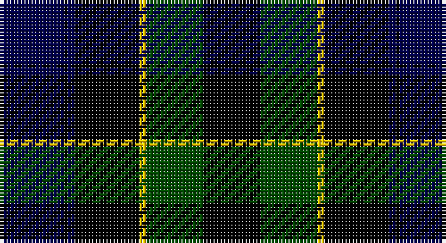

This page is one **sett** — a single exact thread-count. It belongs to the [tartan](/setts/db18k1db2k18ly2dg16k16/)
(the same proportion at any scale), whose colour order is pattern [BKBKYGK](/stripes/bkbkygk/).

Part of the [Mowat](/tartans/mowat/) tartan — the named design grouping this sett with its other cloths.

Sourced from weddslist.  It is a [7 stripe tartan](/stripes/stripes7/).

Original link http://www.weddslist.com/cgi-bin/tartans/pg.pl?source=rb

2 attestations — the source records this cloth was collapsed from (oldest owns this page)

<ul>
<li>undated — Mowat (weddslist, <a href="http://www.weddslist.com/cgi-bin/tartans/pg.pl?source=rb">record</a>)</li>
<li>undated — Mowat (weddslist, <a href="http://www.weddslist.com/cgi-bin/tartans/pg.pl?source=x">record</a>)</li>
</ul>

## Thread count
DB/18 K1 DB2 K18 Y2 G16 K/16

One full sett is **112 threads**.

## Palette

Palette: <strong>Tartan Register</strong> <small style="color:#888">(2 of 4 colours)</small>
<table><thead><tr><th>Colour</th><th>Threads</th><th>Shade</th><th>Base</th><th>OKLCh</th></tr></thead><tbody><tr><td>DB/</td><td style="text-align:right;font-variant-numeric:tabular-nums">18</td><td><code style="background-color:#00004C;">#00004C</code> <small style="color:#888">#00004C</small></td><td>B <code style="background-color:#2A418A;">#2A418A</code></td><td><small style="color:#888">oklch(18.8% 0.130 264.1)</small></td></tr><tr><td>K</td><td style="text-align:right;font-variant-numeric:tabular-nums">1</td><td><code style="background-color:#000000;">#000000</code> <small style="color:#888">#000000</small></td><td>K <code style="background-color:#000000;">#000000</code></td><td><small style="color:#888">oklch(0.0% 0.000 0.0)</small></td></tr><tr><td>DB</td><td style="text-align:right;font-variant-numeric:tabular-nums">2</td><td><code style="background-color:#00004C;">#00004C</code> <small style="color:#888">#00004C</small></td><td>B <code style="background-color:#2A418A;">#2A418A</code></td><td><small style="color:#888">oklch(18.8% 0.130 264.1)</small></td></tr><tr><td>K</td><td style="text-align:right;font-variant-numeric:tabular-nums">18</td><td><code style="background-color:#000000;">#000000</code> <small style="color:#888">#000000</small></td><td>K <code style="background-color:#000000;">#000000</code></td><td><small style="color:#888">oklch(0.0% 0.000 0.0)</small></td></tr><tr><td>Y</td><td style="text-align:right;font-variant-numeric:tabular-nums">2</td><td><code style="background-color:#FFC800;">#FFC800</code> <small style="color:#888">#FFC800</small></td><td>Y <code style="background-color:#F2BF00;">#F2BF00</code></td><td><small style="color:#888">oklch(85.7% 0.175 88.5)</small></td></tr><tr><td>G</td><td style="text-align:right;font-variant-numeric:tabular-nums">16</td><td><code style="background-color:#004C00;">#004C00</code> <small style="color:#888">#004C00</small></td><td>G <code style="background-color:#006100;">#006100</code></td><td><small style="color:#888">oklch(36.1% 0.123 142.5)</small></td></tr><tr><td>K/</td><td style="text-align:right;font-variant-numeric:tabular-nums">16</td><td><code style="background-color:#000000;">#000000</code> <small style="color:#888">#000000</small></td><td>K <code style="background-color:#000000;">#000000</code></td><td><small style="color:#888">oklch(0.0% 0.000 0.0)</small></td></tr></tbody></table>

# Sample pattern

## Compared to the master

This cloth is one sett of its design; the master sett (the exemplar the design is anchored on) is below for comparison.

<figure style="margin:0"><figcaption style="color:#888;font-size:smaller">this sett</figcaption></figure>
<figure style="margin:0"><figcaption style="color:#888;font-size:smaller"><a href="/setts/db24k3db5k23ly2k11g22/">master sett →</a></figcaption></figure>

## Nearest tartans

The nearest existing variants by ΔTartan distance, with this tartan at the top so the swatches line up against it.

ΔTartan

Tartan

Sett

—

<a href="/ttd/edit/#slug=db18k1db2k18ly2dg16k16">Mowat</a> <a class="nn-out" href="/variants/s7/db18k1db2k18ly2dg16k16/" title="open its dictionary page">↗</a>

0.37

<a href="/ttd/edit/#slug=db18k1db2k18ly2dg16k16~x2&amp;base=db18k1db2k18ly2dg16k16">Mowat</a> <a class="nn-out" href="/variants/s7/db18k1db2k18ly2dg16k16~x2/" title="open its dictionary page">↗</a>

1.14

<a href="/ttd/edit/#slug=dg14lr1dg7k7db2k2db2k2db7~x2&amp;base=db18k1db2k18ly2dg16k16">Abercrombie</a> <a class="nn-out" href="/variants/s9/dg14lr1dg7k7db2k2db2k2db7~x2/" title="open its dictionary page">↗</a>

1.14

<a href="/ttd/edit/#slug=dg14lr1dg7k7db2k2db2k2db7&amp;base=db18k1db2k18ly2dg16k16">Abercrombie</a> <a class="nn-out" href="/variants/s9/dg14lr1dg7k7db2k2db2k2db7/" title="open its dictionary page">↗</a>

1.21

<a href="/ttd/edit/#slug=dg14lb1dg7k7db2k2db2k2db7&amp;base=db18k1db2k18ly2dg16k16">Abercrombie</a> <a class="nn-out" href="/variants/s9/dg14lb1dg7k7db2k2db2k2db7/" title="open its dictionary page">↗</a>

1.21

<a href="/ttd/edit/#slug=k4db16k12dg24r1dg2k2~x2&amp;base=db18k1db2k18ly2dg16k16">Dundas</a> <a class="nn-out" href="/variants/s7/k4db16k12dg24r1dg2k2~x2/" title="open its dictionary page">↗</a>

1.24

<a href="/ttd/edit/#slug=dg16b2dg1k12db12k1~x2&amp;base=db18k1db2k18ly2dg16k16">Graham of Menteith</a> <a class="nn-out" href="/variants/s6/dg16b2dg1k12db12k1~x2/" title="open its dictionary page">↗</a>

1.35

<a href="/ttd/edit/#slug=dg2db12dg1k12dg12r2&amp;base=db18k1db2k18ly2dg16k16">Gunn</a> <a class="nn-out" href="/variants/s6/dg2db12dg1k12dg12r2/" title="open its dictionary page">↗</a>

1.35

<a href="/ttd/edit/#slug=dg14lr1dg7k7db2k2db2k2db14~x2&amp;base=db18k1db2k18ly2dg16k16">Abercrombie D</a> <a class="nn-out" href="/variants/s9/dg14lr1dg7k7db2k2db2k2db14~x2/" title="open its dictionary page">↗</a>

1.35

<a href="/ttd/edit/#slug=dg14lr1dg7k7db2k2db2k2db14&amp;base=db18k1db2k18ly2dg16k16">Abercrombie D</a> <a class="nn-out" href="/variants/s9/dg14lr1dg7k7db2k2db2k2db14/" title="open its dictionary page">↗</a>

1.38

<a href="/ttd/edit/#slug=k40dt4k12dt21g17k4~x2&amp;base=db18k1db2k18ly2dg16k16">Granger Family Tartan</a> <a class="nn-out" href="/variants/s6/k40dt4k12dt21g17k4~x2/" title="open its dictionary page">↗</a>

## Neighbour map

Every grey dot is one of 14360 variants placed by the first two principal components of the ΔTartan feature space (44% of its variance). Red is this tartan; blue dots are its nearest — click one to open its page.

<svg viewBox="0 0 640 380" role="img" style="max-width:100%;height:auto;border:1px solid #e0e0e0;border-radius:4px;display:block" xmlns="http://www.w3.org/2000/svg"><image href="/nn/cloud.v1.png" width="640" height="380"/><a href="/variants/s7/db18k1db2k18ly2dg16k16~x2/"><circle cx="278.4" cy="221.0" r="4" fill="#3465a4"><title>Mowat</title></circle></a><a href="/variants/s9/dg14lr1dg7k7db2k2db2k2db7~x2/"><circle cx="268.7" cy="209.2" r="4" fill="#3465a4"><title>Abercrombie</title></circle></a><a href="/variants/s9/dg14lr1dg7k7db2k2db2k2db7/"><circle cx="268.7" cy="209.2" r="4" fill="#3465a4"><title>Abercrombie</title></circle></a><a href="/variants/s9/dg14lb1dg7k7db2k2db2k2db7/"><circle cx="256.6" cy="203.9" r="4" fill="#3465a4"><title>Abercrombie</title></circle></a><a href="/variants/s7/k4db16k12dg24r1dg2k2~x2/"><circle cx="275.3" cy="188.5" r="4" fill="#3465a4"><title>Dundas</title></circle></a><a href="/variants/s6/dg16b2dg1k12db12k1~x2/"><circle cx="243.2" cy="221.0" r="4" fill="#3465a4"><title>Graham of Menteith</title></circle></a><a href="/variants/s6/dg2db12dg1k12dg12r2/"><circle cx="203.8" cy="229.6" r="4" fill="#3465a4"><title>Gunn</title></circle></a><a href="/variants/s9/dg14lr1dg7k7db2k2db2k2db14~x2/"><circle cx="252.9" cy="208.4" r="4" fill="#3465a4"><title>Abercrombie D</title></circle></a><a href="/variants/s9/dg14lr1dg7k7db2k2db2k2db14/"><circle cx="252.9" cy="208.4" r="4" fill="#3465a4"><title>Abercrombie D</title></circle></a><a href="/variants/s6/k40dt4k12dt21g17k4~x2/"><circle cx="300.7" cy="252.3" r="4" fill="#3465a4"><title>Granger Family Tartan</title></circle></a><circle cx="267.7" cy="215.6" r="5" fill="#c00000"/></svg>

ID: /variants/s7/db18k1db2k18ly2dg16k16/
