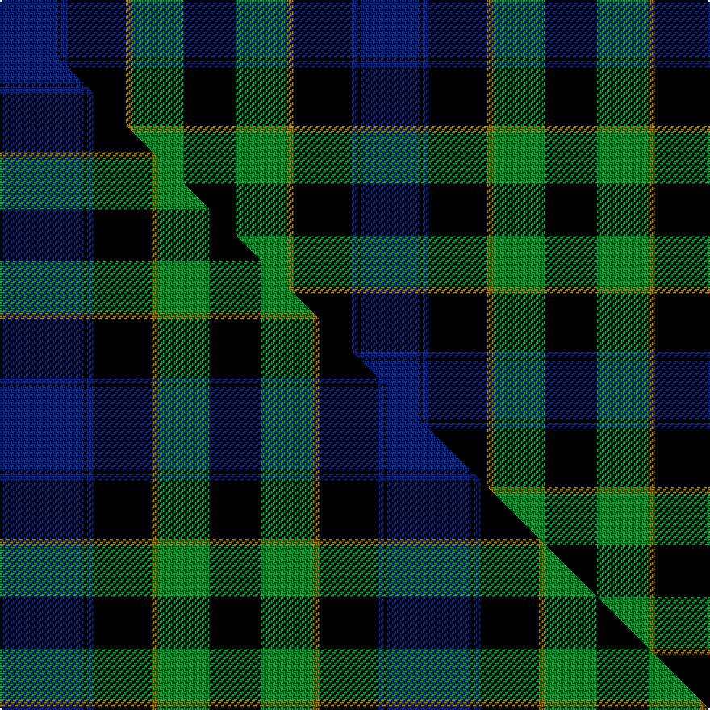

This is one **variant** — a specific cloth: this exact thread count and colourway, with its own
provenance below. It is one weaving of the [sett](/tartans/m/mo/mowat/) (the scale-free proportion — the
same cloth at any scale or shade), whose colour order is pattern [BKBKGGK](/stripes/bkbkggk/).

Part of the [Mowat](/tartans/m/mo/mowat/) tartan — the named design grouping this sett with its other cloths.

Sourced from weddslist.  It is a [7 stripe tartan](/stripes/stripes7/).

Original link [http://www.weddslist.com/cgi-bin/tartans/pg.pl?source=tinsel](http://www.weddslist.com/cgi-bin/tartans/pg.pl?source=tinsel)

Dataset <small>— provenance for this record, inherited from the source manifest</small>

<dl class="dataset-prov">
<dt>source</dt><dd><a href="/sources/weddslist/">Weddslist</a></dd>
<dt>data captured from</dt><dd><a href="https://github.com/thetartan/tartan-database/blob/master/data/weddslist/data.csv">https://github.com/thetartan/tartan-database/blob/master/data/weddslist/data.csv</a></dd>
<dt>data date</dt><dd>2016-11-17 <small>(dataset default)</small></dd>
<dt>licence</dt><dd><a href="https://creativecommons.org/licenses/by-nc-nd/4.0/">CC BY-NC-ND 4.0</a></dd>
</dl>

Capture chain <small>— the hands this data passed through, oldest first; each capture carries its own licence</small>

<ol class="capture-chain">
<li><a href="https://www.weddslist.com/tartans/">Weddslist</a> <small>the living privately compiled reference</small></li>
<li><a href="https://github.com/thetartan/tartan-database">thetartan/tartan-database</a> <small>2016-2017</small> · <a href="https://creativecommons.org/licenses/by-nc-nd/4.0/">CC BY-NC-ND 4.0</a> <small>Levko Kravets's frozen compilation — the capture we vendored, and where its CC licence text came from</small></li>
<li>this dictionary <small>captured 2026-06-10 · commit 5bf86c7566</small> <small>each re-capture is a git commit to data/sources</small></li>
</ol>

## Thread count
DB/36 K2 DB4 K36 Y4 G32 K/32

One full sett is **224 threads**.

## Palette
<table><thead><tr><th>Colour</th><th>Shade</th><th>OKLCh</th></tr></thead><tbody><tr><td>DB</td><td><code style="background-color:#082077;">#082077</code> <small style="color:#888">#082077</small></td><td><small style="color:#888">oklch(30.0% 0.149 265.1)</small></td></tr><tr><td>G</td><td><code style="background-color:#008B2A;">#008B2A</code> <small style="color:#888">#008B2A</small></td><td><small style="color:#888">oklch(55.4% 0.170 145.9)</small></td></tr><tr><td>K</td><td><code style="background-color:#000000;">#000000</code> <small style="color:#888">#000000</small></td><td><small style="color:#888">oklch(0.0% 0.000 0.0)</small></td></tr><tr><td>Y</td><td><code style="background-color:#8B6E00;">#8B6E00</code> <small style="color:#888">#8B6E00</small></td><td><small style="color:#888">oklch(55.1% 0.113 90.4)</small></td></tr></tbody></table>

# Sample pattern

## Compared to the master

This cloth is one sett of its design; the master sett (the exemplar the design is anchored on) is below for comparison.

Its **ΔTartan distance** from the master is **0.31** — the same measure the nearest-tartans table ranks by (0 is identical; a re-scale of the same cloth is near 0, a recolour or a different proportion further).

<figure class="master-compare" style="margin:0">

this sett
master sett ★

<figcaption style="color:#888;font-size:smaller">One weave of this sett against the <a href="/setts/db26k1db2k18y2g16k16/">master sett ★</a>, split on the diagonal: a shared proportion runs seamlessly across it with only the shades shifting; a different proportion breaks on it.</figcaption>
</figure>

## Nearest tartan variants

The nearest existing variants by ΔTartan distance, with this cloth at the top so the swatches line up against it.

ΔTartan

Threads

Variant

Sett

—

224

<a href="/variants/s7/db18k1db2k18y2g16k16~x2/">Mowat</a>

<a href="/ttd/edit/#slug=db18k1db2k18y2g16k16&amp;base=db18k1db2k18y2g16k16~x2" title="compare in the TTD">0.00</a>

112

<a href="/variants/s7/db18k1db2k18y2g16k16/">Mowat</a>

<a href="/ttd/edit/#slug=db26k1db2k18y2g16k16~x2&amp;base=db18k1db2k18y2g16k16~x2" title="compare in the TTD">0.31</a>

240

<a href="/variants/s7/db26k1db2k18y2g16k16~x2/">Mowat</a>

<a href="/ttd/edit/#slug=k5g23k18db21k33db3~x2&amp;base=db18k1db2k18y2g16k16~x2" title="compare in the TTD">1.02</a>

396

<a href="/variants/s6/k5g23k18db21k33db3~x2/">Black Watch (variation)</a>

<a href="/ttd/edit/#slug=db6k1db6k8r1g8k2&amp;base=db18k1db2k18y2g16k16~x2" title="compare in the TTD">1.18</a>

56

<a href="/variants/s7/db6k1db6k8r1g8k2/">Fletcher</a>

<a href="/ttd/edit/#slug=db6k1db6k8r1g8k2~x2&amp;base=db18k1db2k18y2g16k16~x2" title="compare in the TTD">1.18</a>

112

<a href="/variants/s7/db6k1db6k8r1g8k2~x2/">Fletcher Clan Tartan</a>

<a href="/ttd/edit/#slug=k2g10k9db9r1k1db2~x2&amp;base=db18k1db2k18y2g16k16~x2" title="compare in the TTD">1.35</a>

128

<a href="/variants/s7/k2g10k9db9r1k1db2~x2/">Reid and Taylor</a>

<a href="/ttd/edit/#slug=db6k2db18k18g18k3r2~x2&amp;base=db18k1db2k18y2g16k16~x2" title="compare in the TTD">1.47</a>

252

<a href="/variants/s7/db6k2db18k18g18k3r2~x2/">Renfrew</a>

<a href="/ttd/edit/#slug=db5k10db48k72w12dg48r5&amp;base=db18k1db2k18y2g16k16~x2" title="compare in the TTD">1.90</a>

390

<a href="/variants/s7/db5k10db48k72w12dg48r5/">Colquhoun (Clan)</a>

<a href="/ttd/edit/#slug=n15k14t1y2t1k14n15k2~x4~n1802249-t2503227&amp;base=db18k1db2k18y2g16k16~x2" title="compare in the TTD">1.96</a>

444

<a href="/variants/s8/n15k14t1y2t1k14n15k2~x4~n1802249-t2503227/">South African Air Force</a>

<a href="/ttd/edit/#slug=k5w2g18k17db16k3&amp;base=db18k1db2k18y2g16k16~x2" title="compare in the TTD">1.97</a>

114

<a href="/variants/s6/k5w2g18k17db16k3/">Melville</a>

## Neighbour map

Every grey dot is one of 13657 variants placed by the first two principal components of the ΔTartan feature space (42% of its variance). Red is this tartan; blue dots are its nearest — click one to open its page. The map is a flat projection of a many-dimensional space — [how to read it](/posts/neighbourhood-maps/).

<svg viewBox="0 0 640 380" role="img" style="max-width:100%;height:auto;border:1px solid #e0e0e0;border-radius:4px;display:block" xmlns="http://www.w3.org/2000/svg"><image href="/nn/cloud.v1.png" width="640" height="380"/><a href="/variants/s7/db18k1db2k18y2g16k16/"><circle cx="224.2" cy="176.5" r="4" fill="#3465a4"><title>Mowat</title></circle></a><a href="/variants/s7/db26k1db2k18y2g16k16~x2/"><circle cx="227.4" cy="160.3" r="4" fill="#3465a4"><title>Mowat</title></circle></a><a href="/variants/s6/k5g23k18db21k33db3~x2/"><circle cx="253.2" cy="224.5" r="4" fill="#3465a4"><title>Black Watch (variation)</title></circle></a><a href="/variants/s7/db6k1db6k8r1g8k2/"><circle cx="147.7" cy="216.8" r="4" fill="#3465a4"><title>Fletcher</title></circle></a><a href="/variants/s7/db6k1db6k8r1g8k2~x2/"><circle cx="147.7" cy="216.8" r="4" fill="#3465a4"><title>Fletcher Clan Tartan</title></circle></a><a href="/variants/s7/k2g10k9db9r1k1db2~x2/"><circle cx="155.4" cy="192.8" r="4" fill="#3465a4"><title>Reid and Taylor</title></circle></a><a href="/variants/s7/db6k2db18k18g18k3r2~x2/"><circle cx="155.0" cy="199.8" r="4" fill="#3465a4"><title>Renfrew</title></circle></a><a href="/variants/s7/db5k10db48k72w12dg48r5/"><circle cx="177.2" cy="160.9" r="4" fill="#3465a4"><title>Colquhoun (Clan)</title></circle></a><a href="/variants/s8/n15k14t1y2t1k14n15k2~x4~n1802249-t2503227/"><circle cx="261.5" cy="172.7" r="4" fill="#3465a4"><title>South African Air Force</title></circle></a><a href="/variants/s6/k5w2g18k17db16k3/"><circle cx="152.6" cy="208.1" r="4" fill="#3465a4"><title>Melville</title></circle></a><circle cx="224.2" cy="176.5" r="5" fill="#c00000"/><text x="320" y="376" text-anchor="middle" font-size="11" fill="#999">ground</text><text x="11" y="190" text-anchor="middle" font-size="11" fill="#999" transform="rotate(-90 11 190)">complexity</text></svg>

ID: /variants/s7/db18k1db2k18y2g16k16~x2/
