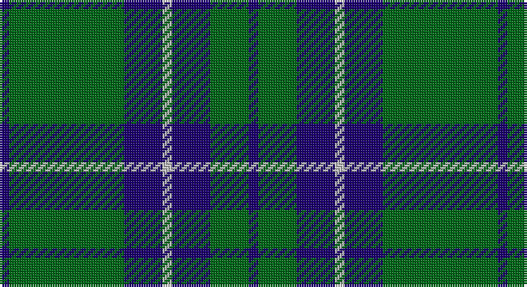

This page is one **sett** — a single exact thread-count. It belongs to the [tartan](/setts/db1g12db4lb1db4g4db1/)
(the same proportion at any scale), whose colour order is pattern [BGBWBGB](/stripes/bgbwbgb/).

Sourced from register-of-tartans.  It is a [7 stripe tartan](/stripes/stripes7/).

Original link https://www.tartanregister.gov.uk/tartanDetails.aspx?ref=3888

## Also known as

This cloth is also recorded under:

- St. Dennis & Cranley School

2 attestations — the source records this cloth was collapsed from (oldest owns this page)

<ul>
<li>01/01/1995 — St. Dennis & Cranley School (register-of-tartans, <a href="https://www.tartanregister.gov.uk/tartanDetails.aspx?ref=3888">record</a>)</li>
<li>1995 — St. Dennis & Cranley (Corporate) (tartans-authority, <a href="http://www.tartansauthority.com/tartan-ferret/display/5310/">record</a>)</li>
</ul>

## Register references

External register numbers recorded for this tartan.

- Scottish Register of Tartans: [3888](https://www.tartanregister.gov.uk/tartanDetails.aspx?ref=3888)
- Scottish Tartans Authority (ITI): 5310

## Thread count
DB/4 G48 DB16 N4 DB16 G16 DB/4

One full sett is **208 threads**.

## Palette

Palette: <strong>Tartan Register</strong>
<table><thead><tr><th>Colour</th><th>Threads</th><th>Shade</th><th>Base</th><th>OKLCh</th></tr></thead><tbody><tr><td>DB/</td><td style="text-align:right;font-variant-numeric:tabular-nums">4</td><td><code style="background-color:#1C0070;">#1C0070</code> <small style="color:#888">#1C0070</small></td><td>B <code style="background-color:#2A418A;">#2A418A</code></td><td><small style="color:#888">oklch(26.3% 0.162 277.1)</small></td></tr><tr><td>G</td><td style="text-align:right;font-variant-numeric:tabular-nums">48</td><td><code style="background-color:#006818;">#006818</code> <small style="color:#888">#006818</small></td><td>G <code style="background-color:#006100;">#006100</code></td><td><small style="color:#888">oklch(45.0% 0.142 145.0)</small></td></tr><tr><td>DB</td><td style="text-align:right;font-variant-numeric:tabular-nums">16</td><td><code style="background-color:#1C0070;">#1C0070</code> <small style="color:#888">#1C0070</small></td><td>B <code style="background-color:#2A418A;">#2A418A</code></td><td><small style="color:#888">oklch(26.3% 0.162 277.1)</small></td></tr><tr><td>N</td><td style="text-align:right;font-variant-numeric:tabular-nums">4</td><td><code style="background-color:#C0C0C0;">#C0C0C0</code> <small style="color:#888">#C0C0C0</small></td><td>W <code style="background-color:#F7F7F7;">#F7F7F7</code></td><td><small style="color:#888">oklch(80.8% 0.000 89.9)</small></td></tr><tr><td>DB</td><td style="text-align:right;font-variant-numeric:tabular-nums">16</td><td><code style="background-color:#1C0070;">#1C0070</code> <small style="color:#888">#1C0070</small></td><td>B <code style="background-color:#2A418A;">#2A418A</code></td><td><small style="color:#888">oklch(26.3% 0.162 277.1)</small></td></tr><tr><td>G</td><td style="text-align:right;font-variant-numeric:tabular-nums">16</td><td><code style="background-color:#006818;">#006818</code> <small style="color:#888">#006818</small></td><td>G <code style="background-color:#006100;">#006100</code></td><td><small style="color:#888">oklch(45.0% 0.142 145.0)</small></td></tr><tr><td>DB/</td><td style="text-align:right;font-variant-numeric:tabular-nums">4</td><td><code style="background-color:#1C0070;">#1C0070</code> <small style="color:#888">#1C0070</small></td><td>B <code style="background-color:#2A418A;">#2A418A</code></td><td><small style="color:#888">oklch(26.3% 0.162 277.1)</small></td></tr></tbody></table>

# Sample pattern

## Nearest tartans

The nearest existing variants by ΔTartan distance, with this tartan at the top so the swatches line up against it.

ΔTartan

Tartan

Sett

—

<a href="/ttd/edit/#slug=db1g12db4lb1db4g4db1~x4">St. Dennis &amp; Cranley School</a> <a class="nn-out" href="/variants/s7/db1g12db4lb1db4g4db1~x4/" title="open its dictionary page">↗</a>

1.11

<a href="/ttd/edit/#slug=dg10r1dg1r2dg8db10dg1ly1~x4&amp;base=db1g12db4lb1db4g4db1~x4">Glen Esk</a> <a class="nn-out" href="/variants/s8/dg10r1dg1r2dg8db10dg1ly1~x4/" title="open its dictionary page">↗</a>

1.23

<a href="/ttd/edit/#slug=db4w1db12g12db1g4~x2&amp;base=db1g12db4lb1db4g4db1~x4">Unidentified, Tweed</a> <a class="nn-out" href="/variants/s6/db4w1db12g12db1g4~x2/" title="open its dictionary page">↗</a>

1.25

<a href="/ttd/edit/#slug=g47r3g6db35lo3~x2&amp;base=db1g12db4lb1db4g4db1~x4">Gracie (Name)</a> <a class="nn-out" href="/variants/s5/g47r3g6db35lo3~x2/" title="open its dictionary page">↗</a>

1.31

<a href="/ttd/edit/#slug=dg4db12r3db12dg32lb4&amp;base=db1g12db4lb1db4g4db1~x4">MacIntyre L</a> <a class="nn-out" href="/variants/s6/dg4db12r3db12dg32lb4/" title="open its dictionary page">↗</a>

1.32

<a href="/ttd/edit/#slug=r2db32g14db5g16w2~x2&amp;base=db1g12db4lb1db4g4db1~x4">Connacht Irish District Tartan</a> <a class="nn-out" href="/variants/s6/r2db32g14db5g16w2~x2/" title="open its dictionary page">↗</a>

1.33

<a href="/ttd/edit/#slug=g3k6w2k6g2k2g16k2~x2&amp;base=db1g12db4lb1db4g4db1~x4">MacLean of Duart Hunting</a> <a class="nn-out" href="/variants/s8/g3k6w2k6g2k2g16k2~x2/" title="open its dictionary page">↗</a>

1.34

<a href="/ttd/edit/#slug=r3g22db16g14r2g6lo2~x2&amp;base=db1g12db4lb1db4g4db1~x4">Scottish Scouts (1957) (Corporate)</a> <a class="nn-out" href="/variants/s7/r3g22db16g14r2g6lo2~x2/" title="open its dictionary page">↗</a>

1.35

<a href="/ttd/edit/#slug=k2g11k26b11k2~x2&amp;base=db1g12db4lb1db4g4db1~x4">Campbell of Loch Awe</a> <a class="nn-out" href="/variants/s5/k2g11k26b11k2~x2/" title="open its dictionary page">↗</a>

1.37

<a href="/ttd/edit/#slug=db16w1db1w1db8g16r1db2~x2&amp;base=db1g12db4lb1db4g4db1~x4">Roxburgh</a> <a class="nn-out" href="/variants/s8/db16w1db1w1db8g16r1db2~x2/" title="open its dictionary page">↗</a>

1.39

<a href="/ttd/edit/#slug=g4db12r3db12g32w4~x2&amp;base=db1g12db4lb1db4g4db1~x4">MacIntyre Hunting (VS)</a> <a class="nn-out" href="/variants/s6/g4db12r3db12g32w4~x2/" title="open its dictionary page">↗</a>

## Neighbour map

Every grey dot is one of 14360 variants placed by the first two principal components of the ΔTartan feature space (44% of its variance). Red is this tartan; blue dots are its nearest — click one to open its page.

<svg viewBox="0 0 640 380" role="img" style="max-width:100%;height:auto;border:1px solid #e0e0e0;border-radius:4px;display:block" xmlns="http://www.w3.org/2000/svg"><image href="/nn/cloud.v1.png" width="640" height="380"/><a href="/variants/s8/dg10r1dg1r2dg8db10dg1ly1~x4/"><circle cx="324.4" cy="208.7" r="4" fill="#3465a4"><title>Glen Esk</title></circle></a><a href="/variants/s6/db4w1db12g12db1g4~x2/"><circle cx="339.4" cy="244.4" r="4" fill="#3465a4"><title>Unidentified, Tweed</title></circle></a><a href="/variants/s5/g47r3g6db35lo3~x2/"><circle cx="356.4" cy="211.1" r="4" fill="#3465a4"><title>Gracie (Name)</title></circle></a><a href="/variants/s6/dg4db12r3db12dg32lb4/"><circle cx="301.0" cy="219.4" r="4" fill="#3465a4"><title>MacIntyre L</title></circle></a><a href="/variants/s6/r2db32g14db5g16w2~x2/"><circle cx="323.1" cy="202.9" r="4" fill="#3465a4"><title>Connacht Irish District Tartan</title></circle></a><a href="/variants/s8/g3k6w2k6g2k2g16k2~x2/"><circle cx="320.6" cy="232.0" r="4" fill="#3465a4"><title>MacLean of Duart Hunting</title></circle></a><a href="/variants/s7/r3g22db16g14r2g6lo2~x2/"><circle cx="365.3" cy="227.3" r="4" fill="#3465a4"><title>Scottish Scouts (1957) (Corporate)</title></circle></a><a href="/variants/s5/k2g11k26b11k2~x2/"><circle cx="350.1" cy="245.0" r="4" fill="#3465a4"><title>Campbell of Loch Awe</title></circle></a><a href="/variants/s8/db16w1db1w1db8g16r1db2~x2/"><circle cx="368.9" cy="181.2" r="4" fill="#3465a4"><title>Roxburgh</title></circle></a><a href="/variants/s6/g4db12r3db12g32w4~x2/"><circle cx="294.7" cy="211.8" r="4" fill="#3465a4"><title>MacIntyre Hunting (VS)</title></circle></a><circle cx="369.2" cy="225.6" r="5" fill="#c00000"/></svg>

ID: /variants/s7/db1g12db4lb1db4g4db1~x4/
