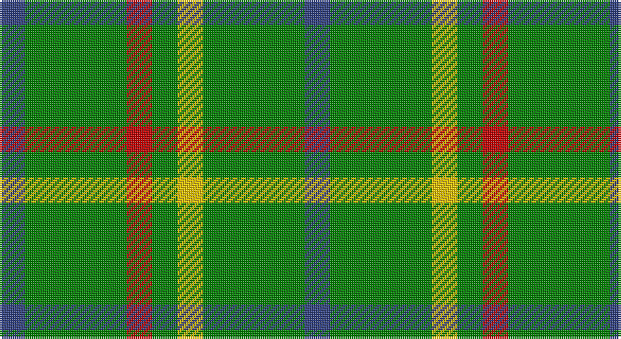

This page is one **sett** — a single exact thread-count. It belongs to the [tartan](/setts/db1g4r1g1ly1g4db1/)
(the same proportion at any scale), whose colour order is pattern [BGRGYGB](/stripes/bgrgygb/).

Sourced from weddslist.  It is a [7 stripe tartan](/stripes/stripes7/).

Original link http://www.weddslist.com/cgi-bin/tartans/pg.pl?source=sts

## Thread count
B/12 G48 R12 G12 Y12 G48 B/12

One full sett is **288 threads**.

## Palette

Palette: <strong>custom</strong>
<table><thead><tr><th>Colour</th><th>Threads</th><th>Shade</th><th>Base</th><th>OKLCh</th></tr></thead><tbody><tr><td>B/</td><td style="text-align:right;font-variant-numeric:tabular-nums">12</td><td><code style="background-color:#304080;">#304080</code> <small style="color:#888">#304080</small></td><td>B <code style="background-color:#2A418A;">#2A418A</code></td><td><small style="color:#888">oklch(39.4% 0.109 270.2)</small></td></tr><tr><td>G</td><td style="text-align:right;font-variant-numeric:tabular-nums">48</td><td><code style="background-color:#008000;">#008000</code> <small style="color:#888">#008000</small></td><td>G <code style="background-color:#006100;">#006100</code></td><td><small style="color:#888">oklch(52.0% 0.177 142.5)</small></td></tr><tr><td>R</td><td style="text-align:right;font-variant-numeric:tabular-nums">12</td><td><code style="background-color:#C00000;">#C00000</code> <small style="color:#888">#C00000</small></td><td>R <code style="background-color:#CC0000;">#CC0000</code></td><td><small style="color:#888">oklch(50.7% 0.208 29.2)</small></td></tr><tr><td>G</td><td style="text-align:right;font-variant-numeric:tabular-nums">12</td><td><code style="background-color:#008000;">#008000</code> <small style="color:#888">#008000</small></td><td>G <code style="background-color:#006100;">#006100</code></td><td><small style="color:#888">oklch(52.0% 0.177 142.5)</small></td></tr><tr><td>Y</td><td style="text-align:right;font-variant-numeric:tabular-nums">12</td><td><code style="background-color:#F0C000;">#F0C000</code> <small style="color:#888">#F0C000</small></td><td>Y <code style="background-color:#F2BF00;">#F2BF00</code></td><td><small style="color:#888">oklch(82.7% 0.169 90.5)</small></td></tr><tr><td>G</td><td style="text-align:right;font-variant-numeric:tabular-nums">48</td><td><code style="background-color:#008000;">#008000</code> <small style="color:#888">#008000</small></td><td>G <code style="background-color:#006100;">#006100</code></td><td><small style="color:#888">oklch(52.0% 0.177 142.5)</small></td></tr><tr><td>B/</td><td style="text-align:right;font-variant-numeric:tabular-nums">12</td><td><code style="background-color:#304080;">#304080</code> <small style="color:#888">#304080</small></td><td>B <code style="background-color:#2A418A;">#2A418A</code></td><td><small style="color:#888">oklch(39.4% 0.109 270.2)</small></td></tr></tbody></table>

# Sample pattern

## Nearest tartans

The nearest existing variants by ΔTartan distance, with this tartan at the top so the swatches line up against it.

ΔTartan

Tartan

Sett

—

<a href="/ttd/edit/#slug=db1g4r1g1ly1g4db1~x12">Justus hunting</a> <a class="nn-out" href="/variants/s7/db1g4r1g1ly1g4db1~x12/" title="open its dictionary page">↗</a>

1.03

<a href="/ttd/edit/#slug=lo21g28db24g72w16g20&amp;base=db1g4r1g1ly1g4db1~x12">Meath County Crest (Fashion)</a> <a class="nn-out" href="/variants/s6/lo21g28db24g72w16g20/" title="open its dictionary page">↗</a>

1.25

<a href="/ttd/edit/#slug=r1g6ly1g6db1g1db1g1db2r1~x4&amp;base=db1g4r1g1ly1g4db1~x12">Ayrton, Laoch</a> <a class="nn-out" href="/variants/s10/r1g6ly1g6db1g1db1g1db2r1~x4/" title="open its dictionary page">↗</a>

1.40

<a href="/ttd/edit/#slug=db1dg4r1dg1lo1dg4db1~x12&amp;base=db1g4r1g1ly1g4db1~x12">Justus Hunting (Personal)</a> <a class="nn-out" href="/variants/s7/db1dg4r1dg1lo1dg4db1~x12/" title="open its dictionary page">↗</a>

1.67

<a href="/ttd/edit/#slug=r2g12ly2g12db3g2db2g2db4r2~x2&amp;base=db1g4r1g1ly1g4db1~x12">Ayrton of Laoch (Personal)</a> <a class="nn-out" href="/variants/s10/r2g12ly2g12db3g2db2g2db4r2~x2/" title="open its dictionary page">↗</a>

1.73

<a href="/ttd/edit/#slug=db1r3g11r2db5g11ly1~x2&amp;base=db1g4r1g1ly1g4db1~x12">MacKintosh, hunting</a> <a class="nn-out" href="/variants/s7/db1r3g11r2db5g11ly1~x2/" title="open its dictionary page">↗</a>

1.74

<a href="/ttd/edit/#slug=g13dy7g13dy2g13dy2g13dy2w3ly4w3g4~x2&amp;base=db1g4r1g1ly1g4db1~x12">McGrane (2014)</a> <a class="nn-out" href="/variants/s12/g13dy7g13dy2g13dy2g13dy2w3ly4w3g4~x2/" title="open its dictionary page">↗</a>

1.78

<a href="/ttd/edit/#slug=g12k2g2dg9g4k2~x4&amp;base=db1g4r1g1ly1g4db1~x12">Campbell-Simpson (Personal)</a> <a class="nn-out" href="/variants/s6/g12k2g2dg9g4k2~x4/" title="open its dictionary page">↗</a>

1.79

<a href="/ttd/edit/#slug=g13do7g13do2g13do2g13do2w3lo4w3g4~x2&amp;base=db1g4r1g1ly1g4db1~x12">McGrane (2014)</a> <a class="nn-out" href="/variants/s12/g13do7g13do2g13do2g13do2w3lo4w3g4~x2/" title="open its dictionary page">↗</a>

1.79

<a href="/ttd/edit/#slug=g21ly10g20k3g10r3g10w3~x2&amp;base=db1g4r1g1ly1g4db1~x12">Hanby (Personal)</a> <a class="nn-out" href="/variants/s8/g21ly10g20k3g10r3g10w3~x2/" title="open its dictionary page">↗</a>

1.82

<a href="/ttd/edit/#slug=g3lr2g3r1g6r3g3r1g3lr2~x4&amp;base=db1g4r1g1ly1g4db1~x12">Dundee Green</a> <a class="nn-out" href="/variants/s10/g3lr2g3r1g6r3g3r1g3lr2~x4/" title="open its dictionary page">↗</a>

## Neighbour map

Every grey dot is one of 14360 variants placed by the first two principal components of the ΔTartan feature space (44% of its variance). Red is this tartan; blue dots are its nearest — click one to open its page.

<svg viewBox="0 0 640 380" role="img" style="max-width:100%;height:auto;border:1px solid #e0e0e0;border-radius:4px;display:block" xmlns="http://www.w3.org/2000/svg"><image href="/nn/cloud.v1.png" width="640" height="380"/><a href="/variants/s6/lo21g28db24g72w16g20/"><circle cx="307.0" cy="270.6" r="4" fill="#3465a4"><title>Meath County Crest (Fashion)</title></circle></a><a href="/variants/s10/r1g6ly1g6db1g1db1g1db2r1~x4/"><circle cx="355.0" cy="218.7" r="4" fill="#3465a4"><title>Ayrton, Laoch</title></circle></a><a href="/variants/s7/db1dg4r1dg1lo1dg4db1~x12/"><circle cx="359.6" cy="271.9" r="4" fill="#3465a4"><title>Justus Hunting (Personal)</title></circle></a><a href="/variants/s10/r2g12ly2g12db3g2db2g2db4r2~x2/"><circle cx="344.8" cy="221.7" r="4" fill="#3465a4"><title>Ayrton of Laoch (Personal)</title></circle></a><a href="/variants/s7/db1r3g11r2db5g11ly1~x2/"><circle cx="364.5" cy="217.9" r="4" fill="#3465a4"><title>MacKintosh, hunting</title></circle></a><a href="/variants/s12/g13dy7g13dy2g13dy2g13dy2w3ly4w3g4~x2/"><circle cx="362.3" cy="220.8" r="4" fill="#3465a4"><title>McGrane (2014)</title></circle></a><a href="/variants/s6/g12k2g2dg9g4k2~x4/"><circle cx="318.2" cy="274.4" r="4" fill="#3465a4"><title>Campbell-Simpson (Personal)</title></circle></a><a href="/variants/s12/g13do7g13do2g13do2g13do2w3lo4w3g4~x2/"><circle cx="371.5" cy="226.4" r="4" fill="#3465a4"><title>McGrane (2014)</title></circle></a><a href="/variants/s8/g21ly10g20k3g10r3g10w3~x2/"><circle cx="382.9" cy="225.5" r="4" fill="#3465a4"><title>Hanby (Personal)</title></circle></a><a href="/variants/s10/g3lr2g3r1g6r3g3r1g3lr2~x4/"><circle cx="335.2" cy="274.3" r="4" fill="#3465a4"><title>Dundee Green</title></circle></a><circle cx="344.4" cy="265.1" r="5" fill="#c00000"/></svg>

ID: /variants/s7/db1g4r1g1ly1g4db1~x12/
