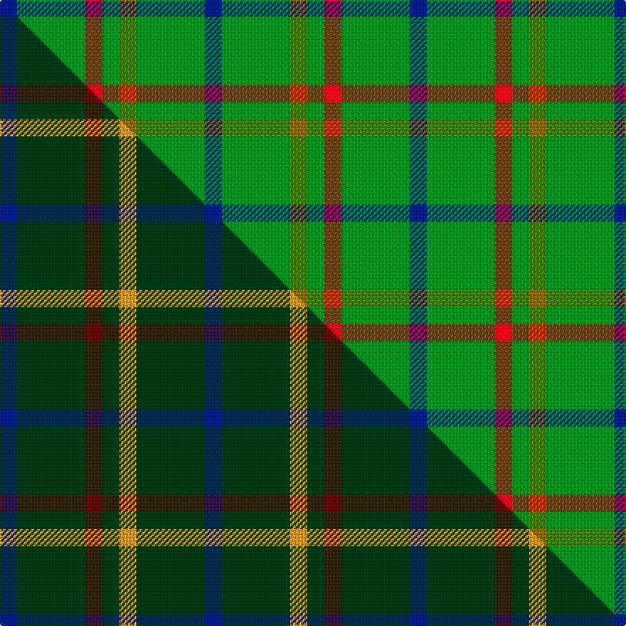

This is one **variant** — a specific cloth: this exact thread count and colourway, with its own
provenance below. It is one weaving of the [sett](/tartans/j/ju/justus-hunting/) (the scale-free proportion — the
same cloth at any scale or shade), whose colour order is pattern [BGGGRGB](/stripes/bgggrgb/).

Part of the [Justus Hunting](/tartans/j/ju/justus-hunting/) tartan — the named design grouping this sett with its other cloths.

Sourced from weddslist.  It is a [7 stripe tartan](/stripes/stripes7/).

Original link [http://www.weddslist.com/cgi-bin/tartans/pg.pl?source=sts](http://www.weddslist.com/cgi-bin/tartans/pg.pl?source=sts)

Dataset <small>— provenance for this record, inherited from the source manifest</small>

<dl class="dataset-prov">
<dt>source</dt><dd><a href="/sources/weddslist/">Weddslist</a></dd>
<dt>data captured from</dt><dd><a href="https://github.com/thetartan/tartan-database/blob/master/data/weddslist/data.csv">https://github.com/thetartan/tartan-database/blob/master/data/weddslist/data.csv</a></dd>
<dt>data date</dt><dd>2016-11-17 <small>(dataset default)</small></dd>
<dt>licence</dt><dd><a href="https://creativecommons.org/licenses/by-nc-nd/4.0/">CC BY-NC-ND 4.0</a></dd>
</dl>

Capture chain <small>— the hands this data passed through, oldest first; each capture carries its own licence</small>

<ol class="capture-chain">
<li><a href="https://www.weddslist.com/tartans/">Weddslist</a> <small>the living privately compiled reference</small></li>
<li><a href="https://github.com/thetartan/tartan-database">thetartan/tartan-database</a> <small>2016-2017</small> · <a href="https://creativecommons.org/licenses/by-nc-nd/4.0/">CC BY-NC-ND 4.0</a> <small>Levko Kravets's frozen compilation — the capture we vendored, and where its CC licence text came from</small></li>
<li>this dictionary <small>captured 2026-06-10 · commit 5bf86c7566</small> <small>each re-capture is a git commit to data/sources</small></li>
</ol>

## Thread count
DB/12 G48 R12 G12 Y12 G48 DB/12

One full sett is **288 threads**.

## Palette
<table><thead><tr><th>Colour</th><th>Shade</th><th>OKLCh</th></tr></thead><tbody><tr><td>DB</td><td><code style="background-color:#082077;">#082077</code> <small style="color:#888">#082077</small></td><td><small style="color:#888">oklch(30.0% 0.149 265.1)</small></td></tr><tr><td>G</td><td><code style="background-color:#008B2A;">#008B2A</code> <small style="color:#888">#008B2A</small></td><td><small style="color:#888">oklch(55.4% 0.170 145.9)</small></td></tr><tr><td>R</td><td><code style="background-color:#D60020;">#D60020</code> <small style="color:#888">#D60020</small></td><td><small style="color:#888">oklch(55.2% 0.224 25.5)</small></td></tr><tr><td>Y</td><td><code style="background-color:#8B6E00;">#8B6E00</code> <small style="color:#888">#8B6E00</small></td><td><small style="color:#888">oklch(55.1% 0.113 90.4)</small></td></tr></tbody></table>

# Sample pattern

## Compared to the master

This cloth is one sett of its design; the master sett (the exemplar the design is anchored on) is below for comparison.

Its **ΔTartan distance** from the master is **0.46** — the same measure the nearest-tartans table ranks by (0 is identical; a re-scale of the same cloth is near 0, a recolour or a different proportion further).

<figure class="master-compare" style="margin:0">

this sett
master sett ★

<figcaption style="color:#888;font-size:smaller">One weave of this sett against the <a href="/setts/db1dg4dr1dg1lo1dg4db1/">master sett ★</a>, split on the diagonal: a shared proportion runs seamlessly across it with only the shades shifting; a different proportion breaks on it.</figcaption>
</figure>

## Nearest tartan variants

The nearest existing variants by ΔTartan distance, with this cloth at the top so the swatches line up against it.

ΔTartan

Threads

Variant

Sett

—

288

<a href="/variants/s7/db1g4r1g1y1g4db1~x12/">Justus hunting</a>

<a href="/ttd/edit/#slug=db1dg4r1dg1ly1dg4db1~x12&amp;base=db1g4r1g1y1g4db1~x12" title="compare in the TTD">0.22</a>

288

<a href="/variants/s7/db1dg4r1dg1ly1dg4db1~x12/">Justus Htg (Personal)</a>

<a href="/ttd/edit/#slug=db1dg4dr1dg1lo1dg4db1~x12&amp;base=db1g4r1g1y1g4db1~x12" title="compare in the TTD">0.46</a>

288

<a href="/variants/s7/db1dg4dr1dg1lo1dg4db1~x12/">Justus Hunting (Personal)</a>

<a href="/ttd/edit/#slug=g8r2lb3y2g4n4g14db2n2db2~x2&amp;base=db1g4r1g1y1g4db1~x12" title="compare in the TTD">1.60</a>

152

<a href="/variants/s10/g8r2lb3y2g4n4g14db2n2db2~x2/">Lévesque, Pascal (Personal)</a>

<a href="/ttd/edit/#slug=dy21g28db24g72w16g20&amp;base=db1g4r1g1y1g4db1~x12" title="compare in the TTD">1.69</a>

321

<a href="/variants/s6/dy21g28db24g72w16g20/">Meath County, Crest Range</a>

<a href="/ttd/edit/#slug=ly21g28db24g72w16g20&amp;base=db1g4r1g1y1g4db1~x12" title="compare in the TTD">1.69</a>

321

<a href="/variants/s6/ly21g28db24g72w16g20/">Meath County Crest (Fashion)</a>

<a href="/ttd/edit/#slug=g10b4g1b4g15r4g1~x4&amp;base=db1g4r1g1y1g4db1~x12" title="compare in the TTD">2.01</a>

268

<a href="/variants/s7/g10b4g1b4g15r4g1~x4/">Logan</a>

<a href="/ttd/edit/#slug=g4r1g15t5r1w5g4r1~x4&amp;base=db1g4r1g1y1g4db1~x12" title="compare in the TTD">2.19</a>

268

<a href="/variants/s8/g4r1g15t5r1w5g4r1~x4/">McGirr (Letterkenny) David, (Pers.)</a>

<a href="/ttd/edit/#slug=g3db8g3k4g15r2~x2&amp;base=db1g4r1g1y1g4db1~x12" title="compare in the TTD">2.19</a>

130

<a href="/variants/s6/g3db8g3k4g15r2~x2/">Lauder (Family)</a>

<a href="/ttd/edit/#slug=db3dy7g2y2g14dy2g2db3~x2&amp;base=db1g4r1g1y1g4db1~x12" title="compare in the TTD">2.25</a>

128

<a href="/variants/s8/db3dy7g2y2g14dy2g2db3~x2/">Daks (Loden)</a>

<a href="/ttd/edit/#slug=r5g20r5g20db24g6y4&amp;base=db1g4r1g1y1g4db1~x12" title="compare in the TTD">2.31</a>

159

<a href="/variants/s7/r5g20r5g20db24g6y4/">Cameron of Lochiel (Hunting) Clan/Family Tartan</a>

## Neighbour map

Every grey dot is one of 13662 variants placed by the first two principal components of the ΔTartan feature space (42% of its variance). Red is this tartan; blue dots are its nearest — click one to open its page. The map is a flat projection of a many-dimensional space — [how to read it](/posts/neighbourhood-maps/).

<svg viewBox="0 0 640 380" role="img" style="max-width:100%;height:auto;border:1px solid #e0e0e0;border-radius:4px;display:block" xmlns="http://www.w3.org/2000/svg"><image href="/nn/cloud.v1.png" width="640" height="380"/><a href="/variants/s7/db1dg4r1dg1ly1dg4db1~x12/"><circle cx="364.1" cy="256.8" r="4" fill="#3465a4"><title>Justus Htg (Personal)</title></circle></a><a href="/variants/s7/db1dg4dr1dg1lo1dg4db1~x12/"><circle cx="416.7" cy="282.9" r="4" fill="#3465a4"><title>Justus Hunting (Personal)</title></circle></a><a href="/variants/s10/g8r2lb3y2g4n4g14db2n2db2~x2/"><circle cx="312.4" cy="203.9" r="4" fill="#3465a4"><title>Lévesque, Pascal (Personal)</title></circle></a><a href="/variants/s6/dy21g28db24g72w16g20/"><circle cx="333.0" cy="281.6" r="4" fill="#3465a4"><title>Meath County, Crest Range</title></circle></a><a href="/variants/s6/ly21g28db24g72w16g20/"><circle cx="336.3" cy="284.6" r="4" fill="#3465a4"><title>Meath County Crest (Fashion)</title></circle></a><a href="/variants/s7/g10b4g1b4g15r4g1~x4/"><circle cx="465.0" cy="227.6" r="4" fill="#3465a4"><title>Logan</title></circle></a><a href="/variants/s8/g4r1g15t5r1w5g4r1~x4/"><circle cx="369.6" cy="190.4" r="4" fill="#3465a4"><title>McGirr (Letterkenny) David, (Pers.)</title></circle></a><a href="/variants/s6/g3db8g3k4g15r2~x2/"><circle cx="269.1" cy="215.1" r="4" fill="#3465a4"><title>Lauder (Family)</title></circle></a><a href="/variants/s8/db3dy7g2y2g14dy2g2db3~x2/"><circle cx="317.2" cy="243.5" r="4" fill="#3465a4"><title>Daks (Loden)</title></circle></a><a href="/variants/s7/r5g20r5g20db24g6y4/"><circle cx="273.6" cy="248.6" r="4" fill="#3465a4"><title>Cameron of Lochiel (Hunting) Clan/Family Tartan</title></circle></a><circle cx="376.1" cy="268.1" r="5" fill="#c00000"/><text x="320" y="376" text-anchor="middle" font-size="11" fill="#999">ground</text><text x="11" y="190" text-anchor="middle" font-size="11" fill="#999" transform="rotate(-90 11 190)">complexity</text></svg>

ID: /variants/s7/db1g4r1g1y1g4db1~x12/
