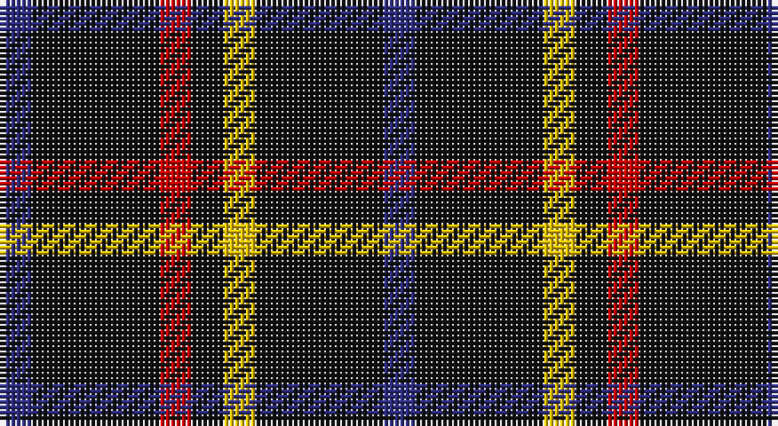

This page is one **sett** — a single exact thread-count. It belongs to the [tartan](/setts/db1k4r1k1ly1k4db1/)
(the same proportion at any scale), whose colour order is pattern [BKRKYKB](/stripes/bkrkykb/).

Sourced from house-of-tartan.  It is a [7 stripe tartan](/stripes/stripes7/).

Original link http://www.house-of-tartan.scotland.net/house/TartanViewjs.asp?colr=Def&tnam=2100

## Provenance

Earliest known date: 1990 Submitted as the Justus family sett but awaits the approval of the proposed Justus Family Society of North America. Sample supplied in 9 tpi.

## Thread count
DB/6 K24 R6 K6 Y6 K24 DB/6

One full sett is **144 threads**.

## Palette

Palette: <strong>Tartan Register</strong>
<table><thead><tr><th>Colour</th><th>Threads</th><th>Shade</th><th>Base</th><th>OKLCh</th></tr></thead><tbody><tr><td>DB/</td><td style="text-align:right;font-variant-numeric:tabular-nums">6</td><td><code style="background-color:#2C2C80;">#2C2C80</code> <small style="color:#888">#2C2C80</small></td><td>B <code style="background-color:#2A418A;">#2A418A</code></td><td><small style="color:#888">oklch(35.0% 0.138 276.6)</small></td></tr><tr><td>K</td><td style="text-align:right;font-variant-numeric:tabular-nums">24</td><td><code style="background-color:#101010;">#101010</code> <small style="color:#888">#101010</small></td><td>K <code style="background-color:#000000;">#000000</code></td><td><small style="color:#888">oklch(17.3% 0.000 89.9)</small></td></tr><tr><td>R</td><td style="text-align:right;font-variant-numeric:tabular-nums">6</td><td><code style="background-color:#C80000;">#C80000</code> <small style="color:#888">#C80000</small></td><td>R <code style="background-color:#CC0000;">#CC0000</code></td><td><small style="color:#888">oklch(52.3% 0.215 29.2)</small></td></tr><tr><td>K</td><td style="text-align:right;font-variant-numeric:tabular-nums">6</td><td><code style="background-color:#101010;">#101010</code> <small style="color:#888">#101010</small></td><td>K <code style="background-color:#000000;">#000000</code></td><td><small style="color:#888">oklch(17.3% 0.000 89.9)</small></td></tr><tr><td>Y</td><td style="text-align:right;font-variant-numeric:tabular-nums">6</td><td><code style="background-color:#E8C000;">#E8C000</code> <small style="color:#888">#E8C000</small></td><td>Y <code style="background-color:#F2BF00;">#F2BF00</code></td><td><small style="color:#888">oklch(81.9% 0.168 93.7)</small></td></tr><tr><td>K</td><td style="text-align:right;font-variant-numeric:tabular-nums">24</td><td><code style="background-color:#101010;">#101010</code> <small style="color:#888">#101010</small></td><td>K <code style="background-color:#000000;">#000000</code></td><td><small style="color:#888">oklch(17.3% 0.000 89.9)</small></td></tr><tr><td>DB/</td><td style="text-align:right;font-variant-numeric:tabular-nums">6</td><td><code style="background-color:#2C2C80;">#2C2C80</code> <small style="color:#888">#2C2C80</small></td><td>B <code style="background-color:#2A418A;">#2A418A</code></td><td><small style="color:#888">oklch(35.0% 0.138 276.6)</small></td></tr></tbody></table>

# Sample pattern

## Nearest tartans

The nearest existing variants by ΔTartan distance, with this tartan at the top so the swatches line up against it.

ΔTartan

Tartan

Sett

—

<a href="/ttd/edit/#slug=db1k4r1k1ly1k4db1~x6">Justus Family Tartan</a> <a class="nn-out" href="/variants/s7/db1k4r1k1ly1k4db1~x6/" title="open its dictionary page">↗</a>

0.90

<a href="/ttd/edit/#slug=db1k4r1k1lo1k4db1~x12&amp;base=db1k4r1k1ly1k4db1~x6">Justus (Personal)</a> <a class="nn-out" href="/variants/s7/db1k4r1k1lo1k4db1~x12/" title="open its dictionary page">↗</a>

1.32

<a href="/ttd/edit/#slug=k16b2k8r3lr3r3k8~x2&amp;base=db1k4r1k1ly1k4db1~x6">Benson (New England)</a> <a class="nn-out" href="/variants/s7/k16b2k8r3lr3r3k8~x2/" title="open its dictionary page">↗</a>

1.34

<a href="/ttd/edit/#slug=k17r6k2lb6k17lo2~x2&amp;base=db1k4r1k1ly1k4db1~x6">Black (symmetrical)</a> <a class="nn-out" href="/variants/s6/k17r6k2lb6k17lo2~x2/" title="open its dictionary page">↗</a>

1.45

<a href="/ttd/edit/#slug=k17r6k2w6k17lo2~x2&amp;base=db1k4r1k1ly1k4db1~x6">Black 1990 (Name)</a> <a class="nn-out" href="/variants/s6/k17r6k2w6k17lo2~x2/" title="open its dictionary page">↗</a>

1.56

<a href="/ttd/edit/#slug=r1n6k1n1k2n1k1n6ly1~x8&amp;base=db1k4r1k1ly1k4db1~x6">Modowny</a> <a class="nn-out" href="/variants/s9/r1n6k1n1k2n1k1n6ly1~x8/" title="open its dictionary page">↗</a>

1.65

<a href="/ttd/edit/#slug=k25ly5k5g25k25b3k10~x2&amp;base=db1k4r1k1ly1k4db1~x6">London Community Gospel Choir</a> <a class="nn-out" href="/variants/s7/k25ly5k5g25k25b3k10~x2/" title="open its dictionary page">↗</a>

1.79

<a href="/ttd/edit/#slug=db24w4db24lo4r5k4~x2&amp;base=db1k4r1k1ly1k4db1~x6">de Grussa (Personal)</a> <a class="nn-out" href="/variants/s6/db24w4db24lo4r5k4~x2/" title="open its dictionary page">↗</a>

1.80

<a href="/variants/s6/r3lo2k10w1~x6/">St. Eloi</a>

1.87

<a href="/ttd/edit/#slug=k8t3k32b14w3k25t3~x2&amp;base=db1k4r1k1ly1k4db1~x6">Cowe (Personal)</a> <a class="nn-out" href="/variants/s7/k8t3k32b14w3k25t3~x2/" title="open its dictionary page">↗</a>

1.87

<a href="/ttd/edit/#slug=r1k10n2lb5k5r1~x4&amp;base=db1k4r1k1ly1k4db1~x6">Callaway (Corporate)</a> <a class="nn-out" href="/variants/s6/r1k10n2lb5k5r1~x4/" title="open its dictionary page">↗</a>

## Neighbour map

Every grey dot is one of 14360 variants placed by the first two principal components of the ΔTartan feature space (44% of its variance). Red is this tartan; blue dots are its nearest — click one to open its page.

<svg viewBox="0 0 640 380" role="img" style="max-width:100%;height:auto;border:1px solid #e0e0e0;border-radius:4px;display:block" xmlns="http://www.w3.org/2000/svg"><image href="/nn/cloud.v1.png" width="640" height="380"/><a href="/variants/s7/db1k4r1k1lo1k4db1~x12/"><circle cx="361.1" cy="272.0" r="4" fill="#3465a4"><title>Justus (Personal)</title></circle></a><a href="/variants/s7/k16b2k8r3lr3r3k8~x2/"><circle cx="402.8" cy="229.1" r="4" fill="#3465a4"><title>Benson (New England)</title></circle></a><a href="/variants/s6/k17r6k2lb6k17lo2~x2/"><circle cx="380.7" cy="228.4" r="4" fill="#3465a4"><title>Black (symmetrical)</title></circle></a><a href="/variants/s6/k17r6k2w6k17lo2~x2/"><circle cx="371.2" cy="223.5" r="4" fill="#3465a4"><title>Black 1990 (Name)</title></circle></a><a href="/variants/s9/r1n6k1n1k2n1k1n6ly1~x8/"><circle cx="360.5" cy="206.7" r="4" fill="#3465a4"><title>Modowny</title></circle></a><a href="/variants/s7/k25ly5k5g25k25b3k10~x2/"><circle cx="350.0" cy="242.7" r="4" fill="#3465a4"><title>London Community Gospel Choir</title></circle></a><a href="/variants/s6/db24w4db24lo4r5k4~x2/"><circle cx="376.5" cy="221.6" r="4" fill="#3465a4"><title>de Grussa (Personal)</title></circle></a><a href="/variants/s6/r3lo2k10w1~x6/"><circle cx="376.0" cy="216.7" r="4" fill="#3465a4"><title>St. Eloi</title></circle></a><a href="/variants/s7/k8t3k32b14w3k25t3~x2/"><circle cx="411.9" cy="213.6" r="4" fill="#3465a4"><title>Cowe (Personal)</title></circle></a><a href="/variants/s6/r1k10n2lb5k5r1~x4/"><circle cx="308.7" cy="209.9" r="4" fill="#3465a4"><title>Callaway (Corporate)</title></circle></a><circle cx="335.4" cy="257.0" r="5" fill="#c00000"/></svg>

ID: /variants/s7/db1k4r1k1ly1k4db1~x6/
