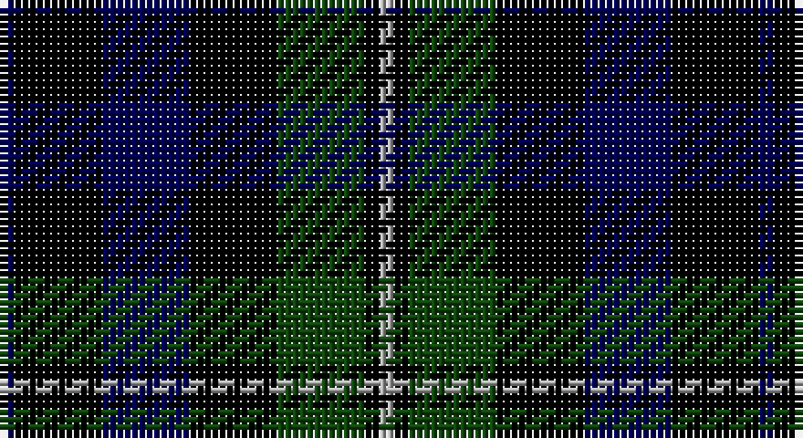

This page is one **sett** — a single exact thread-count. It belongs to the [tartan](/setts/db1k6db6k6dg6k1lr1/)
(the same proportion at any scale), whose colour order is pattern [BKBKGKY](/stripes/bkbkgky/).

Sourced from weddslist.  It is a [7 stripe tartan](/stripes/stripes7/).

Original link http://www.weddslist.com/cgi-bin/tartans/pg.pl?source=tinsel

## Thread count
DB/2 K12 DB12 K12 DG12 K2 N/2

One full sett is **104 threads**.

## Palette

Palette: <strong>Ingles Buchan</strong> <small style="color:#888">(1 of 4 colours)</small>
<table><thead><tr><th>Colour</th><th>Threads</th><th>Shade</th><th>Base</th><th>OKLCh</th></tr></thead><tbody><tr><td>DB/</td><td style="text-align:right;font-variant-numeric:tabular-nums">2</td><td><code style="background-color:#000052;">#000052</code> <small style="color:#888">#000052</small></td><td>B <code style="background-color:#2A418A;">#2A418A</code></td><td><small style="color:#888">oklch(19.8% 0.137 264.1)</small></td></tr><tr><td>K</td><td style="text-align:right;font-variant-numeric:tabular-nums">12</td><td><code style="background-color:#000000;">#000000</code> <small style="color:#888">#000000</small></td><td>K <code style="background-color:#000000;">#000000</code></td><td><small style="color:#888">oklch(0.0% 0.000 0.0)</small></td></tr><tr><td>DB</td><td style="text-align:right;font-variant-numeric:tabular-nums">12</td><td><code style="background-color:#000052;">#000052</code> <small style="color:#888">#000052</small></td><td>B <code style="background-color:#2A418A;">#2A418A</code></td><td><small style="color:#888">oklch(19.8% 0.137 264.1)</small></td></tr><tr><td>K</td><td style="text-align:right;font-variant-numeric:tabular-nums">12</td><td><code style="background-color:#000000;">#000000</code> <small style="color:#888">#000000</small></td><td>K <code style="background-color:#000000;">#000000</code></td><td><small style="color:#888">oklch(0.0% 0.000 0.0)</small></td></tr><tr><td>DG</td><td style="text-align:right;font-variant-numeric:tabular-nums">12</td><td><code style="background-color:#11450D;">#11450D</code> <small style="color:#888">#11450D</small></td><td>G <code style="background-color:#006100;">#006100</code></td><td><small style="color:#888">oklch(34.4% 0.101 142.1)</small></td></tr><tr><td>K</td><td style="text-align:right;font-variant-numeric:tabular-nums">2</td><td><code style="background-color:#000000;">#000000</code> <small style="color:#888">#000000</small></td><td>K <code style="background-color:#000000;">#000000</code></td><td><small style="color:#888">oklch(0.0% 0.000 0.0)</small></td></tr><tr><td>N/</td><td style="text-align:right;font-variant-numeric:tabular-nums">2</td><td><code style="background-color:#AAAAAA;">#AAAAAA</code> <small style="color:#888">#AAAAAA</small></td><td>Y <code style="background-color:#F2BF00;">#F2BF00</code></td><td><small style="color:#888">oklch(73.8% 0.000 89.9)</small></td></tr></tbody></table>

# Sample pattern

## Nearest tartans

The nearest existing variants by ΔTartan distance, with this tartan at the top so the swatches line up against it.

ΔTartan

Tartan

Sett

—

<a href="/ttd/edit/#slug=db1k6db6k6dg6k1lr1~x2">Forbes LC</a> <a class="nn-out" href="/variants/s7/db1k6db6k6dg6k1lr1~x2/" title="open its dictionary page">↗</a>

0.00

<a href="/ttd/edit/#slug=db1k6db6k6dg6k1lr1&amp;base=db1k6db6k6dg6k1lr1~x2">Forbes LC</a> <a class="nn-out" href="/variants/s7/db1k6db6k6dg6k1lr1/" title="open its dictionary page">↗</a>

0.36

<a href="/ttd/edit/#slug=db1k6db6k6dg6k1lb1&amp;base=db1k6db6k6dg6k1lr1~x2">Forbes LC</a> <a class="nn-out" href="/variants/s7/db1k6db6k6dg6k1lb1/" title="open its dictionary page">↗</a>

0.94

<a href="/variants/s8/k7r2k2ki6lo1ki1lo1ki4~x4/">Printing Industries of America</a>

0.95

<a href="/ttd/edit/#slug=dg8k2b1dg4k6db6k1~x2&amp;base=db1k6db6k6dg6k1lr1~x2">MacCallum</a> <a class="nn-out" href="/variants/s7/dg8k2b1dg4k6db6k1~x2/" title="open its dictionary page">↗</a>

1.05

<a href="/ttd/edit/#slug=db6k1db6k8r1dg8k2&amp;base=db1k6db6k6dg6k1lr1~x2">Fletcher</a> <a class="nn-out" href="/variants/s7/db6k1db6k8r1dg8k2/" title="open its dictionary page">↗</a>

1.17

<a href="/ttd/edit/#slug=db6k1db6k8r1dg8k2~x2&amp;base=db1k6db6k6dg6k1lr1~x2">Fletcher</a> <a class="nn-out" href="/variants/s7/db6k1db6k8r1dg8k2~x2/" title="open its dictionary page">↗</a>

1.19

<a href="/ttd/edit/#slug=dg8k2lb1dg4k6db6k1~x2&amp;base=db1k6db6k6dg6k1lr1~x2">MacCallum</a> <a class="nn-out" href="/variants/s7/dg8k2lb1dg4k6db6k1~x2/" title="open its dictionary page">↗</a>

1.22

<a href="/ttd/edit/#slug=db6k1db6k8r1dg8r2~x2&amp;base=db1k6db6k6dg6k1lr1~x2">Fletcher C</a> <a class="nn-out" href="/variants/s7/db6k1db6k8r1dg8r2~x2/" title="open its dictionary page">↗</a>

1.28

<a href="/ttd/edit/#slug=db6k1db6k8r1dg8r2&amp;base=db1k6db6k6dg6k1lr1~x2">Fletcher C</a> <a class="nn-out" href="/variants/s7/db6k1db6k8r1dg8r2/" title="open its dictionary page">↗</a>

1.32

<a href="/ttd/edit/#slug=db1k6db6k6g6k1w1~x6&amp;base=db1k6db6k6dg6k1lr1~x2">Forbes - 1947 (Lyon Court)</a> <a class="nn-out" href="/variants/s7/db1k6db6k6g6k1w1~x6/" title="open its dictionary page">↗</a>

## Neighbour map

Every grey dot is one of 14360 variants placed by the first two principal components of the ΔTartan feature space (44% of its variance). Red is this tartan; blue dots are its nearest — click one to open its page.

<svg viewBox="0 0 640 380" role="img" style="max-width:100%;height:auto;border:1px solid #e0e0e0;border-radius:4px;display:block" xmlns="http://www.w3.org/2000/svg"><image href="/nn/cloud.v1.png" width="640" height="380"/><a href="/variants/s7/db1k6db6k6dg6k1lr1/"><circle cx="223.1" cy="265.2" r="4" fill="#3465a4"><title>Forbes LC</title></circle></a><a href="/variants/s7/db1k6db6k6dg6k1lb1/"><circle cx="212.7" cy="260.3" r="4" fill="#3465a4"><title>Forbes LC</title></circle></a><a href="/variants/s8/k7r2k2ki6lo1ki1lo1ki4~x4/"><circle cx="231.3" cy="237.8" r="4" fill="#3465a4"><title>Printing Industries of America</title></circle></a><a href="/variants/s7/dg8k2b1dg4k6db6k1~x2/"><circle cx="216.6" cy="257.5" r="4" fill="#3465a4"><title>MacCallum</title></circle></a><a href="/variants/s7/db6k1db6k8r1dg8k2/"><circle cx="197.5" cy="258.4" r="4" fill="#3465a4"><title>Fletcher</title></circle></a><a href="/variants/s7/db6k1db6k8r1dg8k2~x2/"><circle cx="205.6" cy="262.3" r="4" fill="#3465a4"><title>Fletcher</title></circle></a><a href="/variants/s7/dg8k2lb1dg4k6db6k1~x2/"><circle cx="194.4" cy="246.3" r="4" fill="#3465a4"><title>MacCallum</title></circle></a><a href="/variants/s7/db6k1db6k8r1dg8r2~x2/"><circle cx="183.4" cy="252.5" r="4" fill="#3465a4"><title>Fletcher C</title></circle></a><a href="/variants/s7/db6k1db6k8r1dg8r2/"><circle cx="168.3" cy="244.5" r="4" fill="#3465a4"><title>Fletcher C</title></circle></a><a href="/variants/s7/db1k6db6k6g6k1w1~x6/"><circle cx="216.3" cy="255.2" r="4" fill="#3465a4"><title>Forbes - 1947 (Lyon Court)</title></circle></a><circle cx="223.1" cy="265.2" r="5" fill="#c00000"/></svg>

ID: /variants/s7/db1k6db6k6dg6k1lr1~x2/
