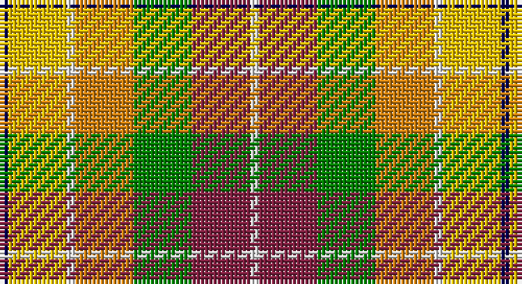

This page is one **sett** — a single exact thread-count. It belongs to the [tartan](/setts/db1ly7w1lo7g7m7w1/)
(the same proportion at any scale), whose colour order is pattern [BYWYGRW](/stripes/bywygrw/).

Part of the [Kipp](/tartans/kipp/) tartan — the named design grouping this sett with its other cloths.

Sourced from weddslist.  It is a [7 stripe tartan](/stripes/stripes7/).

Original link http://www.weddslist.com/cgi-bin/tartans/pg.pl?source=sts

## Thread count
DB/2 Y14 LN2 O14 G14 DR14 LN/2

One full sett is **120 threads**.

## Palette

Palette: <strong>Tartan Dictionary</strong> <small style="color:#888">(1 of 6 colours)</small>
<table><thead><tr><th>Colour</th><th>Threads</th><th>Shade</th><th>Base</th><th>OKLCh</th></tr></thead><tbody><tr><td>DB/</td><td style="text-align:right;font-variant-numeric:tabular-nums">2</td><td><code style="background-color:#000050;">#000050</code> <small style="color:#888">#000050</small></td><td>B <code style="background-color:#2A418A;">#2A418A</code></td><td><small style="color:#888">oklch(19.5% 0.135 264.1)</small></td></tr><tr><td>Y</td><td style="text-align:right;font-variant-numeric:tabular-nums">14</td><td><code style="background-color:#F0C000;">#F0C000</code> <small style="color:#888">#F0C000</small></td><td>Y <code style="background-color:#F2BF00;">#F2BF00</code></td><td><small style="color:#888">oklch(82.7% 0.169 90.5)</small></td></tr><tr><td>LN</td><td style="text-align:right;font-variant-numeric:tabular-nums">2</td><td><code style="background-color:#E0E0E0;">#E0E0E0</code> <small style="color:#888">#E0E0E0</small></td><td>W <code style="background-color:#F7F7F7;">#F7F7F7</code></td><td><small style="color:#888">oklch(90.7% 0.000 89.9)</small></td></tr><tr><td>O</td><td style="text-align:right;font-variant-numeric:tabular-nums">14</td><td><code style="background-color:#D08010;">#D08010</code> <small style="color:#888">#D08010</small></td><td>Y <code style="background-color:#F2BF00;">#F2BF00</code></td><td><small style="color:#888">oklch(67.0% 0.145 66.1)</small></td></tr><tr><td>G</td><td style="text-align:right;font-variant-numeric:tabular-nums">14</td><td><code style="background-color:#008000;">#008000</code> <small style="color:#888">#008000</small></td><td>G <code style="background-color:#006100;">#006100</code></td><td><small style="color:#888">oklch(52.0% 0.177 142.5)</small></td></tr><tr><td>DR</td><td style="text-align:right;font-variant-numeric:tabular-nums">14</td><td><code style="background-color:#802040;">#802040</code> <small style="color:#888">#802040</small></td><td>R <code style="background-color:#CC0000;">#CC0000</code></td><td><small style="color:#888">oklch(40.8% 0.132 5.2)</small></td></tr><tr><td>LN/</td><td style="text-align:right;font-variant-numeric:tabular-nums">2</td><td><code style="background-color:#E0E0E0;">#E0E0E0</code> <small style="color:#888">#E0E0E0</small></td><td>W <code style="background-color:#F7F7F7;">#F7F7F7</code></td><td><small style="color:#888">oklch(90.7% 0.000 89.9)</small></td></tr></tbody></table>

# Sample pattern

## Compared to the master

This cloth is one sett of its design; the master sett (the exemplar the design is anchored on) is below for comparison.

<figure style="margin:0"><figcaption style="color:#888;font-size:smaller">this sett</figcaption></figure>
<figure style="margin:0"><figcaption style="color:#888;font-size:smaller"><a href="/setts/db2lo10lb1o8g7dr10lb2/">master sett →</a></figcaption></figure>

## Nearest tartans

The nearest existing variants by ΔTartan distance, with this tartan at the top so the swatches line up against it.

ΔTartan

Tartan

Sett

—

<a href="/ttd/edit/#slug=db1ly7w1lo7g7m7w1~x2">Kipp</a> <a class="nn-out" href="/variants/s7/db1ly7w1lo7g7m7w1~x2/" title="open its dictionary page">↗</a>

1.19

<a href="/ttd/edit/#slug=db2lo10lb1o8g7dr10lb2~x2&amp;base=db1ly7w1lo7g7m7w1~x2">Kipp (Personal)</a> <a class="nn-out" href="/variants/s7/db2lo10lb1o8g7dr10lb2~x2/" title="open its dictionary page">↗</a>

1.26

<a href="/ttd/edit/#slug=w2ri8o5ly6w5g21w6ri8r4w2&amp;base=db1ly7w1lo7g7m7w1~x2">Jacobite, Silk sash</a> <a class="nn-out" href="/variants/s10/w2ri8o5ly6w5g21w6ri8r4w2/" title="open its dictionary page">↗</a>

1.44

<a href="/ttd/edit/#slug=r8lo4ly3g6t6dp1~x5&amp;base=db1ly7w1lo7g7m7w1~x2">Pride, The Tartan of</a> <a class="nn-out" href="/variants/s6/r8lo4ly3g6t6dp1~x5/" title="open its dictionary page">↗</a>

1.47

<a href="/ttd/edit/#slug=w2r8dy5ly6w5dg21w6r8ri4w2&amp;base=db1ly7w1lo7g7m7w1~x2">Jacobite Silk sash</a> <a class="nn-out" href="/variants/s10/w2r8dy5ly6w5dg21w6r8ri4w2/" title="open its dictionary page">↗</a>

1.50

<a href="/ttd/edit/#slug=w5y4b1y4r4b1dg4ly1~x2&amp;base=db1ly7w1lo7g7m7w1~x2">Devon Rural Skills Trust</a> <a class="nn-out" href="/variants/s8/w5y4b1y4r4b1dg4ly1~x2/" title="open its dictionary page">↗</a>

1.50

<a href="/ttd/edit/#slug=r22t6db10ly4r4w4g22db8ly3&amp;base=db1ly7w1lo7g7m7w1~x2">Unnamed No 14</a> <a class="nn-out" href="/variants/s9/r22t6db10ly4r4w4g22db8ly3/" title="open its dictionary page">↗</a>

1.52

<a href="/ttd/edit/#slug=w2k1gi4r2gi2r4g5k1ly2~x6&amp;base=db1ly7w1lo7g7m7w1~x2">Ellis (Personal)</a> <a class="nn-out" href="/variants/s9/w2k1gi4r2gi2r4g5k1ly2~x6/" title="open its dictionary page">↗</a>

1.54

<a href="/ttd/edit/#slug=r10n3db1lb8db1lo2g5~x4&amp;base=db1ly7w1lo7g7m7w1~x2">Porcupine City of</a> <a class="nn-out" href="/variants/s7/r10n3db1lb8db1lo2g5~x4/" title="open its dictionary page">↗</a>

1.55

<a href="/ttd/edit/#slug=dy17o5db2w12db2ly4g7~x2&amp;base=db1ly7w1lo7g7m7w1~x2">Ontario Northern Canadian District Tartan</a> <a class="nn-out" href="/variants/s7/dy17o5db2w12db2ly4g7~x2/" title="open its dictionary page">↗</a>

1.56

<a href="/ttd/edit/#slug=w5y4t1y4r4t1dg4ly1~x6&amp;base=db1ly7w1lo7g7m7w1~x2">Devon Rural Skills Trust</a> <a class="nn-out" href="/variants/s8/w5y4t1y4r4t1dg4ly1~x6/" title="open its dictionary page">↗</a>

## Neighbour map

Every grey dot is one of 14360 variants placed by the first two principal components of the ΔTartan feature space (44% of its variance). Red is this tartan; blue dots are its nearest — click one to open its page.

<svg viewBox="0 0 640 380" role="img" style="max-width:100%;height:auto;border:1px solid #e0e0e0;border-radius:4px;display:block" xmlns="http://www.w3.org/2000/svg"><image href="/nn/cloud.v1.png" width="640" height="380"/><a href="/variants/s7/db2lo10lb1o8g7dr10lb2~x2/"><circle cx="63.7" cy="174.4" r="4" fill="#3465a4"><title>Kipp (Personal)</title></circle></a><a href="/variants/s10/w2ri8o5ly6w5g21w6ri8r4w2/"><circle cx="88.7" cy="138.8" r="4" fill="#3465a4"><title>Jacobite, Silk sash</title></circle></a><a href="/variants/s6/r8lo4ly3g6t6dp1~x5/"><circle cx="64.3" cy="209.5" r="4" fill="#3465a4"><title>Pride, The Tartan of</title></circle></a><a href="/variants/s10/w2r8dy5ly6w5dg21w6r8ri4w2/"><circle cx="80.4" cy="133.8" r="4" fill="#3465a4"><title>Jacobite Silk sash</title></circle></a><a href="/variants/s8/w5y4b1y4r4b1dg4ly1~x2/"><circle cx="44.4" cy="204.1" r="4" fill="#3465a4"><title>Devon Rural Skills Trust</title></circle></a><a href="/variants/s9/r22t6db10ly4r4w4g22db8ly3/"><circle cx="89.1" cy="164.6" r="4" fill="#3465a4"><title>Unnamed No 14</title></circle></a><a href="/variants/s9/w2k1gi4r2gi2r4g5k1ly2~x6/"><circle cx="14.0" cy="198.8" r="4" fill="#3465a4"><title>Ellis (Personal)</title></circle></a><a href="/variants/s7/r10n3db1lb8db1lo2g5~x4/"><circle cx="115.9" cy="164.2" r="4" fill="#3465a4"><title>Porcupine City of</title></circle></a><a href="/variants/s7/dy17o5db2w12db2ly4g7~x2/"><circle cx="87.2" cy="167.3" r="4" fill="#3465a4"><title>Ontario Northern Canadian District Tartan</title></circle></a><a href="/variants/s8/w5y4t1y4r4t1dg4ly1~x6/"><circle cx="36.2" cy="200.2" r="4" fill="#3465a4"><title>Devon Rural Skills Trust</title></circle></a><circle cx="40.3" cy="178.7" r="5" fill="#c00000"/></svg>

ID: /variants/s7/db1ly7w1lo7g7m7w1~x2/
