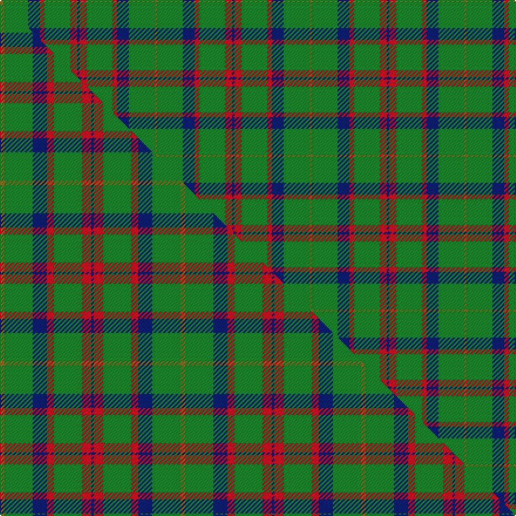

This is one **variant** — a specific cloth: this exact thread count and colourway, with its own
provenance below. It is one weaving of the [sett](/tartans/m/ma/mackintosh-hunting/) (the scale-free proportion — the
same cloth at any scale or shade), whose colour order is pattern [BRGRBGG](/stripes/brgrbgg/).

Part of the [MacKintosh Hunting](/tartans/m/ma/mackintosh-hunting/) tartan — the named design grouping this sett with its other cloths.

Sourced from house-of-tartan.  It is a [7 stripe tartan](/stripes/stripes7/).

Original link [http://www.house-of-tartan.scotland.net/house/TartanViewjs.asp?colr=Def&tnam=544](http://www.house-of-tartan.scotland.net/house/TartanViewjs.asp?colr=Def&tnam=544)

## Provenance

Earliest known date: 1951 This sett appears in D.C. Stewarts book, The Setts of the Scottish Tartans, with slightly different proportions. The Lyon Court Book No. 1 records the sett in relation to the narrowest stripe. ie Y 1, Vt (Vert meaning green) 10 1/2, Bu 5, etc. The rendering illustrated here multiplies the Lyon count by two. Commercially manufactured cloth may vary from these proportions. D.C. Stewart calls the sett "a modern arrangement".

2 attestations — the source records this cloth was collapsed from (oldest owns this page)

<ul>
<li>1951 — MacKintosh Hunting Clan Tartan (house-of-tartan, <a href="http://www.house-of-tartan.scotland.net/house/TartanViewjs.asp?colr=Def&tnam=544">record</a>) </li>
<li>undated — MacKintosh, hunting (weddslist, <a href="http://www.weddslist.com/cgi-bin/tartans/pg.pl?source=sts">record</a>) </li>
</ul>

Dataset <small>— provenance for this record, inherited from the source manifest</small>

<dl class="dataset-prov">
<dt>source</dt><dd><a href="/sources/house-of-tartan/">House of Tartan</a></dd>
<dt>data captured from</dt><dd><a href="https://github.com/thetartan/tartan-database/blob/master/data/house-of-tartan/data.csv">https://github.com/thetartan/tartan-database/blob/master/data/house-of-tartan/data.csv</a></dd>
<dt>data date</dt><dd>1951 <small>(this record)</small></dd>
<dt>licence</dt><dd><a href="https://creativecommons.org/licenses/by-nc-nd/4.0/">CC BY-NC-ND 4.0</a></dd>
</dl>

Capture chain <small>— the hands this data passed through, oldest first; each capture carries its own licence</small>

<ol class="capture-chain">
<li><a href="http://www.house-of-tartan.scotland.net/">House of Tartan</a> <small>the weaver/retailer's database — the site is now offline; the URL is kept as the ultimate source's identity</small></li>
<li><a href="https://github.com/thetartan/tartan-database">thetartan/tartan-database</a> <small>2016-2017</small> · <a href="https://creativecommons.org/licenses/by-nc-nd/4.0/">CC BY-NC-ND 4.0</a> <small>Levko Kravets's frozen compilation — the capture we vendored, and where its CC licence text came from</small></li>
<li>this dictionary <small>captured 2026-06-10 · commit 5bf86c7566</small> <small>each re-capture is a git commit to data/sources</small></li>
</ol>

## Thread count
DB/2 R6 G22 R4 DB10 G22 Y/2

One full sett is **132 threads**.

## Palette
<table><thead><tr><th>Colour</th><th>Shade</th><th>OKLCh</th></tr></thead><tbody><tr><td>DB</td><td><code style="background-color:#082077;">#082077</code> <small style="color:#888">#082077</small></td><td><small style="color:#888">oklch(30.0% 0.149 265.1)</small></td></tr><tr><td>G</td><td><code style="background-color:#008B2A;">#008B2A</code> <small style="color:#888">#008B2A</small></td><td><small style="color:#888">oklch(55.4% 0.170 145.9)</small></td></tr><tr><td>R</td><td><code style="background-color:#D60020;">#D60020</code> <small style="color:#888">#D60020</small></td><td><small style="color:#888">oklch(55.2% 0.224 25.5)</small></td></tr><tr><td>Y</td><td><code style="background-color:#8B6E00;">#8B6E00</code> <small style="color:#888">#8B6E00</small></td><td><small style="color:#888">oklch(55.1% 0.113 90.4)</small></td></tr></tbody></table>

# Sample pattern

## Compared to the master

This cloth is one sett of its design; the master sett (the exemplar the design is anchored on) is below for comparison.

Its **ΔTartan distance** from the master is **0.23** — the same measure the nearest-tartans table ranks by (0 is identical; a re-scale of the same cloth is near 0, a recolour or a different proportion further).

<figure class="master-compare" style="margin:0">

this sett
master sett ★

<figcaption style="color:#888;font-size:smaller">One weave of this sett against the <a href="/setts/y2g12db6r3g12r4db1/">master sett ★</a>, split on the diagonal: a shared proportion runs seamlessly across it with only the shades shifting; a different proportion breaks on it.</figcaption>
</figure>

## Nearest tartan variants

The nearest existing variants by ΔTartan distance, with this cloth at the top so the swatches line up against it.

ΔTartan

Threads

Variant

Sett

—

132

<a href="/variants/s7/db1r3g11r2db5g11y1~x2/">MacKintosh Hunting Clan Tartan</a>

<a href="/ttd/edit/#slug=y2g12db6r3g12r4db1~x2&amp;base=db1r3g11r2db5g11y1~x2" title="compare in the TTD">0.23</a>

154

<a href="/variants/s7/y2g12db6r3g12r4db1~x2/">MacKintosh Hunting</a>

<a href="/ttd/edit/#slug=y2g12db6r3g12r4db1&amp;base=db1r3g11r2db5g11y1~x2" title="compare in the TTD">0.23</a>

77

<a href="/variants/s7/y2g12db6r3g12r4db1/">MacKintosh Hunting</a>

<a href="/ttd/edit/#slug=db6r15g41r15db20g41lb6&amp;base=db1r3g11r2db5g11y1~x2" title="compare in the TTD">0.83</a>

276

<a href="/variants/s7/db6r15g41r15db20g41lb6/">Bean Hunting</a>

<a href="/ttd/edit/#slug=g6b1g7w1b7r1~x4~w98-r5221030&amp;base=db1r3g11r2db5g11y1~x2" title="compare in the TTD">1.54</a>

156

<a href="/variants/s6/g6b1g7w1b7r1~x4~w98-r5221030/">Norris (1957)</a>

<a href="/ttd/edit/#slug=g6b1g7w1b7r1~x4&amp;base=db1r3g11r2db5g11y1~x2" title="compare in the TTD">1.54</a>

156

<a href="/variants/s6/g6b1g7w1b7r1~x4/">Norris (1957) (Name)</a>

<a href="/ttd/edit/#slug=g4r1g15t5r1w5g4r1~x4&amp;base=db1r3g11r2db5g11y1~x2" title="compare in the TTD">2.08</a>

268

<a href="/variants/s8/g4r1g15t5r1w5g4r1~x4/">McGirr (Letterkenny) David, (Pers.)</a>

<a href="/ttd/edit/#slug=r3g22db16g14r2g6y1~x2&amp;base=db1r3g11r2db5g11y1~x2" title="compare in the TTD">2.25</a>

248

<a href="/variants/s7/r3g22db16g14r2g6y1~x2/">Scottish Scouts Corporate Tartan</a>

<a href="/ttd/edit/#slug=g14w1db2r1g1r1db2w1g4y1~x4&amp;base=db1r3g11r2db5g11y1~x2" title="compare in the TTD">2.30</a>

164

<a href="/variants/s10/g14w1db2r1g1r1db2w1g4y1~x4/">Seattle District Tartan</a>

<a href="/ttd/edit/#slug=g10r3g30n10w2db15r4~x2&amp;base=db1r3g11r2db5g11y1~x2" title="compare in the TTD">2.31</a>

268

<a href="/variants/s7/g10r3g30n10w2db15r4~x2/">Sinclair</a>

<a href="/ttd/edit/#slug=g47r3g6db35y3~x2&amp;base=db1r3g11r2db5g11y1~x2" title="compare in the TTD">2.32</a>

276

<a href="/variants/s5/g47r3g6db35y3~x2/">Gracie</a>

## Neighbour map

Every grey dot is one of 13662 variants placed by the first two principal components of the ΔTartan feature space (42% of its variance). Red is this tartan; blue dots are its nearest — click one to open its page. The map is a flat projection of a many-dimensional space — [how to read it](/posts/neighbourhood-maps/).

<svg viewBox="0 0 640 380" role="img" style="max-width:100%;height:auto;border:1px solid #e0e0e0;border-radius:4px;display:block" xmlns="http://www.w3.org/2000/svg"><image href="/nn/cloud.v1.png" width="640" height="380"/><a href="/variants/s7/y2g12db6r3g12r4db1~x2/"><circle cx="331.8" cy="218.4" r="4" fill="#3465a4"><title>MacKintosh Hunting</title></circle></a><a href="/variants/s7/y2g12db6r3g12r4db1/"><circle cx="331.8" cy="218.4" r="4" fill="#3465a4"><title>MacKintosh Hunting</title></circle></a><a href="/variants/s7/db6r15g41r15db20g41lb6/"><circle cx="280.0" cy="241.5" r="4" fill="#3465a4"><title>Bean Hunting</title></circle></a><a href="/variants/s6/g6b1g7w1b7r1~x4~w98-r5221030/"><circle cx="332.1" cy="254.5" r="4" fill="#3465a4"><title>Norris (1957)</title></circle></a><a href="/variants/s6/g6b1g7w1b7r1~x4/"><circle cx="333.2" cy="254.8" r="4" fill="#3465a4"><title>Norris (1957) (Name)</title></circle></a><a href="/variants/s8/g4r1g15t5r1w5g4r1~x4/"><circle cx="369.6" cy="190.4" r="4" fill="#3465a4"><title>McGirr (Letterkenny) David, (Pers.)</title></circle></a><a href="/variants/s7/r3g22db16g14r2g6y1~x2/"><circle cx="396.6" cy="189.2" r="4" fill="#3465a4"><title>Scottish Scouts Corporate Tartan</title></circle></a><a href="/variants/s10/g14w1db2r1g1r1db2w1g4y1~x4/"><circle cx="378.5" cy="138.4" r="4" fill="#3465a4"><title>Seattle District Tartan</title></circle></a><a href="/variants/s7/g10r3g30n10w2db15r4~x2/"><circle cx="289.6" cy="189.2" r="4" fill="#3465a4"><title>Sinclair</title></circle></a><a href="/variants/s5/g47r3g6db35y3~x2/"><circle cx="359.5" cy="202.9" r="4" fill="#3465a4"><title>Gracie</title></circle></a><circle cx="367.4" cy="212.7" r="5" fill="#c00000"/><text x="320" y="376" text-anchor="middle" font-size="11" fill="#999">ground</text><text x="11" y="190" text-anchor="middle" font-size="11" fill="#999" transform="rotate(-90 11 190)">complexity</text></svg>

ID: /variants/s7/db1r3g11r2db5g11y1~x2/
