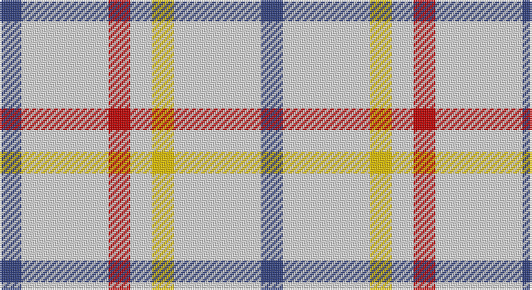

This page is one **sett** — a single exact thread-count. It belongs to the [tartan](/setts/db1w4r1w1ly1w4db1/)
(the same proportion at any scale), whose colour order is pattern [BWRWYWB](/stripes/bwrwywb/).

Sourced from weddslist.  It is a [7 stripe tartan](/stripes/stripes7/).

Original link http://www.weddslist.com/cgi-bin/tartans/pg.pl?source=sts

## Thread count
B/12 LN48 R12 LN12 Y12 LN48 B/12

One full sett is **288 threads**.

## Palette

Palette: <strong>Tartan Dictionary</strong> <small style="color:#888">(1 of 4 colours)</small>
<table><thead><tr><th>Colour</th><th>Threads</th><th>Shade</th><th>Base</th><th>OKLCh</th></tr></thead><tbody><tr><td>B/</td><td style="text-align:right;font-variant-numeric:tabular-nums">12</td><td><code style="background-color:#304080;">#304080</code> <small style="color:#888">#304080</small></td><td>B <code style="background-color:#2A418A;">#2A418A</code></td><td><small style="color:#888">oklch(39.4% 0.109 270.2)</small></td></tr><tr><td>LN</td><td style="text-align:right;font-variant-numeric:tabular-nums">48</td><td><code style="background-color:#E0E0E0;">#E0E0E0</code> <small style="color:#888">#E0E0E0</small></td><td>W <code style="background-color:#F7F7F7;">#F7F7F7</code></td><td><small style="color:#888">oklch(90.7% 0.000 89.9)</small></td></tr><tr><td>R</td><td style="text-align:right;font-variant-numeric:tabular-nums">12</td><td><code style="background-color:#C00000;">#C00000</code> <small style="color:#888">#C00000</small></td><td>R <code style="background-color:#CC0000;">#CC0000</code></td><td><small style="color:#888">oklch(50.7% 0.208 29.2)</small></td></tr><tr><td>LN</td><td style="text-align:right;font-variant-numeric:tabular-nums">12</td><td><code style="background-color:#E0E0E0;">#E0E0E0</code> <small style="color:#888">#E0E0E0</small></td><td>W <code style="background-color:#F7F7F7;">#F7F7F7</code></td><td><small style="color:#888">oklch(90.7% 0.000 89.9)</small></td></tr><tr><td>Y</td><td style="text-align:right;font-variant-numeric:tabular-nums">12</td><td><code style="background-color:#F0C000;">#F0C000</code> <small style="color:#888">#F0C000</small></td><td>Y <code style="background-color:#F2BF00;">#F2BF00</code></td><td><small style="color:#888">oklch(82.7% 0.169 90.5)</small></td></tr><tr><td>LN</td><td style="text-align:right;font-variant-numeric:tabular-nums">48</td><td><code style="background-color:#E0E0E0;">#E0E0E0</code> <small style="color:#888">#E0E0E0</small></td><td>W <code style="background-color:#F7F7F7;">#F7F7F7</code></td><td><small style="color:#888">oklch(90.7% 0.000 89.9)</small></td></tr><tr><td>B/</td><td style="text-align:right;font-variant-numeric:tabular-nums">12</td><td><code style="background-color:#304080;">#304080</code> <small style="color:#888">#304080</small></td><td>B <code style="background-color:#2A418A;">#2A418A</code></td><td><small style="color:#888">oklch(39.4% 0.109 270.2)</small></td></tr></tbody></table>

# Sample pattern

## Nearest tartans

The nearest existing variants by ΔTartan distance, with this tartan at the top so the swatches line up against it.

ΔTartan

Tartan

Sett

—

<a href="/ttd/edit/#slug=db1w4r1w1ly1w4db1~x12">Justus dress</a> <a class="nn-out" href="/variants/s7/db1w4r1w1ly1w4db1~x12/" title="open its dictionary page">↗</a>

1.34

<a href="/ttd/edit/#slug=b1lr4r1lr1lo1lr4b1~x12&amp;base=db1w4r1w1ly1w4db1~x12">Justus Dress (Personal)</a> <a class="nn-out" href="/variants/s7/b1lr4r1lr1lo1lr4b1~x12/" title="open its dictionary page">↗</a>

1.44

<a href="/ttd/edit/#slug=w12dg2w12r17w12dg2w5b2~x4&amp;base=db1w4r1w1ly1w4db1~x12">Milne (Personal)</a> <a class="nn-out" href="/variants/s8/w12dg2w12r17w12dg2w5b2~x4/" title="open its dictionary page">↗</a>

1.50

<a href="/ttd/edit/#slug=w12r2w12g17w12r2w5p2~x4&amp;base=db1w4r1w1ly1w4db1~x12">Milne, Green (Dance)</a> <a class="nn-out" href="/variants/s8/w12r2w12g17w12r2w5p2~x4/" title="open its dictionary page">↗</a>

1.52

<a href="/ttd/edit/#slug=w12db2w12m17w12db2w5r2~x4&amp;base=db1w4r1w1ly1w4db1~x12">Milne Purple Dress (Dance)</a> <a class="nn-out" href="/variants/s8/w12db2w12m17w12db2w5r2~x4/" title="open its dictionary page">↗</a>

1.59

<a href="/ttd/edit/#slug=w12t2w12r17w12t2w5dp2~x4&amp;base=db1w4r1w1ly1w4db1~x12">Milne, Dress (Dance)</a> <a class="nn-out" href="/variants/s8/w12t2w12r17w12t2w5dp2~x4/" title="open its dictionary page">↗</a>

1.73

<a href="/ttd/edit/#slug=w24n5w24db36w28n6w12r6&amp;base=db1w4r1w1ly1w4db1~x12">Milne Royal Blue Dress Fashion Tartan</a> <a class="nn-out" href="/variants/s8/w24n5w24db36w28n6w12r6/" title="open its dictionary page">↗</a>

1.76

<a href="/ttd/edit/#slug=w13r3w2k5w2r3w13db8~x2&amp;base=db1w4r1w1ly1w4db1~x12">Boswell Dress Personal Tartan</a> <a class="nn-out" href="/variants/s8/w13r3w2k5w2r3w13db8~x2/" title="open its dictionary page">↗</a>

1.79

<a href="/ttd/edit/#slug=w18db4w18r30w18db4w9p4&amp;base=db1w4r1w1ly1w4db1~x12">Milne, dress</a> <a class="nn-out" href="/variants/s8/w18db4w18r30w18db4w9p4/" title="open its dictionary page">↗</a>

1.82

<a href="/ttd/edit/#slug=w18db4w18r30w18db4w9dp4&amp;base=db1w4r1w1ly1w4db1~x12">Milne Dress Family Tartan</a> <a class="nn-out" href="/variants/s8/w18db4w18r30w18db4w9dp4/" title="open its dictionary page">↗</a>

1.87

<a href="/ttd/edit/#slug=lr3lb2lr18t9lr18lb2lr18k9lr18lb2&amp;base=db1w4r1w1ly1w4db1~x12">London Fog Camel 2 (Fashion)</a> <a class="nn-out" href="/variants/s10/lr3lb2lr18t9lr18lb2lr18k9lr18lb2/" title="open its dictionary page">↗</a>

## Neighbour map

Every grey dot is one of 14360 variants placed by the first two principal components of the ΔTartan feature space (44% of its variance). Red is this tartan; blue dots are its nearest — click one to open its page.

<svg viewBox="0 0 640 380" role="img" style="max-width:100%;height:auto;border:1px solid #e0e0e0;border-radius:4px;display:block" xmlns="http://www.w3.org/2000/svg"><image href="/nn/cloud.v1.png" width="640" height="380"/><a href="/variants/s7/b1lr4r1lr1lo1lr4b1~x12/"><circle cx="342.3" cy="243.1" r="4" fill="#3465a4"><title>Justus Dress (Personal)</title></circle></a><a href="/variants/s8/w12dg2w12r17w12dg2w5b2~x4/"><circle cx="297.9" cy="183.0" r="4" fill="#3465a4"><title>Milne (Personal)</title></circle></a><a href="/variants/s8/w12r2w12g17w12r2w5p2~x4/"><circle cx="297.8" cy="193.0" r="4" fill="#3465a4"><title>Milne, Green (Dance)</title></circle></a><a href="/variants/s8/w12db2w12m17w12db2w5r2~x4/"><circle cx="296.4" cy="183.9" r="4" fill="#3465a4"><title>Milne Purple Dress (Dance)</title></circle></a><a href="/variants/s8/w12t2w12r17w12t2w5dp2~x4/"><circle cx="295.5" cy="179.7" r="4" fill="#3465a4"><title>Milne, Dress (Dance)</title></circle></a><a href="/variants/s8/w24n5w24db36w28n6w12r6/"><circle cx="261.3" cy="202.6" r="4" fill="#3465a4"><title>Milne Royal Blue Dress Fashion Tartan</title></circle></a><a href="/variants/s8/w13r3w2k5w2r3w13db8~x2/"><circle cx="245.4" cy="191.5" r="4" fill="#3465a4"><title>Boswell Dress Personal Tartan</title></circle></a><a href="/variants/s8/w18db4w18r30w18db4w9p4/"><circle cx="269.3" cy="190.7" r="4" fill="#3465a4"><title>Milne, dress</title></circle></a><a href="/variants/s8/w18db4w18r30w18db4w9dp4/"><circle cx="268.3" cy="189.8" r="4" fill="#3465a4"><title>Milne Dress Family Tartan</title></circle></a><a href="/variants/s10/lr3lb2lr18t9lr18lb2lr18k9lr18lb2/"><circle cx="392.7" cy="193.9" r="4" fill="#3465a4"><title>London Fog Camel 2 (Fashion)</title></circle></a><circle cx="307.9" cy="221.1" r="5" fill="#c00000"/></svg>

ID: /variants/s7/db1w4r1w1ly1w4db1~x12/
