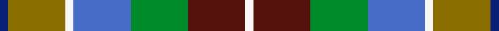

This is one **variant** — a specific cloth: this exact thread count and colourway, with its own
provenance below. It is one weaving of the [sett](/tartans/k/ki/kipp-2/) (the scale-free proportion — the
same cloth at any scale or shade), whose colour order is pattern [BGWBGBW](/stripes/bgwbgbw/).

Part of the [Kipp](/tartans/k/ki/kipp-2/) tartan — the named design grouping this sett with its other cloths.

Sourced from weddslist.  It is a [7 stripe tartan](/stripes/stripes7/).

Original link [http://www.weddslist.com/cgi-bin/tartans/pg.pl?source=sts](http://www.weddslist.com/cgi-bin/tartans/pg.pl?source=sts)

Dataset <small>— provenance for this record, inherited from the source manifest</small>

<dl class="dataset-prov">
<dt>source</dt><dd><a href="/sources/weddslist/">Weddslist</a></dd>
<dt>data captured from</dt><dd><a href="https://github.com/thetartan/tartan-database/blob/master/data/weddslist/data.csv">https://github.com/thetartan/tartan-database/blob/master/data/weddslist/data.csv</a></dd>
<dt>data date</dt><dd>2016-11-17 <small>(dataset default)</small></dd>
<dt>licence</dt><dd><a href="https://creativecommons.org/licenses/by-nc-nd/4.0/">CC BY-NC-ND 4.0</a></dd>
</dl>

Capture chain <small>— the hands this data passed through, oldest first; each capture carries its own licence</small>

<ol class="capture-chain">
<li><a href="https://www.weddslist.com/tartans/">Weddslist</a> <small>the living privately compiled reference</small></li>
<li><a href="https://github.com/thetartan/tartan-database">thetartan/tartan-database</a> <small>2016-2017</small> · <a href="https://creativecommons.org/licenses/by-nc-nd/4.0/">CC BY-NC-ND 4.0</a> <small>Levko Kravets's frozen compilation — the capture we vendored, and where its CC licence text came from</small></li>
<li>this dictionary <small>captured 2026-06-10 · commit 5bf86c7566</small> <small>each re-capture is a git commit to data/sources</small></li>
</ol>

## Thread count
DB/2 Y14 W2 B14 G14 DR14 W/2

One full sett is **120 threads**.

## Palette
<table><thead><tr><th>Colour</th><th>Shade</th><th>OKLCh</th></tr></thead><tbody><tr><td>DB</td><td><code style="background-color:#082077;">#082077</code> <small style="color:#888">#082077</small></td><td><small style="color:#888">oklch(30.0% 0.149 265.1)</small></td></tr><tr><td>DR</td><td><code style="background-color:#55120C;">#55120C</code> <small style="color:#888">#55120C</small></td><td><small style="color:#888">oklch(30.0% 0.099 29.3)</small></td></tr><tr><td>G</td><td><code style="background-color:#008B2A;">#008B2A</code> <small style="color:#888">#008B2A</small></td><td><small style="color:#888">oklch(55.4% 0.170 145.9)</small></td></tr><tr><td>W</td><td><code style="background-color:#F7F7F7;">#F7F7F7</code> <small style="color:#888">#F7F7F7</small></td><td><small style="color:#888">oklch(97.6% 0.000 89.9)</small></td></tr><tr><td>B</td><td><code style="background-color:#466CC8;">#466CC8</code> <small style="color:#888">#466CC8</small></td><td><small style="color:#888">oklch(55.1% 0.149 265.0)</small></td></tr><tr><td>Y</td><td><code style="background-color:#8B6E00;">#8B6E00</code> <small style="color:#888">#8B6E00</small></td><td><small style="color:#888">oklch(55.1% 0.113 90.4)</small></td></tr></tbody></table>

# Sample pattern

## Nearest tartan variants

The nearest existing variants by ΔTartan distance, with this cloth at the top so the swatches line up against it.

ΔTartan

Threads

Variant

Sett

—

120

<a href="/variants/s7/db1y7w1b7g7dr7w1~x2/">Kipp</a>

<a href="/ttd/edit/#slug=w3db17dy16dt2dg17y2~x2~db1406275-dt1204274&amp;base=db1y7w1b7g7dr7w1~x2" title="compare in the TTD">2.70</a>

218

<a href="/variants/s6/w3dbi17dy16db2dg17y2~x2~dbi1406275-db1204274/">Atlantic Ancient Trade Tartan</a>

<a href="/ttd/edit/#slug=lb18t18k10w3dy15y3ly8~x2~t2503227-k0705267&amp;base=db1y7w1b7g7dr7w1~x2" title="compare in the TTD">3.35</a>

248

<a href="/variants/s7/lb18t18db10w3dy15y3ly8~x2~t2503227-db0705267/">Isle of Jura</a>

<a href="/ttd/edit/#slug=dt2y10dg4lp5dg2lp3dg2lp5dg4dt15lr2~x2~y2302166-dg1806142&amp;base=db1y7w1b7g7dr7w1~x2" title="compare in the TTD">3.40</a>

208

<a href="/variants/s11/dt2y10dg4lp5dg2lp3dg2lp5dg4dt15lr2~x2~y2302166-dg1806142/">Elwyn Glen (Corporate)</a>

<a href="/ttd/edit/#slug=dy17n5db2w12db2y4g7~x2&amp;base=db1y7w1b7g7dr7w1~x2" title="compare in the TTD">3.41</a>

148

<a href="/variants/s7/dy17n5db2w12db2y4g7~x2/">Ontario Northern Canadian District Tartan</a>

<a href="/ttd/edit/#slug=do3dy1lr1do1dy3do3lr3y6dp1~x6~do1301000-lr3100000&amp;base=db1y7w1b7g7dr7w1~x2" title="compare in the TTD">3.45</a>

240

<a href="/variants/s9/do3dy1lr1do1dy3do3lr3y6dp1~x6~do1301000-lr3100000/">Toorak Chapler</a>

<a href="/ttd/edit/#slug=dbi16db7ly4db2ly16db2g24db8lb11~x2~dbi1406275-db1004274&amp;base=db1y7w1b7g7dr7w1~x2" title="compare in the TTD">3.47</a>

306

<a href="/variants/s9/dbi16db7ly4db2ly16db2g24db8lb11~x2~dbi1406275-db1004274/">Wicklow County Crest (Fashion)</a>

<a href="/ttd/edit/#slug=dbi16db7dy4db2dy16db2g24db8lb11~x2~dbi1406275-db1004274&amp;base=db1y7w1b7g7dr7w1~x2" title="compare in the TTD">3.48</a>

306

<a href="/variants/s9/dbi16db7dy4db2dy16db2g24db8lb11~x2~dbi1406275-db1004274/">Wicklow County, Crest Range</a>

<a href="/ttd/edit/#slug=dy19g23y3db15r11w5~x2&amp;base=db1y7w1b7g7dr7w1~x2" title="compare in the TTD">3.53</a>

256

<a href="/variants/s6/dy19g23y3db15r11w5~x2/">Mekos, The</a>

<a href="/ttd/edit/#slug=dy19g23ly3db15r11w5~x2&amp;base=db1y7w1b7g7dr7w1~x2" title="compare in the TTD">3.54</a>

256

<a href="/variants/s6/dy19g23ly3db15r11w5~x2/">Mekos, The</a>

<a href="/ttd/edit/#slug=dpi4dp4dpi2dp14dg6g3dg6dgi2g4dgi2g15n3~x2~dpi1607327-dp1105325-g2408144-dgi1806142&amp;base=db1y7w1b7g7dr7w1~x2" title="compare in the TTD">3.60</a>

246

<a href="/variants/s12/dpi4dp4dpi2dp14dg6g3dg6dgi2g4dgi2g15n3~x2~dpi1607327-dp1105325-g2408144-dgi1806142/">Kinloch Anderson Heather (Corporate)</a>

## Neighbour map

Every grey dot is one of 13657 variants placed by the first two principal components of the ΔTartan feature space (42% of its variance). Red is this tartan; blue dots are its nearest — click one to open its page. The map is a flat projection of a many-dimensional space — [how to read it](/posts/neighbourhood-maps/).

<svg viewBox="0 0 640 380" role="img" style="max-width:100%;height:auto;border:1px solid #e0e0e0;border-radius:4px;display:block" xmlns="http://www.w3.org/2000/svg"><image href="/nn/cloud.v1.png" width="640" height="380"/><a href="/variants/s6/w3dbi17dy16db2dg17y2~x2~dbi1406275-db1204274/"><circle cx="209.2" cy="241.6" r="4" fill="#3465a4"><title>Atlantic Ancient Trade Tartan</title></circle></a><a href="/variants/s7/lb18t18db10w3dy15y3ly8~x2~t2503227-db0705267/"><circle cx="44.5" cy="231.4" r="4" fill="#3465a4"><title>Isle of Jura</title></circle></a><a href="/variants/s11/dt2y10dg4lp5dg2lp3dg2lp5dg4dt15lr2~x2~y2302166-dg1806142/"><circle cx="156.3" cy="215.0" r="4" fill="#3465a4"><title>Elwyn Glen (Corporate)</title></circle></a><a href="/variants/s7/dy17n5db2w12db2y4g7~x2/"><circle cx="119.6" cy="206.1" r="4" fill="#3465a4"><title>Ontario Northern Canadian District Tartan</title></circle></a><a href="/variants/s9/do3dy1lr1do1dy3do3lr3y6dp1~x6~do1301000-lr3100000/"><circle cx="178.3" cy="254.1" r="4" fill="#3465a4"><title>Toorak Chapler</title></circle></a><a href="/variants/s9/dbi16db7ly4db2ly16db2g24db8lb11~x2~dbi1406275-db1004274/"><circle cx="124.8" cy="211.4" r="4" fill="#3465a4"><title>Wicklow County Crest (Fashion)</title></circle></a><a href="/variants/s9/dbi16db7dy4db2dy16db2g24db8lb11~x2~dbi1406275-db1004274/"><circle cx="151.9" cy="219.0" r="4" fill="#3465a4"><title>Wicklow County, Crest Range</title></circle></a><a href="/variants/s6/dy19g23y3db15r11w5~x2/"><circle cx="96.3" cy="230.5" r="4" fill="#3465a4"><title>Mekos, The</title></circle></a><a href="/variants/s6/dy19g23ly3db15r11w5~x2/"><circle cx="91.6" cy="229.4" r="4" fill="#3465a4"><title>Mekos, The</title></circle></a><a href="/variants/s12/dpi4dp4dpi2dp14dg6g3dg6dgi2g4dgi2g15n3~x2~dpi1607327-dp1105325-g2408144-dgi1806142/"><circle cx="151.1" cy="199.6" r="4" fill="#3465a4"><title>Kinloch Anderson Heather (Corporate)</title></circle></a><circle cx="112.6" cy="239.9" r="5" fill="#c00000"/><text x="320" y="376" text-anchor="middle" font-size="11" fill="#999">ground</text><text x="11" y="190" text-anchor="middle" font-size="11" fill="#999" transform="rotate(-90 11 190)">complexity</text></svg>

ID: /variants/s7/db1y7w1b7g7dr7w1~x2/
