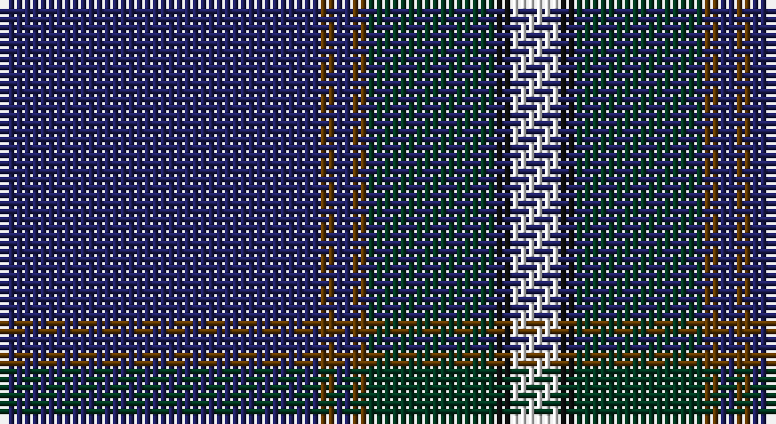

This page is one **sett** — a single exact thread-count. It belongs to the [tartan](/setts/db20dy1db1dy1dg8k1w3/)
(the same proportion at any scale), whose colour order is pattern [BGBGGKW](/stripes/bgbggkw/).

Sourced from tartans-authority.  It is a [7 stripe tartan](/stripes/stripes7/).

Original link http://www.tartansauthority.com/tartan-ferret/display/10867/

## Register references

External register numbers recorded for this tartan.

- Scottish Register of Tartans: [10867](https://www.tartanregister.gov.uk/tartanDetails?ref=10867)
- Scottish Tartans Authority (ITI): 10867

## Thread count
DB/40 T2 DB2 T2 DG16 K2 W/6

One full sett is **94 threads**.

## Palette

Palette: <strong>Tartan Register</strong>
<table><thead><tr><th>Colour</th><th>Threads</th><th>Shade</th><th>Base</th><th>OKLCh</th></tr></thead><tbody><tr><td>DB/</td><td style="text-align:right;font-variant-numeric:tabular-nums">40</td><td><code style="background-color:#202060;">#202060</code> <small style="color:#888">#202060</small></td><td>B <code style="background-color:#2A418A;">#2A418A</code></td><td><small style="color:#888">oklch(28.9% 0.111 276.9)</small></td></tr><tr><td>T</td><td style="text-align:right;font-variant-numeric:tabular-nums">2</td><td><code style="background-color:#603800;">#603800</code> <small style="color:#888">#603800</small></td><td>G <code style="background-color:#006100;">#006100</code></td><td><small style="color:#888">oklch(38.1% 0.084 66.7)</small></td></tr><tr><td>DB</td><td style="text-align:right;font-variant-numeric:tabular-nums">2</td><td><code style="background-color:#202060;">#202060</code> <small style="color:#888">#202060</small></td><td>B <code style="background-color:#2A418A;">#2A418A</code></td><td><small style="color:#888">oklch(28.9% 0.111 276.9)</small></td></tr><tr><td>T</td><td style="text-align:right;font-variant-numeric:tabular-nums">2</td><td><code style="background-color:#603800;">#603800</code> <small style="color:#888">#603800</small></td><td>G <code style="background-color:#006100;">#006100</code></td><td><small style="color:#888">oklch(38.1% 0.084 66.7)</small></td></tr><tr><td>DG</td><td style="text-align:right;font-variant-numeric:tabular-nums">16</td><td><code style="background-color:#003820;">#003820</code> <small style="color:#888">#003820</small></td><td>G <code style="background-color:#006100;">#006100</code></td><td><small style="color:#888">oklch(30.0% 0.070 158.3)</small></td></tr><tr><td>K</td><td style="text-align:right;font-variant-numeric:tabular-nums">2</td><td><code style="background-color:#101010;">#101010</code> <small style="color:#888">#101010</small></td><td>K <code style="background-color:#000000;">#000000</code></td><td><small style="color:#888">oklch(17.3% 0.000 89.9)</small></td></tr><tr><td>W/</td><td style="text-align:right;font-variant-numeric:tabular-nums">6</td><td><code style="background-color:#FCFCFC;">#FCFCFC</code> <small style="color:#888">#FCFCFC</small></td><td>W <code style="background-color:#F7F7F7;">#F7F7F7</code></td><td><small style="color:#888">oklch(99.1% 0.000 89.9)</small></td></tr></tbody></table>

# Sample pattern

## Nearest tartans

The nearest existing variants by ΔTartan distance, with this tartan at the top so the swatches line up against it.

ΔTartan

Tartan

Sett

—

<a href="/ttd/edit/#slug=db20dy1db1dy1dg8k1w3~x2">Chestico</a> <a class="nn-out" href="/variants/s7/db20dy1db1dy1dg8k1w3~x2/" title="open its dictionary page">↗</a>

0.95

<a href="/ttd/edit/#slug=db42k6lo2k3lo2g10r7k2~x2&amp;base=db20dy1db1dy1dg8k1w3~x2">MacBeth (Fashion)</a> <a class="nn-out" href="/variants/s8/db42k6lo2k3lo2g10r7k2~x2/" title="open its dictionary page">↗</a>

1.03

<a href="/ttd/edit/#slug=r1db2dt1dbi3dt19db3ly1db2ly1~x4&amp;base=db20dy1db1dy1dg8k1w3~x2">Pagus Wasia</a> <a class="nn-out" href="/variants/s9/r1db2dt1dbi3dt19db3ly1db2ly1~x4/" title="open its dictionary page">↗</a>

1.03

<a href="/ttd/edit/#slug=k62b4k7db29k3lo4k3lb4k11b16~x2&amp;base=db20dy1db1dy1dg8k1w3~x2">State Seal of Massachusetts Fash)</a> <a class="nn-out" href="/variants/s10/k62b4k7db29k3lo4k3lb4k11b16~x2/" title="open its dictionary page">↗</a>

1.05

<a href="/ttd/edit/#slug=dt2w2dt43b5db4k8db2w2~x2&amp;base=db20dy1db1dy1dg8k1w3~x2">Fife Flyers</a> <a class="nn-out" href="/variants/s8/dt2w2dt43b5db4k8db2w2~x2/" title="open its dictionary page">↗</a>

1.05

<a href="/ttd/edit/#slug=db47g14dr5o2r3g7~x2&amp;base=db20dy1db1dy1dg8k1w3~x2">Round Table of Britain and Ireland, RtbI.</a> <a class="nn-out" href="/variants/s6/db47g14dr5o2r3g7~x2/" title="open its dictionary page">↗</a>

1.08

<a href="/ttd/edit/#slug=w2db40g22ly3g2r3g2w2~x2&amp;base=db20dy1db1dy1dg8k1w3~x2">Tartan Day SA (Corporate)</a> <a class="nn-out" href="/variants/s8/w2db40g22ly3g2r3g2w2~x2/" title="open its dictionary page">↗</a>

1.11

<a href="/ttd/edit/#slug=g1db1k1db30k30w2db5ly1~x2&amp;base=db20dy1db1dy1dg8k1w3~x2">Binder Wedding (Personal)</a> <a class="nn-out" href="/variants/s8/g1db1k1db30k30w2db5ly1~x2/" title="open its dictionary page">↗</a>

1.12

<a href="/ttd/edit/#slug=lr5k6w2dg7w2dt44w2~x2&amp;base=db20dy1db1dy1dg8k1w3~x2">Leblant-Macqueron (Personal)</a> <a class="nn-out" href="/variants/s7/lr5k6w2dg7w2dt44w2~x2/" title="open its dictionary page">↗</a>

1.12

<a href="/ttd/edit/#slug=k2db22g4k7lo2k2w2db2~x2&amp;base=db20dy1db1dy1dg8k1w3~x2">Glasgow, University of</a> <a class="nn-out" href="/variants/s8/k2db22g4k7lo2k2w2db2~x2/" title="open its dictionary page">↗</a>

1.13

<a href="/ttd/edit/#slug=db6ly3k2ly5dbi30g2k4g2dbi6db4~x2&amp;base=db20dy1db1dy1dg8k1w3~x2">St. Andrews University (Corporate)</a> <a class="nn-out" href="/variants/s10/db6ly3k2ly5dbi30g2k4g2dbi6db4~x2/" title="open its dictionary page">↗</a>

## Neighbour map

Every grey dot is one of 14360 variants placed by the first two principal components of the ΔTartan feature space (44% of its variance). Red is this tartan; blue dots are its nearest — click one to open its page.

<svg viewBox="0 0 640 380" role="img" style="max-width:100%;height:auto;border:1px solid #e0e0e0;border-radius:4px;display:block" xmlns="http://www.w3.org/2000/svg"><image href="/nn/cloud.v1.png" width="640" height="380"/><a href="/variants/s8/db42k6lo2k3lo2g10r7k2~x2/"><circle cx="342.9" cy="140.2" r="4" fill="#3465a4"><title>MacBeth (Fashion)</title></circle></a><a href="/variants/s9/r1db2dt1dbi3dt19db3ly1db2ly1~x4/"><circle cx="375.2" cy="141.7" r="4" fill="#3465a4"><title>Pagus Wasia</title></circle></a><a href="/variants/s10/k62b4k7db29k3lo4k3lb4k11b16~x2/"><circle cx="353.7" cy="138.8" r="4" fill="#3465a4"><title>State Seal of Massachusetts Fash)</title></circle></a><a href="/variants/s8/dt2w2dt43b5db4k8db2w2~x2/"><circle cx="395.4" cy="129.0" r="4" fill="#3465a4"><title>Fife Flyers</title></circle></a><a href="/variants/s6/db47g14dr5o2r3g7~x2/"><circle cx="359.5" cy="155.6" r="4" fill="#3465a4"><title>Round Table of Britain and Ireland, RtbI.</title></circle></a><a href="/variants/s8/w2db40g22ly3g2r3g2w2~x2/"><circle cx="303.2" cy="125.3" r="4" fill="#3465a4"><title>Tartan Day SA (Corporate)</title></circle></a><a href="/variants/s8/g1db1k1db30k30w2db5ly1~x2/"><circle cx="358.0" cy="127.7" r="4" fill="#3465a4"><title>Binder Wedding (Personal)</title></circle></a><a href="/variants/s7/lr5k6w2dg7w2dt44w2~x2/"><circle cx="363.8" cy="123.9" r="4" fill="#3465a4"><title>Leblant-Macqueron (Personal)</title></circle></a><a href="/variants/s8/k2db22g4k7lo2k2w2db2~x2/"><circle cx="302.8" cy="167.0" r="4" fill="#3465a4"><title>Glasgow, University of</title></circle></a><a href="/variants/s10/db6ly3k2ly5dbi30g2k4g2dbi6db4~x2/"><circle cx="300.6" cy="140.4" r="4" fill="#3465a4"><title>St. Andrews University (Corporate)</title></circle></a><circle cx="352.6" cy="145.2" r="5" fill="#c00000"/></svg>

ID: /variants/s7/db20dy1db1dy1dg8k1w3~x2/
