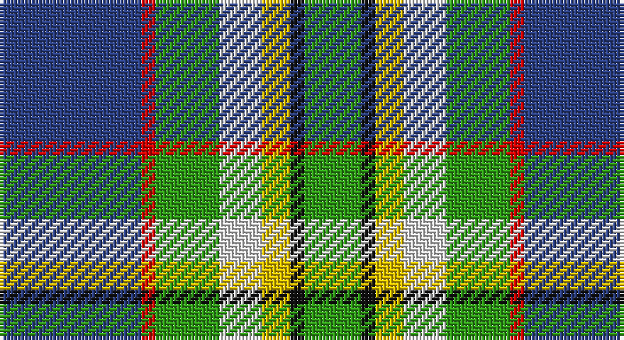

This page is one **sett** — a single exact thread-count. It belongs to the [tartan](/setts/db20r2g9w6ly4k2g8/)
(the same proportion at any scale), whose colour order is pattern [BRGWYKG](/stripes/brgwykg/).

Sourced from register-of-tartans.  It is a [7 stripe tartan](/stripes/stripes7/).

Original link https://www.tartanregister.gov.uk/tartanDetails.aspx?ref=5879

2 attestations — the source records this cloth was collapsed from (oldest owns this page)

<ul>
<li>01/03/2005 — Crofters (Personal) (register-of-tartans, <a href="https://www.tartanregister.gov.uk/tartanDetails.aspx?ref=5879">record</a>)</li>
<li>pre 2006 — Crofters (Corporate?) (tartans-authority, <a href="http://www.tartansauthority.com/tartan-ferret/display/7068/">record</a>)</li>
</ul>

## Register references

External register numbers recorded for this tartan.

- Scottish Register of Tartans: [5879](https://www.tartanregister.gov.uk/tartanDetails.aspx?ref=5879)
- Scottish Tartans Authority (ITI): 7068
- Scottish Tartans World Register: 3146

## Thread count
B/40 R4 G18 LN12 Y8 K4 G/16

One full sett is **148 threads**.

## Palette

Palette: <strong>Tartan Register</strong> <small style="color:#888">(5 of 6 colours)</small>
<table><thead><tr><th>Colour</th><th>Threads</th><th>Shade</th><th>Base</th><th>OKLCh</th></tr></thead><tbody><tr><td>B/</td><td style="text-align:right;font-variant-numeric:tabular-nums">40</td><td><code style="background-color:#2C4084;">#2C4084</code> <small style="color:#888">#2C4084</small></td><td>B <code style="background-color:#2A418A;">#2A418A</code></td><td><small style="color:#888">oklch(39.4% 0.117 268.3)</small></td></tr><tr><td>R</td><td style="text-align:right;font-variant-numeric:tabular-nums">4</td><td><code style="background-color:#DC0000;">#DC0000</code> <small style="color:#888">#DC0000</small></td><td>R <code style="background-color:#CC0000;">#CC0000</code></td><td><small style="color:#888">oklch(56.2% 0.230 29.2)</small></td></tr><tr><td>G</td><td style="text-align:right;font-variant-numeric:tabular-nums">18</td><td><code style="background-color:#309C18;">#309C18</code> <small style="color:#888">#309C18</small></td><td>G <code style="background-color:#006100;">#006100</code></td><td><small style="color:#888">oklch(60.8% 0.188 140.8)</small></td></tr><tr><td>LN</td><td style="text-align:right;font-variant-numeric:tabular-nums">12</td><td><code style="background-color:#E0E0E0;">#E0E0E0</code> <small style="color:#888">#E0E0E0</small></td><td>W <code style="background-color:#F7F7F7;">#F7F7F7</code></td><td><small style="color:#888">oklch(90.7% 0.000 89.9)</small></td></tr><tr><td>Y</td><td style="text-align:right;font-variant-numeric:tabular-nums">8</td><td><code style="background-color:#E8C000;">#E8C000</code> <small style="color:#888">#E8C000</small></td><td>Y <code style="background-color:#F2BF00;">#F2BF00</code></td><td><small style="color:#888">oklch(81.9% 0.168 93.7)</small></td></tr><tr><td>K</td><td style="text-align:right;font-variant-numeric:tabular-nums">4</td><td><code style="background-color:#101010;">#101010</code> <small style="color:#888">#101010</small></td><td>K <code style="background-color:#000000;">#000000</code></td><td><small style="color:#888">oklch(17.3% 0.000 89.9)</small></td></tr><tr><td>G/</td><td style="text-align:right;font-variant-numeric:tabular-nums">16</td><td><code style="background-color:#309C18;">#309C18</code> <small style="color:#888">#309C18</small></td><td>G <code style="background-color:#006100;">#006100</code></td><td><small style="color:#888">oklch(60.8% 0.188 140.8)</small></td></tr></tbody></table>

# Sample pattern

## Nearest tartans

The nearest existing variants by ΔTartan distance, with this tartan at the top so the swatches line up against it.

ΔTartan

Tartan

Sett

—

<a href="/ttd/edit/#slug=db20r2g9w6ly4k2g8~x2">Crofters (Personal)</a> <a class="nn-out" href="/variants/s7/db20r2g9w6ly4k2g8~x2/" title="open its dictionary page">↗</a>

0.85

<a href="/ttd/edit/#slug=g20gi6w15dt5w2dt15o4dt10r2~x2&amp;base=db20r2g9w6ly4k2g8~x2">Copar a'Beannichte Dress (Personal)</a> <a class="nn-out" href="/variants/s9/g20gi6w15dt5w2dt15o4dt10r2~x2/" title="open its dictionary page">↗</a>

0.86

<a href="/ttd/edit/#slug=k3ly3db20g25lb18w3~x2&amp;base=db20r2g9w6ly4k2g8~x2">Porteous (Clan)</a> <a class="nn-out" href="/variants/s6/k3ly3db20g25lb18w3~x2/" title="open its dictionary page">↗</a>

0.89

<a href="/ttd/edit/#slug=dt36y20dg6w12k6r3~x2&amp;base=db20r2g9w6ly4k2g8~x2">Sirens &amp; Swords</a> <a class="nn-out" href="/variants/s6/dt36y20dg6w12k6r3~x2/" title="open its dictionary page">↗</a>

0.99

<a href="/ttd/edit/#slug=db2w12k8g8r2g8k1lo2~x2&amp;base=db20r2g9w6ly4k2g8~x2">MacLaren Dress</a> <a class="nn-out" href="/variants/s8/db2w12k8g8r2g8k1lo2~x2/" title="open its dictionary page">↗</a>

1.05

<a href="/ttd/edit/#slug=k6r3g30ly10db30w3~x2&amp;base=db20r2g9w6ly4k2g8~x2">Turnbull of Thornton (Personal)</a> <a class="nn-out" href="/variants/s6/k6r3g30ly10db30w3~x2/" title="open its dictionary page">↗</a>

1.05

<a href="/ttd/edit/#slug=db2r1db10w1y4g8lo1g2~x4&amp;base=db20r2g9w6ly4k2g8~x2">Ayrshire (District)</a> <a class="nn-out" href="/variants/s8/db2r1db10w1y4g8lo1g2~x4/" title="open its dictionary page">↗</a>

1.07

<a href="/ttd/edit/#slug=m5g2m2g26k9lr9lb13w5~x2&amp;base=db20r2g9w6ly4k2g8~x2">Alexander of Menstry Hunting</a> <a class="nn-out" href="/variants/s8/m5g2m2g26k9lr9lb13w5~x2/" title="open its dictionary page">↗</a>

1.07

<a href="/ttd/edit/#slug=o5dt30w3dg15ly8r4~x2&amp;base=db20r2g9w6ly4k2g8~x2">Carleton College Rugby</a> <a class="nn-out" href="/variants/s6/o5dt30w3dg15ly8r4~x2/" title="open its dictionary page">↗</a>

1.10

<a href="/ttd/edit/#slug=r6b2g20k3db8gi2b4~x2&amp;base=db20r2g9w6ly4k2g8~x2">Royal British Legion, The</a> <a class="nn-out" href="/variants/s7/r6b2g20k3db8gi2b4~x2/" title="open its dictionary page">↗</a>

1.11

<a href="/ttd/edit/#slug=db8w33k15dg17t3dg17t3~x2&amp;base=db20r2g9w6ly4k2g8~x2">MacRobart Dress (Personal)</a> <a class="nn-out" href="/variants/s7/db8w33k15dg17t3dg17t3~x2/" title="open its dictionary page">↗</a>

## Neighbour map

Every grey dot is one of 14360 variants placed by the first two principal components of the ΔTartan feature space (44% of its variance). Red is this tartan; blue dots are its nearest — click one to open its page.

<svg viewBox="0 0 640 380" role="img" style="max-width:100%;height:auto;border:1px solid #e0e0e0;border-radius:4px;display:block" xmlns="http://www.w3.org/2000/svg"><image href="/nn/cloud.v1.png" width="640" height="380"/><a href="/variants/s9/g20gi6w15dt5w2dt15o4dt10r2~x2/"><circle cx="107.4" cy="166.7" r="4" fill="#3465a4"><title>Copar a'Beannichte Dress (Personal)</title></circle></a><a href="/variants/s6/k3ly3db20g25lb18w3~x2/"><circle cx="98.8" cy="180.0" r="4" fill="#3465a4"><title>Porteous (Clan)</title></circle></a><a href="/variants/s6/dt36y20dg6w12k6r3~x2/"><circle cx="153.7" cy="163.5" r="4" fill="#3465a4"><title>Sirens &amp; Swords</title></circle></a><a href="/variants/s8/db2w12k8g8r2g8k1lo2~x2/"><circle cx="97.3" cy="145.6" r="4" fill="#3465a4"><title>MacLaren Dress</title></circle></a><a href="/variants/s6/k6r3g30ly10db30w3~x2/"><circle cx="143.5" cy="174.0" r="4" fill="#3465a4"><title>Turnbull of Thornton (Personal)</title></circle></a><a href="/variants/s8/db2r1db10w1y4g8lo1g2~x4/"><circle cx="152.4" cy="154.1" r="4" fill="#3465a4"><title>Ayrshire (District)</title></circle></a><a href="/variants/s8/m5g2m2g26k9lr9lb13w5~x2/"><circle cx="131.8" cy="146.5" r="4" fill="#3465a4"><title>Alexander of Menstry Hunting</title></circle></a><a href="/variants/s6/o5dt30w3dg15ly8r4~x2/"><circle cx="171.4" cy="168.8" r="4" fill="#3465a4"><title>Carleton College Rugby</title></circle></a><a href="/variants/s7/r6b2g20k3db8gi2b4~x2/"><circle cx="168.2" cy="164.9" r="4" fill="#3465a4"><title>Royal British Legion, The</title></circle></a><a href="/variants/s7/db8w33k15dg17t3dg17t3~x2/"><circle cx="114.3" cy="175.9" r="4" fill="#3465a4"><title>MacRobart Dress (Personal)</title></circle></a><circle cx="130.0" cy="164.6" r="5" fill="#c00000"/></svg>

ID: /variants/s7/db20r2g9w6ly4k2g8~x2/
