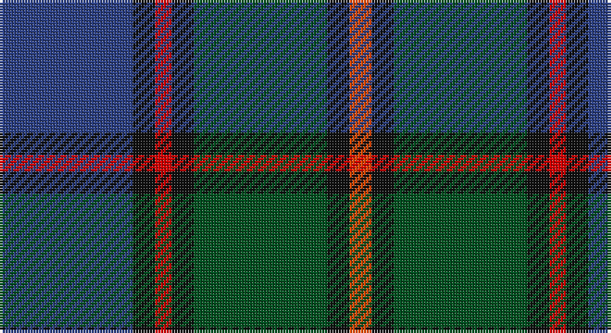

This page is one **sett** — a single exact thread-count. It belongs to the [tartan](/setts/db24k4r3k4dg24k4ri4/)
(the same proportion at any scale), whose colour order is pattern [BKRKGKR](/stripes/bkrkgkr/).

Part of the [Skene](/tartans/skene/) tartan — the named design grouping this sett with its other cloths.

Sourced from register-of-tartans.  It is a [7 stripe tartan](/stripes/stripes7/).

Original link https://www.tartanregister.gov.uk/tartanDetails.aspx?ref=3802

## Also known as

This cloth is also recorded under:

- Logan, or Skene
- Skene #2

## Register references

External register numbers recorded for this tartan.

- Scottish Register of Tartans: [3802](https://www.tartanregister.gov.uk/tartanDetails.aspx?ref=3802)
- Scottish Tartans World Register: 363

## Thread count
B/48 K8 R6 K8 G48 K8 Ra/8

One full sett is **212 threads**.

## Palette

Palette: <strong>Tartan Register</strong>
<table><thead><tr><th>Colour</th><th>Threads</th><th>Shade</th><th>Base</th><th>OKLCh</th></tr></thead><tbody><tr><td>B/</td><td style="text-align:right;font-variant-numeric:tabular-nums">48</td><td><code style="background-color:#2C4084;">#2C4084</code> <small style="color:#888">#2C4084</small></td><td>B <code style="background-color:#2A418A;">#2A418A</code></td><td><small style="color:#888">oklch(39.4% 0.117 268.3)</small></td></tr><tr><td>K</td><td style="text-align:right;font-variant-numeric:tabular-nums">8</td><td><code style="background-color:#101010;">#101010</code> <small style="color:#888">#101010</small></td><td>K <code style="background-color:#000000;">#000000</code></td><td><small style="color:#888">oklch(17.3% 0.000 89.9)</small></td></tr><tr><td>R</td><td style="text-align:right;font-variant-numeric:tabular-nums">6</td><td><code style="background-color:#DC0000;">#DC0000</code> <small style="color:#888">#DC0000</small></td><td>R <code style="background-color:#CC0000;">#CC0000</code></td><td><small style="color:#888">oklch(56.2% 0.230 29.2)</small></td></tr><tr><td>K</td><td style="text-align:right;font-variant-numeric:tabular-nums">8</td><td><code style="background-color:#101010;">#101010</code> <small style="color:#888">#101010</small></td><td>K <code style="background-color:#000000;">#000000</code></td><td><small style="color:#888">oklch(17.3% 0.000 89.9)</small></td></tr><tr><td>G</td><td style="text-align:right;font-variant-numeric:tabular-nums">48</td><td><code style="background-color:#005020;">#005020</code> <small style="color:#888">#005020</small></td><td>G <code style="background-color:#006100;">#006100</code></td><td><small style="color:#888">oklch(37.7% 0.105 149.6)</small></td></tr><tr><td>K</td><td style="text-align:right;font-variant-numeric:tabular-nums">8</td><td><code style="background-color:#101010;">#101010</code> <small style="color:#888">#101010</small></td><td>K <code style="background-color:#000000;">#000000</code></td><td><small style="color:#888">oklch(17.3% 0.000 89.9)</small></td></tr><tr><td>Ra/</td><td style="text-align:right;font-variant-numeric:tabular-nums">8</td><td><code style="background-color:#FA4B00;">#FA4B00</code> <small style="color:#888">#FA4B00</small></td><td>R <code style="background-color:#CC0000;">#CC0000</code></td><td><small style="color:#888">oklch(65.7% 0.220 36.9)</small></td></tr></tbody></table>

# Sample pattern

## Compared to the master

This cloth is one sett of its design; the master sett (the exemplar the design is anchored on) is below for comparison.

<figure style="margin:0"><figcaption style="color:#888;font-size:smaller">this sett</figcaption></figure>
<figure style="margin:0"><figcaption style="color:#888;font-size:smaller"><a href="/setts/db6r3g1r3g12r3g1/">master sett →</a></figcaption></figure>

## Nearest tartans

The nearest existing variants by ΔTartan distance, with this tartan at the top so the swatches line up against it.

ΔTartan

Tartan

Sett

—

<a href="/ttd/edit/#slug=db24k4r3k4dg24k4ri4~x2">Skene</a> <a class="nn-out" href="/variants/s7/db24k4r3k4dg24k4ri4~x2/" title="open its dictionary page">↗</a>

0.59

<a href="/ttd/edit/#slug=db2dy3db16k18g18k2r2~x2&amp;base=db24k4r3k4dg24k4ri4~x2">McEwan '1856', The</a> <a class="nn-out" href="/variants/s7/db2dy3db16k18g18k2r2~x2/" title="open its dictionary page">↗</a>

0.64

<a href="/ttd/edit/#slug=dt10r1dt1r1dt1k6y9b2~x2&amp;base=db24k4r3k4dg24k4ri4~x2">Antique 2000</a> <a class="nn-out" href="/variants/s8/dt10r1dt1r1dt1k6y9b2~x2/" title="open its dictionary page">↗</a>

0.80

<a href="/ttd/edit/#slug=g11t3g5r3g5k22db22k5~x2&amp;base=db24k4r3k4dg24k4ri4~x2">Wood (Personal)</a> <a class="nn-out" href="/variants/s8/g11t3g5r3g5k22db22k5~x2/" title="open its dictionary page">↗</a>

0.81

<a href="/ttd/edit/#slug=db22r3db2r3db2k17g18lo4~x2&amp;base=db24k4r3k4dg24k4ri4~x2">Scotch House 2000 Original</a> <a class="nn-out" href="/variants/s8/db22r3db2r3db2k17g18lo4~x2/" title="open its dictionary page">↗</a>

0.85

<a href="/ttd/edit/#slug=r1k1g7k5db10k1ly1~x2&amp;base=db24k4r3k4dg24k4ri4~x2">MacLeod Small Clan Tartan</a> <a class="nn-out" href="/variants/s7/r1k1g7k5db10k1ly1~x2/" title="open its dictionary page">↗</a>

0.86

<a href="/ttd/edit/#slug=g2k2g17k16r2db17ly2~x2&amp;base=db24k4r3k4dg24k4ri4~x2">Greenock</a> <a class="nn-out" href="/variants/s7/g2k2g17k16r2db17ly2~x2/" title="open its dictionary page">↗</a>

0.89

<a href="/ttd/edit/#slug=r3g2r3g18k14w2db16g3~x2&amp;base=db24k4r3k4dg24k4ri4~x2">Mantle (Personal)</a> <a class="nn-out" href="/variants/s8/r3g2r3g18k14w2db16g3~x2/" title="open its dictionary page">↗</a>

0.89

<a href="/ttd/edit/#slug=r2db23k14dg16k2w2~x2&amp;base=db24k4r3k4dg24k4ri4~x2">MacPhail Hunting</a> <a class="nn-out" href="/variants/s6/r2db23k14dg16k2w2~x2/" title="open its dictionary page">↗</a>

0.92

<a href="/ttd/edit/#slug=dg17ly2k14r2db9r2db10~x2&amp;base=db24k4r3k4dg24k4ri4~x2">MacDonald (Flora.. )</a> <a class="nn-out" href="/variants/s7/dg17ly2k14r2db9r2db10~x2/" title="open its dictionary page">↗</a>

0.95

<a href="/ttd/edit/#slug=dg5b2dg9dt19r9ly2~x2&amp;base=db24k4r3k4dg24k4ri4~x2">Lyle and Scott</a> <a class="nn-out" href="/variants/s6/dg5b2dg9dt19r9ly2~x2/" title="open its dictionary page">↗</a>

## Neighbour map

Every grey dot is one of 14360 variants placed by the first two principal components of the ΔTartan feature space (44% of its variance). Red is this tartan; blue dots are its nearest — click one to open its page.

<svg viewBox="0 0 640 380" role="img" style="max-width:100%;height:auto;border:1px solid #e0e0e0;border-radius:4px;display:block" xmlns="http://www.w3.org/2000/svg"><image href="/nn/cloud.v1.png" width="640" height="380"/><a href="/variants/s7/db2dy3db16k18g18k2r2~x2/"><circle cx="186.7" cy="215.4" r="4" fill="#3465a4"><title>McEwan '1856', The</title></circle></a><a href="/variants/s8/dt10r1dt1r1dt1k6y9b2~x2/"><circle cx="203.9" cy="190.2" r="4" fill="#3465a4"><title>Antique 2000</title></circle></a><a href="/variants/s8/g11t3g5r3g5k22db22k5~x2/"><circle cx="172.5" cy="217.9" r="4" fill="#3465a4"><title>Wood (Personal)</title></circle></a><a href="/variants/s8/db22r3db2r3db2k17g18lo4~x2/"><circle cx="188.3" cy="190.2" r="4" fill="#3465a4"><title>Scotch House 2000 Original</title></circle></a><a href="/variants/s7/r1k1g7k5db10k1ly1~x2/"><circle cx="196.2" cy="195.4" r="4" fill="#3465a4"><title>MacLeod Small Clan Tartan</title></circle></a><a href="/variants/s7/g2k2g17k16r2db17ly2~x2/"><circle cx="166.9" cy="205.0" r="4" fill="#3465a4"><title>Greenock</title></circle></a><a href="/variants/s8/r3g2r3g18k14w2db16g3~x2/"><circle cx="174.5" cy="196.7" r="4" fill="#3465a4"><title>Mantle (Personal)</title></circle></a><a href="/variants/s6/r2db23k14dg16k2w2~x2/"><circle cx="214.9" cy="210.7" r="4" fill="#3465a4"><title>MacPhail Hunting</title></circle></a><a href="/variants/s7/dg17ly2k14r2db9r2db10~x2/"><circle cx="160.9" cy="221.6" r="4" fill="#3465a4"><title>MacDonald (Flora.. )</title></circle></a><a href="/variants/s6/dg5b2dg9dt19r9ly2~x2/"><circle cx="220.3" cy="226.4" r="4" fill="#3465a4"><title>Lyle and Scott</title></circle></a><circle cx="200.9" cy="208.7" r="5" fill="#c00000"/></svg>

ID: /variants/s7/db24k4r3k4dg24k4ri4~x2/
