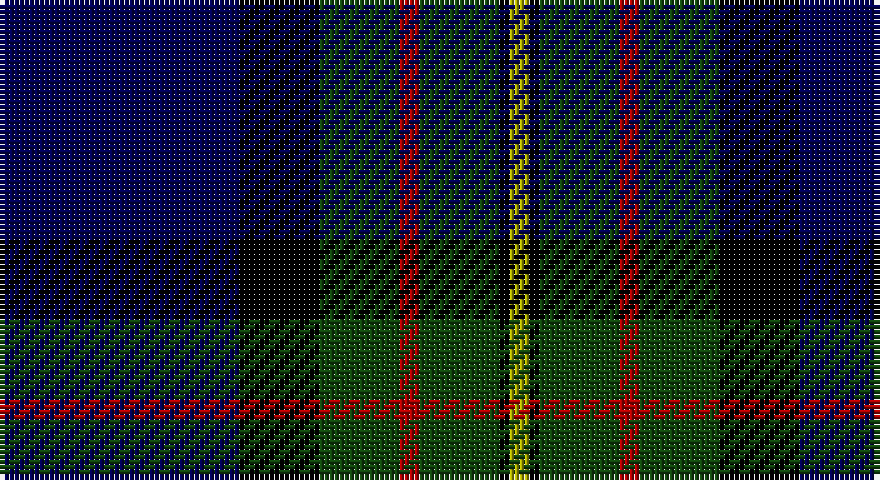

This page is one **sett** — a single exact thread-count. It belongs to the [tartan](/setts/db24k8dg8r2dg8k1ly2/)
(the same proportion at any scale), whose colour order is pattern [BKGRGKY](/stripes/bkgrgky/).

Part of the [MacLaren](/tartans/maclaren/) tartan — the named design grouping this sett with its other cloths.

Sourced from weddslist.  It is a [7 stripe tartan](/stripes/stripes7/).

Original link http://www.weddslist.com/cgi-bin/tartans/pg.pl?source=tinsel

## Also known as

This cloth is also recorded under:

- MacLaren #2

## Thread count
DB/48 K16 DG16 DR4 DG16 K2 LG/4

One full sett is **160 threads**.

## Palette

Palette: <strong>Ingles Buchan</strong> <small style="color:#888">(1 of 5 colours)</small>
<table><thead><tr><th>Colour</th><th>Threads</th><th>Shade</th><th>Base</th><th>OKLCh</th></tr></thead><tbody><tr><td>DB/</td><td style="text-align:right;font-variant-numeric:tabular-nums">48</td><td><code style="background-color:#000052;">#000052</code> <small style="color:#888">#000052</small></td><td>B <code style="background-color:#2A418A;">#2A418A</code></td><td><small style="color:#888">oklch(19.8% 0.137 264.1)</small></td></tr><tr><td>K</td><td style="text-align:right;font-variant-numeric:tabular-nums">16</td><td><code style="background-color:#000000;">#000000</code> <small style="color:#888">#000000</small></td><td>K <code style="background-color:#000000;">#000000</code></td><td><small style="color:#888">oklch(0.0% 0.000 0.0)</small></td></tr><tr><td>DG</td><td style="text-align:right;font-variant-numeric:tabular-nums">16</td><td><code style="background-color:#11450D;">#11450D</code> <small style="color:#888">#11450D</small></td><td>G <code style="background-color:#006100;">#006100</code></td><td><small style="color:#888">oklch(34.4% 0.101 142.1)</small></td></tr><tr><td>DR</td><td style="text-align:right;font-variant-numeric:tabular-nums">4</td><td><code style="background-color:#AA0000;">#AA0000</code> <small style="color:#888">#AA0000</small></td><td>R <code style="background-color:#CC0000;">#CC0000</code></td><td><small style="color:#888">oklch(46.3% 0.190 29.2)</small></td></tr><tr><td>DG</td><td style="text-align:right;font-variant-numeric:tabular-nums">16</td><td><code style="background-color:#11450D;">#11450D</code> <small style="color:#888">#11450D</small></td><td>G <code style="background-color:#006100;">#006100</code></td><td><small style="color:#888">oklch(34.4% 0.101 142.1)</small></td></tr><tr><td>K</td><td style="text-align:right;font-variant-numeric:tabular-nums">2</td><td><code style="background-color:#000000;">#000000</code> <small style="color:#888">#000000</small></td><td>K <code style="background-color:#000000;">#000000</code></td><td><small style="color:#888">oklch(0.0% 0.000 0.0)</small></td></tr><tr><td>LG/</td><td style="text-align:right;font-variant-numeric:tabular-nums">4</td><td><code style="background-color:#AAAA00;">#AAAA00</code> <small style="color:#888">#AAAA00</small></td><td>Y <code style="background-color:#F2BF00;">#F2BF00</code></td><td><small style="color:#888">oklch(71.4% 0.156 109.8)</small></td></tr></tbody></table>

# Sample pattern

## Compared to the master

This cloth is one sett of its design; the master sett (the exemplar the design is anchored on) is below for comparison.

<figure style="margin:0"><figcaption style="color:#888;font-size:smaller">this sett</figcaption></figure>
<figure style="margin:0"><figcaption style="color:#888;font-size:smaller"><a href="/setts/db12k4g4r1g4k1lo1/">master sett →</a></figcaption></figure>

## Nearest tartans

The nearest existing variants by ΔTartan distance, with this tartan at the top so the swatches line up against it.

ΔTartan

Tartan

Sett

—

<a href="/ttd/edit/#slug=db24k8dg8r2dg8k1ly2~x2">MacLaren</a> <a class="nn-out" href="/variants/s7/db24k8dg8r2dg8k1ly2~x2/" title="open its dictionary page">↗</a>

0.12

<a href="/ttd/edit/#slug=db24k8dg8r2dg8k1lr2~x2&amp;base=db24k8dg8r2dg8k1ly2~x2">Fergusson</a> <a class="nn-out" href="/variants/s7/db24k8dg8r2dg8k1lr2~x2/" title="open its dictionary page">↗</a>

0.12

<a href="/ttd/edit/#slug=db24k8dg8r2dg8k1lr2&amp;base=db24k8dg8r2dg8k1ly2~x2">Fergusson</a> <a class="nn-out" href="/variants/s7/db24k8dg8r2dg8k1lr2/" title="open its dictionary page">↗</a>

0.45

<a href="/ttd/edit/#slug=db24k8dg8r2dg8k1lb2&amp;base=db24k8dg8r2dg8k1ly2~x2">Fergusson</a> <a class="nn-out" href="/variants/s7/db24k8dg8r2dg8k1lb2/" title="open its dictionary page">↗</a>

0.58

<a href="/ttd/edit/#slug=db4k2db16lr1k8dg24r4~x2&amp;base=db24k8dg8r2dg8k1ly2~x2">Colqhoun VS</a> <a class="nn-out" href="/variants/s7/db4k2db16lr1k8dg24r4~x2/" title="open its dictionary page">↗</a>

0.61

<a href="/ttd/edit/#slug=db24k8dg8r2dg8k1ly2&amp;base=db24k8dg8r2dg8k1ly2~x2">MacLaren</a> <a class="nn-out" href="/variants/s7/db24k8dg8r2dg8k1ly2/" title="open its dictionary page">↗</a>

0.75

<a href="/ttd/edit/#slug=db4k2db16lb1k8dg24r4&amp;base=db24k8dg8r2dg8k1ly2~x2">Colquhoun VS</a> <a class="nn-out" href="/variants/s7/db4k2db16lb1k8dg24r4/" title="open its dictionary page">↗</a>

0.81

<a href="/ttd/edit/#slug=db28ly1db2k16dg24k1dg2r3~x2&amp;base=db24k8dg8r2dg8k1ly2~x2">Ogilvy VS</a> <a class="nn-out" href="/variants/s8/db28ly1db2k16dg24k1dg2r3~x2/" title="open its dictionary page">↗</a>

0.85

<a href="/ttd/edit/#slug=k6db3dg28w1dbi28db2w3~x2&amp;base=db24k8dg8r2dg8k1ly2~x2">Weisfeld</a> <a class="nn-out" href="/variants/s7/k6db3dg28w1dbi28db2w3~x2/" title="open its dictionary page">↗</a>

0.88

<a href="/ttd/edit/#slug=dg2r1dg30k16lr1db16r2~x2&amp;base=db24k8dg8r2dg8k1ly2~x2">Sinclair Hunting</a> <a class="nn-out" href="/variants/s7/dg2r1dg30k16lr1db16r2~x2/" title="open its dictionary page">↗</a>

0.92

<a href="/ttd/edit/#slug=db24k8g8dp2g8k1w2~x2&amp;base=db24k8dg8r2dg8k1ly2~x2">Alexander</a> <a class="nn-out" href="/variants/s7/db24k8g8dp2g8k1w2~x2/" title="open its dictionary page">↗</a>

## Neighbour map

Every grey dot is one of 14360 variants placed by the first two principal components of the ΔTartan feature space (44% of its variance). Red is this tartan; blue dots are its nearest — click one to open its page.

<svg viewBox="0 0 640 380" role="img" style="max-width:100%;height:auto;border:1px solid #e0e0e0;border-radius:4px;display:block" xmlns="http://www.w3.org/2000/svg"><image href="/nn/cloud.v1.png" width="640" height="380"/><a href="/variants/s7/db24k8dg8r2dg8k1lr2~x2/"><circle cx="268.0" cy="170.1" r="4" fill="#3465a4"><title>Fergusson</title></circle></a><a href="/variants/s7/db24k8dg8r2dg8k1lr2/"><circle cx="268.0" cy="170.1" r="4" fill="#3465a4"><title>Fergusson</title></circle></a><a href="/variants/s7/db24k8dg8r2dg8k1lb2/"><circle cx="254.1" cy="163.1" r="4" fill="#3465a4"><title>Fergusson</title></circle></a><a href="/variants/s7/db4k2db16lr1k8dg24r4~x2/"><circle cx="248.6" cy="171.9" r="4" fill="#3465a4"><title>Colqhoun VS</title></circle></a><a href="/variants/s7/db24k8dg8r2dg8k1ly2/"><circle cx="249.6" cy="160.5" r="4" fill="#3465a4"><title>MacLaren</title></circle></a><a href="/variants/s7/db4k2db16lb1k8dg24r4/"><circle cx="232.5" cy="163.8" r="4" fill="#3465a4"><title>Colquhoun VS</title></circle></a><a href="/variants/s8/db28ly1db2k16dg24k1dg2r3~x2/"><circle cx="250.1" cy="147.9" r="4" fill="#3465a4"><title>Ogilvy VS</title></circle></a><a href="/variants/s7/k6db3dg28w1dbi28db2w3~x2/"><circle cx="253.8" cy="149.8" r="4" fill="#3465a4"><title>Weisfeld</title></circle></a><a href="/variants/s7/dg2r1dg30k16lr1db16r2~x2/"><circle cx="292.7" cy="155.2" r="4" fill="#3465a4"><title>Sinclair Hunting</title></circle></a><a href="/variants/s7/db24k8g8dp2g8k1w2~x2/"><circle cx="254.8" cy="159.8" r="4" fill="#3465a4"><title>Alexander</title></circle></a><circle cx="267.4" cy="170.0" r="5" fill="#c00000"/></svg>

ID: /variants/s7/db24k8dg8r2dg8k1ly2~x2/
