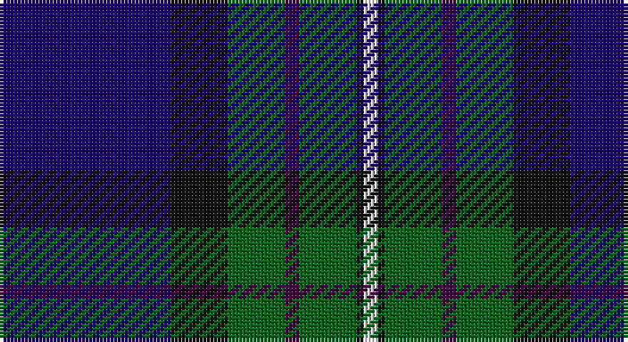

This page is one **sett** — a single exact thread-count. It belongs to the [tartan](/setts/db24k8g8dp2g8k1w2/)
(the same proportion at any scale), whose colour order is pattern [BKGBGKW](/stripes/bkgbgkw/).

Part of the [Alexander](/tartans/alexander/) tartan — the named design grouping this sett with its other cloths.

Sourced from register-of-tartans.  It is a [7 stripe tartan](/stripes/stripes7/).

Original link https://www.tartanregister.gov.uk/tartanDetails.aspx?ref=45

## Register references

External register numbers recorded for this tartan.

- Scottish Register of Tartans: [45](https://www.tartanregister.gov.uk/tartanDetails.aspx?ref=45)
- Scottish Tartans Authority (ITI): 5686
- Scottish Tartans World Register: 2722

## Thread count
DB/48 K16 G16 DP4 G16 K2 W/4

One full sett is **160 threads**.

## Palette

Palette: <strong>Tartan Register</strong>
<table><thead><tr><th>Colour</th><th>Threads</th><th>Shade</th><th>Base</th><th>OKLCh</th></tr></thead><tbody><tr><td>DB/</td><td style="text-align:right;font-variant-numeric:tabular-nums">48</td><td><code style="background-color:#1C0070;">#1C0070</code> <small style="color:#888">#1C0070</small></td><td>B <code style="background-color:#2A418A;">#2A418A</code></td><td><small style="color:#888">oklch(26.3% 0.162 277.1)</small></td></tr><tr><td>K</td><td style="text-align:right;font-variant-numeric:tabular-nums">16</td><td><code style="background-color:#101010;">#101010</code> <small style="color:#888">#101010</small></td><td>K <code style="background-color:#000000;">#000000</code></td><td><small style="color:#888">oklch(17.3% 0.000 89.9)</small></td></tr><tr><td>G</td><td style="text-align:right;font-variant-numeric:tabular-nums">16</td><td><code style="background-color:#006818;">#006818</code> <small style="color:#888">#006818</small></td><td>G <code style="background-color:#006100;">#006100</code></td><td><small style="color:#888">oklch(45.0% 0.142 145.0)</small></td></tr><tr><td>DP</td><td style="text-align:right;font-variant-numeric:tabular-nums">4</td><td><code style="background-color:#440044;">#440044</code> <small style="color:#888">#440044</small></td><td>B <code style="background-color:#2A418A;">#2A418A</code></td><td><small style="color:#888">oklch(27.1% 0.125 328.4)</small></td></tr><tr><td>G</td><td style="text-align:right;font-variant-numeric:tabular-nums">16</td><td><code style="background-color:#006818;">#006818</code> <small style="color:#888">#006818</small></td><td>G <code style="background-color:#006100;">#006100</code></td><td><small style="color:#888">oklch(45.0% 0.142 145.0)</small></td></tr><tr><td>K</td><td style="text-align:right;font-variant-numeric:tabular-nums">2</td><td><code style="background-color:#101010;">#101010</code> <small style="color:#888">#101010</small></td><td>K <code style="background-color:#000000;">#000000</code></td><td><small style="color:#888">oklch(17.3% 0.000 89.9)</small></td></tr><tr><td>W/</td><td style="text-align:right;font-variant-numeric:tabular-nums">4</td><td><code style="background-color:#FCFCFC;">#FCFCFC</code> <small style="color:#888">#FCFCFC</small></td><td>W <code style="background-color:#F7F7F7;">#F7F7F7</code></td><td><small style="color:#888">oklch(99.1% 0.000 89.9)</small></td></tr></tbody></table>

# Sample pattern

## Nearest tartans

The nearest existing variants by ΔTartan distance, with this tartan at the top so the swatches line up against it.

ΔTartan

Tartan

Sett

—

<a href="/ttd/edit/#slug=db24k8g8dp2g8k1w2~x2">Alexander</a> <a class="nn-out" href="/variants/s7/db24k8g8dp2g8k1w2~x2/" title="open its dictionary page">↗</a>

0.71

<a href="/ttd/edit/#slug=db24k8dg8r2dg8k1ly2&amp;base=db24k8g8dp2g8k1w2~x2">MacLaren</a> <a class="nn-out" href="/variants/s7/db24k8dg8r2dg8k1ly2/" title="open its dictionary page">↗</a>

0.85

<a href="/ttd/edit/#slug=db24k8dg8r2dg8k1lb2&amp;base=db24k8g8dp2g8k1w2~x2">Fergusson</a> <a class="nn-out" href="/variants/s7/db24k8dg8r2dg8k1lb2/" title="open its dictionary page">↗</a>

0.88

<a href="/ttd/edit/#slug=db24k8dg8r2dg8k1lr2~x2&amp;base=db24k8g8dp2g8k1w2~x2">Fergusson</a> <a class="nn-out" href="/variants/s7/db24k8dg8r2dg8k1lr2~x2/" title="open its dictionary page">↗</a>

0.88

<a href="/ttd/edit/#slug=db24k8dg8r2dg8k1lr2&amp;base=db24k8g8dp2g8k1w2~x2">Fergusson</a> <a class="nn-out" href="/variants/s7/db24k8dg8r2dg8k1lr2/" title="open its dictionary page">↗</a>

0.89

<a href="/ttd/edit/#slug=k6db3dg28w1dbi28db2w3~x2&amp;base=db24k8g8dp2g8k1w2~x2">Weisfeld</a> <a class="nn-out" href="/variants/s7/k6db3dg28w1dbi28db2w3~x2/" title="open its dictionary page">↗</a>

0.92

<a href="/ttd/edit/#slug=db24k8dg8r2dg8k1ly2~x2&amp;base=db24k8g8dp2g8k1w2~x2">MacLaren</a> <a class="nn-out" href="/variants/s7/db24k8dg8r2dg8k1ly2~x2/" title="open its dictionary page">↗</a>

0.97

<a href="/ttd/edit/#slug=dp4db40k15g10dp2g10dp2g10w4~x2&amp;base=db24k8g8dp2g8k1w2~x2">Ebdon-Muir (Personal)</a> <a class="nn-out" href="/variants/s9/dp4db40k15g10dp2g10dp2g10w4~x2/" title="open its dictionary page">↗</a>

0.98

<a href="/ttd/edit/#slug=k7db4dg31db3ly2db27lb4~x2&amp;base=db24k8g8dp2g8k1w2~x2">Wishart Htg (Clan)</a> <a class="nn-out" href="/variants/s7/k7db4dg31db3ly2db27lb4~x2/" title="open its dictionary page">↗</a>

0.98

<a href="/ttd/edit/#slug=g40k8g4k8g4r14db64t9db3&amp;base=db24k8g8dp2g8k1w2~x2">West Lothian</a> <a class="nn-out" href="/variants/s9/g40k8g4k8g4r14db64t9db3/" title="open its dictionary page">↗</a>

0.99

<a href="/ttd/edit/#slug=db48w2k20g22r3g4~x2&amp;base=db24k8g8dp2g8k1w2~x2">MacFadzean</a> <a class="nn-out" href="/variants/s6/db48w2k20g22r3g4~x2/" title="open its dictionary page">↗</a>

## Neighbour map

Every grey dot is one of 14360 variants placed by the first two principal components of the ΔTartan feature space (44% of its variance). Red is this tartan; blue dots are its nearest — click one to open its page.

<svg viewBox="0 0 640 380" role="img" style="max-width:100%;height:auto;border:1px solid #e0e0e0;border-radius:4px;display:block" xmlns="http://www.w3.org/2000/svg"><image href="/nn/cloud.v1.png" width="640" height="380"/><a href="/variants/s7/db24k8dg8r2dg8k1ly2/"><circle cx="249.6" cy="160.5" r="4" fill="#3465a4"><title>MacLaren</title></circle></a><a href="/variants/s7/db24k8dg8r2dg8k1lb2/"><circle cx="254.1" cy="163.1" r="4" fill="#3465a4"><title>Fergusson</title></circle></a><a href="/variants/s7/db24k8dg8r2dg8k1lr2~x2/"><circle cx="268.0" cy="170.1" r="4" fill="#3465a4"><title>Fergusson</title></circle></a><a href="/variants/s7/db24k8dg8r2dg8k1lr2/"><circle cx="268.0" cy="170.1" r="4" fill="#3465a4"><title>Fergusson</title></circle></a><a href="/variants/s7/k6db3dg28w1dbi28db2w3~x2/"><circle cx="253.8" cy="149.8" r="4" fill="#3465a4"><title>Weisfeld</title></circle></a><a href="/variants/s7/db24k8dg8r2dg8k1ly2~x2/"><circle cx="267.4" cy="170.0" r="4" fill="#3465a4"><title>MacLaren</title></circle></a><a href="/variants/s9/dp4db40k15g10dp2g10dp2g10w4~x2/"><circle cx="213.8" cy="147.8" r="4" fill="#3465a4"><title>Ebdon-Muir (Personal)</title></circle></a><a href="/variants/s7/k7db4dg31db3ly2db27lb4~x2/"><circle cx="246.6" cy="169.8" r="4" fill="#3465a4"><title>Wishart Htg (Clan)</title></circle></a><a href="/variants/s9/g40k8g4k8g4r14db64t9db3/"><circle cx="261.1" cy="146.5" r="4" fill="#3465a4"><title>West Lothian</title></circle></a><a href="/variants/s6/db48w2k20g22r3g4~x2/"><circle cx="259.2" cy="155.4" r="4" fill="#3465a4"><title>MacFadzean</title></circle></a><circle cx="254.8" cy="159.8" r="5" fill="#c00000"/></svg>

ID: /variants/s7/db24k8g8dp2g8k1w2~x2/
