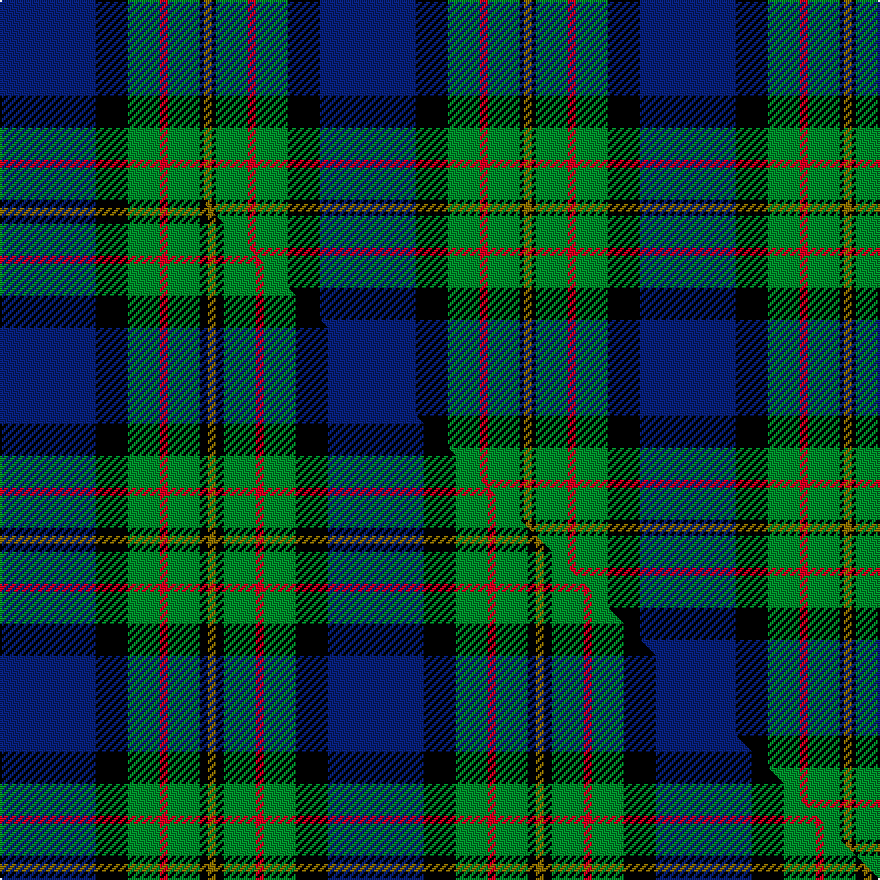

This is one **variant** — a specific cloth: this exact thread count and colourway, with its own
provenance below. It is one weaving of the [sett](/setts/db24k8g8r2g8k1y2/) (the scale-free proportion — the
same cloth at any scale or shade), whose colour order is pattern [BKGRGKG](/stripes/bkgrgkg/).

Part of the [MacLaren](/tartans/maclaren-2/) tartan — the named design grouping this sett with its other cloths.

Sourced from house-of-tartan.  It is a [7 stripe tartan](/stripes/stripes7/).

Original link [http://www.house-of-tartan.scotland.net/house/TartanViewjs.asp?colr=Def&tnam=342](http://www.house-of-tartan.scotland.net/house/TartanViewjs.asp?colr=Def&tnam=342)

## Provenance

Earliest known date: pre 1820 The MacLaren differs from The Ferguson only in having a yellow line where the latter has a white. They share the unusual feature of an unbroken band of blue. The present tartan appears under this name in Mclan's plate for Clan MacLaren. The Wilsons of Bannockburn were producing it before 1820 - but only under the name of 'Regent'. The Regency ended when George IV succeeded the throne in that year, the name of the tartan then becoming outdated; but production of the sett continued, as we know from specimens attached to customers' orders for more. Writers of the period tell us that the demand around 1822 for Clan tartans exceeded the authentic supply, and that not only were new setts invented but pre-existing ones acquired new names. Our present tartan may have been one of the latter; no older MacLaren has come to light. (MacLaren Society)

3 attestations — the source records this cloth was collapsed from (oldest owns this page)

<ul>
<li>pre 1820 — MacLaren Clan Tartan (house-of-tartan, <a href="http://www.house-of-tartan.scotland.net/house/TartanViewjs.asp?colr=Def&tnam=342">record</a>) </li>
<li>undated — MacLaren (weddslist, <a href="http://www.weddslist.com/cgi-bin/tartans/pg.pl?source=sts">record</a>) </li>
<li>undated — MacLaren (weddslist, <a href="http://www.weddslist.com/cgi-bin/tartans/pg.pl?source=tinsel">record</a>) </li>
</ul>

Dataset <small>— provenance for this record, inherited from the source manifest</small>

<dl class="dataset-prov">
<dt>source</dt><dd><a href="/sources/house-of-tartan/">House of Tartan</a></dd>
<dt>data captured from</dt><dd><a href="https://github.com/thetartan/tartan-database/blob/master/data/house-of-tartan/data.csv">https://github.com/thetartan/tartan-database/blob/master/data/house-of-tartan/data.csv</a></dd>
<dt>data date</dt><dd>pre 1820 <small>(this record)</small></dd>
<dt>licence</dt><dd><a href="https://creativecommons.org/licenses/by-nc-nd/4.0/">CC BY-NC-ND 4.0</a></dd>
</dl>

Capture chain <small>— the hands this data passed through, oldest first; each capture carries its own licence</small>

<ol class="capture-chain">
<li><a href="http://www.house-of-tartan.scotland.net/">House of Tartan</a> <small>the weaver/retailer's database — the site is now offline; the URL is kept as the ultimate source's identity</small></li>
<li><a href="https://github.com/thetartan/tartan-database">thetartan/tartan-database</a> <small>2016-2017</small> · <a href="https://creativecommons.org/licenses/by-nc-nd/4.0/">CC BY-NC-ND 4.0</a> <small>Levko Kravets's frozen compilation — the capture we vendored, and where its CC licence text came from</small></li>
<li>this dictionary <small>captured 2026-06-10 · commit 5bf86c7566</small> <small>each re-capture is a git commit to data/sources</small></li>
</ol>

## Thread count
DB/48 K16 G16 R4 G16 K2 Y/4

One full sett is **160 threads**.

## Palette
<table><thead><tr><th>Colour</th><th>Shade</th><th>OKLCh</th></tr></thead><tbody><tr><td>DB</td><td><code style="background-color:#082077;">#082077</code> <small style="color:#888">#082077</small></td><td><small style="color:#888">oklch(30.0% 0.149 265.1)</small></td></tr><tr><td>G</td><td><code style="background-color:#008B2A;">#008B2A</code> <small style="color:#888">#008B2A</small></td><td><small style="color:#888">oklch(55.4% 0.170 145.9)</small></td></tr><tr><td>K</td><td><code style="background-color:#000000;">#000000</code> <small style="color:#888">#000000</small></td><td><small style="color:#888">oklch(0.0% 0.000 0.0)</small></td></tr><tr><td>R</td><td><code style="background-color:#D60020;">#D60020</code> <small style="color:#888">#D60020</small></td><td><small style="color:#888">oklch(55.2% 0.224 25.5)</small></td></tr><tr><td>Y</td><td><code style="background-color:#8B6E00;">#8B6E00</code> <small style="color:#888">#8B6E00</small></td><td><small style="color:#888">oklch(55.1% 0.113 90.4)</small></td></tr></tbody></table>

# Sample pattern

## Compared to the master

This cloth is one sett of its design; the master sett (the exemplar the design is anchored on) is below for comparison.

Its **ΔTartan distance** from the master is **0.49** — the same measure the nearest-tartans table ranks by (0 is identical; a re-scale of the same cloth is near 0, a recolour or a different proportion further).

<figure class="master-compare" style="margin:0">

this sett
master sett ★

<figcaption style="color:#888;font-size:smaller">One weave of this sett against the <a href="/setts/db12k4g4r1g4k1y1/">master sett ★</a>, split on the diagonal: a shared proportion runs seamlessly across it with only the shades shifting; a different proportion breaks on it.</figcaption>
</figure>

## Nearest tartan variants

The nearest existing variants by ΔTartan distance, with this cloth at the top so the swatches line up against it.

ΔTartan

Threads

Variant

Sett

—

160

<a href="/variants/s7/db24k8g8r2g8k1y2~x2/">MacLaren Clan Tartan</a>

<a href="/ttd/edit/#slug=db24k8g8r2g8k1y2&amp;base=db24k8g8r2g8k1y2~x2" title="compare in the TTD">0.00</a>

80

<a href="/variants/s7/db24k8g8r2g8k1y2/">MacLaren</a>

<a href="/ttd/edit/#slug=db24k8g8r2g8k1w2&amp;base=db24k8g8r2g8k1y2~x2" title="compare in the TTD">0.30</a>

80

<a href="/variants/s7/db24k8g8r2g8k1w2/">Fergusson</a>

<a href="/ttd/edit/#slug=db24k8g8r2g8k1w2~x2&amp;base=db24k8g8r2g8k1y2~x2" title="compare in the TTD">0.30</a>

160

<a href="/variants/s7/db24k8g8r2g8k1w2~x2/">Ferguson of Athol Clan Tartan</a>

<a href="/ttd/edit/#slug=db12k4g4r1g4k1y1~x4&amp;base=db24k8g8r2g8k1y2~x2" title="compare in the TTD">0.49</a>

164

<a href="/variants/s7/db12k4g4r1g4k1y1~x4/">MacLaren</a>

<a href="/ttd/edit/#slug=db24k8g8dp2g8k1w2~x2&amp;base=db24k8g8r2g8k1y2~x2" title="compare in the TTD">0.60</a>

160

<a href="/variants/s7/db24k8g8dp2g8k1w2~x2/">Alexander</a>

<a href="/ttd/edit/#slug=db18k10g6r4g6k1w2~x2&amp;base=db24k8g8r2g8k1y2~x2" title="compare in the TTD">0.61</a>

148

<a href="/variants/s7/db18k10g6r4g6k1w2~x2/">Ferguson - 1830 of Atholl (Clan)</a>

<a href="/ttd/edit/#slug=db12k4g4r1g4k1lo1~x4&amp;base=db24k8g8r2g8k1y2~x2" title="compare in the TTD">0.79</a>

164

<a href="/variants/s7/db12k4g4r1g4k1lo1~x4/">MacLaren (Clan)</a>

<a href="/ttd/edit/#slug=db12k4g4dp1g4k1w1~x4&amp;base=db24k8g8r2g8k1y2~x2" title="compare in the TTD">1.09</a>

164

<a href="/variants/s7/db12k4g4dp1g4k1w1~x4/">Alexander - 2000 (Name)</a>

<a href="/ttd/edit/#slug=db32k12db12g6r6g18k2y3~x2&amp;base=db24k8g8r2g8k1y2~x2" title="compare in the TTD">1.47</a>

294

<a href="/variants/s8/db32k12db12g6r6g18k2y3~x2/">Gillies Clan Tartan</a>

<a href="/ttd/edit/#slug=lb2dbi19k4dbi4k4g9db2k1~x4~dbi1404245-db1106275&amp;base=db24k8g8r2g8k1y2~x2" title="compare in the TTD">1.53</a>

348

<a href="/variants/s8/lb2dbi19k4dbi4k4g9db2k1~x4~dbi1404245-db1106275/">Dollar Academy (1999)</a>

## Neighbour map

Every grey dot is one of 13621 variants placed by the first two principal components of the ΔTartan feature space (42% of its variance). Red is this tartan; blue dots are its nearest — click one to open its page.

<svg viewBox="0 0 640 380" role="img" style="max-width:100%;height:auto;border:1px solid #e0e0e0;border-radius:4px;display:block" xmlns="http://www.w3.org/2000/svg"><image href="/nn/cloud.v1.png" width="640" height="380"/><a href="/variants/s7/db24k8g8r2g8k1y2/"><circle cx="222.8" cy="137.8" r="4" fill="#3465a4"><title>MacLaren</title></circle></a><a href="/variants/s7/db24k8g8r2g8k1w2/"><circle cx="211.4" cy="134.3" r="4" fill="#3465a4"><title>Fergusson</title></circle></a><a href="/variants/s7/db24k8g8r2g8k1w2~x2/"><circle cx="211.4" cy="134.3" r="4" fill="#3465a4"><title>Ferguson of Athol Clan Tartan</title></circle></a><a href="/variants/s7/db12k4g4r1g4k1y1~x4/"><circle cx="194.1" cy="165.5" r="4" fill="#3465a4"><title>MacLaren</title></circle></a><a href="/variants/s7/db24k8g8dp2g8k1w2~x2/"><circle cx="215.5" cy="136.5" r="4" fill="#3465a4"><title>Alexander</title></circle></a><a href="/variants/s7/db18k10g6r4g6k1w2~x2/"><circle cx="147.9" cy="156.6" r="4" fill="#3465a4"><title>Ferguson - 1830 of Atholl (Clan)</title></circle></a><a href="/variants/s7/db12k4g4r1g4k1lo1~x4/"><circle cx="188.1" cy="163.3" r="4" fill="#3465a4"><title>MacLaren (Clan)</title></circle></a><a href="/variants/s7/db12k4g4dp1g4k1w1~x4/"><circle cx="187.1" cy="164.3" r="4" fill="#3465a4"><title>Alexander - 2000 (Name)</title></circle></a><a href="/variants/s8/db32k12db12g6r6g18k2y3~x2/"><circle cx="210.2" cy="158.7" r="4" fill="#3465a4"><title>Gillies Clan Tartan</title></circle></a><a href="/variants/s8/lb2dbi19k4dbi4k4g9db2k1~x4~dbi1404245-db1106275/"><circle cx="246.1" cy="142.5" r="4" fill="#3465a4"><title>Dollar Academy (1999)</title></circle></a><circle cx="222.8" cy="137.8" r="5" fill="#c00000"/><text x="320" y="376" text-anchor="middle" font-size="11" fill="#999">ground</text><text x="11" y="190" text-anchor="middle" font-size="11" fill="#999" transform="rotate(-90 11 190)">complexity</text></svg>

ID: /variants/s7/db24k8g8r2g8k1y2~x2/
