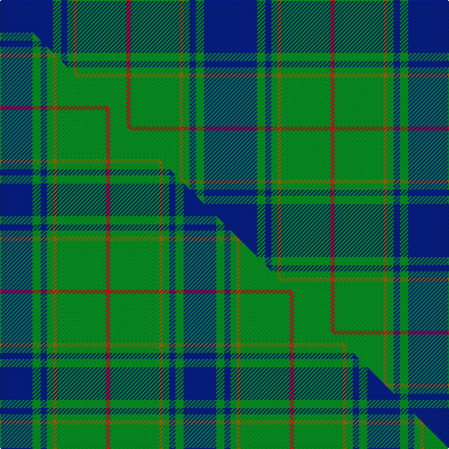

This is one **variant** — a specific cloth: this exact thread count and colourway, with its own
provenance below. It is one weaving of the [sett](/setts/db26g4db3g3y2g24r2/) (the scale-free proportion — the
same cloth at any scale or shade), whose colour order is pattern [BGBGGGR](/stripes/bgbgggr/).

Part of the [St Andrews Links](/tartans/s/st/st-andrews-links-2/) tartan — the named design grouping this sett with its other cloths.

Sourced from weddslist.  It is a [7 stripe tartan](/stripes/stripes7/).

Original link [http://www.weddslist.com/cgi-bin/tartans/pg.pl?source=sts](http://www.weddslist.com/cgi-bin/tartans/pg.pl?source=sts)

Dataset <small>— provenance for this record, inherited from the source manifest</small>

<dl class="dataset-prov">
<dt>source</dt><dd><a href="/sources/weddslist/">Weddslist</a></dd>
<dt>data captured from</dt><dd><a href="https://github.com/thetartan/tartan-database/blob/master/data/weddslist/data.csv">https://github.com/thetartan/tartan-database/blob/master/data/weddslist/data.csv</a></dd>
<dt>data date</dt><dd>2016-11-17 <small>(dataset default)</small></dd>
<dt>licence</dt><dd><a href="https://creativecommons.org/licenses/by-nc-nd/4.0/">CC BY-NC-ND 4.0</a></dd>
</dl>

Capture chain <small>— the hands this data passed through, oldest first; each capture carries its own licence</small>

<ol class="capture-chain">
<li><a href="https://www.weddslist.com/tartans/">Weddslist</a> <small>the living privately compiled reference</small></li>
<li><a href="https://github.com/thetartan/tartan-database">thetartan/tartan-database</a> <small>2016-2017</small> · <a href="https://creativecommons.org/licenses/by-nc-nd/4.0/">CC BY-NC-ND 4.0</a> <small>Levko Kravets's frozen compilation — the capture we vendored, and where its CC licence text came from</small></li>
<li>this dictionary <small>captured 2026-06-10 · commit 5bf86c7566</small> <small>each re-capture is a git commit to data/sources</small></li>
</ol>

## Thread count
DB/52 G8 DB6 G6 Y4 G48 R/4

One full sett is **200 threads**.

## Palette
<table><thead><tr><th>Colour</th><th>Shade</th><th>OKLCh</th></tr></thead><tbody><tr><td>DB</td><td><code style="background-color:#082077;">#082077</code> <small style="color:#888">#082077</small></td><td><small style="color:#888">oklch(30.0% 0.149 265.1)</small></td></tr><tr><td>G</td><td><code style="background-color:#008B2A;">#008B2A</code> <small style="color:#888">#008B2A</small></td><td><small style="color:#888">oklch(55.4% 0.170 145.9)</small></td></tr><tr><td>R</td><td><code style="background-color:#D60020;">#D60020</code> <small style="color:#888">#D60020</small></td><td><small style="color:#888">oklch(55.2% 0.224 25.5)</small></td></tr><tr><td>Y</td><td><code style="background-color:#8B6E00;">#8B6E00</code> <small style="color:#888">#8B6E00</small></td><td><small style="color:#888">oklch(55.1% 0.113 90.4)</small></td></tr></tbody></table>

# Sample pattern

## Compared to the master

This cloth is one sett of its design; the master sett (the exemplar the design is anchored on) is below for comparison.

Its **ΔTartan distance** from the master is **0.42** — the same measure the nearest-tartans table ranks by (0 is identical; a re-scale of the same cloth is near 0, a recolour or a different proportion further).

<figure class="master-compare" style="margin:0">

this sett
master sett ★

<figcaption style="color:#888;font-size:smaller">One weave of this sett against the <a href="/setts/db16g4db3g3y2g24r2/">master sett ★</a>, split on the diagonal: a shared proportion runs seamlessly across it with only the shades shifting; a different proportion breaks on it.</figcaption>
</figure>

## Nearest tartan variants

The nearest existing variants by ΔTartan distance, with this cloth at the top so the swatches line up against it.

ΔTartan

Threads

Variant

Sett

—

200

<a href="/variants/s7/db26g4db3g3y2g24r2~x2/">St Andrews Links</a>

<a href="/ttd/edit/#slug=db16g4db3g3y2g24r2~x2&amp;base=db26g4db3g3y2g24r2~x2" title="compare in the TTD">0.42</a>

180

<a href="/variants/s7/db16g4db3g3y2g24r2~x2/">St Andrews Links</a>

<a href="/ttd/edit/#slug=db24g3db3g3lo2g18dr2~x2&amp;base=db26g4db3g3y2g24r2~x2" title="compare in the TTD">0.60</a>

168

<a href="/variants/s7/db24g3db3g3lo2g18dr2~x2/">Greenways Marketing Intl (Corporate)</a>

<a href="/ttd/edit/#slug=r1db12g5db2g4lb1~x2&amp;base=db26g4db3g3y2g24r2~x2" title="compare in the TTD">1.89</a>

96

<a href="/variants/s6/r1db12g5db2g4lb1~x2/">Connaught Green</a>

<a href="/ttd/edit/#slug=r2db32g14db5g16w2~x2~g2106142&amp;base=db26g4db3g3y2g24r2~x2" title="compare in the TTD">1.90</a>

276

<a href="/variants/s6/r2db32g14db5g16w2~x2~g2106142/">Connacht Irish District Tartan</a>

<a href="/ttd/edit/#slug=db5w3db36g38y5g5~x2&amp;base=db26g4db3g3y2g24r2~x2" title="compare in the TTD">1.91</a>

348

<a href="/variants/s6/db5w3db36g38y5g5~x2/">St. Andrew Society, Sao Paulo (Corp)</a>

<a href="/ttd/edit/#slug=db3r3db36g17y2g21w2r3~x2&amp;base=db26g4db3g3y2g24r2~x2" title="compare in the TTD">1.93</a>

336

<a href="/variants/s8/db3r3db36g17y2g21w2r3~x2/">Singh Name Tartan</a>

<a href="/ttd/edit/#slug=db8g2db10g12k1lr1r1~x4&amp;base=db26g4db3g3y2g24r2~x2" title="compare in the TTD">1.99</a>

244

<a href="/variants/s7/db8g2db10g12k1lr1r1~x4/">Nowell/Noel</a>

<a href="/ttd/edit/#slug=g28r2g2r2g8db24dy3r2~x2&amp;base=db26g4db3g3y2g24r2~x2" title="compare in the TTD">2.01</a>

224

<a href="/variants/s8/g28r2g2r2g8db24dy3r2~x2/">Leatherneck U.S.Marine Corps Corporate Tartan</a>

<a href="/ttd/edit/#slug=g28r2g2r2g8db24y3r2~x2&amp;base=db26g4db3g3y2g24r2~x2" title="compare in the TTD">2.01</a>

224

<a href="/variants/s8/g28r2g2r2g8db24y3r2~x2/">Leatherneck, U.S.Marine Corps</a>

<a href="/ttd/edit/#slug=dy1r1dy2db11g5db1g8r1~x4&amp;base=db26g4db3g3y2g24r2~x2" title="compare in the TTD">2.05</a>

232

<a href="/variants/s8/dy1r1dy2db11g5db1g8r1~x4/">New Mexico, State of (Fashion)</a>

## Neighbour map

Every grey dot is one of 13656 variants placed by the first two principal components of the ΔTartan feature space (42% of its variance). Red is this tartan; blue dots are its nearest — click one to open its page. The map is a flat projection of a many-dimensional space — [how to read it](/posts/neighbourhood-maps/).

<svg viewBox="0 0 640 380" role="img" style="max-width:100%;height:auto;border:1px solid #e0e0e0;border-radius:4px;display:block" xmlns="http://www.w3.org/2000/svg"><image href="/nn/cloud.v1.png" width="640" height="380"/><a href="/variants/s7/db16g4db3g3y2g24r2~x2/"><circle cx="349.7" cy="195.4" r="4" fill="#3465a4"><title>St Andrews Links</title></circle></a><a href="/variants/s7/db24g3db3g3lo2g18dr2~x2/"><circle cx="334.5" cy="206.3" r="4" fill="#3465a4"><title>Greenways Marketing Intl (Corporate)</title></circle></a><a href="/variants/s6/r1db12g5db2g4lb1~x2/"><circle cx="331.7" cy="207.1" r="4" fill="#3465a4"><title>Connaught Green</title></circle></a><a href="/variants/s6/r2db32g14db5g16w2~x2~g2106142/"><circle cx="332.2" cy="200.4" r="4" fill="#3465a4"><title>Connacht Irish District Tartan</title></circle></a><a href="/variants/s6/db5w3db36g38y5g5~x2/"><circle cx="315.8" cy="213.9" r="4" fill="#3465a4"><title>St. Andrew Society, Sao Paulo (Corp)</title></circle></a><a href="/variants/s8/db3r3db36g17y2g21w2r3~x2/"><circle cx="275.0" cy="156.7" r="4" fill="#3465a4"><title>Singh Name Tartan</title></circle></a><a href="/variants/s7/db8g2db10g12k1lr1r1~x4/"><circle cx="261.4" cy="173.7" r="4" fill="#3465a4"><title>Nowell/Noel</title></circle></a><a href="/variants/s8/g28r2g2r2g8db24dy3r2~x2/"><circle cx="323.4" cy="175.6" r="4" fill="#3465a4"><title>Leatherneck U.S.Marine Corps Corporate Tartan</title></circle></a><a href="/variants/s8/g28r2g2r2g8db24y3r2~x2/"><circle cx="324.8" cy="176.3" r="4" fill="#3465a4"><title>Leatherneck, U.S.Marine Corps</title></circle></a><a href="/variants/s8/dy1r1dy2db11g5db1g8r1~x4/"><circle cx="263.9" cy="198.8" r="4" fill="#3465a4"><title>New Mexico, State of (Fashion)</title></circle></a><circle cx="320.8" cy="188.9" r="5" fill="#c00000"/><text x="320" y="376" text-anchor="middle" font-size="11" fill="#999">ground</text><text x="11" y="190" text-anchor="middle" font-size="11" fill="#999" transform="rotate(-90 11 190)">complexity</text></svg>

ID: /variants/s7/db26g4db3g3y2g24r2~x2/
