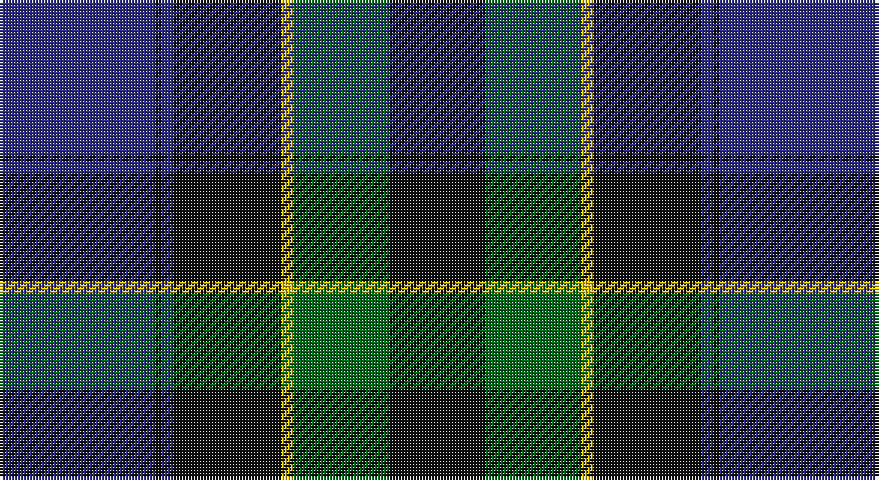

This page is one **sett** — a single exact thread-count. It belongs to the [tartan](/setts/db26k1db2k18ly2g16k16/)
(the same proportion at any scale), whose colour order is pattern [BKBKYGK](/stripes/bkbkygk/).

Part of the [Mowat](/tartans/mowat/) tartan — the named design grouping this sett with its other cloths.

Sourced from register-of-tartans.  It is a [7 stripe tartan](/stripes/stripes7/).

Original link https://www.tartanregister.gov.uk/tartanDetails.aspx?ref=3034

## Provenance

Earliest known date: 1906. Designed for Kincardine & Deeside branch of the National Trust for Scotland. Blue is a muted sky blue. Green is a dark pine green.

3 attestations — the source records this cloth was collapsed from (oldest owns this page)

<ul>
<li>01/01/1900 — Mowat (register-of-tartans, <a href="https://www.tartanregister.gov.uk/tartanDetails.aspx?ref=3034">record</a>)</li>
<li>pre 2002 — Mowat (Clan) (tartans-authority, <a href="http://www.tartansauthority.com/tartan-ferret/display/258/">record</a>)</li>
<li>undated — Mowat Clan Tartan (house-of-tartan, <a href="http://www.house-of-tartan.scotland.net/house/TartanViewjs.asp?colr=Def&tnam=258">record</a>)</li>
</ul>

## Register references

External register numbers recorded for this tartan.

- Scottish Register of Tartans: [3034](https://www.tartanregister.gov.uk/tartanDetails.aspx?ref=3034)
- Scottish Tartans Authority (ITI): 258
- Scottish Tartans World Register: 258

## Thread count
DB/52 K2 DB4 K36 Y4 G32 K/32

One full sett is **240 threads**.

## Palette

Palette: <strong>Tartan Register</strong>
<table><thead><tr><th>Colour</th><th>Threads</th><th>Shade</th><th>Base</th><th>OKLCh</th></tr></thead><tbody><tr><td>DB/</td><td style="text-align:right;font-variant-numeric:tabular-nums">52</td><td><code style="background-color:#2C2C80;">#2C2C80</code> <small style="color:#888">#2C2C80</small></td><td>B <code style="background-color:#2A418A;">#2A418A</code></td><td><small style="color:#888">oklch(35.0% 0.138 276.6)</small></td></tr><tr><td>K</td><td style="text-align:right;font-variant-numeric:tabular-nums">2</td><td><code style="background-color:#101010;">#101010</code> <small style="color:#888">#101010</small></td><td>K <code style="background-color:#000000;">#000000</code></td><td><small style="color:#888">oklch(17.3% 0.000 89.9)</small></td></tr><tr><td>DB</td><td style="text-align:right;font-variant-numeric:tabular-nums">4</td><td><code style="background-color:#2C2C80;">#2C2C80</code> <small style="color:#888">#2C2C80</small></td><td>B <code style="background-color:#2A418A;">#2A418A</code></td><td><small style="color:#888">oklch(35.0% 0.138 276.6)</small></td></tr><tr><td>K</td><td style="text-align:right;font-variant-numeric:tabular-nums">36</td><td><code style="background-color:#101010;">#101010</code> <small style="color:#888">#101010</small></td><td>K <code style="background-color:#000000;">#000000</code></td><td><small style="color:#888">oklch(17.3% 0.000 89.9)</small></td></tr><tr><td>Y</td><td style="text-align:right;font-variant-numeric:tabular-nums">4</td><td><code style="background-color:#E8C000;">#E8C000</code> <small style="color:#888">#E8C000</small></td><td>Y <code style="background-color:#F2BF00;">#F2BF00</code></td><td><small style="color:#888">oklch(81.9% 0.168 93.7)</small></td></tr><tr><td>G</td><td style="text-align:right;font-variant-numeric:tabular-nums">32</td><td><code style="background-color:#006818;">#006818</code> <small style="color:#888">#006818</small></td><td>G <code style="background-color:#006100;">#006100</code></td><td><small style="color:#888">oklch(45.0% 0.142 145.0)</small></td></tr><tr><td>K/</td><td style="text-align:right;font-variant-numeric:tabular-nums">32</td><td><code style="background-color:#101010;">#101010</code> <small style="color:#888">#101010</small></td><td>K <code style="background-color:#000000;">#000000</code></td><td><small style="color:#888">oklch(17.3% 0.000 89.9)</small></td></tr></tbody></table>

# Sample pattern

## Compared to the master

This cloth is one sett of its design; the master sett (the exemplar the design is anchored on) is below for comparison.

<figure style="margin:0"><figcaption style="color:#888;font-size:smaller">this sett</figcaption></figure>
<figure style="margin:0"><figcaption style="color:#888;font-size:smaller"><a href="/setts/db24k3db5k23ly2k11g22/">master sett →</a></figcaption></figure>

## Nearest tartans

The nearest existing variants by ΔTartan distance, with this tartan at the top so the swatches line up against it.

ΔTartan

Tartan

Sett

—

<a href="/ttd/edit/#slug=db26k1db2k18ly2g16k16~x2">Mowat</a> <a class="nn-out" href="/variants/s7/db26k1db2k18ly2g16k16~x2/" title="open its dictionary page">↗</a>

0.98

<a href="/ttd/edit/#slug=k4db16k12g12r1g2k2~x2&amp;base=db26k1db2k18ly2g16k16~x2">Dundas #2</a> <a class="nn-out" href="/variants/s7/k4db16k12g12r1g2k2~x2/" title="open its dictionary page">↗</a>

1.01

<a href="/ttd/edit/#slug=k4db16k12g24r1g2k2~x2&amp;base=db26k1db2k18ly2g16k16~x2">Dundas Clan Tartan</a> <a class="nn-out" href="/variants/s7/k4db16k12g24r1g2k2~x2/" title="open its dictionary page">↗</a>

1.03

<a href="/ttd/edit/#slug=k16dg16k2dg16k16w2dp16k1~x2&amp;base=db26k1db2k18ly2g16k16~x2">Unidentified #36</a> <a class="nn-out" href="/variants/s8/k16dg16k2dg16k16w2dp16k1~x2/" title="open its dictionary page">↗</a>

1.07

<a href="/ttd/edit/#slug=dg30db4dg2k20db18r1db4~x2&amp;base=db26k1db2k18ly2g16k16~x2">MacTaggart</a> <a class="nn-out" href="/variants/s7/dg30db4dg2k20db18r1db4~x2/" title="open its dictionary page">↗</a>

1.08

<a href="/ttd/edit/#slug=db30k10g10lb2g15lb2~x2&amp;base=db26k1db2k18ly2g16k16~x2">MacRobart (Personal)</a> <a class="nn-out" href="/variants/s6/db30k10g10lb2g15lb2~x2/" title="open its dictionary page">↗</a>

1.09

<a href="/ttd/edit/#slug=lo4db24g3k21g23k1~x2&amp;base=db26k1db2k18ly2g16k16~x2">Glenturret Distillery</a> <a class="nn-out" href="/variants/s6/lo4db24g3k21g23k1~x2/" title="open its dictionary page">↗</a>

1.13

<a href="/ttd/edit/#slug=db37o18k37r2k2r2~x2&amp;base=db26k1db2k18ly2g16k16~x2">Hakkarain Personal Finnish Tartan</a> <a class="nn-out" href="/variants/s6/db37o18k37r2k2r2~x2/" title="open its dictionary page">↗</a>

1.18

<a href="/ttd/edit/#slug=dt22k16ly4k11dp2n1~x4&amp;base=db26k1db2k18ly2g16k16~x2">Martinez, Clément (Personal)</a> <a class="nn-out" href="/variants/s6/dt22k16ly4k11dp2n1~x4/" title="open its dictionary page">↗</a>

1.23

<a href="/ttd/edit/#slug=db24k3db5k23ly2k11g22~x2&amp;base=db26k1db2k18ly2g16k16~x2">Mowat (Clans Originaux)</a> <a class="nn-out" href="/variants/s7/db24k3db5k23ly2k11g22~x2/" title="open its dictionary page">↗</a>

1.24

<a href="/ttd/edit/#slug=k2db3g16t1k13t1db18k2db2~x2&amp;base=db26k1db2k18ly2g16k16~x2">Hebridean Old.. District Tartan</a> <a class="nn-out" href="/variants/s9/k2db3g16t1k13t1db18k2db2~x2/" title="open its dictionary page">↗</a>

## Neighbour map

Every grey dot is one of 14360 variants placed by the first two principal components of the ΔTartan feature space (44% of its variance). Red is this tartan; blue dots are its nearest — click one to open its page.

<svg viewBox="0 0 640 380" role="img" style="max-width:100%;height:auto;border:1px solid #e0e0e0;border-radius:4px;display:block" xmlns="http://www.w3.org/2000/svg"><image href="/nn/cloud.v1.png" width="640" height="380"/><a href="/variants/s7/k4db16k12g12r1g2k2~x2/"><circle cx="248.8" cy="217.5" r="4" fill="#3465a4"><title>Dundas #2</title></circle></a><a href="/variants/s7/k4db16k12g24r1g2k2~x2/"><circle cx="292.0" cy="191.6" r="4" fill="#3465a4"><title>Dundas Clan Tartan</title></circle></a><a href="/variants/s8/k16dg16k2dg16k16w2dp16k1~x2/"><circle cx="249.1" cy="223.0" r="4" fill="#3465a4"><title>Unidentified #36</title></circle></a><a href="/variants/s7/dg30db4dg2k20db18r1db4~x2/"><circle cx="311.3" cy="192.9" r="4" fill="#3465a4"><title>MacTaggart</title></circle></a><a href="/variants/s6/db30k10g10lb2g15lb2~x2/"><circle cx="264.1" cy="218.3" r="4" fill="#3465a4"><title>MacRobart (Personal)</title></circle></a><a href="/variants/s6/lo4db24g3k21g23k1~x2/"><circle cx="226.0" cy="199.4" r="4" fill="#3465a4"><title>Glenturret Distillery</title></circle></a><a href="/variants/s6/db37o18k37r2k2r2~x2/"><circle cx="272.7" cy="196.6" r="4" fill="#3465a4"><title>Hakkarain Personal Finnish Tartan</title></circle></a><a href="/variants/s6/dt22k16ly4k11dp2n1~x4/"><circle cx="296.2" cy="189.7" r="4" fill="#3465a4"><title>Martinez, Clément (Personal)</title></circle></a><a href="/variants/s7/db24k3db5k23ly2k11g22~x2/"><circle cx="238.5" cy="232.6" r="4" fill="#3465a4"><title>Mowat (Clans Originaux)</title></circle></a><a href="/variants/s9/k2db3g16t1k13t1db18k2db2~x2/"><circle cx="272.2" cy="186.4" r="4" fill="#3465a4"><title>Hebridean Old.. District Tartan</title></circle></a><circle cx="286.8" cy="199.5" r="5" fill="#c00000"/></svg>

ID: /variants/s7/db26k1db2k18ly2g16k16~x2/
