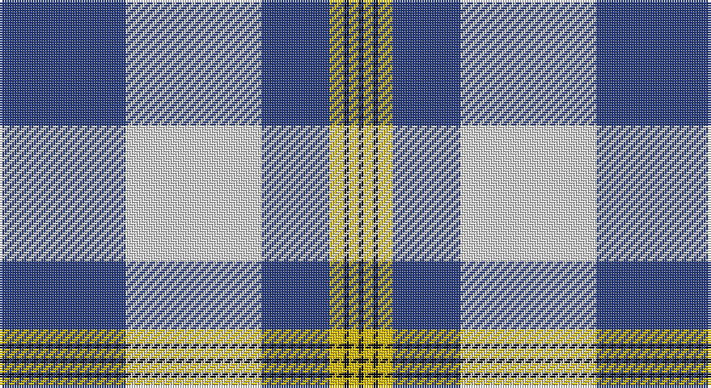

This page is one **sett** — a single exact thread-count. It belongs to the [tartan](/setts/db26w28db14ly3k1ly2k1/)
(the same proportion at any scale), whose colour order is pattern [BWBYKYK](/stripes/bwbykyk/).

Sourced from register-of-tartans.  It is a [7 stripe tartan](/stripes/stripes7/).

Original link https://www.tartanregister.gov.uk/tartanDetails.aspx?ref=5865

## Register references

External register numbers recorded for this tartan.

- Scottish Register of Tartans: [5865](https://www.tartanregister.gov.uk/tartanDetails.aspx?ref=5865)
- Scottish Tartans World Register: 3201

## Thread count
B/52 LN56 B28 Y6 K2 Y4 K/2

One full sett is **246 threads**.

## Palette

Palette: <strong>Tartan Register</strong>
<table><thead><tr><th>Colour</th><th>Threads</th><th>Shade</th><th>Base</th><th>OKLCh</th></tr></thead><tbody><tr><td>B/</td><td style="text-align:right;font-variant-numeric:tabular-nums">52</td><td><code style="background-color:#2C4084;">#2C4084</code> <small style="color:#888">#2C4084</small></td><td>B <code style="background-color:#2A418A;">#2A418A</code></td><td><small style="color:#888">oklch(39.4% 0.117 268.3)</small></td></tr><tr><td>LN</td><td style="text-align:right;font-variant-numeric:tabular-nums">56</td><td><code style="background-color:#E0E0E0;">#E0E0E0</code> <small style="color:#888">#E0E0E0</small></td><td>W <code style="background-color:#F7F7F7;">#F7F7F7</code></td><td><small style="color:#888">oklch(90.7% 0.000 89.9)</small></td></tr><tr><td>B</td><td style="text-align:right;font-variant-numeric:tabular-nums">28</td><td><code style="background-color:#2C4084;">#2C4084</code> <small style="color:#888">#2C4084</small></td><td>B <code style="background-color:#2A418A;">#2A418A</code></td><td><small style="color:#888">oklch(39.4% 0.117 268.3)</small></td></tr><tr><td>Y</td><td style="text-align:right;font-variant-numeric:tabular-nums">6</td><td><code style="background-color:#E8C000;">#E8C000</code> <small style="color:#888">#E8C000</small></td><td>Y <code style="background-color:#F2BF00;">#F2BF00</code></td><td><small style="color:#888">oklch(81.9% 0.168 93.7)</small></td></tr><tr><td>K</td><td style="text-align:right;font-variant-numeric:tabular-nums">2</td><td><code style="background-color:#101010;">#101010</code> <small style="color:#888">#101010</small></td><td>K <code style="background-color:#000000;">#000000</code></td><td><small style="color:#888">oklch(17.3% 0.000 89.9)</small></td></tr><tr><td>Y</td><td style="text-align:right;font-variant-numeric:tabular-nums">4</td><td><code style="background-color:#E8C000;">#E8C000</code> <small style="color:#888">#E8C000</small></td><td>Y <code style="background-color:#F2BF00;">#F2BF00</code></td><td><small style="color:#888">oklch(81.9% 0.168 93.7)</small></td></tr><tr><td>K/</td><td style="text-align:right;font-variant-numeric:tabular-nums">2</td><td><code style="background-color:#101010;">#101010</code> <small style="color:#888">#101010</small></td><td>K <code style="background-color:#000000;">#000000</code></td><td><small style="color:#888">oklch(17.3% 0.000 89.9)</small></td></tr></tbody></table>

# Sample pattern

## Nearest tartans

The nearest existing variants by ΔTartan distance, with this tartan at the top so the swatches line up against it.

ΔTartan

Tartan

Sett

—

<a href="/ttd/edit/#slug=db26w28db14ly3k1ly2k1~x2">Gothenburg/Goteborg</a> <a class="nn-out" href="/variants/s7/db26w28db14ly3k1ly2k1~x2/" title="open its dictionary page">↗</a>

0.93

<a href="/ttd/edit/#slug=b26w28b14ly3k1ly2k1~x2&amp;base=db26w28db14ly3k1ly2k1~x2">Gothenburg</a> <a class="nn-out" href="/variants/s7/b26w28b14ly3k1ly2k1~x2/" title="open its dictionary page">↗</a>

0.99

<a href="/ttd/edit/#slug=db41t2w2t2db5b12w31db4~x2&amp;base=db26w28db14ly3k1ly2k1~x2">Harmony, Eildon</a> <a class="nn-out" href="/variants/s8/db41t2w2t2db5b12w31db4~x2/" title="open its dictionary page">↗</a>

1.00

<a href="/ttd/edit/#slug=t2db1k1db20w20db1w2~x4&amp;base=db26w28db14ly3k1ly2k1~x2">Cunningham, Dress Blue (Dance) Fashion Tartan</a> <a class="nn-out" href="/variants/s7/t2db1k1db20w20db1w2~x4/" title="open its dictionary page">↗</a>

1.09

<a href="/ttd/edit/#slug=db41ti2w2ti2db5t12w31db4~x2&amp;base=db26w28db14ly3k1ly2k1~x2">Harmony Eildon (Dance)</a> <a class="nn-out" href="/variants/s8/db41ti2w2ti2db5t12w31db4~x2/" title="open its dictionary page">↗</a>

1.10

<a href="/ttd/edit/#slug=ly2w21db16b8db30w8db1~x2&amp;base=db26w28db14ly3k1ly2k1~x2">Muir, John</a> <a class="nn-out" href="/variants/s7/ly2w21db16b8db30w8db1~x2/" title="open its dictionary page">↗</a>

1.16

<a href="/ttd/edit/#slug=r1w10ly2w16db40w1~x2&amp;base=db26w28db14ly3k1ly2k1~x2">Caithness Glass (Corporate)</a> <a class="nn-out" href="/variants/s6/r1w10ly2w16db40w1~x2/" title="open its dictionary page">↗</a>

1.18

<a href="/ttd/edit/#slug=w8k1w40m1k16db16w6db3m3db6~x2&amp;base=db26w28db14ly3k1ly2k1~x2">Lochnagar Dress fashion Tartan</a> <a class="nn-out" href="/variants/s10/w8k1w40m1k16db16w6db3m3db6~x2/" title="open its dictionary page">↗</a>

1.25

<a href="/ttd/edit/#slug=t42k2w2k2t5n12w32t4~x2&amp;base=db26w28db14ly3k1ly2k1~x2">Longniddry, dress (Turquoise)</a> <a class="nn-out" href="/variants/s8/t42k2w2k2t5n12w32t4~x2/" title="open its dictionary page">↗</a>

1.27

<a href="/ttd/edit/#slug=lt25db11r5w1k1~x4&amp;base=db26w28db14ly3k1ly2k1~x2">Mount Vernon Primary School</a> <a class="nn-out" href="/variants/s5/lt25db11r5w1k1~x4/" title="open its dictionary page">↗</a>

1.27

<a href="/ttd/edit/#slug=lb25db11r5w1k1~x4&amp;base=db26w28db14ly3k1ly2k1~x2">Mount Vernon Primary School (Corp)</a> <a class="nn-out" href="/variants/s5/lb25db11r5w1k1~x4/" title="open its dictionary page">↗</a>

## Neighbour map

Every grey dot is one of 14360 variants placed by the first two principal components of the ΔTartan feature space (44% of its variance). Red is this tartan; blue dots are its nearest — click one to open its page.

<svg viewBox="0 0 640 380" role="img" style="max-width:100%;height:auto;border:1px solid #e0e0e0;border-radius:4px;display:block" xmlns="http://www.w3.org/2000/svg"><image href="/nn/cloud.v1.png" width="640" height="380"/><a href="/variants/s7/b26w28b14ly3k1ly2k1~x2/"><circle cx="312.4" cy="134.6" r="4" fill="#3465a4"><title>Gothenburg</title></circle></a><a href="/variants/s8/db41t2w2t2db5b12w31db4~x2/"><circle cx="285.9" cy="135.9" r="4" fill="#3465a4"><title>Harmony, Eildon</title></circle></a><a href="/variants/s7/t2db1k1db20w20db1w2~x4/"><circle cx="288.4" cy="129.3" r="4" fill="#3465a4"><title>Cunningham, Dress Blue (Dance) Fashion Tartan</title></circle></a><a href="/variants/s8/db41ti2w2ti2db5t12w31db4~x2/"><circle cx="278.5" cy="134.5" r="4" fill="#3465a4"><title>Harmony Eildon (Dance)</title></circle></a><a href="/variants/s7/ly2w21db16b8db30w8db1~x2/"><circle cx="288.0" cy="150.7" r="4" fill="#3465a4"><title>Muir, John</title></circle></a><a href="/variants/s6/r1w10ly2w16db40w1~x2/"><circle cx="352.3" cy="114.0" r="4" fill="#3465a4"><title>Caithness Glass (Corporate)</title></circle></a><a href="/variants/s10/w8k1w40m1k16db16w6db3m3db6~x2/"><circle cx="296.2" cy="89.9" r="4" fill="#3465a4"><title>Lochnagar Dress fashion Tartan</title></circle></a><a href="/variants/s8/t42k2w2k2t5n12w32t4~x2/"><circle cx="296.5" cy="138.3" r="4" fill="#3465a4"><title>Longniddry, dress (Turquoise)</title></circle></a><a href="/variants/s5/lt25db11r5w1k1~x4/"><circle cx="299.8" cy="133.4" r="4" fill="#3465a4"><title>Mount Vernon Primary School</title></circle></a><a href="/variants/s5/lb25db11r5w1k1~x4/"><circle cx="314.1" cy="136.4" r="4" fill="#3465a4"><title>Mount Vernon Primary School (Corp)</title></circle></a><circle cx="308.0" cy="132.9" r="5" fill="#c00000"/></svg>

ID: /variants/s7/db26w28db14ly3k1ly2k1~x2/
