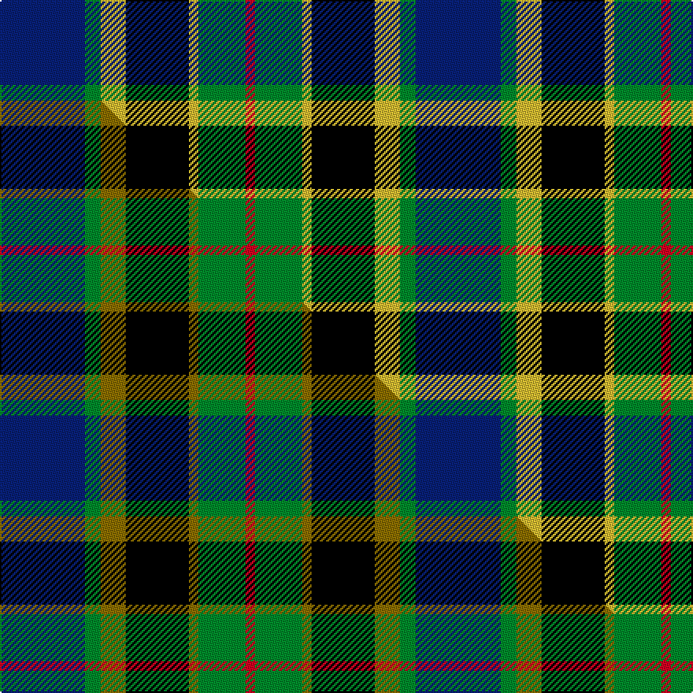

This page is one **sett** — a single exact thread-count. It belongs to the [tartan](/setts/db27g5ly8k20ly3g15r3/)
(the same proportion at any scale), whose colour order is pattern [BGYKYGR](/stripes/bgykygr/).

Part of the [Nelson Mandela](/tartans/nelson-mandela/) tartan — the named design grouping this sett with its other cloths.

Sourced from tartans-authority.  It is a [7 stripe tartan](/stripes/stripes7/).

Original link http://www.tartansauthority.com/tartan-ferret/display/6601/

## Register references

External register numbers recorded for this tartan.

- Scottish Tartans Authority (ITI): 6601

## Thread count
DB/54 G10 LY16 K40 LY6 G30 R/6

One full sett is **264 threads**.

## Palette
<table><thead><tr><th>Colour</th><th>Shade</th><th>OKLCh</th></tr></thead><tbody><tr><td>DB</td><td><code style="background-color:#082077;">#082077</code> <small style="color:#888">#082077</small></td><td><small style="color:#888">oklch(30.0% 0.149 265.1)</small></td></tr><tr><td>G</td><td><code style="background-color:#008B2A;">#008B2A</code> <small style="color:#888">#008B2A</small></td><td><small style="color:#888">oklch(55.4% 0.170 145.9)</small></td></tr><tr><td>K</td><td><code style="background-color:#000000;">#000000</code> <small style="color:#888">#000000</small></td><td><small style="color:#888">oklch(0.0% 0.000 0.0)</small></td></tr><tr><td>R</td><td><code style="background-color:#D60020;">#D60020</code> <small style="color:#888">#D60020</small></td><td><small style="color:#888">oklch(55.2% 0.224 25.5)</small></td></tr><tr><td>LY</td><td><code style="background-color:#DCBC32;">#DCBC32</code> <small style="color:#888">#DCBC32</small></td><td><small style="color:#888">oklch(80.0% 0.150 95.2)</small></td></tr></tbody></table>

# Sample pattern

## Compared to the master

This cloth is one sett of its design; the master sett (the exemplar the design is anchored on) is below for comparison.

Its **ΔTartan distance** from the master is **0.07** — the same measure the nearest-tartans table ranks by (0 is identical; a re-scale of the same cloth is near 0, a recolour or a different proportion further).

<figure class="master-compare" style="margin:0">

this sett
master sett ★

<figcaption style="color:#888;font-size:smaller">One weave of this sett against the <a href="/setts/db27g5y8k20y3g15r3/">master sett ★</a>, split on the diagonal: a shared proportion runs seamlessly across it with only the shades shifting; a different proportion breaks on it.</figcaption>
</figure>

## Nearest tartan variants

The nearest existing variants by ΔTartan distance, with this cloth at the top so the swatches line up against it.

ΔTartan

Threads

Variant

Sett

—

264

<a href="/variants/s7/db27g5ly8k20ly3g15r3~x2/">Nelson Mandela (Personal)</a>

<a href="/ttd/edit/#slug=db27g5y8k20y3g15r3~x2&amp;base=db27g5ly8k20ly3g15r3~x2" title="compare in the TTD">0.07</a>

264

<a href="/variants/s7/db27g5y8k20y3g15r3~x2/">Nelson Mandela (Personal)</a>

<a href="/ttd/edit/#slug=r2k1db8k8g8k1w2&amp;base=db27g5ly8k20ly3g15r3~x2" title="compare in the TTD">1.70</a>

56

<a href="/variants/s7/r2k1db8k8g8k1w2/">Campbell Cawdor</a>

<a href="/ttd/edit/#slug=r2k1db8k8g8k1lb2~x2&amp;base=db27g5ly8k20ly3g15r3~x2" title="compare in the TTD">1.72</a>

112

<a href="/variants/s7/r2k1db8k8g8k1lb2~x2/">Argyll</a>

<a href="/ttd/edit/#slug=r2k1db8k8g8k1lb2~x4&amp;base=db27g5ly8k20ly3g15r3~x2" title="compare in the TTD">1.72</a>

224

<a href="/variants/s7/r2k1db8k8g8k1lb2~x4/">Campbell of Cawdor</a>

<a href="/ttd/edit/#slug=g9lb2g1k6db6r1db1~x2&amp;base=db27g5ly8k20ly3g15r3~x2" title="compare in the TTD">1.82</a>

84

<a href="/variants/s7/g9lb2g1k6db6r1db1~x2/">MacTaggert</a>

<a href="/ttd/edit/#slug=g17y2k14r2db9r2db10~x2&amp;base=db27g5ly8k20ly3g15r3~x2" title="compare in the TTD">1.87</a>

170

<a href="/variants/s7/g17y2k14r2db9r2db10~x2/">MacDonald (Flora.. )</a>

<a href="/ttd/edit/#slug=dp8k1g2k1dy2k6g8k1w2~x4&amp;base=db27g5ly8k20ly3g15r3~x2" title="compare in the TTD">1.97</a>

208

<a href="/variants/s9/dp8k1g2k1dy2k6g8k1w2~x4/">Coffield-Limesand (Personal)</a>

<a href="/ttd/edit/#slug=dr3g2dr3g18k14w2db16g3~x2&amp;base=db27g5ly8k20ly3g15r3~x2" title="compare in the TTD">2.00</a>

232

<a href="/variants/s8/dr3g2dr3g18k14w2db16g3~x2/">Mantle (Personal)</a>

<a href="/ttd/edit/#slug=k4t21dy10y4k20r6t3~x2&amp;base=db27g5ly8k20ly3g15r3~x2" title="compare in the TTD">2.01</a>

258

<a href="/variants/s7/k4t21dy10y4k20r6t3~x2/">Swankie (Personal)</a>

<a href="/ttd/edit/#slug=g11lb3g5r3g5k22db22k5~x2&amp;base=db27g5ly8k20ly3g15r3~x2" title="compare in the TTD">2.01</a>

272

<a href="/variants/s8/g11lb3g5r3g5k22db22k5~x2/">Wood (Personal)</a>

## Neighbour map

Every grey dot is one of 13620 variants placed by the first two principal components of the ΔTartan feature space (42% of its variance). Red is this tartan; blue dots are its nearest — click one to open its page.

<svg viewBox="0 0 640 380" role="img" style="max-width:100%;height:auto;border:1px solid #e0e0e0;border-radius:4px;display:block" xmlns="http://www.w3.org/2000/svg"><image href="/nn/cloud.v1.png" width="640" height="380"/><a href="/variants/s7/db27g5y8k20y3g15r3~x2/"><circle cx="111.1" cy="192.1" r="4" fill="#3465a4"><title>Nelson Mandela (Personal)</title></circle></a><a href="/variants/s7/r2k1db8k8g8k1w2/"><circle cx="90.7" cy="187.7" r="4" fill="#3465a4"><title>Campbell Cawdor</title></circle></a><a href="/variants/s7/r2k1db8k8g8k1lb2~x2/"><circle cx="96.5" cy="189.4" r="4" fill="#3465a4"><title>Argyll</title></circle></a><a href="/variants/s7/r2k1db8k8g8k1lb2~x4/"><circle cx="96.5" cy="189.4" r="4" fill="#3465a4"><title>Campbell of Cawdor</title></circle></a><a href="/variants/s7/g9lb2g1k6db6r1db1~x2/"><circle cx="130.1" cy="184.7" r="4" fill="#3465a4"><title>MacTaggert</title></circle></a><a href="/variants/s7/g17y2k14r2db9r2db10~x2/"><circle cx="111.2" cy="194.4" r="4" fill="#3465a4"><title>MacDonald (Flora.. )</title></circle></a><a href="/variants/s9/dp8k1g2k1dy2k6g8k1w2~x4/"><circle cx="92.5" cy="173.3" r="4" fill="#3465a4"><title>Coffield-Limesand (Personal)</title></circle></a><a href="/variants/s8/dr3g2dr3g18k14w2db16g3~x2/"><circle cx="128.8" cy="175.5" r="4" fill="#3465a4"><title>Mantle (Personal)</title></circle></a><a href="/variants/s7/k4t21dy10y4k20r6t3~x2/"><circle cx="108.7" cy="195.2" r="4" fill="#3465a4"><title>Swankie (Personal)</title></circle></a><a href="/variants/s8/g11lb3g5r3g5k22db22k5~x2/"><circle cx="114.1" cy="185.6" r="4" fill="#3465a4"><title>Wood (Personal)</title></circle></a><circle cx="102.1" cy="191.9" r="5" fill="#c00000"/><text x="320" y="376" text-anchor="middle" font-size="11" fill="#999">ground</text><text x="11" y="190" text-anchor="middle" font-size="11" fill="#999" transform="rotate(-90 11 190)">complexity</text></svg>

ID: /variants/s7/db27g5ly8k20ly3g15r3~x2/
