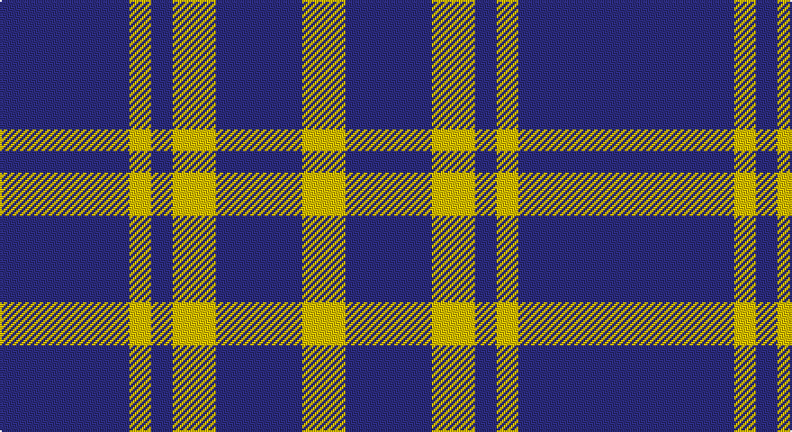

This page is one **sett** — a single exact thread-count. It belongs to the [tartan](/setts/db2db4ly1db1ly2db4ly2/)
(the same proportion at any scale), whose colour order is pattern [BBYBYBY](/stripes/bbybyby/).

Part of the [Creek Indian Nation](/tartans/creek-indian-nation/) tartan — the named design grouping this sett with its other cloths.

Sourced from tartans-authority.  It is a [7 stripe tartan](/stripes/stripes7/).

Original link http://www.tartansauthority.com/tartan-ferret/display/4610/

## Register references

External register numbers recorded for this tartan.

- Scottish Tartans Authority (ITI): 4610

## Thread count
DB/24 DBa48 Y12 DB12 Ya24 DBa48 Ya/24

One full sett is **336 threads**.

## Palette

Palette: <strong>Tartan Register</strong>
<table><thead><tr><th>Colour</th><th>Threads</th><th>Shade</th><th>Base</th><th>OKLCh</th></tr></thead><tbody><tr><td>DB/</td><td style="text-align:right;font-variant-numeric:tabular-nums">24</td><td><code style="background-color:#2C2C80;">#2C2C80</code> <small style="color:#888">#2C2C80</small></td><td>B <code style="background-color:#2A418A;">#2A418A</code></td><td><small style="color:#888">oklch(35.0% 0.138 276.6)</small></td></tr><tr><td>DBa</td><td style="text-align:right;font-variant-numeric:tabular-nums">48</td><td><code style="background-color:#2C2C80;">#2C2C80</code> <small style="color:#888">#2C2C80</small></td><td>B <code style="background-color:#2A418A;">#2A418A</code></td><td><small style="color:#888">oklch(35.0% 0.138 276.6)</small></td></tr><tr><td>Y</td><td style="text-align:right;font-variant-numeric:tabular-nums">12</td><td><code style="background-color:#E8C000;">#E8C000</code> <small style="color:#888">#E8C000</small></td><td>Y <code style="background-color:#F2BF00;">#F2BF00</code></td><td><small style="color:#888">oklch(81.9% 0.168 93.7)</small></td></tr><tr><td>DB</td><td style="text-align:right;font-variant-numeric:tabular-nums">12</td><td><code style="background-color:#2C2C80;">#2C2C80</code> <small style="color:#888">#2C2C80</small></td><td>B <code style="background-color:#2A418A;">#2A418A</code></td><td><small style="color:#888">oklch(35.0% 0.138 276.6)</small></td></tr><tr><td>Ya</td><td style="text-align:right;font-variant-numeric:tabular-nums">24</td><td><code style="background-color:#E8C000;">#E8C000</code> <small style="color:#888">#E8C000</small></td><td>Y <code style="background-color:#F2BF00;">#F2BF00</code></td><td><small style="color:#888">oklch(81.9% 0.168 93.7)</small></td></tr><tr><td>DBa</td><td style="text-align:right;font-variant-numeric:tabular-nums">48</td><td><code style="background-color:#2C2C80;">#2C2C80</code> <small style="color:#888">#2C2C80</small></td><td>B <code style="background-color:#2A418A;">#2A418A</code></td><td><small style="color:#888">oklch(35.0% 0.138 276.6)</small></td></tr><tr><td>Ya/</td><td style="text-align:right;font-variant-numeric:tabular-nums">24</td><td><code style="background-color:#E8C000;">#E8C000</code> <small style="color:#888">#E8C000</small></td><td>Y <code style="background-color:#F2BF00;">#F2BF00</code></td><td><small style="color:#888">oklch(81.9% 0.168 93.7)</small></td></tr></tbody></table>

# Sample pattern

## Compared to the master

This cloth is one sett of its design; the master sett (the exemplar the design is anchored on) is below for comparison.

<figure style="margin:0"><figcaption style="color:#888;font-size:smaller">this sett</figcaption></figure>
<figure style="margin:0"><figcaption style="color:#888;font-size:smaller"><a href="/setts/db2g4ly1db1r2/">master sett →</a></figcaption></figure>

## Nearest tartans

The nearest existing variants by ΔTartan distance, with this tartan at the top so the swatches line up against it.

ΔTartan

Tartan

Sett

—

<a href="/ttd/edit/#slug=db2db4ly1db1ly2db4ly2~x12">Creek Indian Nation (District)</a> <a class="nn-out" href="/variants/s7/db2db4ly1db1ly2db4ly2~x12/" title="open its dictionary page">↗</a>

1.22

<a href="/ttd/edit/#slug=b4w1o1k2b4o2w1o1w1o1~x4&amp;base=db2db4ly1db1ly2db4ly2~x12">City of Pointe-Claire</a> <a class="nn-out" href="/variants/s10/b4w1o1k2b4o2w1o1w1o1~x4/" title="open its dictionary page">↗</a>

1.25

<a href="/ttd/edit/#slug=db4w1dy1k2db4dy2w1dy1w1dy1~x4&amp;base=db2db4ly1db1ly2db4ly2~x12">City of Pointe-Claire (District)</a> <a class="nn-out" href="/variants/s10/db4w1dy1k2db4dy2w1dy1w1dy1~x4/" title="open its dictionary page">↗</a>

1.35

<a href="/ttd/edit/#slug=db13r5g5w3~x8&amp;base=db2db4ly1db1ly2db4ly2~x12">International Highland Games Fed.</a> <a class="nn-out" href="/variants/s4/db13r5g5w3~x8/" title="open its dictionary page">↗</a>

1.40

<a href="/ttd/edit/#slug=k4db1k1db1k1db4r2db4w2~x4&amp;base=db2db4ly1db1ly2db4ly2~x12">Broz Sanz Elementary (Corporate)</a> <a class="nn-out" href="/variants/s9/k4db1k1db1k1db4r2db4w2~x4/" title="open its dictionary page">↗</a>

1.42

<a href="/variants/s8/db3w3db5k6ly1~x4/">Kilmarnock Football Club (Old)</a>

1.43

<a href="/ttd/edit/#slug=db20k5db18lo26k6~x2&amp;base=db2db4ly1db1ly2db4ly2~x12">Johore Regiment (Military)</a> <a class="nn-out" href="/variants/s5/db20k5db18lo26k6~x2/" title="open its dictionary page">↗</a>

1.45

<a href="/ttd/edit/#slug=lo2db10r3lo2lb3lo2db3r3db3lb3lo2~x4&amp;base=db2db4ly1db1ly2db4ly2~x12">Unidentified #55</a> <a class="nn-out" href="/variants/s11/lo2db10r3lo2lb3lo2db3r3db3lb3lo2~x4/" title="open its dictionary page">↗</a>

1.46

<a href="/ttd/edit/#slug=db9r12g9db5w2~x4&amp;base=db2db4ly1db1ly2db4ly2~x12">Battle of Prestonpans (1745) Heritage Trust, The</a> <a class="nn-out" href="/variants/s5/db9r12g9db5w2~x4/" title="open its dictionary page">↗</a>

1.46

<a href="/ttd/edit/#slug=db12w4r12w5k4w12db20r4db5r4~x2&amp;base=db2db4ly1db1ly2db4ly2~x12">Commonwealth, Games 1986</a> <a class="nn-out" href="/variants/s10/db12w4r12w5k4w12db20r4db5r4~x2/" title="open its dictionary page">↗</a>

1.46

<a href="/variants/s8/db20k5db18lo26k6~x2/">Johore Regiment</a>

## Neighbour map

Every grey dot is one of 14360 variants placed by the first two principal components of the ΔTartan feature space (44% of its variance). Red is this tartan; blue dots are its nearest — click one to open its page.

<svg viewBox="0 0 640 380" role="img" style="max-width:100%;height:auto;border:1px solid #e0e0e0;border-radius:4px;display:block" xmlns="http://www.w3.org/2000/svg"><image href="/nn/cloud.v1.png" width="640" height="380"/><a href="/variants/s10/b4w1o1k2b4o2w1o1w1o1~x4/"><circle cx="130.4" cy="221.6" r="4" fill="#3465a4"><title>City of Pointe-Claire</title></circle></a><a href="/variants/s10/db4w1dy1k2db4dy2w1dy1w1dy1~x4/"><circle cx="148.4" cy="230.9" r="4" fill="#3465a4"><title>City of Pointe-Claire (District)</title></circle></a><a href="/variants/s4/db13r5g5w3~x8/"><circle cx="193.9" cy="271.4" r="4" fill="#3465a4"><title>International Highland Games Fed.</title></circle></a><a href="/variants/s9/k4db1k1db1k1db4r2db4w2~x4/"><circle cx="186.3" cy="247.5" r="4" fill="#3465a4"><title>Broz Sanz Elementary (Corporate)</title></circle></a><a href="/variants/s8/db3w3db5k6ly1~x4/"><circle cx="124.5" cy="251.7" r="4" fill="#3465a4"><title>Kilmarnock Football Club (Old)</title></circle></a><a href="/variants/s5/db20k5db18lo26k6~x2/"><circle cx="226.7" cy="276.1" r="4" fill="#3465a4"><title>Johore Regiment (Military)</title></circle></a><a href="/variants/s11/lo2db10r3lo2lb3lo2db3r3db3lb3lo2~x4/"><circle cx="137.4" cy="206.9" r="4" fill="#3465a4"><title>Unidentified #55</title></circle></a><a href="/variants/s5/db9r12g9db5w2~x4/"><circle cx="120.3" cy="253.3" r="4" fill="#3465a4"><title>Battle of Prestonpans (1745) Heritage Trust, The</title></circle></a><a href="/variants/s10/db12w4r12w5k4w12db20r4db5r4~x2/"><circle cx="152.6" cy="207.8" r="4" fill="#3465a4"><title>Commonwealth, Games 1986</title></circle></a><a href="/variants/s8/db20k5db18lo26k6~x2/"><circle cx="195.4" cy="253.2" r="4" fill="#3465a4"><title>Johore Regiment</title></circle></a><circle cx="162.6" cy="257.6" r="5" fill="#c00000"/></svg>

ID: /variants/s7/db2db4ly1db1ly2db4ly2~x12/
