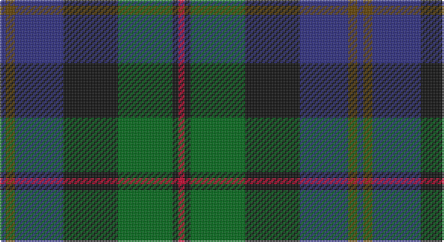

This page is one **sett** — a single exact thread-count. It belongs to the [tartan](/setts/db2dy3db16k18g18k2r2/)
(the same proportion at any scale), whose colour order is pattern [BGBKGKR](/stripes/bgbkgkr/).

Part of the [McEwan '1856', The](/tartans/mcewan-1856-the/) tartan — the named design grouping this sett with its other cloths.

Sourced from register-of-tartans.  It is a [7 stripe tartan](/stripes/stripes7/).

Original link https://www.tartanregister.gov.uk/tartanDetails.aspx?ref=2880

## Also known as

This cloth is also recorded under:

- McEwan "1856", The

2 attestations — the source records this cloth was collapsed from (oldest owns this page)

<ul>
<li>01/01/1995 — McEwan '1856', The (register-of-tartans, <a href="https://www.tartanregister.gov.uk/tartanDetails.aspx?ref=2880">record</a>)</li>
<li>1997 — McEwan '1856', The (Corporate) (tartans-authority, <a href="http://www.tartansauthority.com/tartan-ferret/display/2299/">record</a>)</li>
</ul>

## Register references

External register numbers recorded for this tartan.

- Scottish Register of Tartans: [2880](https://www.tartanregister.gov.uk/tartanDetails.aspx?ref=2880)
- Scottish Tartans Authority (ITI): 2299
- Scottish Tartans World Register: 2299

## Thread count
DB/4 T6 DB32 K36 G36 K4 R/4

One full sett is **236 threads**.

## Palette

Palette: <strong>Tartan Register</strong>
<table><thead><tr><th>Colour</th><th>Threads</th><th>Shade</th><th>Base</th><th>OKLCh</th></tr></thead><tbody><tr><td>DB/</td><td style="text-align:right;font-variant-numeric:tabular-nums">4</td><td><code style="background-color:#2C2C80;">#2C2C80</code> <small style="color:#888">#2C2C80</small></td><td>B <code style="background-color:#2A418A;">#2A418A</code></td><td><small style="color:#888">oklch(35.0% 0.138 276.6)</small></td></tr><tr><td>T</td><td style="text-align:right;font-variant-numeric:tabular-nums">6</td><td><code style="background-color:#604000;">#604000</code> <small style="color:#888">#604000</small></td><td>G <code style="background-color:#006100;">#006100</code></td><td><small style="color:#888">oklch(39.8% 0.083 76.8)</small></td></tr><tr><td>DB</td><td style="text-align:right;font-variant-numeric:tabular-nums">32</td><td><code style="background-color:#2C2C80;">#2C2C80</code> <small style="color:#888">#2C2C80</small></td><td>B <code style="background-color:#2A418A;">#2A418A</code></td><td><small style="color:#888">oklch(35.0% 0.138 276.6)</small></td></tr><tr><td>K</td><td style="text-align:right;font-variant-numeric:tabular-nums">36</td><td><code style="background-color:#101010;">#101010</code> <small style="color:#888">#101010</small></td><td>K <code style="background-color:#000000;">#000000</code></td><td><small style="color:#888">oklch(17.3% 0.000 89.9)</small></td></tr><tr><td>G</td><td style="text-align:right;font-variant-numeric:tabular-nums">36</td><td><code style="background-color:#006818;">#006818</code> <small style="color:#888">#006818</small></td><td>G <code style="background-color:#006100;">#006100</code></td><td><small style="color:#888">oklch(45.0% 0.142 145.0)</small></td></tr><tr><td>K</td><td style="text-align:right;font-variant-numeric:tabular-nums">4</td><td><code style="background-color:#101010;">#101010</code> <small style="color:#888">#101010</small></td><td>K <code style="background-color:#000000;">#000000</code></td><td><small style="color:#888">oklch(17.3% 0.000 89.9)</small></td></tr><tr><td>R/</td><td style="text-align:right;font-variant-numeric:tabular-nums">4</td><td><code style="background-color:#C8002C;">#C8002C</code> <small style="color:#888">#C8002C</small></td><td>R <code style="background-color:#CC0000;">#CC0000</code></td><td><small style="color:#888">oklch(52.6% 0.212 22.0)</small></td></tr></tbody></table>

# Sample pattern

## Nearest tartans

The nearest existing variants by ΔTartan distance, with this tartan at the top so the swatches line up against it.

ΔTartan

Tartan

Sett

—

<a href="/ttd/edit/#slug=db2dy3db16k18g18k2r2~x2">McEwan '1856', The</a> <a class="nn-out" href="/variants/s7/db2dy3db16k18g18k2r2~x2/" title="open its dictionary page">↗</a>

0.59

<a href="/ttd/edit/#slug=db24k4r3k4dg24k4ri4~x2&amp;base=db2dy3db16k18g18k2r2~x2">Skene</a> <a class="nn-out" href="/variants/s7/db24k4r3k4dg24k4ri4~x2/" title="open its dictionary page">↗</a>

0.62

<a href="/ttd/edit/#slug=g11t3g5r3g5k22db22k5~x2&amp;base=db2dy3db16k18g18k2r2~x2">Wood (Personal)</a> <a class="nn-out" href="/variants/s8/g11t3g5r3g5k22db22k5~x2/" title="open its dictionary page">↗</a>

0.68

<a href="/ttd/edit/#slug=db20k6o4db3k16g20w2~x2&amp;base=db2dy3db16k18g18k2r2~x2">Deloughery, Paul</a> <a class="nn-out" href="/variants/s7/db20k6o4db3k16g20w2~x2/" title="open its dictionary page">↗</a>

0.68

<a href="/ttd/edit/#slug=r4dg16k16db4dg3db12lo2~x2&amp;base=db2dy3db16k18g18k2r2~x2">Junior Chamber International (Corp)</a> <a class="nn-out" href="/variants/s7/r4dg16k16db4dg3db12lo2~x2/" title="open its dictionary page">↗</a>

0.73

<a href="/ttd/edit/#slug=dg17ly2k14r2db9r2db10~x2&amp;base=db2dy3db16k18g18k2r2~x2">MacDonald (Flora.. )</a> <a class="nn-out" href="/variants/s7/dg17ly2k14r2db9r2db10~x2/" title="open its dictionary page">↗</a>

0.73

<a href="/ttd/edit/#slug=r2k1db8k8g8k1t2~x2&amp;base=db2dy3db16k18g18k2r2~x2">Argyll</a> <a class="nn-out" href="/variants/s7/r2k1db8k8g8k1t2~x2/" title="open its dictionary page">↗</a>

0.73

<a href="/ttd/edit/#slug=r2k1db8k8g8k1t2~x4&amp;base=db2dy3db16k18g18k2r2~x2">Campbell of Cawdor</a> <a class="nn-out" href="/variants/s7/r2k1db8k8g8k1t2~x4/" title="open its dictionary page">↗</a>

0.75

<a href="/ttd/edit/#slug=g2k2g17k16r2db17ly2~x2&amp;base=db2dy3db16k18g18k2r2~x2">Greenock</a> <a class="nn-out" href="/variants/s7/g2k2g17k16r2db17ly2~x2/" title="open its dictionary page">↗</a>

0.76

<a href="/ttd/edit/#slug=db22r3db2r3db2k17g18lo4~x2&amp;base=db2dy3db16k18g18k2r2~x2">Scotch House 2000 Original</a> <a class="nn-out" href="/variants/s8/db22r3db2r3db2k17g18lo4~x2/" title="open its dictionary page">↗</a>

0.78

<a href="/ttd/edit/#slug=r2k1db8k8g8k1y2~x2&amp;base=db2dy3db16k18g18k2r2~x2">Campbell of Cawdor Clan Tartan</a> <a class="nn-out" href="/variants/s7/r2k1db8k8g8k1y2~x2/" title="open its dictionary page">↗</a>

## Neighbour map

Every grey dot is one of 14360 variants placed by the first two principal components of the ΔTartan feature space (44% of its variance). Red is this tartan; blue dots are its nearest — click one to open its page.

<svg viewBox="0 0 640 380" role="img" style="max-width:100%;height:auto;border:1px solid #e0e0e0;border-radius:4px;display:block" xmlns="http://www.w3.org/2000/svg"><image href="/nn/cloud.v1.png" width="640" height="380"/><a href="/variants/s7/db24k4r3k4dg24k4ri4~x2/"><circle cx="200.9" cy="208.7" r="4" fill="#3465a4"><title>Skene</title></circle></a><a href="/variants/s8/g11t3g5r3g5k22db22k5~x2/"><circle cx="172.5" cy="217.9" r="4" fill="#3465a4"><title>Wood (Personal)</title></circle></a><a href="/variants/s7/db20k6o4db3k16g20w2~x2/"><circle cx="167.3" cy="216.9" r="4" fill="#3465a4"><title>Deloughery, Paul</title></circle></a><a href="/variants/s7/r4dg16k16db4dg3db12lo2~x2/"><circle cx="161.7" cy="228.1" r="4" fill="#3465a4"><title>Junior Chamber International (Corp)</title></circle></a><a href="/variants/s7/dg17ly2k14r2db9r2db10~x2/"><circle cx="160.9" cy="221.6" r="4" fill="#3465a4"><title>MacDonald (Flora.. )</title></circle></a><a href="/variants/s7/r2k1db8k8g8k1t2~x2/"><circle cx="151.0" cy="217.9" r="4" fill="#3465a4"><title>Argyll</title></circle></a><a href="/variants/s7/r2k1db8k8g8k1t2~x4/"><circle cx="151.0" cy="217.9" r="4" fill="#3465a4"><title>Campbell of Cawdor</title></circle></a><a href="/variants/s7/g2k2g17k16r2db17ly2~x2/"><circle cx="166.9" cy="205.0" r="4" fill="#3465a4"><title>Greenock</title></circle></a><a href="/variants/s8/db22r3db2r3db2k17g18lo4~x2/"><circle cx="188.3" cy="190.2" r="4" fill="#3465a4"><title>Scotch House 2000 Original</title></circle></a><a href="/variants/s7/r2k1db8k8g8k1y2~x2/"><circle cx="149.5" cy="216.9" r="4" fill="#3465a4"><title>Campbell of Cawdor Clan Tartan</title></circle></a><circle cx="186.7" cy="215.4" r="5" fill="#c00000"/></svg>

ID: /variants/s7/db2dy3db16k18g18k2r2~x2/
