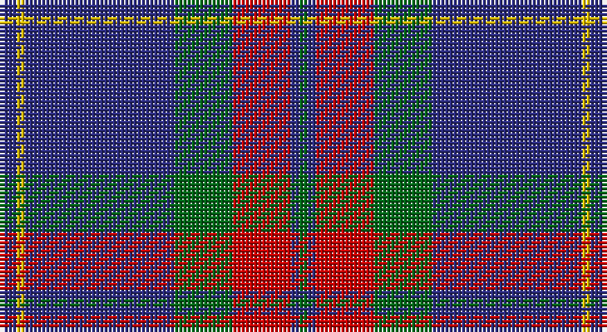

This page is one **sett** — a single exact thread-count. It belongs to the [tartan](/setts/db2ly1db18g7r7db1g1/)
(the same proportion at any scale), whose colour order is pattern [BYBGRBG](/stripes/bybgrbg/).

Part of the [Unnamed C20th](/tartans/unnamed-c20th/) tartan — the named design grouping this sett with its other cloths.

Sourced from tartans-authority.  It is a [7 stripe tartan](/stripes/stripes7/).

Original link http://www.tartansauthority.com/tartan-ferret/display/8745/

## Register references

External register numbers recorded for this tartan.

- Scottish Register of Tartans: [8745](https://www.tartanregister.gov.uk/tartanDetails?ref=8745)
- Scottish Tartans Authority (ITI): 8745

## Thread count
DB/4 Y2 DB36 G14 R14 DB2 G/2

One full sett is **142 threads**.

## Palette

Palette: <strong>Tartan Register</strong>
<table><thead><tr><th>Colour</th><th>Threads</th><th>Shade</th><th>Base</th><th>OKLCh</th></tr></thead><tbody><tr><td>DB/</td><td style="text-align:right;font-variant-numeric:tabular-nums">4</td><td><code style="background-color:#2C2C80;">#2C2C80</code> <small style="color:#888">#2C2C80</small></td><td>B <code style="background-color:#2A418A;">#2A418A</code></td><td><small style="color:#888">oklch(35.0% 0.138 276.6)</small></td></tr><tr><td>Y</td><td style="text-align:right;font-variant-numeric:tabular-nums">2</td><td><code style="background-color:#E8C000;">#E8C000</code> <small style="color:#888">#E8C000</small></td><td>Y <code style="background-color:#F2BF00;">#F2BF00</code></td><td><small style="color:#888">oklch(81.9% 0.168 93.7)</small></td></tr><tr><td>DB</td><td style="text-align:right;font-variant-numeric:tabular-nums">36</td><td><code style="background-color:#2C2C80;">#2C2C80</code> <small style="color:#888">#2C2C80</small></td><td>B <code style="background-color:#2A418A;">#2A418A</code></td><td><small style="color:#888">oklch(35.0% 0.138 276.6)</small></td></tr><tr><td>G</td><td style="text-align:right;font-variant-numeric:tabular-nums">14</td><td><code style="background-color:#006818;">#006818</code> <small style="color:#888">#006818</small></td><td>G <code style="background-color:#006100;">#006100</code></td><td><small style="color:#888">oklch(45.0% 0.142 145.0)</small></td></tr><tr><td>R</td><td style="text-align:right;font-variant-numeric:tabular-nums">14</td><td><code style="background-color:#C80000;">#C80000</code> <small style="color:#888">#C80000</small></td><td>R <code style="background-color:#CC0000;">#CC0000</code></td><td><small style="color:#888">oklch(52.3% 0.215 29.2)</small></td></tr><tr><td>DB</td><td style="text-align:right;font-variant-numeric:tabular-nums">2</td><td><code style="background-color:#2C2C80;">#2C2C80</code> <small style="color:#888">#2C2C80</small></td><td>B <code style="background-color:#2A418A;">#2A418A</code></td><td><small style="color:#888">oklch(35.0% 0.138 276.6)</small></td></tr><tr><td>G/</td><td style="text-align:right;font-variant-numeric:tabular-nums">2</td><td><code style="background-color:#006818;">#006818</code> <small style="color:#888">#006818</small></td><td>G <code style="background-color:#006100;">#006100</code></td><td><small style="color:#888">oklch(45.0% 0.142 145.0)</small></td></tr></tbody></table>

# Sample pattern

## Nearest tartans

The nearest existing variants by ΔTartan distance, with this tartan at the top so the swatches line up against it.

ΔTartan

Tartan

Sett

—

<a href="/ttd/edit/#slug=db2ly1db18g7r7db1g1~x2">Unnamed C20th - USA</a> <a class="nn-out" href="/variants/s7/db2ly1db18g7r7db1g1~x2/" title="open its dictionary page">↗</a>

0.76

<a href="/ttd/edit/#slug=w4y15db8k4db28k2db4w2&amp;base=db2ly1db18g7r7db1g1~x2">Kelvinside Academy (School)</a> <a class="nn-out" href="/variants/s8/w4y15db8k4db28k2db4w2/" title="open its dictionary page">↗</a>

0.89

<a href="/ttd/edit/#slug=n42db2n2db17lo8db4~x2&amp;base=db2ly1db18g7r7db1g1~x2">Connecticut State Police PB (Cor.)</a> <a class="nn-out" href="/variants/s6/n42db2n2db17lo8db4~x2/" title="open its dictionary page">↗</a>

0.92

<a href="/ttd/edit/#slug=w2db15r3g3r3db1~x8&amp;base=db2ly1db18g7r7db1g1~x2">Lothian Buses (Corporate?)</a> <a class="nn-out" href="/variants/s6/w2db15r3g3r3db1~x8/" title="open its dictionary page">↗</a>

0.93

<a href="/ttd/edit/#slug=db22ly2db1ly2db10r2g11r6~x2&amp;base=db2ly1db18g7r7db1g1~x2">Katsushika Scottish Country Dancers</a> <a class="nn-out" href="/variants/s8/db22ly2db1ly2db10r2g11r6~x2/" title="open its dictionary page">↗</a>

0.96

<a href="/ttd/edit/#slug=db30r2db2r4db9k26w2k4~x2&amp;base=db2ly1db18g7r7db1g1~x2">Murdoch Celebration (Personal)</a> <a class="nn-out" href="/variants/s8/db30r2db2r4db9k26w2k4~x2/" title="open its dictionary page">↗</a>

1.00

<a href="/ttd/edit/#slug=g23db3k8db4g4db56ly8&amp;base=db2ly1db18g7r7db1g1~x2">Tern House</a> <a class="nn-out" href="/variants/s7/g23db3k8db4g4db56ly8/" title="open its dictionary page">↗</a>

1.00

<a href="/ttd/edit/#slug=db22ly2db1ly2db10y2g11y6~x2&amp;base=db2ly1db18g7r7db1g1~x2">Katsushika (Corporate)</a> <a class="nn-out" href="/variants/s8/db22ly2db1ly2db10y2g11y6~x2/" title="open its dictionary page">↗</a>

1.02

<a href="/ttd/edit/#slug=o11dbi1o3db1dbi9r1~x4&amp;base=db2ly1db18g7r7db1g1~x2">Dege, of Saville Row</a> <a class="nn-out" href="/variants/s6/o11dbi1o3db1dbi9r1~x4/" title="open its dictionary page">↗</a>

1.03

<a href="/ttd/edit/#slug=k3t10lo5t29k10r6k2~x2&amp;base=db2ly1db18g7r7db1g1~x2">Perkins (2015)</a> <a class="nn-out" href="/variants/s7/k3t10lo5t29k10r6k2~x2/" title="open its dictionary page">↗</a>

1.07

<a href="/ttd/edit/#slug=dp6ly1dp20db6g19dp2~x4&amp;base=db2ly1db18g7r7db1g1~x2">Discover Islay (District)</a> <a class="nn-out" href="/variants/s6/dp6ly1dp20db6g19dp2~x4/" title="open its dictionary page">↗</a>

## Neighbour map

Every grey dot is one of 14360 variants placed by the first two principal components of the ΔTartan feature space (44% of its variance). Red is this tartan; blue dots are its nearest — click one to open its page.

<svg viewBox="0 0 640 380" role="img" style="max-width:100%;height:auto;border:1px solid #e0e0e0;border-radius:4px;display:block" xmlns="http://www.w3.org/2000/svg"><image href="/nn/cloud.v1.png" width="640" height="380"/><a href="/variants/s8/w4y15db8k4db28k2db4w2/"><circle cx="351.5" cy="187.3" r="4" fill="#3465a4"><title>Kelvinside Academy (School)</title></circle></a><a href="/variants/s6/n42db2n2db17lo8db4~x2/"><circle cx="380.8" cy="179.7" r="4" fill="#3465a4"><title>Connecticut State Police PB (Cor.)</title></circle></a><a href="/variants/s6/w2db15r3g3r3db1~x8/"><circle cx="341.2" cy="177.4" r="4" fill="#3465a4"><title>Lothian Buses (Corporate?)</title></circle></a><a href="/variants/s8/db22ly2db1ly2db10r2g11r6~x2/"><circle cx="346.2" cy="166.7" r="4" fill="#3465a4"><title>Katsushika Scottish Country Dancers</title></circle></a><a href="/variants/s8/db30r2db2r4db9k26w2k4~x2/"><circle cx="334.1" cy="183.0" r="4" fill="#3465a4"><title>Murdoch Celebration (Personal)</title></circle></a><a href="/variants/s7/g23db3k8db4g4db56ly8/"><circle cx="370.7" cy="175.4" r="4" fill="#3465a4"><title>Tern House</title></circle></a><a href="/variants/s8/db22ly2db1ly2db10y2g11y6~x2/"><circle cx="348.8" cy="173.7" r="4" fill="#3465a4"><title>Katsushika (Corporate)</title></circle></a><a href="/variants/s6/o11dbi1o3db1dbi9r1~x4/"><circle cx="328.7" cy="209.2" r="4" fill="#3465a4"><title>Dege, of Saville Row</title></circle></a><a href="/variants/s7/k3t10lo5t29k10r6k2~x2/"><circle cx="333.0" cy="183.2" r="4" fill="#3465a4"><title>Perkins (2015)</title></circle></a><a href="/variants/s6/dp6ly1dp20db6g19dp2~x4/"><circle cx="336.7" cy="196.1" r="4" fill="#3465a4"><title>Discover Islay (District)</title></circle></a><circle cx="349.9" cy="173.6" r="5" fill="#c00000"/></svg>

ID: /variants/s7/db2ly1db18g7r7db1g1~x2/
