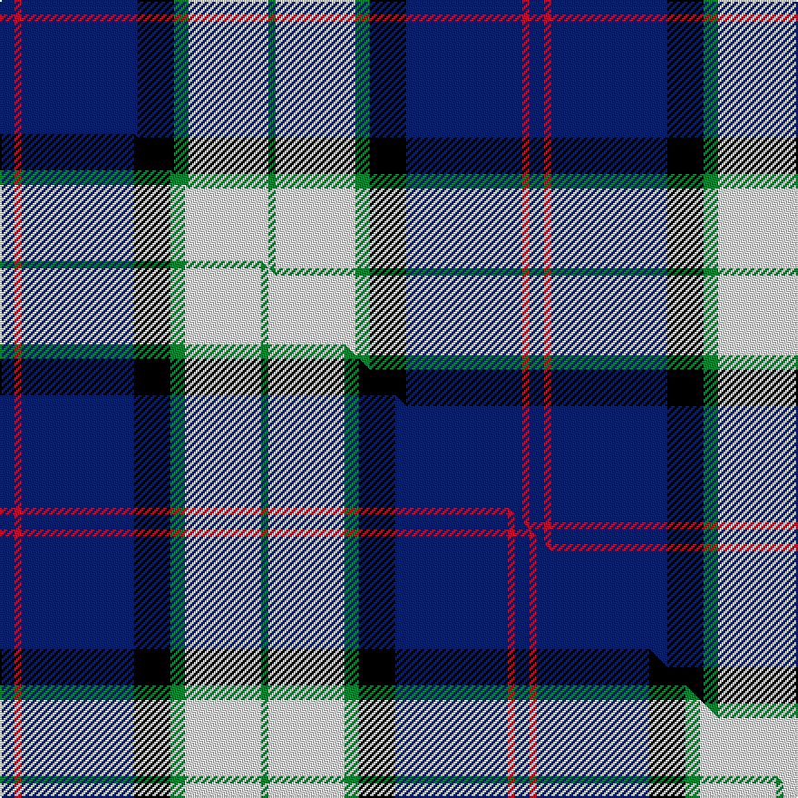

This is one **variant** — a specific cloth: this exact thread count and colourway, with its own
provenance below. It is one weaving of the [sett](/setts/db2r1db16k5g2w11g1/) (the scale-free proportion — the
same cloth at any scale or shade), whose colour order is pattern [BRBKGWG](/stripes/brbkgwg/).

Part of the [Sinclair Dress](/tartans/s/si/sinclair-dress-2/) tartan — the named design grouping this sett with its other cloths.

Sourced from weddslist.  It is a [7 stripe tartan](/stripes/stripes7/).

Original link [http://www.weddslist.com/cgi-bin/tartans/pg.pl?source=sts](http://www.weddslist.com/cgi-bin/tartans/pg.pl?source=sts)

Dataset <small>— provenance for this record, inherited from the source manifest</small>

<dl class="dataset-prov">
<dt>source</dt><dd><a href="/sources/weddslist/">Weddslist</a></dd>
<dt>data captured from</dt><dd><a href="https://github.com/thetartan/tartan-database/blob/master/data/weddslist/data.csv">https://github.com/thetartan/tartan-database/blob/master/data/weddslist/data.csv</a></dd>
<dt>data date</dt><dd>2016-11-17 <small>(dataset default)</small></dd>
<dt>licence</dt><dd><a href="https://creativecommons.org/licenses/by-nc-nd/4.0/">CC BY-NC-ND 4.0</a></dd>
</dl>

Capture chain <small>— the hands this data passed through, oldest first; each capture carries its own licence</small>

<ol class="capture-chain">
<li><a href="https://www.weddslist.com/tartans/">Weddslist</a> <small>the living privately compiled reference</small></li>
<li><a href="https://github.com/thetartan/tartan-database">thetartan/tartan-database</a> <small>2016-2017</small> · <a href="https://creativecommons.org/licenses/by-nc-nd/4.0/">CC BY-NC-ND 4.0</a> <small>Levko Kravets's frozen compilation — the capture we vendored, and where its CC licence text came from</small></li>
<li>this dictionary <small>captured 2026-06-10 · commit 5bf86c7566</small> <small>each re-capture is a git commit to data/sources</small></li>
</ol>

## Thread count
DB/8 R4 DB64 K20 G8 W44 G/4

One full sett is **292 threads**.

## Palette
<table><thead><tr><th>Colour</th><th>Shade</th><th>OKLCh</th></tr></thead><tbody><tr><td>DB</td><td><code style="background-color:#082077;">#082077</code> <small style="color:#888">#082077</small></td><td><small style="color:#888">oklch(30.0% 0.149 265.1)</small></td></tr><tr><td>G</td><td><code style="background-color:#008B2A;">#008B2A</code> <small style="color:#888">#008B2A</small></td><td><small style="color:#888">oklch(55.4% 0.170 145.9)</small></td></tr><tr><td>K</td><td><code style="background-color:#000000;">#000000</code> <small style="color:#888">#000000</small></td><td><small style="color:#888">oklch(0.0% 0.000 0.0)</small></td></tr><tr><td>W</td><td><code style="background-color:#F7F7F7;">#F7F7F7</code> <small style="color:#888">#F7F7F7</small></td><td><small style="color:#888">oklch(97.6% 0.000 89.9)</small></td></tr><tr><td>R</td><td><code style="background-color:#D60020;">#D60020</code> <small style="color:#888">#D60020</small></td><td><small style="color:#888">oklch(55.2% 0.224 25.5)</small></td></tr></tbody></table>

# Sample pattern

## Compared to the master

This cloth is one sett of its design; the master sett (the exemplar the design is anchored on) is below for comparison.

Its **ΔTartan distance** from the master is **0.05** — the same measure the nearest-tartans table ranks by (0 is identical; a re-scale of the same cloth is near 0, a recolour or a different proportion further).

<figure class="master-compare" style="margin:0">

this sett
master sett ★

<figcaption style="color:#888;font-size:smaller">One weave of this sett against the <a href="/setts/db4r2db31k10g4w21g2/">master sett ★</a>, split on the diagonal: a shared proportion runs seamlessly across it with only the shades shifting; a different proportion breaks on it.</figcaption>
</figure>

## Nearest tartan variants

The nearest existing variants by ΔTartan distance, with this cloth at the top so the swatches line up against it.

ΔTartan

Threads

Variant

Sett

—

292

<a href="/variants/s7/db2r1db16k5g2w11g1~x4/">Sinclair dress</a>

<a href="/ttd/edit/#slug=db4r2db31k10g4w21g2~x2&amp;base=db2r1db16k5g2w11g1~x4" title="compare in the TTD">0.05</a>

284

<a href="/variants/s7/db4r2db31k10g4w21g2~x2/">Sinclair Dress (Dance)</a>

<a href="/ttd/edit/#slug=db4r2db39k11g2w16r2~x2&amp;base=db2r1db16k5g2w11g1~x4" title="compare in the TTD">0.80</a>

292

<a href="/variants/s7/db4r2db39k11g2w16r2~x2/">Sinclair, The Jack</a>

<a href="/ttd/edit/#slug=db4r2db39k11g2w16r2~x2~r2109032&amp;base=db2r1db16k5g2w11g1~x4" title="compare in the TTD">0.80</a>

292

<a href="/variants/s7/db4r2db39k11g2w16r2~x2~r2109032/">Sinclair Dress Personal Tartan</a>

<a href="/ttd/edit/#slug=db4dr2db40k11g2w16dr2~x2&amp;base=db2r1db16k5g2w11g1~x4" title="compare in the TTD">0.83</a>

296

<a href="/variants/s7/db4dr2db40k11g2w16dr2~x2/">Jack Sinclair (Personal)</a>

<a href="/ttd/edit/#slug=r2db14k6g1w12g1w2~x4&amp;base=db2r1db16k5g2w11g1~x4" title="compare in the TTD">1.45</a>

288

<a href="/variants/s7/r2db14k6g1w12g1w2~x4/">Davidson (Wedding) (Personal)</a>

<a href="/ttd/edit/#slug=dbi42lb2w2lb2dbi5k12w32db4~x2~dbi1404245-db1106275&amp;base=db2r1db16k5g2w11g1~x4" title="compare in the TTD">1.79</a>

312

<a href="/variants/s8/dbi42lb2w2lb2dbi5k12w32db4~x2~dbi1404245-db1106275/">Comrie, Navy Blue (Dance)</a>

<a href="/ttd/edit/#slug=w1dp3g6k1db12ly1db2ly1~x4&amp;base=db2r1db16k5g2w11g1~x4" title="compare in the TTD">1.82</a>

208

<a href="/variants/s8/w1dp3g6k1db12ly1db2ly1~x4/">Lambert, Patrice (Personal)</a>

<a href="/ttd/edit/#slug=r4db24w2g13db2k3~x4&amp;base=db2r1db16k5g2w11g1~x4" title="compare in the TTD">1.85</a>

356

<a href="/variants/s6/r4db24w2g13db2k3~x4/">Vance (Family Association)</a>

<a href="/ttd/edit/#slug=db3lb24k11db20w2db5y3~x2&amp;base=db2r1db16k5g2w11g1~x4" title="compare in the TTD">2.31</a>

260

<a href="/variants/s7/db3lb24k11db20w2db5y3~x2/">Icelandair</a>

<a href="/ttd/edit/#slug=ly8k2db20lb4w1k2~x4&amp;base=db2r1db16k5g2w11g1~x4" title="compare in the TTD">2.47</a>

256

<a href="/variants/s6/ly8k2db20lb4w1k2~x4/">Solberg-Bell</a>

## Neighbour map

Every grey dot is one of 13621 variants placed by the first two principal components of the ΔTartan feature space (42% of its variance). Red is this tartan; blue dots are its nearest — click one to open its page.

<svg viewBox="0 0 640 380" role="img" style="max-width:100%;height:auto;border:1px solid #e0e0e0;border-radius:4px;display:block" xmlns="http://www.w3.org/2000/svg"><image href="/nn/cloud.v1.png" width="640" height="380"/><a href="/variants/s7/db4r2db31k10g4w21g2~x2/"><circle cx="166.3" cy="126.3" r="4" fill="#3465a4"><title>Sinclair Dress (Dance)</title></circle></a><a href="/variants/s7/db4r2db39k11g2w16r2~x2/"><circle cx="256.0" cy="118.8" r="4" fill="#3465a4"><title>Sinclair, The Jack</title></circle></a><a href="/variants/s7/db4r2db39k11g2w16r2~x2~r2109032/"><circle cx="256.1" cy="118.9" r="4" fill="#3465a4"><title>Sinclair Dress Personal Tartan</title></circle></a><a href="/variants/s7/db4dr2db40k11g2w16dr2~x2/"><circle cx="261.8" cy="117.8" r="4" fill="#3465a4"><title>Jack Sinclair (Personal)</title></circle></a><a href="/variants/s7/r2db14k6g1w12g1w2~x4/"><circle cx="137.8" cy="150.1" r="4" fill="#3465a4"><title>Davidson (Wedding) (Personal)</title></circle></a><a href="/variants/s8/dbi42lb2w2lb2dbi5k12w32db4~x2~dbi1404245-db1106275/"><circle cx="210.0" cy="117.0" r="4" fill="#3465a4"><title>Comrie, Navy Blue (Dance)</title></circle></a><a href="/variants/s8/w1dp3g6k1db12ly1db2ly1~x4/"><circle cx="212.0" cy="135.2" r="4" fill="#3465a4"><title>Lambert, Patrice (Personal)</title></circle></a><a href="/variants/s6/r4db24w2g13db2k3~x4/"><circle cx="247.3" cy="160.7" r="4" fill="#3465a4"><title>Vance (Family Association)</title></circle></a><a href="/variants/s7/db3lb24k11db20w2db5y3~x2/"><circle cx="162.9" cy="166.4" r="4" fill="#3465a4"><title>Icelandair</title></circle></a><a href="/variants/s6/ly8k2db20lb4w1k2~x4/"><circle cx="247.0" cy="134.8" r="4" fill="#3465a4"><title>Solberg-Bell</title></circle></a><circle cx="189.7" cy="139.2" r="5" fill="#c00000"/><text x="320" y="376" text-anchor="middle" font-size="11" fill="#999">ground</text><text x="11" y="190" text-anchor="middle" font-size="11" fill="#999" transform="rotate(-90 11 190)">complexity</text></svg>

ID: /variants/s7/db2r1db16k5g2w11g1~x4/
