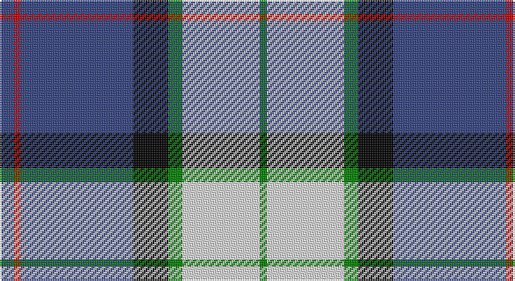

This page is one **sett** — a single exact thread-count. It belongs to the [tartan](/setts/db2r1db16k5g2w11g1/)
(the same proportion at any scale), whose colour order is pattern [BRBKGWG](/stripes/brbkgwg/).

Part of the [Sinclair Dress](/tartans/sinclair-dress/) tartan — the named design grouping this sett with its other cloths.

Sourced from weddslist.  It is a [7 stripe tartan](/stripes/stripes7/).

Original link http://www.weddslist.com/cgi-bin/tartans/pg.pl?source=sts

## Also known as

This cloth is also recorded under:

- Sinclair Dress Personal
- Sinclair dress
- Sinclair, The Jack

## Thread count
B/8 R4 B64 K20 G8 LN44 G/4

One full sett is **292 threads**.

## Palette

Palette: <strong>Tartan Register</strong> <small style="color:#888">(2 of 5 colours)</small>
<table><thead><tr><th>Colour</th><th>Threads</th><th>Shade</th><th>Base</th><th>OKLCh</th></tr></thead><tbody><tr><td>B/</td><td style="text-align:right;font-variant-numeric:tabular-nums">8</td><td><code style="background-color:#304080;">#304080</code> <small style="color:#888">#304080</small></td><td>B <code style="background-color:#2A418A;">#2A418A</code></td><td><small style="color:#888">oklch(39.4% 0.109 270.2)</small></td></tr><tr><td>R</td><td style="text-align:right;font-variant-numeric:tabular-nums">4</td><td><code style="background-color:#C00000;">#C00000</code> <small style="color:#888">#C00000</small></td><td>R <code style="background-color:#CC0000;">#CC0000</code></td><td><small style="color:#888">oklch(50.7% 0.208 29.2)</small></td></tr><tr><td>B</td><td style="text-align:right;font-variant-numeric:tabular-nums">64</td><td><code style="background-color:#304080;">#304080</code> <small style="color:#888">#304080</small></td><td>B <code style="background-color:#2A418A;">#2A418A</code></td><td><small style="color:#888">oklch(39.4% 0.109 270.2)</small></td></tr><tr><td>K</td><td style="text-align:right;font-variant-numeric:tabular-nums">20</td><td><code style="background-color:#000000;">#000000</code> <small style="color:#888">#000000</small></td><td>K <code style="background-color:#000000;">#000000</code></td><td><small style="color:#888">oklch(0.0% 0.000 0.0)</small></td></tr><tr><td>G</td><td style="text-align:right;font-variant-numeric:tabular-nums">8</td><td><code style="background-color:#008000;">#008000</code> <small style="color:#888">#008000</small></td><td>G <code style="background-color:#006100;">#006100</code></td><td><small style="color:#888">oklch(52.0% 0.177 142.5)</small></td></tr><tr><td>LN</td><td style="text-align:right;font-variant-numeric:tabular-nums">44</td><td><code style="background-color:#E0E0E0;">#E0E0E0</code> <small style="color:#888">#E0E0E0</small></td><td>W <code style="background-color:#F7F7F7;">#F7F7F7</code></td><td><small style="color:#888">oklch(90.7% 0.000 89.9)</small></td></tr><tr><td>G/</td><td style="text-align:right;font-variant-numeric:tabular-nums">4</td><td><code style="background-color:#008000;">#008000</code> <small style="color:#888">#008000</small></td><td>G <code style="background-color:#006100;">#006100</code></td><td><small style="color:#888">oklch(52.0% 0.177 142.5)</small></td></tr></tbody></table>

# Sample pattern

## Compared to the master

This cloth is one sett of its design; the master sett (the exemplar the design is anchored on) is below for comparison.

<figure style="margin:0"><figcaption style="color:#888;font-size:smaller">this sett</figcaption></figure>
<figure style="margin:0"><figcaption style="color:#888;font-size:smaller"><a href="/setts/db4r2db31k10g4w21g2/">master sett →</a></figcaption></figure>

## Nearest tartans

The nearest existing variants by ΔTartan distance, with this tartan at the top so the swatches line up against it.

ΔTartan

Tartan

Sett

—

<a href="/ttd/edit/#slug=db2r1db16k5g2w11g1~x4">Sinclair dress</a> <a class="nn-out" href="/variants/s7/db2r1db16k5g2w11g1~x4/" title="open its dictionary page">↗</a>

0.56

<a href="/ttd/edit/#slug=db4r2db31k10g4w21g2~x2&amp;base=db2r1db16k5g2w11g1~x4">Sinclair Dress (Dance)</a> <a class="nn-out" href="/variants/s7/db4r2db31k10g4w21g2~x2/" title="open its dictionary page">↗</a>

0.73

<a href="/ttd/edit/#slug=dt42t2w2t2dt5k12w32db4~x2&amp;base=db2r1db16k5g2w11g1~x4">Comrie, Navy Blue (Dance)</a> <a class="nn-out" href="/variants/s8/dt42t2w2t2dt5k12w32db4~x2/" title="open its dictionary page">↗</a>

0.84

<a href="/ttd/edit/#slug=w12db48k13o22k3ly6&amp;base=db2r1db16k5g2w11g1~x4">Clunie (Personal)</a> <a class="nn-out" href="/variants/s6/w12db48k13o22k3ly6/" title="open its dictionary page">↗</a>

1.02

<a href="/ttd/edit/#slug=r1b10k2w4k4ly1~x6&amp;base=db2r1db16k5g2w11g1~x4">Thomson Dress (Blue)</a> <a class="nn-out" href="/variants/s6/r1b10k2w4k4ly1~x6/" title="open its dictionary page">↗</a>

1.05

<a href="/ttd/edit/#slug=db68k42w32r5w32dg4w6&amp;base=db2r1db16k5g2w11g1~x4">Ferguson Dress #2</a> <a class="nn-out" href="/variants/s7/db68k42w32r5w32dg4w6/" title="open its dictionary page">↗</a>

1.05

<a href="/ttd/edit/#slug=r15t98db72ly25db8w15&amp;base=db2r1db16k5g2w11g1~x4">Afternoon Tea / Earl Grey</a> <a class="nn-out" href="/variants/s6/r15t98db72ly25db8w15/" title="open its dictionary page">↗</a>

1.06

<a href="/ttd/edit/#slug=g2db14lg6lr1g1lr6r1~x4&amp;base=db2r1db16k5g2w11g1~x4">Loch Ness in Scotland</a> <a class="nn-out" href="/variants/s7/g2db14lg6lr1g1lr6r1~x4/" title="open its dictionary page">↗</a>

1.11

<a href="/ttd/edit/#slug=ly8k2dt20t4w1k2~x4&amp;base=db2r1db16k5g2w11g1~x4">Solberg-Bell</a> <a class="nn-out" href="/variants/s6/ly8k2dt20t4w1k2~x4/" title="open its dictionary page">↗</a>

1.13

<a href="/variants/s9/r3k1lb12k2db2k2ki14lb2ki2~x2/">NEWYORKER</a>

1.15

<a href="/ttd/edit/#slug=db6ly2db22g7r2w11g11db3~x2&amp;base=db2r1db16k5g2w11g1~x4">Bahamas District Tartan</a> <a class="nn-out" href="/variants/s8/db6ly2db22g7r2w11g11db3~x2/" title="open its dictionary page">↗</a>

## Neighbour map

Every grey dot is one of 14360 variants placed by the first two principal components of the ΔTartan feature space (44% of its variance). Red is this tartan; blue dots are its nearest — click one to open its page.

<svg viewBox="0 0 640 380" role="img" style="max-width:100%;height:auto;border:1px solid #e0e0e0;border-radius:4px;display:block" xmlns="http://www.w3.org/2000/svg"><image href="/nn/cloud.v1.png" width="640" height="380"/><a href="/variants/s7/db4r2db31k10g4w21g2~x2/"><circle cx="213.2" cy="144.0" r="4" fill="#3465a4"><title>Sinclair Dress (Dance)</title></circle></a><a href="/variants/s8/dt42t2w2t2dt5k12w32db4~x2/"><circle cx="229.9" cy="116.0" r="4" fill="#3465a4"><title>Comrie, Navy Blue (Dance)</title></circle></a><a href="/variants/s6/w12db48k13o22k3ly6/"><circle cx="197.0" cy="161.4" r="4" fill="#3465a4"><title>Clunie (Personal)</title></circle></a><a href="/variants/s6/r1b10k2w4k4ly1~x6/"><circle cx="179.4" cy="179.2" r="4" fill="#3465a4"><title>Thomson Dress (Blue)</title></circle></a><a href="/variants/s7/db68k42w32r5w32dg4w6/"><circle cx="159.6" cy="149.0" r="4" fill="#3465a4"><title>Ferguson Dress #2</title></circle></a><a href="/variants/s6/r15t98db72ly25db8w15/"><circle cx="185.4" cy="169.2" r="4" fill="#3465a4"><title>Afternoon Tea / Earl Grey</title></circle></a><a href="/variants/s7/g2db14lg6lr1g1lr6r1~x4/"><circle cx="199.8" cy="157.5" r="4" fill="#3465a4"><title>Loch Ness in Scotland</title></circle></a><a href="/variants/s6/ly8k2dt20t4w1k2~x4/"><circle cx="266.2" cy="141.7" r="4" fill="#3465a4"><title>Solberg-Bell</title></circle></a><a href="/variants/s9/r3k1lb12k2db2k2ki14lb2ki2~x2/"><circle cx="170.0" cy="130.2" r="4" fill="#3465a4"><title>NEWYORKER</title></circle></a><a href="/variants/s8/db6ly2db22g7r2w11g11db3~x2/"><circle cx="200.4" cy="175.3" r="4" fill="#3465a4"><title>Bahamas District Tartan</title></circle></a><circle cx="209.3" cy="140.1" r="5" fill="#c00000"/></svg>

ID: /variants/s7/db2r1db16k5g2w11g1~x4/
