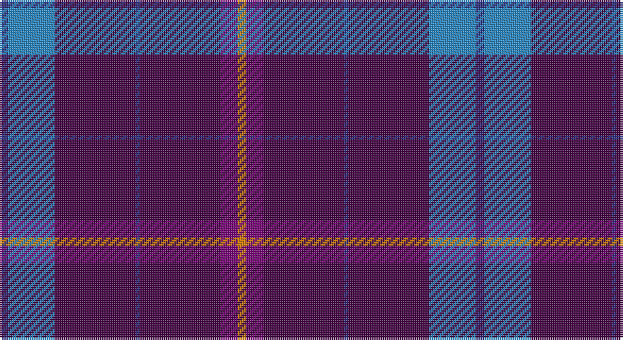

This page is one **sett** — a single exact thread-count. It belongs to the [tartan](/setts/db2t11dp19db1dp19dpi4lo2/)
(the same proportion at any scale), whose colour order is pattern [BBBBBBY](/stripes/bbbbbby/).

Part of the [Brigid Mhairi](/tartans/brigid-mhairi/) tartan — the named design grouping this sett with its other cloths.

Sourced from tartans-authority.  It is a [7 stripe tartan](/stripes/stripes7/).

Original link http://www.tartansauthority.com/tartan-ferret/display/10401/

## Register references

External register numbers recorded for this tartan.

- Scottish Register of Tartans: [10401](https://www.tartanregister.gov.uk/tartanDetails?ref=10401)
- Scottish Tartans Authority (ITI): 10401

## Thread count
DB/4 B22 DP38 DB2 DP38 P8 O/4

One full sett is **224 threads**.

## Palette

Palette: <strong>Tartan Register</strong>
<table><thead><tr><th>Colour</th><th>Threads</th><th>Shade</th><th>Base</th><th>OKLCh</th></tr></thead><tbody><tr><td>DB/</td><td style="text-align:right;font-variant-numeric:tabular-nums">4</td><td><code style="background-color:#2C2C80;">#2C2C80</code> <small style="color:#888">#2C2C80</small></td><td>B <code style="background-color:#2A418A;">#2A418A</code></td><td><small style="color:#888">oklch(35.0% 0.138 276.6)</small></td></tr><tr><td>B</td><td style="text-align:right;font-variant-numeric:tabular-nums">22</td><td><code style="background-color:#2888C4;">#2888C4</code> <small style="color:#888">#2888C4</small></td><td>B <code style="background-color:#2A418A;">#2A418A</code></td><td><small style="color:#888">oklch(60.1% 0.125 241.5)</small></td></tr><tr><td>DP</td><td style="text-align:right;font-variant-numeric:tabular-nums">38</td><td><code style="background-color:#440044;">#440044</code> <small style="color:#888">#440044</small></td><td>B <code style="background-color:#2A418A;">#2A418A</code></td><td><small style="color:#888">oklch(27.1% 0.125 328.4)</small></td></tr><tr><td>DB</td><td style="text-align:right;font-variant-numeric:tabular-nums">2</td><td><code style="background-color:#2C2C80;">#2C2C80</code> <small style="color:#888">#2C2C80</small></td><td>B <code style="background-color:#2A418A;">#2A418A</code></td><td><small style="color:#888">oklch(35.0% 0.138 276.6)</small></td></tr><tr><td>DP</td><td style="text-align:right;font-variant-numeric:tabular-nums">38</td><td><code style="background-color:#440044;">#440044</code> <small style="color:#888">#440044</small></td><td>B <code style="background-color:#2A418A;">#2A418A</code></td><td><small style="color:#888">oklch(27.1% 0.125 328.4)</small></td></tr><tr><td>P</td><td style="text-align:right;font-variant-numeric:tabular-nums">8</td><td><code style="background-color:#780078;">#780078</code> <small style="color:#888">#780078</small></td><td>B <code style="background-color:#2A418A;">#2A418A</code></td><td><small style="color:#888">oklch(40.2% 0.185 328.4)</small></td></tr><tr><td>O/</td><td style="text-align:right;font-variant-numeric:tabular-nums">4</td><td><code style="background-color:#D87C00;">#D87C00</code> <small style="color:#888">#D87C00</small></td><td>Y <code style="background-color:#F2BF00;">#F2BF00</code></td><td><small style="color:#888">oklch(67.3% 0.155 61.8)</small></td></tr></tbody></table>

# Sample pattern

## Compared to the master

This cloth is one sett of its design; the master sett (the exemplar the design is anchored on) is below for comparison.

<figure style="margin:0"><figcaption style="color:#888;font-size:smaller">this sett</figcaption></figure>
<figure style="margin:0"><figcaption style="color:#888;font-size:smaller"><a href="/setts/db2dg4n11dp19db1dp19dpi4o2/">master sett →</a></figcaption></figure>

## Nearest tartans

The nearest existing variants by ΔTartan distance, with this tartan at the top so the swatches line up against it.

ΔTartan

Tartan

Sett

—

<a href="/ttd/edit/#slug=db2t11dp19db1dp19dpi4lo2~x2">Brigid Mhairi (Personal)</a> <a class="nn-out" href="/variants/s7/db2t11dp19db1dp19dpi4lo2~x2/" title="open its dictionary page">↗</a>

1.22

<a href="/ttd/edit/#slug=db40w7db60k10r25ly4&amp;base=db2t11dp19db1dp19dpi4lo2~x2">Stradling (Name)</a> <a class="nn-out" href="/variants/s6/db40w7db60k10r25ly4/" title="open its dictionary page">↗</a>

1.32

<a href="/ttd/edit/#slug=dp20t8g8db8dp33r3~x2&amp;base=db2t11dp19db1dp19dpi4lo2~x2">McIntosh, Stuart (Personal)</a> <a class="nn-out" href="/variants/s6/dp20t8g8db8dp33r3~x2/" title="open its dictionary page">↗</a>

1.50

<a href="/ttd/edit/#slug=r10db4r6db30k10db5w2~x2&amp;base=db2t11dp19db1dp19dpi4lo2~x2">Heritage of Wales (Fashion)</a> <a class="nn-out" href="/variants/s7/r10db4r6db30k10db5w2~x2/" title="open its dictionary page">↗</a>

1.57

<a href="/ttd/edit/#slug=ri28r1db18ly2g1db18~x2&amp;base=db2t11dp19db1dp19dpi4lo2~x2">European Judo Union</a> <a class="nn-out" href="/variants/s6/ri28r1db18ly2g1db18~x2/" title="open its dictionary page">↗</a>

1.62

<a href="/ttd/edit/#slug=dp10ly3dp8db42g5o5~x2&amp;base=db2t11dp19db1dp19dpi4lo2~x2">Cheadle (Personal)</a> <a class="nn-out" href="/variants/s6/dp10ly3dp8db42g5o5~x2/" title="open its dictionary page">↗</a>

1.67

<a href="/ttd/edit/#slug=o9k16dg10k22dp67ly4&amp;base=db2t11dp19db1dp19dpi4lo2~x2">Widows Sons Scotland (MRA)</a> <a class="nn-out" href="/variants/s6/o9k16dg10k22dp67ly4/" title="open its dictionary page">↗</a>

1.71

<a href="/ttd/edit/#slug=r14lr6db38k3g2~x2&amp;base=db2t11dp19db1dp19dpi4lo2~x2">Doten (2013)</a> <a class="nn-out" href="/variants/s5/r14lr6db38k3g2~x2/" title="open its dictionary page">↗</a>

1.74

<a href="/ttd/edit/#slug=g20lr6db20ly3db48r6db4r6~x2&amp;base=db2t11dp19db1dp19dpi4lo2~x2">Warren Wilson College (Corporate)</a> <a class="nn-out" href="/variants/s8/g20lr6db20ly3db48r6db4r6~x2/" title="open its dictionary page">↗</a>

1.77

<a href="/ttd/edit/#slug=db18r9db2r3k1o1~x4&amp;base=db2t11dp19db1dp19dpi4lo2~x2">MacGregor, Modern</a> <a class="nn-out" href="/variants/s6/db18r9db2r3k1o1~x4/" title="open its dictionary page">↗</a>

1.78

<a href="/ttd/edit/#slug=db28r15db27r2db27r3db26n20w3n2w2n4~x2&amp;base=db2t11dp19db1dp19dpi4lo2~x2">Eidart</a> <a class="nn-out" href="/variants/s12/db28r15db27r2db27r3db26n20w3n2w2n4~x2/" title="open its dictionary page">↗</a>

## Neighbour map

Every grey dot is one of 14360 variants placed by the first two principal components of the ΔTartan feature space (44% of its variance). Red is this tartan; blue dots are its nearest — click one to open its page.

<svg viewBox="0 0 640 380" role="img" style="max-width:100%;height:auto;border:1px solid #e0e0e0;border-radius:4px;display:block" xmlns="http://www.w3.org/2000/svg"><image href="/nn/cloud.v1.png" width="640" height="380"/><a href="/variants/s6/db40w7db60k10r25ly4/"><circle cx="385.1" cy="194.4" r="4" fill="#3465a4"><title>Stradling (Name)</title></circle></a><a href="/variants/s6/dp20t8g8db8dp33r3~x2/"><circle cx="386.5" cy="216.4" r="4" fill="#3465a4"><title>McIntosh, Stuart (Personal)</title></circle></a><a href="/variants/s7/r10db4r6db30k10db5w2~x2/"><circle cx="339.5" cy="188.0" r="4" fill="#3465a4"><title>Heritage of Wales (Fashion)</title></circle></a><a href="/variants/s6/ri28r1db18ly2g1db18~x2/"><circle cx="364.3" cy="160.9" r="4" fill="#3465a4"><title>European Judo Union</title></circle></a><a href="/variants/s6/dp10ly3dp8db42g5o5~x2/"><circle cx="356.2" cy="186.5" r="4" fill="#3465a4"><title>Cheadle (Personal)</title></circle></a><a href="/variants/s6/o9k16dg10k22dp67ly4/"><circle cx="308.9" cy="169.4" r="4" fill="#3465a4"><title>Widows Sons Scotland (MRA)</title></circle></a><a href="/variants/s5/r14lr6db38k3g2~x2/"><circle cx="347.5" cy="163.9" r="4" fill="#3465a4"><title>Doten (2013)</title></circle></a><a href="/variants/s8/g20lr6db20ly3db48r6db4r6~x2/"><circle cx="350.6" cy="165.9" r="4" fill="#3465a4"><title>Warren Wilson College (Corporate)</title></circle></a><a href="/variants/s6/db18r9db2r3k1o1~x4/"><circle cx="389.7" cy="176.1" r="4" fill="#3465a4"><title>MacGregor, Modern</title></circle></a><a href="/variants/s12/db28r15db27r2db27r3db26n20w3n2w2n4~x2/"><circle cx="399.5" cy="189.5" r="4" fill="#3465a4"><title>Eidart</title></circle></a><circle cx="397.3" cy="178.3" r="5" fill="#c00000"/></svg>

ID: /variants/s7/db2t11dp19db1dp19dpi4lo2~x2/
