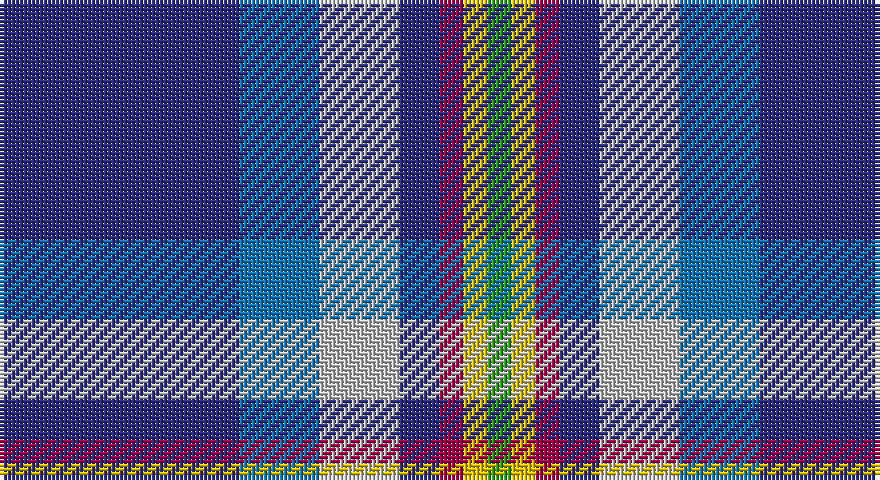

This page is one **sett** — a single exact thread-count. It belongs to the [tartan](/setts/db30b10lb10db5m3ly3g3/)
(the same proportion at any scale), whose colour order is pattern [BBWBRYG](/stripes/bbwbryg/).

Sourced from tartans-authority.  It is a [7 stripe tartan](/stripes/stripes7/).

Original link http://www.tartansauthority.com/tartan-ferret/display/10374/

## Register references

External register numbers recorded for this tartan.

- Scottish Register of Tartans: [10374](https://www.tartanregister.gov.uk/tartanDetails?ref=10374)
- Scottish Tartans Authority (ITI): 10374

## Thread count
DB/60 B20 N20 DB10 R6 Y6 G/6

One full sett is **190 threads**.

## Palette

Palette: <strong>Tartan Register</strong>
<table><thead><tr><th>Colour</th><th>Threads</th><th>Shade</th><th>Base</th><th>OKLCh</th></tr></thead><tbody><tr><td>DB/</td><td style="text-align:right;font-variant-numeric:tabular-nums">60</td><td><code style="background-color:#2C2C80;">#2C2C80</code> <small style="color:#888">#2C2C80</small></td><td>B <code style="background-color:#2A418A;">#2A418A</code></td><td><small style="color:#888">oklch(35.0% 0.138 276.6)</small></td></tr><tr><td>B</td><td style="text-align:right;font-variant-numeric:tabular-nums">20</td><td><code style="background-color:#1474B4;">#1474B4</code> <small style="color:#888">#1474B4</small></td><td>B <code style="background-color:#2A418A;">#2A418A</code></td><td><small style="color:#888">oklch(54.0% 0.129 245.1)</small></td></tr><tr><td>N</td><td style="text-align:right;font-variant-numeric:tabular-nums">20</td><td><code style="background-color:#C0C0C0;">#C0C0C0</code> <small style="color:#888">#C0C0C0</small></td><td>W <code style="background-color:#F7F7F7;">#F7F7F7</code></td><td><small style="color:#888">oklch(80.8% 0.000 89.9)</small></td></tr><tr><td>DB</td><td style="text-align:right;font-variant-numeric:tabular-nums">10</td><td><code style="background-color:#2C2C80;">#2C2C80</code> <small style="color:#888">#2C2C80</small></td><td>B <code style="background-color:#2A418A;">#2A418A</code></td><td><small style="color:#888">oklch(35.0% 0.138 276.6)</small></td></tr><tr><td>R</td><td style="text-align:right;font-variant-numeric:tabular-nums">6</td><td><code style="background-color:#A00048;">#A00048</code> <small style="color:#888">#A00048</small></td><td>R <code style="background-color:#CC0000;">#CC0000</code></td><td><small style="color:#888">oklch(45.4% 0.182 5.3)</small></td></tr><tr><td>Y</td><td style="text-align:right;font-variant-numeric:tabular-nums">6</td><td><code style="background-color:#E8C000;">#E8C000</code> <small style="color:#888">#E8C000</small></td><td>Y <code style="background-color:#F2BF00;">#F2BF00</code></td><td><small style="color:#888">oklch(81.9% 0.168 93.7)</small></td></tr><tr><td>G/</td><td style="text-align:right;font-variant-numeric:tabular-nums">6</td><td><code style="background-color:#289C18;">#289C18</code> <small style="color:#888">#289C18</small></td><td>G <code style="background-color:#006100;">#006100</code></td><td><small style="color:#888">oklch(60.6% 0.191 141.6)</small></td></tr></tbody></table>

# Sample pattern

## Nearest tartans

The nearest existing variants by ΔTartan distance, with this tartan at the top so the swatches line up against it.

ΔTartan

Tartan

Sett

—

<a href="/ttd/edit/#slug=db30b10lb10db5m3ly3g3~x2">Wrigglesworth (Name)</a> <a class="nn-out" href="/variants/s7/db30b10lb10db5m3ly3g3~x2/" title="open its dictionary page">↗</a>

1.05

<a href="/ttd/edit/#slug=w1db15r1o10g2lp1~x4&amp;base=db30b10lb10db5m3ly3g3~x2">Peterson, Oren (Name)</a> <a class="nn-out" href="/variants/s6/w1db15r1o10g2lp1~x4/" title="open its dictionary page">↗</a>

1.06

<a href="/ttd/edit/#slug=t12db6t50dbi39p12dp6p6w4&amp;base=db30b10lb10db5m3ly3g3~x2">Pride of the Nation (Fashion)</a> <a class="nn-out" href="/variants/s8/t12db6t50dbi39p12dp6p6w4/" title="open its dictionary page">↗</a>

1.06

<a href="/ttd/edit/#slug=m1g2t10r1db15w1~x4&amp;base=db30b10lb10db5m3ly3g3~x2">Oren Peterson</a> <a class="nn-out" href="/variants/s6/m1g2t10r1db15w1~x4/" title="open its dictionary page">↗</a>

1.07

<a href="/ttd/edit/#slug=b49lb11lo7k16lbi5b20lb10k6t5~x2&amp;base=db30b10lb10db5m3ly3g3~x2">State Seal of Louisiana (Fashion)</a> <a class="nn-out" href="/variants/s9/b49lb11lo7k16lbi5b20lb10k6t5~x2/" title="open its dictionary page">↗</a>

1.07

<a href="/ttd/edit/#slug=w1dp3g6k1db12ly1db2ly1~x4&amp;base=db30b10lb10db5m3ly3g3~x2">Lambert, Patrice (Personal)</a> <a class="nn-out" href="/variants/s8/w1dp3g6k1db12ly1db2ly1~x4/" title="open its dictionary page">↗</a>

1.09

<a href="/ttd/edit/#slug=k4n4dt32r4t17w2~x2&amp;base=db30b10lb10db5m3ly3g3~x2">Shearer (2016)</a> <a class="nn-out" href="/variants/s6/k4n4dt32r4t17w2~x2/" title="open its dictionary page">↗</a>

1.16

<a href="/ttd/edit/#slug=t5ly5db12g1db1r1db1w2~x4&amp;base=db30b10lb10db5m3ly3g3~x2">Hodgkinson</a> <a class="nn-out" href="/variants/s8/t5ly5db12g1db1r1db1w2~x4/" title="open its dictionary page">↗</a>

1.16

<a href="/ttd/edit/#slug=t3k2g2k1db10w1~x8&amp;base=db30b10lb10db5m3ly3g3~x2">Isle of Harris (District)</a> <a class="nn-out" href="/variants/s6/t3k2g2k1db10w1~x8/" title="open its dictionary page">↗</a>

1.17

<a href="/ttd/edit/#slug=b12dt35lb4w3k11r5~x2&amp;base=db30b10lb10db5m3ly3g3~x2">Ferster, James Carney (Personal)</a> <a class="nn-out" href="/variants/s6/b12dt35lb4w3k11r5~x2/" title="open its dictionary page">↗</a>

1.17

<a href="/ttd/edit/#slug=ly4db24t5g2db3k5t33r2~x2&amp;base=db30b10lb10db5m3ly3g3~x2">Los Angeles</a> <a class="nn-out" href="/variants/s8/ly4db24t5g2db3k5t33r2~x2/" title="open its dictionary page">↗</a>

## Neighbour map

Every grey dot is one of 14360 variants placed by the first two principal components of the ΔTartan feature space (44% of its variance). Red is this tartan; blue dots are its nearest — click one to open its page.

<svg viewBox="0 0 640 380" role="img" style="max-width:100%;height:auto;border:1px solid #e0e0e0;border-radius:4px;display:block" xmlns="http://www.w3.org/2000/svg"><image href="/nn/cloud.v1.png" width="640" height="380"/><a href="/variants/s6/w1db15r1o10g2lp1~x4/"><circle cx="269.5" cy="150.4" r="4" fill="#3465a4"><title>Peterson, Oren (Name)</title></circle></a><a href="/variants/s8/t12db6t50dbi39p12dp6p6w4/"><circle cx="217.0" cy="153.8" r="4" fill="#3465a4"><title>Pride of the Nation (Fashion)</title></circle></a><a href="/variants/s6/m1g2t10r1db15w1~x4/"><circle cx="245.7" cy="144.8" r="4" fill="#3465a4"><title>Oren Peterson</title></circle></a><a href="/variants/s9/b49lb11lo7k16lbi5b20lb10k6t5~x2/"><circle cx="213.2" cy="153.7" r="4" fill="#3465a4"><title>State Seal of Louisiana (Fashion)</title></circle></a><a href="/variants/s8/w1dp3g6k1db12ly1db2ly1~x4/"><circle cx="235.0" cy="145.6" r="4" fill="#3465a4"><title>Lambert, Patrice (Personal)</title></circle></a><a href="/variants/s6/k4n4dt32r4t17w2~x2/"><circle cx="249.0" cy="151.0" r="4" fill="#3465a4"><title>Shearer (2016)</title></circle></a><a href="/variants/s8/t5ly5db12g1db1r1db1w2~x4/"><circle cx="202.5" cy="132.5" r="4" fill="#3465a4"><title>Hodgkinson</title></circle></a><a href="/variants/s6/t3k2g2k1db10w1~x8/"><circle cx="243.1" cy="185.7" r="4" fill="#3465a4"><title>Isle of Harris (District)</title></circle></a><a href="/variants/s6/b12dt35lb4w3k11r5~x2/"><circle cx="220.1" cy="173.4" r="4" fill="#3465a4"><title>Ferster, James Carney (Personal)</title></circle></a><a href="/variants/s8/ly4db24t5g2db3k5t33r2~x2/"><circle cx="250.6" cy="128.9" r="4" fill="#3465a4"><title>Los Angeles</title></circle></a><circle cx="238.1" cy="160.4" r="5" fill="#c00000"/></svg>

ID: /variants/s7/db30b10lb10db5m3ly3g3~x2/
