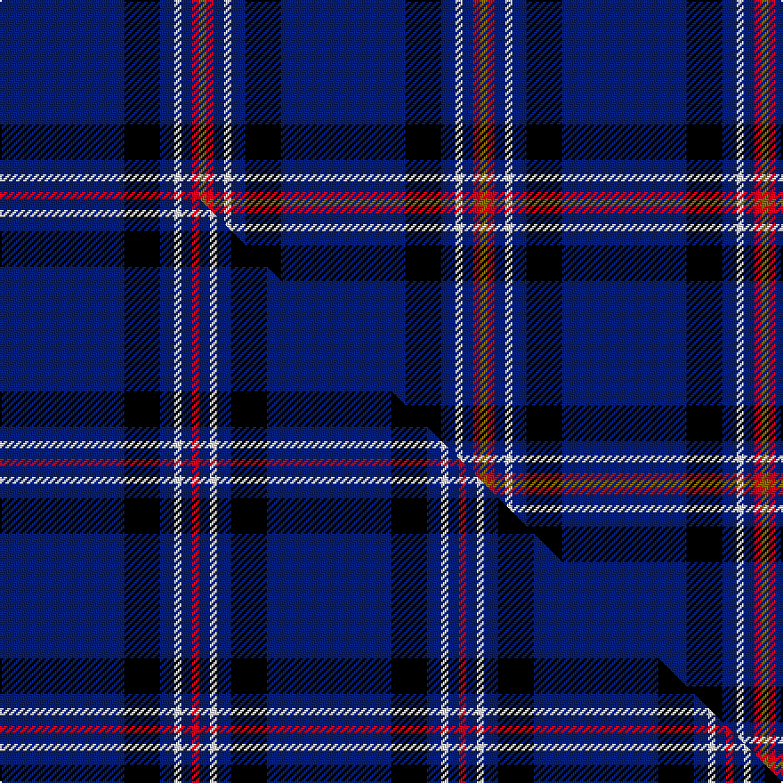

This is one **variant** — a specific cloth: this exact thread count and colourway, with its own
provenance below. It is one weaving of the [sett](/tartans/l/la/laidlaw-s-highland-drovers/) (the scale-free proportion — the
same cloth at any scale or shade), whose colour order is pattern [BKBWBRG](/stripes/bkbwbrg/).

Part of the [Laidlaw's Highland Drovers](/tartans/l/la/laidlaw-s-highland-drovers/) tartan — the named design grouping this sett with its other cloths.

Sourced from tartans-authority.  It is a [7 stripe tartan](/stripes/stripes7/).

Original link <code>http://www.tartansauthority.com/tartan-ferret/display/2127/</code> — retired · [Internet Archive copy](https://web.archive.org/web/*/http://www.tartansauthority.com/tartan-ferret/display/2127/*)

Dataset <small>— provenance for this record, inherited from the source manifest</small>

<dl class="dataset-prov">
<dt>source</dt><dd><a href="/sources/tartans-authority/">Scottish Tartans Authority</a></dd>
<dt>data captured from</dt><dd><a href="https://github.com/thetartan/tartan-database/blob/master/data/tartans-authority/data.csv">https://github.com/thetartan/tartan-database/blob/master/data/tartans-authority/data.csv</a></dd>
<dt>data date</dt><dd>pre 2009 <small>(this record)</small></dd>
<dt>licence</dt><dd><a href="https://creativecommons.org/licenses/by-nc-nd/4.0/">CC BY-NC-ND 4.0</a></dd>
</dl>

Capture chain <small>— the hands this data passed through, oldest first; each capture carries its own licence</small>

<ol class="capture-chain">
<li><a href="https://www.tartansauthority.com/">Scottish Tartans Authority</a> <small>the heritage body’s archive — its tartan-ferret record browser is retired; dead record links are shown unlinked, with an Internet Archive copy (ITI numbers are not SRT references)</small></li>
<li><a href="https://github.com/thetartan/tartan-database">thetartan/tartan-database</a> <small>2016-2017</small> · <a href="https://creativecommons.org/licenses/by-nc-nd/4.0/">CC BY-NC-ND 4.0</a> <small>Levko Kravets's frozen compilation — the capture we vendored, and where its CC licence text came from</small></li>
<li>this dictionary <small>captured 2026-06-10 · commit 5bf86c7566</small> <small>each re-capture is a git commit to data/sources</small></li>
</ol>

## Register references

External register numbers recorded for this tartan.

- Scottish Register of Tartans: [2127](https://www.tartanregister.gov.uk/tartanDetails?ref=2127)
- Scottish Tartans Authority (ITI): 2127

## Thread count
DB/70 K20 DB8 W4 DB6 R4 Y/4

One full sett is **158 threads**.

## Palette
<table><thead><tr><th>Colour</th><th>Shade</th><th>OKLCh</th></tr></thead><tbody><tr><td>DB</td><td><code style="background-color:#082077;">#082077</code> <small style="color:#888">#082077</small></td><td><small style="color:#888">oklch(30.0% 0.149 265.1)</small></td></tr><tr><td>K</td><td><code style="background-color:#000000;">#000000</code> <small style="color:#888">#000000</small></td><td><small style="color:#888">oklch(0.0% 0.000 0.0)</small></td></tr><tr><td>W</td><td><code style="background-color:#F7F7F7;">#F7F7F7</code> <small style="color:#888">#F7F7F7</small></td><td><small style="color:#888">oklch(97.6% 0.000 89.9)</small></td></tr><tr><td>R</td><td><code style="background-color:#D60020;">#D60020</code> <small style="color:#888">#D60020</small></td><td><small style="color:#888">oklch(55.2% 0.224 25.5)</small></td></tr><tr><td>Y</td><td><code style="background-color:#8B6E00;">#8B6E00</code> <small style="color:#888">#8B6E00</small></td><td><small style="color:#888">oklch(55.1% 0.113 90.4)</small></td></tr></tbody></table>

# Sample pattern

## Compared to the master

This cloth is one sett of its design; the master sett (the exemplar the design is anchored on) is below for comparison.

Its **ΔTartan distance** from the master is **0.30** — the same measure the nearest-tartans table ranks by (0 is identical; a re-scale of the same cloth is near 0, a recolour or a different proportion further).

<figure class="master-compare" style="margin:0">

this sett
master sett ★

<figcaption style="color:#888;font-size:smaller">One weave of this sett against the <a href="/setts/db35k10db4w2db3r2/">master sett ★</a>, split on the diagonal: a shared proportion runs seamlessly across it with only the shades shifting; a different proportion breaks on it.</figcaption>
</figure>

## Nearest tartan variants

The nearest existing variants by ΔTartan distance, with this cloth at the top so the swatches line up against it.

ΔTartan

Threads

Variant

Sett

—

158

<a href="/variants/s7/db35k10db4w2db3r2y2~x2/">Laidlaw's Highland Drovers (Corp)</a>

<a href="/ttd/edit/#slug=db35k10db4w2db3r2~x2&amp;base=db35k10db4w2db3r2y2~x2" title="compare in the TTD">0.30</a>

150

<a href="/variants/s6/db35k10db4w2db3r2~x2/">Laidlaw's Highland Drovers</a>

<a href="/ttd/edit/#slug=db3g6db2y3db42k6w3~x2&amp;base=db35k10db4w2db3r2y2~x2" title="compare in the TTD">1.34</a>

248

<a href="/variants/s7/db3g6db2y3db42k6w3~x2/">Bro-sant-Brieg</a>

<a href="/ttd/edit/#slug=db62w2db4w5db6y2r8y3w4~x2&amp;base=db35k10db4w2db3r2y2~x2" title="compare in the TTD">1.51</a>

252

<a href="/variants/s9/db62w2db4w5db6y2r8y3w4~x2/">George, Stuart (Personal)</a>

<a href="/ttd/edit/#slug=db60g10db3lb6y2db9r2w2~x2&amp;base=db35k10db4w2db3r2y2~x2" title="compare in the TTD">1.69</a>

252

<a href="/variants/s8/db60g10db3lb6y2db9r2w2~x2/">St. Petersburg City (District)</a>

<a href="/ttd/edit/#slug=r4k9dg9db40r2db2w2~x2&amp;base=db35k10db4w2db3r2y2~x2" title="compare in the TTD">1.79</a>

260

<a href="/variants/s7/r4k9dg9db40r2db2w2~x2/">Genet, Edmond Charles 'Citizen' (Personal)</a>

<a href="/ttd/edit/#slug=k10db30g3db3g3db3r6~x2&amp;base=db35k10db4w2db3r2y2~x2" title="compare in the TTD">1.87</a>

200

<a href="/variants/s7/k10db30g3db3g3db3r6~x2/">Kinding</a>

<a href="/ttd/edit/#slug=db18r1db1r1db1k7db13w2~x4&amp;base=db35k10db4w2db3r2y2~x2" title="compare in the TTD">1.95</a>

272

<a href="/variants/s8/db18r1db1r1db1k7db13w2~x4/">Tokyo Bluebells</a>

<a href="/ttd/edit/#slug=db50y4db3y4db8k2dbi12w5~x2~db2508270-dbi3912267&amp;base=db35k10db4w2db3r2y2~x2" title="compare in the TTD">1.99</a>

242

<a href="/variants/s8/db50y4db3y4db8k2dbi12w5~x2~db2508270-dbi3912267/">Indiana #2</a>

<a href="/ttd/edit/#slug=r1db12k5o3db5w1~x4&amp;base=db35k10db4w2db3r2y2~x2" title="compare in the TTD">2.06</a>

208

<a href="/variants/s6/r1db12k5o3db5w1~x4/">Massachusetts</a>

<a href="/ttd/edit/#slug=r5db20r3db20w6db3lb2db1~x2&amp;base=db35k10db4w2db3r2y2~x2" title="compare in the TTD">2.06</a>

228

<a href="/variants/s8/r5db20r3db20w6db3lb2db1~x2/">Masai Shuka 29 (Artefact)</a>

## Neighbour map

Every grey dot is one of 13662 variants placed by the first two principal components of the ΔTartan feature space (42% of its variance). Red is this tartan; blue dots are its nearest — click one to open its page. The map is a flat projection of a many-dimensional space — [how to read it](/posts/neighbourhood-maps/).

<svg viewBox="0 0 640 380" role="img" style="max-width:100%;height:auto;border:1px solid #e0e0e0;border-radius:4px;display:block" xmlns="http://www.w3.org/2000/svg"><image href="/nn/cloud.v1.png" width="640" height="380"/><a href="/variants/s6/db35k10db4w2db3r2~x2/"><circle cx="452.1" cy="145.3" r="4" fill="#3465a4"><title>Laidlaw's Highland Drovers</title></circle></a><a href="/variants/s7/db3g6db2y3db42k6w3~x2/"><circle cx="409.6" cy="110.6" r="4" fill="#3465a4"><title>Bro-sant-Brieg</title></circle></a><a href="/variants/s9/db62w2db4w5db6y2r8y3w4~x2/"><circle cx="468.1" cy="92.6" r="4" fill="#3465a4"><title>George, Stuart (Personal)</title></circle></a><a href="/variants/s8/db60g10db3lb6y2db9r2w2~x2/"><circle cx="470.0" cy="89.3" r="4" fill="#3465a4"><title>St. Petersburg City (District)</title></circle></a><a href="/variants/s7/r4k9dg9db40r2db2w2~x2/"><circle cx="337.1" cy="119.9" r="4" fill="#3465a4"><title>Genet, Edmond Charles 'Citizen' (Personal)</title></circle></a><a href="/variants/s7/k10db30g3db3g3db3r6~x2/"><circle cx="319.8" cy="167.1" r="4" fill="#3465a4"><title>Kinding</title></circle></a><a href="/variants/s8/db18r1db1r1db1k7db13w2~x4/"><circle cx="431.3" cy="139.1" r="4" fill="#3465a4"><title>Tokyo Bluebells</title></circle></a><a href="/variants/s8/db50y4db3y4db8k2dbi12w5~x2~db2508270-dbi3912267/"><circle cx="409.6" cy="108.6" r="4" fill="#3465a4"><title>Indiana #2</title></circle></a><a href="/variants/s6/r1db12k5o3db5w1~x4/"><circle cx="292.2" cy="170.0" r="4" fill="#3465a4"><title>Massachusetts</title></circle></a><a href="/variants/s8/r5db20r3db20w6db3lb2db1~x2/"><circle cx="416.9" cy="153.0" r="4" fill="#3465a4"><title>Masai Shuka 29 (Artefact)</title></circle></a><circle cx="411.6" cy="120.9" r="5" fill="#c00000"/><text x="320" y="376" text-anchor="middle" font-size="11" fill="#999">ground</text><text x="11" y="190" text-anchor="middle" font-size="11" fill="#999" transform="rotate(-90 11 190)">complexity</text></svg>

ID: /variants/s7/db35k10db4w2db3r2y2~x2/
