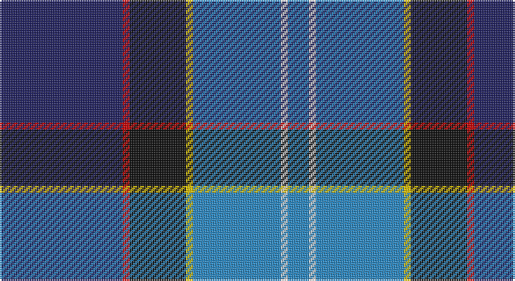

This page is one **sett** — a single exact thread-count. It belongs to the [tartan](/setts/db35r2k16ly2t25w2t6/)
(the same proportion at any scale), whose colour order is pattern [BRKYBWB](/stripes/brkybwb/).

Sourced from house-of-tartan.  It is a [7 stripe tartan](/stripes/stripes7/).

Original link http://www.house-of-tartan.scotland.net/house/TartanViewjs.asp?colr=Def&tnam=549

## Provenance

Earliest known date: 1986 Originally listed as MacNeil, this sett was identified by Ken Dalgliesh, weaver in Selkirk, in 1999.

## Thread count
DB/70 R4 K32 Y4 B50 LN4 B/12

One full sett is **270 threads**.

## Palette

Palette: <strong>Tartan Register</strong>
<table><thead><tr><th>Colour</th><th>Threads</th><th>Shade</th><th>Base</th><th>OKLCh</th></tr></thead><tbody><tr><td>DB/</td><td style="text-align:right;font-variant-numeric:tabular-nums">70</td><td><code style="background-color:#202060;">#202060</code> <small style="color:#888">#202060</small></td><td>B <code style="background-color:#2A418A;">#2A418A</code></td><td><small style="color:#888">oklch(28.9% 0.111 276.9)</small></td></tr><tr><td>R</td><td style="text-align:right;font-variant-numeric:tabular-nums">4</td><td><code style="background-color:#C80000;">#C80000</code> <small style="color:#888">#C80000</small></td><td>R <code style="background-color:#CC0000;">#CC0000</code></td><td><small style="color:#888">oklch(52.3% 0.215 29.2)</small></td></tr><tr><td>K</td><td style="text-align:right;font-variant-numeric:tabular-nums">32</td><td><code style="background-color:#101010;">#101010</code> <small style="color:#888">#101010</small></td><td>K <code style="background-color:#000000;">#000000</code></td><td><small style="color:#888">oklch(17.3% 0.000 89.9)</small></td></tr><tr><td>Y</td><td style="text-align:right;font-variant-numeric:tabular-nums">4</td><td><code style="background-color:#E8C000;">#E8C000</code> <small style="color:#888">#E8C000</small></td><td>Y <code style="background-color:#F2BF00;">#F2BF00</code></td><td><small style="color:#888">oklch(81.9% 0.168 93.7)</small></td></tr><tr><td>B</td><td style="text-align:right;font-variant-numeric:tabular-nums">50</td><td><code style="background-color:#2888C4;">#2888C4</code> <small style="color:#888">#2888C4</small></td><td>B <code style="background-color:#2A418A;">#2A418A</code></td><td><small style="color:#888">oklch(60.1% 0.125 241.5)</small></td></tr><tr><td>LN</td><td style="text-align:right;font-variant-numeric:tabular-nums">4</td><td><code style="background-color:#E0E0E0;">#E0E0E0</code> <small style="color:#888">#E0E0E0</small></td><td>W <code style="background-color:#F7F7F7;">#F7F7F7</code></td><td><small style="color:#888">oklch(90.7% 0.000 89.9)</small></td></tr><tr><td>B/</td><td style="text-align:right;font-variant-numeric:tabular-nums">12</td><td><code style="background-color:#2888C4;">#2888C4</code> <small style="color:#888">#2888C4</small></td><td>B <code style="background-color:#2A418A;">#2A418A</code></td><td><small style="color:#888">oklch(60.1% 0.125 241.5)</small></td></tr></tbody></table>

# Sample pattern

## Nearest tartans

The nearest existing variants by ΔTartan distance, with this tartan at the top so the swatches line up against it.

ΔTartan

Tartan

Sett

—

<a href="/ttd/edit/#slug=db35r2k16ly2t25w2t6~x2">US Forces (Thurso) Regimental Tartan</a> <a class="nn-out" href="/variants/s7/db35r2k16ly2t25w2t6~x2/" title="open its dictionary page">↗</a>

0.84

<a href="/ttd/edit/#slug=db35r2k16ly2b25w2b6~x2&amp;base=db35r2k16ly2t25w2t6~x2">Unidentified #23</a> <a class="nn-out" href="/variants/s7/db35r2k16ly2b25w2b6~x2/" title="open its dictionary page">↗</a>

0.90

<a href="/ttd/edit/#slug=k16w6k4b64m19k8g42ly6&amp;base=db35r2k16ly2t25w2t6~x2">Unidentified (Woven sample)</a> <a class="nn-out" href="/variants/s8/k16w6k4b64m19k8g42ly6/" title="open its dictionary page">↗</a>

0.93

<a href="/ttd/edit/#slug=b11db5g4w3r3k16db28b2~x2&amp;base=db35r2k16ly2t25w2t6~x2">Scottish Italian</a> <a class="nn-out" href="/variants/s8/b11db5g4w3r3k16db28b2~x2/" title="open its dictionary page">↗</a>

1.03

<a href="/ttd/edit/#slug=db60t5w4o12g42p12t5p12&amp;base=db35r2k16ly2t25w2t6~x2">St Columba</a> <a class="nn-out" href="/variants/s8/db60t5w4o12g42p12t5p12/" title="open its dictionary page">↗</a>

1.03

<a href="/ttd/edit/#slug=t26db13k13w2g8k5r3t3~x2&amp;base=db35r2k16ly2t25w2t6~x2">Moran (Coilessan) (Personal)</a> <a class="nn-out" href="/variants/s8/t26db13k13w2g8k5r3t3~x2/" title="open its dictionary page">↗</a>

1.04

<a href="/ttd/edit/#slug=w3k1db24dbi10o24k1ly3~x2&amp;base=db35r2k16ly2t25w2t6~x2">George Heriot's School</a> <a class="nn-out" href="/variants/s7/w3k1db24dbi10o24k1ly3~x2/" title="open its dictionary page">↗</a>

1.04

<a href="/ttd/edit/#slug=db4k3db28lb2dp6g28n2g4dp4~x2&amp;base=db35r2k16ly2t25w2t6~x2">Canmore</a> <a class="nn-out" href="/variants/s9/db4k3db28lb2dp6g28n2g4dp4~x2/" title="open its dictionary page">↗</a>

1.08

<a href="/ttd/edit/#slug=g5m2g2m9k9lr9db30w5~x2&amp;base=db35r2k16ly2t25w2t6~x2">Alexander of Menstry</a> <a class="nn-out" href="/variants/s8/g5m2g2m9k9lr9db30w5~x2/" title="open its dictionary page">↗</a>

1.08

<a href="/ttd/edit/#slug=w4db8m3db25k13g4t29db3t8db2m3~x2&amp;base=db35r2k16ly2t25w2t6~x2">Air Force</a> <a class="nn-out" href="/variants/s11/w4db8m3db25k13g4t29db3t8db2m3~x2/" title="open its dictionary page">↗</a>

1.10

<a href="/ttd/edit/#slug=t4lo2t34db10lr4db4dp4db23w3~x2&amp;base=db35r2k16ly2t25w2t6~x2">Heirloom Blue Alba (Fashion)</a> <a class="nn-out" href="/variants/s9/t4lo2t34db10lr4db4dp4db23w3~x2/" title="open its dictionary page">↗</a>

## Neighbour map

Every grey dot is one of 14360 variants placed by the first two principal components of the ΔTartan feature space (44% of its variance). Red is this tartan; blue dots are its nearest — click one to open its page.

<svg viewBox="0 0 640 380" role="img" style="max-width:100%;height:auto;border:1px solid #e0e0e0;border-radius:4px;display:block" xmlns="http://www.w3.org/2000/svg"><image href="/nn/cloud.v1.png" width="640" height="380"/><a href="/variants/s7/db35r2k16ly2b25w2b6~x2/"><circle cx="177.7" cy="139.7" r="4" fill="#3465a4"><title>Unidentified #23</title></circle></a><a href="/variants/s8/k16w6k4b64m19k8g42ly6/"><circle cx="161.5" cy="136.3" r="4" fill="#3465a4"><title>Unidentified (Woven sample)</title></circle></a><a href="/variants/s8/b11db5g4w3r3k16db28b2~x2/"><circle cx="208.2" cy="156.9" r="4" fill="#3465a4"><title>Scottish Italian</title></circle></a><a href="/variants/s8/db60t5w4o12g42p12t5p12/"><circle cx="166.3" cy="138.4" r="4" fill="#3465a4"><title>St Columba</title></circle></a><a href="/variants/s8/t26db13k13w2g8k5r3t3~x2/"><circle cx="150.7" cy="160.2" r="4" fill="#3465a4"><title>Moran (Coilessan) (Personal)</title></circle></a><a href="/variants/s7/w3k1db24dbi10o24k1ly3~x2/"><circle cx="196.2" cy="126.1" r="4" fill="#3465a4"><title>George Heriot's School</title></circle></a><a href="/variants/s9/db4k3db28lb2dp6g28n2g4dp4~x2/"><circle cx="206.3" cy="142.8" r="4" fill="#3465a4"><title>Canmore</title></circle></a><a href="/variants/s8/g5m2g2m9k9lr9db30w5~x2/"><circle cx="163.7" cy="135.9" r="4" fill="#3465a4"><title>Alexander of Menstry</title></circle></a><a href="/variants/s11/w4db8m3db25k13g4t29db3t8db2m3~x2/"><circle cx="161.2" cy="130.8" r="4" fill="#3465a4"><title>Air Force</title></circle></a><a href="/variants/s9/t4lo2t34db10lr4db4dp4db23w3~x2/"><circle cx="237.5" cy="131.0" r="4" fill="#3465a4"><title>Heirloom Blue Alba (Fashion)</title></circle></a><circle cx="198.7" cy="147.5" r="5" fill="#c00000"/></svg>

ID: /variants/s7/db35r2k16ly2t25w2t6~x2/
