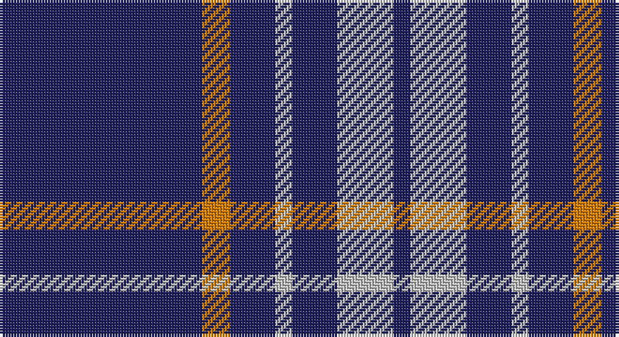

This page is one **sett** — a single exact thread-count. It belongs to the [tartan](/setts/db36lo5db8lb3db8lb10db3/)
(the same proportion at any scale), whose colour order is pattern [BWBWBYB](/stripes/bwbwbyb/).

Sourced from tartans-authority.  It is a [7 stripe tartan](/stripes/stripes7/).

Original link http://www.tartansauthority.com/tartan-ferret/display/2442/

## Also known as

This cloth is also recorded under:

- Scottish Qualifications Auth.

## Register references

External register numbers recorded for this tartan.

- Scottish Tartans Authority (ITI): 2442

## Thread count
DB/72 O10 DB16 N6 DB16 N20 DB/6

One full sett is **214 threads**.

## Palette

Palette: <strong>Tartan Register</strong>
<table><thead><tr><th>Colour</th><th>Threads</th><th>Shade</th><th>Base</th><th>OKLCh</th></tr></thead><tbody><tr><td>DB/</td><td style="text-align:right;font-variant-numeric:tabular-nums">72</td><td><code style="background-color:#202060;">#202060</code> <small style="color:#888">#202060</small></td><td>B <code style="background-color:#2A418A;">#2A418A</code></td><td><small style="color:#888">oklch(28.9% 0.111 276.9)</small></td></tr><tr><td>O</td><td style="text-align:right;font-variant-numeric:tabular-nums">10</td><td><code style="background-color:#D87C00;">#D87C00</code> <small style="color:#888">#D87C00</small></td><td>Y <code style="background-color:#F2BF00;">#F2BF00</code></td><td><small style="color:#888">oklch(67.3% 0.155 61.8)</small></td></tr><tr><td>DB</td><td style="text-align:right;font-variant-numeric:tabular-nums">16</td><td><code style="background-color:#202060;">#202060</code> <small style="color:#888">#202060</small></td><td>B <code style="background-color:#2A418A;">#2A418A</code></td><td><small style="color:#888">oklch(28.9% 0.111 276.9)</small></td></tr><tr><td>N</td><td style="text-align:right;font-variant-numeric:tabular-nums">6</td><td><code style="background-color:#C0C0C0;">#C0C0C0</code> <small style="color:#888">#C0C0C0</small></td><td>W <code style="background-color:#F7F7F7;">#F7F7F7</code></td><td><small style="color:#888">oklch(80.8% 0.000 89.9)</small></td></tr><tr><td>DB</td><td style="text-align:right;font-variant-numeric:tabular-nums">16</td><td><code style="background-color:#202060;">#202060</code> <small style="color:#888">#202060</small></td><td>B <code style="background-color:#2A418A;">#2A418A</code></td><td><small style="color:#888">oklch(28.9% 0.111 276.9)</small></td></tr><tr><td>N</td><td style="text-align:right;font-variant-numeric:tabular-nums">20</td><td><code style="background-color:#C0C0C0;">#C0C0C0</code> <small style="color:#888">#C0C0C0</small></td><td>W <code style="background-color:#F7F7F7;">#F7F7F7</code></td><td><small style="color:#888">oklch(80.8% 0.000 89.9)</small></td></tr><tr><td>DB/</td><td style="text-align:right;font-variant-numeric:tabular-nums">6</td><td><code style="background-color:#202060;">#202060</code> <small style="color:#888">#202060</small></td><td>B <code style="background-color:#2A418A;">#2A418A</code></td><td><small style="color:#888">oklch(28.9% 0.111 276.9)</small></td></tr></tbody></table>

# Sample pattern

## Nearest tartans

The nearest existing variants by ΔTartan distance, with this tartan at the top so the swatches line up against it.

ΔTartan

Tartan

Sett

—

<a href="/ttd/edit/#slug=db36lo5db8lb3db8lb10db3~x2">Scottish Qualifications Auth. (Corp)</a> <a class="nn-out" href="/variants/s7/db36lo5db8lb3db8lb10db3~x2/" title="open its dictionary page">↗</a>

1.24

<a href="/ttd/edit/#slug=db18r1db1r1db1k7db13w2~x4&amp;base=db36lo5db8lb3db8lb10db3~x2">Tokyo Bluebells</a> <a class="nn-out" href="/variants/s8/db18r1db1r1db1k7db13w2~x4/" title="open its dictionary page">↗</a>

1.34

<a href="/variants/s6/db60ly6db11r25~x2/">South Australian Pipes &amp; Drums (Corp</a>

1.39

<a href="/ttd/edit/#slug=db8r2db18r1db2w10db4~x2&amp;base=db36lo5db8lb3db8lb10db3~x2">Nike ACG Lunarstorm (Fashion)</a> <a class="nn-out" href="/variants/s7/db8r2db18r1db2w10db4~x2/" title="open its dictionary page">↗</a>

1.42

<a href="/ttd/edit/#slug=db35lr8db21lr13db6lo4~x2&amp;base=db36lo5db8lb3db8lb10db3~x2">Ochterlonie</a> <a class="nn-out" href="/variants/s6/db35lr8db21lr13db6lo4~x2/" title="open its dictionary page">↗</a>

1.46

<a href="/ttd/edit/#slug=db16w2db2w1db1w1db2w2db16w8~x4&amp;base=db36lo5db8lb3db8lb10db3~x2">Ikelman (Personal)</a> <a class="nn-out" href="/variants/s10/db16w2db2w1db1w1db2w2db16w8~x4/" title="open its dictionary page">↗</a>

1.48

<a href="/ttd/edit/#slug=db12w1r3w1r3w1db6~x4&amp;base=db36lo5db8lb3db8lb10db3~x2">BC Corps of Commissionaires</a> <a class="nn-out" href="/variants/s7/db12w1r3w1r3w1db6~x4/" title="open its dictionary page">↗</a>

1.49

<a href="/ttd/edit/#slug=db40g7ly3g7db15r5~x2&amp;base=db36lo5db8lb3db8lb10db3~x2">Wheadon (Name)</a> <a class="nn-out" href="/variants/s6/db40g7ly3g7db15r5~x2/" title="open its dictionary page">↗</a>

1.51

<a href="/ttd/edit/#slug=db12lb1r3lb1r3lb1db6~x4&amp;base=db36lo5db8lb3db8lb10db3~x2">BC Corps of Commissionaires, The</a> <a class="nn-out" href="/variants/s7/db12lb1r3lb1r3lb1db6~x4/" title="open its dictionary page">↗</a>

1.53

<a href="/ttd/edit/#slug=db40w8db25w14db8ly4~x2&amp;base=db36lo5db8lb3db8lb10db3~x2">Auchterlonie (Personal)</a> <a class="nn-out" href="/variants/s6/db40w8db25w14db8ly4~x2/" title="open its dictionary page">↗</a>

1.55

<a href="/ttd/edit/#slug=db13lb3db1r3lb1~x6&amp;base=db36lo5db8lb3db8lb10db3~x2">Glen Moy</a> <a class="nn-out" href="/variants/s5/db13lb3db1r3lb1~x6/" title="open its dictionary page">↗</a>

## Neighbour map

Every grey dot is one of 14360 variants placed by the first two principal components of the ΔTartan feature space (44% of its variance). Red is this tartan; blue dots are its nearest — click one to open its page.

<svg viewBox="0 0 640 380" role="img" style="max-width:100%;height:auto;border:1px solid #e0e0e0;border-radius:4px;display:block" xmlns="http://www.w3.org/2000/svg"><image href="/nn/cloud.v1.png" width="640" height="380"/><a href="/variants/s8/db18r1db1r1db1k7db13w2~x4/"><circle cx="459.7" cy="169.1" r="4" fill="#3465a4"><title>Tokyo Bluebells</title></circle></a><a href="/variants/s6/db60ly6db11r25~x2/"><circle cx="409.5" cy="215.7" r="4" fill="#3465a4"><title>South Australian Pipes &amp; Drums (Corp</title></circle></a><a href="/variants/s7/db8r2db18r1db2w10db4~x2/"><circle cx="408.2" cy="184.3" r="4" fill="#3465a4"><title>Nike ACG Lunarstorm (Fashion)</title></circle></a><a href="/variants/s6/db35lr8db21lr13db6lo4~x2/"><circle cx="387.2" cy="240.0" r="4" fill="#3465a4"><title>Ochterlonie</title></circle></a><a href="/variants/s10/db16w2db2w1db1w1db2w2db16w8~x4/"><circle cx="450.4" cy="175.7" r="4" fill="#3465a4"><title>Ikelman (Personal)</title></circle></a><a href="/variants/s7/db12w1r3w1r3w1db6~x4/"><circle cx="395.0" cy="207.1" r="4" fill="#3465a4"><title>BC Corps of Commissionaires</title></circle></a><a href="/variants/s6/db40g7ly3g7db15r5~x2/"><circle cx="427.3" cy="202.5" r="4" fill="#3465a4"><title>Wheadon (Name)</title></circle></a><a href="/variants/s7/db12lb1r3lb1r3lb1db6~x4/"><circle cx="405.8" cy="209.2" r="4" fill="#3465a4"><title>BC Corps of Commissionaires, The</title></circle></a><a href="/variants/s6/db40w8db25w14db8ly4~x2/"><circle cx="396.7" cy="223.4" r="4" fill="#3465a4"><title>Auchterlonie (Personal)</title></circle></a><a href="/variants/s5/db13lb3db1r3lb1~x6/"><circle cx="394.6" cy="201.9" r="4" fill="#3465a4"><title>Glen Moy</title></circle></a><circle cx="453.2" cy="202.5" r="5" fill="#c00000"/></svg>

ID: /variants/s7/db36lo5db8lb3db8lb10db3~x2/
