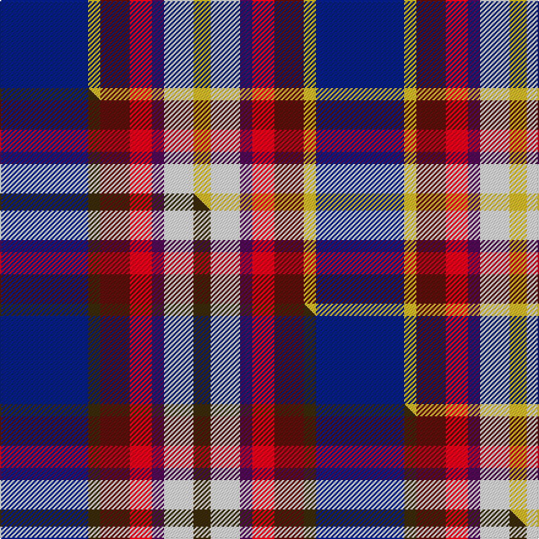

This page is one **sett** — a single exact thread-count. It belongs to the [tartan](/setts/db36ly5dr12r9dp5w12ly7/)
(the same proportion at any scale), whose colour order is pattern [BYBRBWY](/stripes/bybrbwy/).

Part of the [Galvez-Brown](/tartans/galvez-brown/) tartan — the named design grouping this sett with its other cloths.

Sourced from tartans-authority.  It is a [7 stripe tartan](/stripes/stripes7/).

Original link http://www.tartansauthority.com/tartan-ferret/display/10693/

## Register references

External register numbers recorded for this tartan.

- Scottish Register of Tartans: [10693](https://www.tartanregister.gov.uk/tartanDetails?ref=10693)
- Scottish Tartans Authority (ITI): 10693

## Thread count
DB/72 LY10 DR24 R18 DP10 W24 LY/14

One full sett is **258 threads**.

## Palette
<table><thead><tr><th>Colour</th><th>Shade</th><th>OKLCh</th></tr></thead><tbody><tr><td>DB</td><td><code style="background-color:#082077;">#082077</code> <small style="color:#888">#082077</small></td><td><small style="color:#888">oklch(30.0% 0.149 265.1)</small></td></tr><tr><td>DP</td><td><code style="background-color:#4B0B4F;">#4B0B4F</code> <small style="color:#888">#4B0B4F</small></td><td><small style="color:#888">oklch(30.1% 0.125 325.4)</small></td></tr><tr><td>DR</td><td><code style="background-color:#55120C;">#55120C</code> <small style="color:#888">#55120C</small></td><td><small style="color:#888">oklch(30.0% 0.099 29.3)</small></td></tr><tr><td>LY</td><td><code style="background-color:#DCBC32;">#DCBC32</code> <small style="color:#888">#DCBC32</small></td><td><small style="color:#888">oklch(80.0% 0.150 95.2)</small></td></tr><tr><td>R</td><td><code style="background-color:#D60020;">#D60020</code> <small style="color:#888">#D60020</small></td><td><small style="color:#888">oklch(55.2% 0.224 25.5)</small></td></tr><tr><td>W</td><td><code style="background-color:#F7F7F7;">#F7F7F7</code> <small style="color:#888">#F7F7F7</small></td><td><small style="color:#888">oklch(97.6% 0.000 89.9)</small></td></tr></tbody></table>

# Sample pattern

## Compared to the master

This cloth is one sett of its design; the master sett (the exemplar the design is anchored on) is below for comparison.

Its **ΔTartan distance** from the master is **0.73** — the same measure the nearest-tartans table ranks by (0 is identical; a re-scale of the same cloth is near 0, a recolour or a different proportion further).

<figure class="master-compare" style="margin:0">

this sett
master sett ★

<figcaption style="color:#888;font-size:smaller">One weave of this sett against the <a href="/setts/db36dy5dr12r9dp5w12dy7/">master sett ★</a>, split on the diagonal: a shared proportion runs seamlessly across it with only the shades shifting; a different proportion breaks on it.</figcaption>
</figure>

## Nearest tartan variants

The nearest existing variants by ΔTartan distance, with this cloth at the top so the swatches line up against it.

ΔTartan

Threads

Variant

Sett

—

258

<a href="/variants/s7/db36ly5dr12r9dp5w12ly7~x2/">Galvez-Brown (Personal)</a>

<a href="/ttd/edit/#slug=db36dy5dr12r9dp5w12dy7~x2&amp;base=db36ly5dr12r9dp5w12ly7~x2" title="compare in the TTD">0.00</a>

258

<a href="/variants/s7/db36dy5dr12r9dp5w12dy7~x2/">Galvez-Brown</a>

<a href="/ttd/edit/#slug=w4r7y5db13dr18g3~x2&amp;base=db36ly5dr12r9dp5w12ly7~x2" title="compare in the TTD">1.65</a>

186

<a href="/variants/s6/w4r7y5db13dr18g3~x2/">Ryan/Fehder (Personal)</a>

<a href="/ttd/edit/#slug=db13y2r4g2lb8w2~x6&amp;base=db36ly5dr12r9dp5w12ly7~x2" title="compare in the TTD">1.88</a>

282

<a href="/variants/s6/db13y2r4g2lb8w2~x6/">Meh Dundee</a>

<a href="/ttd/edit/#slug=db27ly9w3dy16r7~x2&amp;base=db36ly5dr12r9dp5w12ly7~x2" title="compare in the TTD">1.93</a>

180

<a href="/variants/s5/db27ly9w3dy16r7~x2/">Unidentified (Sock Tie)</a>

<a href="/ttd/edit/#slug=r2ly2db9dy1dg9r1w1~x2&amp;base=db36ly5dr12r9dp5w12ly7~x2" title="compare in the TTD">2.16</a>

94

<a href="/variants/s7/r2ly2db9dy1dg9r1w1~x2/">Unidentified (ex Tony Murray)</a>

<a href="/ttd/edit/#slug=r15dr98db72lb25db8w15&amp;base=db36ly5dr12r9dp5w12ly7~x2" title="compare in the TTD">2.30</a>

436

<a href="/variants/s6/r15dr98db72lb25db8w15/">Afternoon Tea / Assam</a>

<a href="/ttd/edit/#slug=ly5db30w3g15y8r4~x2&amp;base=db36ly5dr12r9dp5w12ly7~x2" title="compare in the TTD">2.32</a>

242

<a href="/variants/s6/ly5db30w3g15y8r4~x2/">Carleton College Rugby</a>

<a href="/ttd/edit/#slug=p5g9r2dy2db6lb14w3~x4&amp;base=db36ly5dr12r9dp5w12ly7~x2" title="compare in the TTD">2.51</a>

296

<a href="/variants/s7/p5g9r2dy2db6lb14w3~x4/">Manx National</a>

<a href="/ttd/edit/#slug=r3y2g12dp12db14w3~x2&amp;base=db36ly5dr12r9dp5w12ly7~x2" title="compare in the TTD">2.51</a>

172

<a href="/variants/s6/r3y2g12dp12db14w3~x2/">Jamestown Parish Church (Corporate)</a>

2.58

—

<a href="/variants/s6/w2dbi15n2db20r9w2~x2~dbi1604274-db0805267/">The Open Championship</a>

## Neighbour map

Every grey dot is one of 13620 variants placed by the first two principal components of the ΔTartan feature space (42% of its variance). Red is this tartan; blue dots are its nearest — click one to open its page.

<svg viewBox="0 0 640 380" role="img" style="max-width:100%;height:auto;border:1px solid #e0e0e0;border-radius:4px;display:block" xmlns="http://www.w3.org/2000/svg"><image href="/nn/cloud.v1.png" width="640" height="380"/><a href="/variants/s7/db36dy5dr12r9dp5w12dy7~x2/"><circle cx="145.9" cy="189.4" r="4" fill="#3465a4"><title>Galvez-Brown</title></circle></a><a href="/variants/s6/w4r7y5db13dr18g3~x2/"><circle cx="120.1" cy="220.6" r="4" fill="#3465a4"><title>Ryan/Fehder (Personal)</title></circle></a><a href="/variants/s6/db13y2r4g2lb8w2~x6/"><circle cx="143.5" cy="200.7" r="4" fill="#3465a4"><title>Meh Dundee</title></circle></a><a href="/variants/s5/db27ly9w3dy16r7~x2/"><circle cx="183.4" cy="220.6" r="4" fill="#3465a4"><title>Unidentified (Sock Tie)</title></circle></a><a href="/variants/s7/r2ly2db9dy1dg9r1w1~x2/"><circle cx="164.9" cy="176.5" r="4" fill="#3465a4"><title>Unidentified (ex Tony Murray)</title></circle></a><a href="/variants/s6/r15dr98db72lb25db8w15/"><circle cx="217.6" cy="186.0" r="4" fill="#3465a4"><title>Afternoon Tea / Assam</title></circle></a><a href="/variants/s6/ly5db30w3g15y8r4~x2/"><circle cx="188.3" cy="183.1" r="4" fill="#3465a4"><title>Carleton College Rugby</title></circle></a><a href="/variants/s7/p5g9r2dy2db6lb14w3~x4/"><circle cx="82.7" cy="195.4" r="4" fill="#3465a4"><title>Manx National</title></circle></a><a href="/variants/s6/r3y2g12dp12db14w3~x2/"><circle cx="105.5" cy="219.7" r="4" fill="#3465a4"><title>Jamestown Parish Church (Corporate)</title></circle></a><a href="/variants/s6/w2dbi15n2db20r9w2~x2~dbi1604274-db0805267/"><circle cx="193.0" cy="196.7" r="4" fill="#3465a4"><title>The Open Championship</title></circle></a><circle cx="132.7" cy="186.1" r="5" fill="#c00000"/><text x="320" y="376" text-anchor="middle" font-size="11" fill="#999">ground</text><text x="11" y="190" text-anchor="middle" font-size="11" fill="#999" transform="rotate(-90 11 190)">complexity</text></svg>

ID: /variants/s7/db36ly5dr12r9dp5w12ly7~x2/
