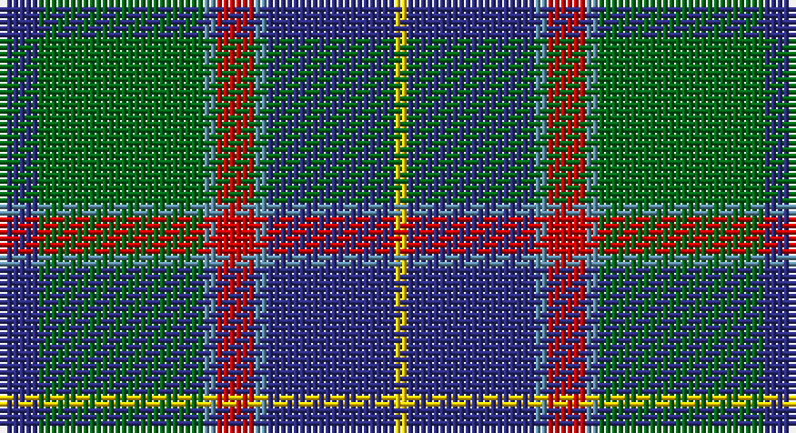

This page is one **sett** — a single exact thread-count. It belongs to the [tartan](/setts/db3g13t1r3t1db10ly1/)
(the same proportion at any scale), whose colour order is pattern [BGBRBBY](/stripes/bgbrbby/).

Sourced from tartans-authority.  It is a [7 stripe tartan](/stripes/stripes7/).

Original link http://www.tartansauthority.com/tartan-ferret/display/10637/

## Also known as

This cloth is also recorded under:

- Heckenberg Htg

## Register references

External register numbers recorded for this tartan.

- Scottish Register of Tartans: [10637](https://www.tartanregister.gov.uk/tartanDetails?ref=10637)
- Scottish Tartans Authority (ITI): 10637

## Thread count
DB/6 G26 B2 R6 B2 DB20 Y/2

One full sett is **120 threads**.

## Palette

Palette: <strong>Tartan Register</strong>
<table><thead><tr><th>Colour</th><th>Threads</th><th>Shade</th><th>Base</th><th>OKLCh</th></tr></thead><tbody><tr><td>DB/</td><td style="text-align:right;font-variant-numeric:tabular-nums">6</td><td><code style="background-color:#2C2C80;">#2C2C80</code> <small style="color:#888">#2C2C80</small></td><td>B <code style="background-color:#2A418A;">#2A418A</code></td><td><small style="color:#888">oklch(35.0% 0.138 276.6)</small></td></tr><tr><td>G</td><td style="text-align:right;font-variant-numeric:tabular-nums">26</td><td><code style="background-color:#006818;">#006818</code> <small style="color:#888">#006818</small></td><td>G <code style="background-color:#006100;">#006100</code></td><td><small style="color:#888">oklch(45.0% 0.142 145.0)</small></td></tr><tr><td>B</td><td style="text-align:right;font-variant-numeric:tabular-nums">2</td><td><code style="background-color:#5C8CA8;">#5C8CA8</code> <small style="color:#888">#5C8CA8</small></td><td>B <code style="background-color:#2A418A;">#2A418A</code></td><td><small style="color:#888">oklch(61.7% 0.067 235.0)</small></td></tr><tr><td>R</td><td style="text-align:right;font-variant-numeric:tabular-nums">6</td><td><code style="background-color:#C80000;">#C80000</code> <small style="color:#888">#C80000</small></td><td>R <code style="background-color:#CC0000;">#CC0000</code></td><td><small style="color:#888">oklch(52.3% 0.215 29.2)</small></td></tr><tr><td>B</td><td style="text-align:right;font-variant-numeric:tabular-nums">2</td><td><code style="background-color:#5C8CA8;">#5C8CA8</code> <small style="color:#888">#5C8CA8</small></td><td>B <code style="background-color:#2A418A;">#2A418A</code></td><td><small style="color:#888">oklch(61.7% 0.067 235.0)</small></td></tr><tr><td>DB</td><td style="text-align:right;font-variant-numeric:tabular-nums">20</td><td><code style="background-color:#2C2C80;">#2C2C80</code> <small style="color:#888">#2C2C80</small></td><td>B <code style="background-color:#2A418A;">#2A418A</code></td><td><small style="color:#888">oklch(35.0% 0.138 276.6)</small></td></tr><tr><td>Y/</td><td style="text-align:right;font-variant-numeric:tabular-nums">2</td><td><code style="background-color:#FCCC00;">#FCCC00</code> <small style="color:#888">#FCCC00</small></td><td>Y <code style="background-color:#F2BF00;">#F2BF00</code></td><td><small style="color:#888">oklch(86.2% 0.176 91.5)</small></td></tr></tbody></table>

# Sample pattern

## Nearest tartans

The nearest existing variants by ΔTartan distance, with this tartan at the top so the swatches line up against it.

ΔTartan

Tartan

Sett

—

<a href="/ttd/edit/#slug=db3g13t1r3t1db10ly1~x2">Heckenberg Htg (Personal)</a> <a class="nn-out" href="/variants/s7/db3g13t1r3t1db10ly1~x2/" title="open its dictionary page">↗</a>

0.51

<a href="/ttd/edit/#slug=r5t3g24db24r4ly2~x2&amp;base=db3g13t1r3t1db10ly1~x2">Canine All Dogs</a> <a class="nn-out" href="/variants/s6/r5t3g24db24r4ly2~x2/" title="open its dictionary page">↗</a>

0.70

<a href="/ttd/edit/#slug=r6db27t2g2t2g30w4~x2&amp;base=db3g13t1r3t1db10ly1~x2">MX-5 Owners' Club</a> <a class="nn-out" href="/variants/s7/r6db27t2g2t2g30w4~x2/" title="open its dictionary page">↗</a>

0.71

<a href="/ttd/edit/#slug=db3m2db22k11g24lp2g3~x2&amp;base=db3g13t1r3t1db10ly1~x2">MacThomas Clan Tartan</a> <a class="nn-out" href="/variants/s7/db3m2db22k11g24lp2g3~x2/" title="open its dictionary page">↗</a>

0.74

<a href="/ttd/edit/#slug=b11k4g4m1g4k1r1~x4&amp;base=db3g13t1r3t1db10ly1~x2">Ednie (Personal)</a> <a class="nn-out" href="/variants/s7/b11k4g4m1g4k1r1~x4/" title="open its dictionary page">↗</a>

0.76

<a href="/ttd/edit/#slug=b5dy28lb5k20lo5b47lo4~x2&amp;base=db3g13t1r3t1db10ly1~x2">State Seal of Washington (Fashion)</a> <a class="nn-out" href="/variants/s7/b5dy28lb5k20lo5b47lo4~x2/" title="open its dictionary page">↗</a>

0.81

<a href="/ttd/edit/#slug=g11k2g1m4db1m4db13lt2db1~x4&amp;base=db3g13t1r3t1db10ly1~x2">Dunbartonshire</a> <a class="nn-out" href="/variants/s9/g11k2g1m4db1m4db13lt2db1~x4/" title="open its dictionary page">↗</a>

0.85

<a href="/ttd/edit/#slug=db20k6lo4db3g20w2~x2&amp;base=db3g13t1r3t1db10ly1~x2">DeLoughery (Personal)</a> <a class="nn-out" href="/variants/s6/db20k6lo4db3g20w2~x2/" title="open its dictionary page">↗</a>

0.87

<a href="/ttd/edit/#slug=dp4t2dp2t8k3dp8gi3dp4gi24g2~x2&amp;base=db3g13t1r3t1db10ly1~x2">Jones Htg (Name)</a> <a class="nn-out" href="/variants/s10/dp4t2dp2t8k3dp8gi3dp4gi24g2~x2/" title="open its dictionary page">↗</a>

0.88

<a href="/ttd/edit/#slug=k5g32db32r3db3ly3~x2&amp;base=db3g13t1r3t1db10ly1~x2">Carmichael</a> <a class="nn-out" href="/variants/s6/k5g32db32r3db3ly3~x2/" title="open its dictionary page">↗</a>

0.88

<a href="/ttd/edit/#slug=dg6r2db1r3db16g20w2~x2&amp;base=db3g13t1r3t1db10ly1~x2">MacCord / McCord (Personal)</a> <a class="nn-out" href="/variants/s7/dg6r2db1r3db16g20w2~x2/" title="open its dictionary page">↗</a>

## Neighbour map

Every grey dot is one of 14360 variants placed by the first two principal components of the ΔTartan feature space (44% of its variance). Red is this tartan; blue dots are its nearest — click one to open its page.

<svg viewBox="0 0 640 380" role="img" style="max-width:100%;height:auto;border:1px solid #e0e0e0;border-radius:4px;display:block" xmlns="http://www.w3.org/2000/svg"><image href="/nn/cloud.v1.png" width="640" height="380"/><a href="/variants/s6/r5t3g24db24r4ly2~x2/"><circle cx="218.5" cy="189.0" r="4" fill="#3465a4"><title>Canine All Dogs</title></circle></a><a href="/variants/s7/r6db27t2g2t2g30w4~x2/"><circle cx="242.4" cy="159.2" r="4" fill="#3465a4"><title>MX-5 Owners' Club</title></circle></a><a href="/variants/s7/db3m2db22k11g24lp2g3~x2/"><circle cx="233.7" cy="195.6" r="4" fill="#3465a4"><title>MacThomas Clan Tartan</title></circle></a><a href="/variants/s7/b11k4g4m1g4k1r1~x4/"><circle cx="212.9" cy="195.3" r="4" fill="#3465a4"><title>Ednie (Personal)</title></circle></a><a href="/variants/s7/b5dy28lb5k20lo5b47lo4~x2/"><circle cx="218.6" cy="177.7" r="4" fill="#3465a4"><title>State Seal of Washington (Fashion)</title></circle></a><a href="/variants/s9/g11k2g1m4db1m4db13lt2db1~x4/"><circle cx="195.3" cy="162.4" r="4" fill="#3465a4"><title>Dunbartonshire</title></circle></a><a href="/variants/s6/db20k6lo4db3g20w2~x2/"><circle cx="206.5" cy="204.1" r="4" fill="#3465a4"><title>DeLoughery (Personal)</title></circle></a><a href="/variants/s10/dp4t2dp2t8k3dp8gi3dp4gi24g2~x2/"><circle cx="238.1" cy="160.4" r="4" fill="#3465a4"><title>Jones Htg (Name)</title></circle></a><a href="/variants/s6/k5g32db32r3db3ly3~x2/"><circle cx="250.5" cy="189.2" r="4" fill="#3465a4"><title>Carmichael</title></circle></a><a href="/variants/s7/dg6r2db1r3db16g20w2~x2/"><circle cx="226.2" cy="158.2" r="4" fill="#3465a4"><title>MacCord / McCord (Personal)</title></circle></a><circle cx="236.2" cy="179.4" r="5" fill="#c00000"/></svg>

ID: /variants/s7/db3g13t1r3t1db10ly1~x2/
