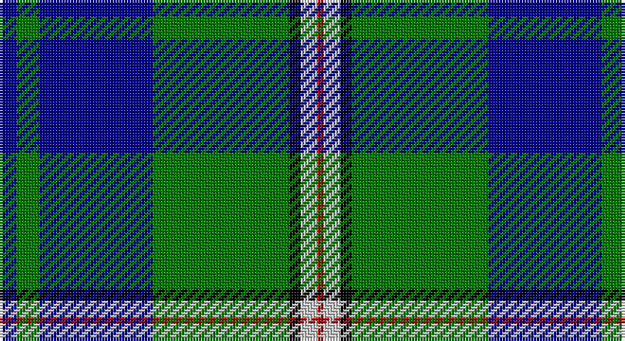

This page is one **sett** — a single exact thread-count. It belongs to the [tartan](/setts/db3g4db20g24k2lb3r1/)
(the same proportion at any scale), whose colour order is pattern [BGBGKWR](/stripes/bgbgkwr/).

Part of the [Nowell/Noel](/tartans/nowell-noel/) tartan — the named design grouping this sett with its other cloths.

Sourced from tartans-authority.  It is a [7 stripe tartan](/stripes/stripes7/).

Original link http://www.tartansauthority.com/tartan-ferret/display/4108/

## Register references

External register numbers recorded for this tartan.

- Scottish Tartans Authority (ITI): 4108

## Thread count
DB/6 G8 DB40 G48 K4 N6 DR/2

One full sett is **220 threads**.

## Palette

Palette: <strong>Tartan Register</strong> <small style="color:#888">(4 of 5 colours)</small>
<table><thead><tr><th>Colour</th><th>Threads</th><th>Shade</th><th>Base</th><th>OKLCh</th></tr></thead><tbody><tr><td>DB/</td><td style="text-align:right;font-variant-numeric:tabular-nums">6</td><td><code style="background-color:#00008C;">#00008C</code> <small style="color:#888">#00008C</small></td><td>B <code style="background-color:#2A418A;">#2A418A</code></td><td><small style="color:#888">oklch(28.9% 0.200 264.1)</small></td></tr><tr><td>G</td><td style="text-align:right;font-variant-numeric:tabular-nums">8</td><td><code style="background-color:#007800;">#007800</code> <small style="color:#888">#007800</small></td><td>G <code style="background-color:#006100;">#006100</code></td><td><small style="color:#888">oklch(49.6% 0.169 142.5)</small></td></tr><tr><td>DB</td><td style="text-align:right;font-variant-numeric:tabular-nums">40</td><td><code style="background-color:#00008C;">#00008C</code> <small style="color:#888">#00008C</small></td><td>B <code style="background-color:#2A418A;">#2A418A</code></td><td><small style="color:#888">oklch(28.9% 0.200 264.1)</small></td></tr><tr><td>G</td><td style="text-align:right;font-variant-numeric:tabular-nums">48</td><td><code style="background-color:#007800;">#007800</code> <small style="color:#888">#007800</small></td><td>G <code style="background-color:#006100;">#006100</code></td><td><small style="color:#888">oklch(49.6% 0.169 142.5)</small></td></tr><tr><td>K</td><td style="text-align:right;font-variant-numeric:tabular-nums">4</td><td><code style="background-color:#000000;">#000000</code> <small style="color:#888">#000000</small></td><td>K <code style="background-color:#000000;">#000000</code></td><td><small style="color:#888">oklch(0.0% 0.000 0.0)</small></td></tr><tr><td>N</td><td style="text-align:right;font-variant-numeric:tabular-nums">6</td><td><code style="background-color:#C8C8C8;">#C8C8C8</code> <small style="color:#888">#C8C8C8</small></td><td>W <code style="background-color:#F7F7F7;">#F7F7F7</code></td><td><small style="color:#888">oklch(83.3% 0.000 89.9)</small></td></tr><tr><td>DR/</td><td style="text-align:right;font-variant-numeric:tabular-nums">2</td><td><code style="background-color:#B00000;">#B00000</code> <small style="color:#888">#B00000</small></td><td>R <code style="background-color:#CC0000;">#CC0000</code></td><td><small style="color:#888">oklch(47.5% 0.195 29.2)</small></td></tr></tbody></table>

# Sample pattern

## Compared to the master

This cloth is one sett of its design; the master sett (the exemplar the design is anchored on) is below for comparison.

<figure style="margin:0"><figcaption style="color:#888;font-size:smaller">this sett</figcaption></figure>
<figure style="margin:0"><figcaption style="color:#888;font-size:smaller"><a href="/setts/db8g2db10g12k1lb1r1/">master sett →</a></figcaption></figure>

## Nearest tartans

The nearest existing variants by ΔTartan distance, with this tartan at the top so the swatches line up against it.

ΔTartan

Tartan

Sett

—

<a href="/ttd/edit/#slug=db3g4db20g24k2lb3r1~x2">Nowell/Noel (Name)</a> <a class="nn-out" href="/variants/s7/db3g4db20g24k2lb3r1~x2/" title="open its dictionary page">↗</a>

1.20

<a href="/ttd/edit/#slug=r3w3db36g36k2r2~x2&amp;base=db3g4db20g24k2lb3r1~x2">Militello (Palermo) Dress (Personal)</a> <a class="nn-out" href="/variants/s6/r3w3db36g36k2r2~x2/" title="open its dictionary page">↗</a>

1.22

<a href="/ttd/edit/#slug=db48w2k20g22r3g4~x2&amp;base=db3g4db20g24k2lb3r1~x2">MacFadzean</a> <a class="nn-out" href="/variants/s6/db48w2k20g22r3g4~x2/" title="open its dictionary page">↗</a>

1.24

<a href="/ttd/edit/#slug=db24k8g8r2g8k1w2~x2&amp;base=db3g4db20g24k2lb3r1~x2">Ferguson of Athol</a> <a class="nn-out" href="/variants/s7/db24k8g8r2g8k1w2~x2/" title="open its dictionary page">↗</a>

1.28

<a href="/ttd/edit/#slug=r2w7b30dg36ly2~x2&amp;base=db3g4db20g24k2lb3r1~x2">Centennial-King George Lodge No.171</a> <a class="nn-out" href="/variants/s5/r2w7b30dg36ly2~x2/" title="open its dictionary page">↗</a>

1.28

<a href="/ttd/edit/#slug=db24k8g8r2g8k1ly2~x2&amp;base=db3g4db20g24k2lb3r1~x2">MacLaren</a> <a class="nn-out" href="/variants/s7/db24k8g8r2g8k1ly2~x2/" title="open its dictionary page">↗</a>

1.29

<a href="/ttd/edit/#slug=b24k8g8r2g8k1w2~x2&amp;base=db3g4db20g24k2lb3r1~x2">Ferguson of Atholl Clan</a> <a class="nn-out" href="/variants/s7/b24k8g8r2g8k1w2~x2/" title="open its dictionary page">↗</a>

1.30

<a href="/variants/s6/k4t24k2g13t2ki3~x4/">Vance (Family Association) Corporate Family Tartan</a>

1.32

<a href="/ttd/edit/#slug=r2w7db30g36ly2~x2&amp;base=db3g4db20g24k2lb3r1~x2">Centennial-King George Lodge No.171</a> <a class="nn-out" href="/variants/s5/r2w7db30g36ly2~x2/" title="open its dictionary page">↗</a>

1.33

<a href="/ttd/edit/#slug=db64k11r2k4r2k4g32y4~x2&amp;base=db3g4db20g24k2lb3r1~x2">Sinclair-Brown</a> <a class="nn-out" href="/variants/s8/db64k11r2k4r2k4g32y4~x2/" title="open its dictionary page">↗</a>

1.36

<a href="/ttd/edit/#slug=k3g36db28r2db2ly3~x2&amp;base=db3g4db20g24k2lb3r1~x2">Carmichael</a> <a class="nn-out" href="/variants/s6/k3g36db28r2db2ly3~x2/" title="open its dictionary page">↗</a>

## Neighbour map

Every grey dot is one of 14360 variants placed by the first two principal components of the ΔTartan feature space (44% of its variance). Red is this tartan; blue dots are its nearest — click one to open its page.

<svg viewBox="0 0 640 380" role="img" style="max-width:100%;height:auto;border:1px solid #e0e0e0;border-radius:4px;display:block" xmlns="http://www.w3.org/2000/svg"><image href="/nn/cloud.v1.png" width="640" height="380"/><a href="/variants/s6/r3w3db36g36k2r2~x2/"><circle cx="243.6" cy="148.9" r="4" fill="#3465a4"><title>Militello (Palermo) Dress (Personal)</title></circle></a><a href="/variants/s6/db48w2k20g22r3g4~x2/"><circle cx="259.2" cy="155.4" r="4" fill="#3465a4"><title>MacFadzean</title></circle></a><a href="/variants/s7/db24k8g8r2g8k1w2~x2/"><circle cx="234.4" cy="147.2" r="4" fill="#3465a4"><title>Ferguson of Athol</title></circle></a><a href="/variants/s5/r2w7b30dg36ly2~x2/"><circle cx="255.3" cy="174.2" r="4" fill="#3465a4"><title>Centennial-King George Lodge No.171</title></circle></a><a href="/variants/s7/db24k8g8r2g8k1ly2~x2/"><circle cx="236.1" cy="147.8" r="4" fill="#3465a4"><title>MacLaren</title></circle></a><a href="/variants/s7/b24k8g8r2g8k1w2~x2/"><circle cx="253.3" cy="157.6" r="4" fill="#3465a4"><title>Ferguson of Atholl Clan</title></circle></a><a href="/variants/s6/k4t24k2g13t2ki3~x4/"><circle cx="260.6" cy="179.0" r="4" fill="#3465a4"><title>Vance (Family Association) Corporate Family Tartan</title></circle></a><a href="/variants/s5/r2w7db30g36ly2~x2/"><circle cx="252.0" cy="172.2" r="4" fill="#3465a4"><title>Centennial-King George Lodge No.171</title></circle></a><a href="/variants/s8/db64k11r2k4r2k4g32y4~x2/"><circle cx="312.4" cy="116.1" r="4" fill="#3465a4"><title>Sinclair-Brown</title></circle></a><a href="/variants/s6/k3g36db28r2db2ly3~x2/"><circle cx="296.0" cy="164.0" r="4" fill="#3465a4"><title>Carmichael</title></circle></a><circle cx="283.3" cy="146.8" r="5" fill="#c00000"/></svg>

ID: /variants/s7/db3g4db20g24k2lb3r1~x2/
