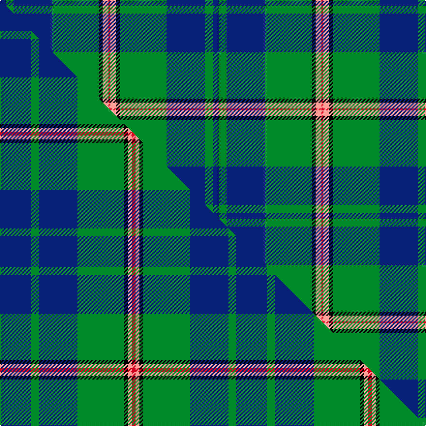

This is one **variant** — a specific cloth: this exact thread count and colourway, with its own
provenance below. It is one weaving of the [sett](/setts/db3g4db20g24k2lr3r1/) (the scale-free proportion — the
same cloth at any scale or shade), whose colour order is pattern [BGBGKYR](/stripes/bgbgkyr/).

Part of the [Nowell/Noel](/tartans/nowell-noel/) tartan — the named design grouping this sett with its other cloths.

Sourced from tartans-authority.  It is a [7 stripe tartan](/stripes/stripes7/).

Original link [https://www.tartanregister.gov.uk/tartanDetails.aspx?ref=4108](https://www.tartanregister.gov.uk/tartanDetails.aspx?ref=4108)

Dataset <small>— provenance for this record, inherited from the source manifest</small>

<dl class="dataset-prov">
<dt>source</dt><dd><a href="/sources/tartans-authority/">Scottish Tartans Authority</a></dd>
<dt>data captured from</dt><dd><a href="https://github.com/thetartan/tartan-database/blob/master/data/tartans-authority/data.csv">https://github.com/thetartan/tartan-database/blob/master/data/tartans-authority/data.csv</a></dd>
<dt>data date</dt><dd>2002 <small>(this record)</small></dd>
<dt>licence</dt><dd><a href="https://creativecommons.org/licenses/by-nc-nd/4.0/">CC BY-NC-ND 4.0</a></dd>
</dl>

Capture chain <small>— the hands this data passed through, oldest first; each capture carries its own licence</small>

<ol class="capture-chain">
<li><a href="https://www.tartansauthority.com/">Scottish Tartans Authority</a> <small>the heritage body's archive — its tartan-ferret record browser is retired (links repaired to the SRT, above)</small></li>
<li><a href="https://github.com/thetartan/tartan-database">thetartan/tartan-database</a> <small>2016-2017</small> · <a href="https://creativecommons.org/licenses/by-nc-nd/4.0/">CC BY-NC-ND 4.0</a> <small>Levko Kravets's frozen compilation — the capture we vendored, and where its CC licence text came from</small></li>
<li>this dictionary <small>captured 2026-06-10 · commit 5bf86c7566</small> <small>each re-capture is a git commit to data/sources</small></li>
</ol>

## Register references

External register numbers recorded for this tartan.

- Scottish Tartans Authority (ITI): 4108

## Thread count
DB/6 G8 DB40 G48 K4 LR6 R/2

One full sett is **220 threads**.

## Palette
<table><thead><tr><th>Colour</th><th>Shade</th><th>OKLCh</th></tr></thead><tbody><tr><td>DB</td><td><code style="background-color:#082077;">#082077</code> <small style="color:#888">#082077</small></td><td><small style="color:#888">oklch(30.0% 0.149 265.1)</small></td></tr><tr><td>R</td><td><code style="background-color:#D60020;">#D60020</code> <small style="color:#888">#D60020</small></td><td><small style="color:#888">oklch(55.2% 0.224 25.5)</small></td></tr><tr><td>G</td><td><code style="background-color:#008B2A;">#008B2A</code> <small style="color:#888">#008B2A</small></td><td><small style="color:#888">oklch(55.4% 0.170 145.9)</small></td></tr><tr><td>K</td><td><code style="background-color:#000000;">#000000</code> <small style="color:#888">#000000</small></td><td><small style="color:#888">oklch(0.0% 0.000 0.0)</small></td></tr><tr><td>LR</td><td><code style="background-color:#FF9C97;">#FF9C97</code> <small style="color:#888">#FF9C97</small></td><td><small style="color:#888">oklch(79.3% 0.119 23.2)</small></td></tr></tbody></table>

# Sample pattern

## Compared to the master

This cloth is one sett of its design; the master sett (the exemplar the design is anchored on) is below for comparison.

Its **ΔTartan distance** from the master is **0.73** — the same measure the nearest-tartans table ranks by (0 is identical; a re-scale of the same cloth is near 0, a recolour or a different proportion further).

<figure class="master-compare" style="margin:0">

this sett
master sett ★

<figcaption style="color:#888;font-size:smaller">One weave of this sett against the <a href="/setts/db8g2db10g12k1lr1r1/">master sett ★</a>, split on the diagonal: a shared proportion runs seamlessly across it with only the shades shifting; a different proportion breaks on it.</figcaption>
</figure>

## Nearest tartan variants

The nearest existing variants by ΔTartan distance, with this cloth at the top so the swatches line up against it.

ΔTartan

Threads

Variant

Sett

—

220

<a href="/variants/s7/db3g4db20g24k2lr3r1~x2/">Nowell/Noel (Name)</a>

<a href="/ttd/edit/#slug=db8g2db10g12k1lr1r1~x4&amp;base=db3g4db20g24k2lr3r1~x2" title="compare in the TTD">0.73</a>

244

<a href="/variants/s7/db8g2db10g12k1lr1r1~x4/">Nowell/Noel</a>

<a href="/ttd/edit/#slug=r1g16db2g10db22y4r2y1~x2&amp;base=db3g4db20g24k2lr3r1~x2" title="compare in the TTD">1.53</a>

228

<a href="/variants/s8/r1g16db2g10db22y4r2y1~x2/">New Mexico</a>

<a href="/ttd/edit/#slug=k3g36db28r2db2y3~x2&amp;base=db3g4db20g24k2lr3r1~x2" title="compare in the TTD">1.96</a>

284

<a href="/variants/s6/k3g36db28r2db2y3~x2/">Carmichael Family Tartan</a>

<a href="/ttd/edit/#slug=dp6y2dp1g25db16k2db4~x2~dp1105325&amp;base=db3g4db20g24k2lr3r1~x2" title="compare in the TTD">2.08</a>

204

<a href="/variants/s7/dp6y2dp1g25db16k2db4~x2~dp1105325/">Lowry Clan Tartan</a>

<a href="/ttd/edit/#slug=dp6r2dp1g25db16k2db4~x2~dp1105325&amp;base=db3g4db20g24k2lr3r1~x2" title="compare in the TTD">2.08</a>

204

<a href="/variants/s7/dp6r2dp1g25db16k2db4~x2~dp1105325/">Laurie Clan Tartan</a>

<a href="/ttd/edit/#slug=dp6dy2dp1g25db16k2db4~x2~dp1105325&amp;base=db3g4db20g24k2lr3r1~x2" title="compare in the TTD">2.08</a>

204

<a href="/variants/s7/dp6dy2dp1g25db16k2db4~x2~dp1105325/">Lawrie Clan Tartan</a>

<a href="/ttd/edit/#slug=k3db3g23db21w2~x2~db1406275&amp;base=db3g4db20g24k2lr3r1~x2" title="compare in the TTD">2.26</a>

198

<a href="/variants/s5/k3db3g23db21w2~x2~db1406275/">Douglas Clan Tartan</a>

<a href="/ttd/edit/#slug=k5g32db32r3db3y3~x2&amp;base=db3g4db20g24k2lr3r1~x2" title="compare in the TTD">2.27</a>

296

<a href="/variants/s6/k5g32db32r3db3y3~x2/">Carmichael</a>

<a href="/ttd/edit/#slug=k3r1y1db11g13db5r1y1~x2&amp;base=db3g4db20g24k2lr3r1~x2" title="compare in the TTD">2.34</a>

136

<a href="/variants/s8/k3r1y1db11g13db5r1y1~x2/">Snodgrass Family Tartan</a>

<a href="/ttd/edit/#slug=o4g9w2g24db37r3~x2&amp;base=db3g4db20g24k2lr3r1~x2" title="compare in the TTD">2.36</a>

302

<a href="/variants/s6/o4g9w2g24db37r3~x2/">Hardie Clan Tartan</a>

## Neighbour map

Every grey dot is one of 13621 variants placed by the first two principal components of the ΔTartan feature space (42% of its variance). Red is this tartan; blue dots are its nearest — click one to open its page.

<svg viewBox="0 0 640 380" role="img" style="max-width:100%;height:auto;border:1px solid #e0e0e0;border-radius:4px;display:block" xmlns="http://www.w3.org/2000/svg"><image href="/nn/cloud.v1.png" width="640" height="380"/><a href="/variants/s7/db8g2db10g12k1lr1r1~x4/"><circle cx="261.7" cy="174.1" r="4" fill="#3465a4"><title>Nowell/Noel</title></circle></a><a href="/variants/s8/r1g16db2g10db22y4r2y1~x2/"><circle cx="300.2" cy="169.9" r="4" fill="#3465a4"><title>New Mexico</title></circle></a><a href="/variants/s6/k3g36db28r2db2y3~x2/"><circle cx="278.6" cy="150.7" r="4" fill="#3465a4"><title>Carmichael Family Tartan</title></circle></a><a href="/variants/s7/dp6y2dp1g25db16k2db4~x2~dp1105325/"><circle cx="255.3" cy="141.8" r="4" fill="#3465a4"><title>Lowry Clan Tartan</title></circle></a><a href="/variants/s7/dp6r2dp1g25db16k2db4~x2~dp1105325/"><circle cx="251.7" cy="139.6" r="4" fill="#3465a4"><title>Laurie Clan Tartan</title></circle></a><a href="/variants/s7/dp6dy2dp1g25db16k2db4~x2~dp1105325/"><circle cx="256.8" cy="142.1" r="4" fill="#3465a4"><title>Lawrie Clan Tartan</title></circle></a><a href="/variants/s5/k3db3g23db21w2~x2~db1406275/"><circle cx="227.0" cy="190.6" r="4" fill="#3465a4"><title>Douglas Clan Tartan</title></circle></a><a href="/variants/s6/k5g32db32r3db3y3~x2/"><circle cx="231.6" cy="175.0" r="4" fill="#3465a4"><title>Carmichael</title></circle></a><a href="/variants/s8/k3r1y1db11g13db5r1y1~x2/"><circle cx="209.4" cy="153.5" r="4" fill="#3465a4"><title>Snodgrass Family Tartan</title></circle></a><a href="/variants/s6/o4g9w2g24db37r3~x2/"><circle cx="278.7" cy="169.9" r="4" fill="#3465a4"><title>Hardie Clan Tartan</title></circle></a><circle cx="275.1" cy="134.5" r="5" fill="#c00000"/><text x="320" y="376" text-anchor="middle" font-size="11" fill="#999">ground</text><text x="11" y="190" text-anchor="middle" font-size="11" fill="#999" transform="rotate(-90 11 190)">complexity</text></svg>

ID: /variants/s7/db3g4db20g24k2lr3r1~x2/
