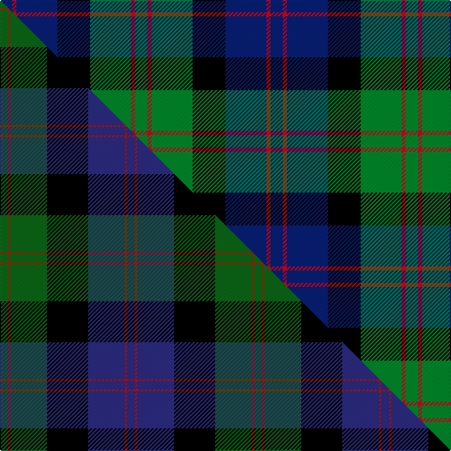

This is one **variant** — a specific cloth: this exact thread count and colourway, with its own
provenance below. It is one weaving of the [sett](/tartans/b/bl/blair/) (the scale-free proportion — the
same cloth at any scale or shade), whose colour order is pattern [BRBKGRG](/stripes/brbkgrg/).

Part of the [Blair](/tartans/b/bl/blair/) tartan — the named design grouping this sett with its other cloths.

Sourced from house-of-tartan.  It is a [7 stripe tartan](/stripes/stripes7/).

Original link [http://www.house-of-tartan.scotland.net/house/TartanViewjs.asp?colr=Def&tnam=416](http://www.house-of-tartan.scotland.net/house/TartanViewjs.asp?colr=Def&tnam=416)

## Provenance

Earliest known date: pre 1963 Described by MacKinlay as a "Modern family sett".

2 attestations — the source records this cloth was collapsed from (oldest owns this page)

<ul>
<li>pre 1963 — Blair Clan Tartan (house-of-tartan, <a href="http://www.house-of-tartan.scotland.net/house/TartanViewjs.asp?colr=Def&tnam=416">record</a>) </li>
<li>undated — Blair (weddslist, <a href="http://www.weddslist.com/cgi-bin/tartans/pg.pl?source=sts">record</a>) </li>
</ul>

Dataset <small>— provenance for this record, inherited from the source manifest</small>

<dl class="dataset-prov">
<dt>source</dt><dd><a href="/sources/house-of-tartan/">House of Tartan</a></dd>
<dt>data captured from</dt><dd><a href="https://github.com/thetartan/tartan-database/blob/master/data/house-of-tartan/data.csv">https://github.com/thetartan/tartan-database/blob/master/data/house-of-tartan/data.csv</a></dd>
<dt>data date</dt><dd>pre 1963 <small>(this record)</small></dd>
<dt>licence</dt><dd><a href="https://creativecommons.org/licenses/by-nc-nd/4.0/">CC BY-NC-ND 4.0</a></dd>
</dl>

Capture chain <small>— the hands this data passed through, oldest first; each capture carries its own licence</small>

<ol class="capture-chain">
<li><a href="http://www.house-of-tartan.scotland.net/">House of Tartan</a> <small>the weaver/retailer's database — the site is now offline; the URL is kept as the ultimate source's identity</small></li>
<li><a href="https://github.com/thetartan/tartan-database">thetartan/tartan-database</a> <small>2016-2017</small> · <a href="https://creativecommons.org/licenses/by-nc-nd/4.0/">CC BY-NC-ND 4.0</a> <small>Levko Kravets's frozen compilation — the capture we vendored, and where its CC licence text came from</small></li>
<li>this dictionary <small>captured 2026-06-10 · commit 5bf86c7566</small> <small>each re-capture is a git commit to data/sources</small></li>
</ol>

## Thread count
DB/12 R4 DB40 K32 G40 R4 G/12

One full sett is **264 threads**.

## Palette
<table><thead><tr><th>Colour</th><th>Shade</th><th>OKLCh</th></tr></thead><tbody><tr><td>DB</td><td><code style="background-color:#082077;">#082077</code> <small style="color:#888">#082077</small></td><td><small style="color:#888">oklch(30.0% 0.149 265.1)</small></td></tr><tr><td>G</td><td><code style="background-color:#008B2A;">#008B2A</code> <small style="color:#888">#008B2A</small></td><td><small style="color:#888">oklch(55.4% 0.170 145.9)</small></td></tr><tr><td>K</td><td><code style="background-color:#000000;">#000000</code> <small style="color:#888">#000000</small></td><td><small style="color:#888">oklch(0.0% 0.000 0.0)</small></td></tr><tr><td>R</td><td><code style="background-color:#D60020;">#D60020</code> <small style="color:#888">#D60020</small></td><td><small style="color:#888">oklch(55.2% 0.224 25.5)</small></td></tr></tbody></table>

# Sample pattern

## Compared to the master

This cloth is one sett of its design; the master sett (the exemplar the design is anchored on) is below for comparison.

Its **ΔTartan distance** from the master is **0.53** — the same measure the nearest-tartans table ranks by (0 is identical; a re-scale of the same cloth is near 0, a recolour or a different proportion further).

<figure class="master-compare" style="margin:0">

this sett
master sett ★

<figcaption style="color:#888;font-size:smaller">One weave of this sett against the <a href="/setts/dg4r1dg18k20db18r1db4/">master sett ★</a>, split on the diagonal: a shared proportion runs seamlessly across it with only the shades shifting; a different proportion breaks on it.</figcaption>
</figure>

## Nearest tartan variants

The nearest existing variants by ΔTartan distance, with this cloth at the top so the swatches line up against it.

ΔTartan

Threads

Variant

Sett

—

264

<a href="/variants/s7/db3r1db10k8g10r1g3~x4/">Blair Clan Tartan</a>

<a href="/ttd/edit/#slug=db3r2db21k11g21r2g3~x2&amp;base=db3r1db10k8g10r1g3~x4" title="compare in the TTD">0.23</a>

240

<a href="/variants/s7/db3r2db21k11g21r2g3~x2/">MacThomas</a>

<a href="/ttd/edit/#slug=db3r2db21k11g21r2g3&amp;base=db3r1db10k8g10r1g3~x4" title="compare in the TTD">0.23</a>

120

<a href="/variants/s7/db3r2db21k11g21r2g3/">MacThomas</a>

<a href="/ttd/edit/#slug=db3r2db22k11g22r2g3~x2&amp;base=db3r1db10k8g10r1g3~x4" title="compare in the TTD">0.25</a>

248

<a href="/variants/s7/db3r2db22k11g22r2g3~x2/">Gammell (1978) (Personal)</a>

<a href="/ttd/edit/#slug=db2r2db21k11g21r2g2~x2&amp;base=db3r1db10k8g10r1g3~x4" title="compare in the TTD">0.26</a>

236

<a href="/variants/s7/db2r2db21k11g21r2g2~x2/">MacThomas</a>

<a href="/ttd/edit/#slug=g16lb3g3k10db12dr2db3~x2&amp;base=db3r1db10k8g10r1g3~x4" title="compare in the TTD">0.94</a>

158

<a href="/variants/s7/g16lb3g3k10db12dr2db3~x2/">MacLean, Donald (Personal)</a>

<a href="/ttd/edit/#slug=db4k3db16k14g14r3g3~x2&amp;base=db3r1db10k8g10r1g3~x4" title="compare in the TTD">1.61</a>

214

<a href="/variants/s7/db4k3db16k14g14r3g3~x2/">Inneryne (Personal)</a>

<a href="/ttd/edit/#slug=dr3g1dr1g8k8db8k2db3~x2&amp;base=db3r1db10k8g10r1g3~x4" title="compare in the TTD">1.67</a>

124

<a href="/variants/s8/dr3g1dr1g8k8db8k2db3~x2/">Baird</a>

<a href="/ttd/edit/#slug=r4k4db24k24g24k2r3~x2&amp;base=db3r1db10k8g10r1g3~x4" title="compare in the TTD">1.80</a>

326

<a href="/variants/s7/r4k4db24k24g24k2r3~x2/">Black Watch</a>

<a href="/ttd/edit/#slug=db3g28db3k16db28r3&amp;base=db3r1db10k8g10r1g3~x4" title="compare in the TTD">1.82</a>

156

<a href="/variants/s6/db3g28db3k16db28r3/">Flower of Scotland</a>

<a href="/ttd/edit/#slug=g8lb1g1k6dp6k1dp3~x4&amp;base=db3r1db10k8g10r1g3~x4" title="compare in the TTD">1.85</a>

164

<a href="/variants/s7/g8lb1g1k6dp6k1dp3~x4/">Unnamed 19th Century Plaid</a>

## Neighbour map

Every grey dot is one of 13662 variants placed by the first two principal components of the ΔTartan feature space (42% of its variance). Red is this tartan; blue dots are its nearest — click one to open its page. The map is a flat projection of a many-dimensional space — [how to read it](/posts/neighbourhood-maps/).

<svg viewBox="0 0 640 380" role="img" style="max-width:100%;height:auto;border:1px solid #e0e0e0;border-radius:4px;display:block" xmlns="http://www.w3.org/2000/svg"><image href="/nn/cloud.v1.png" width="640" height="380"/><a href="/variants/s7/db3r2db21k11g21r2g3~x2/"><circle cx="181.5" cy="186.7" r="4" fill="#3465a4"><title>MacThomas</title></circle></a><a href="/variants/s7/db3r2db21k11g21r2g3/"><circle cx="181.5" cy="186.7" r="4" fill="#3465a4"><title>MacThomas</title></circle></a><a href="/variants/s7/db3r2db22k11g22r2g3~x2/"><circle cx="186.8" cy="183.8" r="4" fill="#3465a4"><title>Gammell (1978) (Personal)</title></circle></a><a href="/variants/s7/db2r2db21k11g21r2g2~x2/"><circle cx="182.0" cy="182.3" r="4" fill="#3465a4"><title>MacThomas</title></circle></a><a href="/variants/s7/g16lb3g3k10db12dr2db3~x2/"><circle cx="130.9" cy="197.7" r="4" fill="#3465a4"><title>MacLean, Donald (Personal)</title></circle></a><a href="/variants/s7/db4k3db16k14g14r3g3~x2/"><circle cx="126.5" cy="227.5" r="4" fill="#3465a4"><title>Inneryne (Personal)</title></circle></a><a href="/variants/s8/dr3g1dr1g8k8db8k2db3~x2/"><circle cx="129.3" cy="211.2" r="4" fill="#3465a4"><title>Baird</title></circle></a><a href="/variants/s7/r4k4db24k24g24k2r3~x2/"><circle cx="151.2" cy="179.2" r="4" fill="#3465a4"><title>Black Watch</title></circle></a><a href="/variants/s6/db3g28db3k16db28r3/"><circle cx="197.2" cy="204.6" r="4" fill="#3465a4"><title>Flower of Scotland</title></circle></a><a href="/variants/s7/g8lb1g1k6dp6k1dp3~x4/"><circle cx="144.7" cy="208.2" r="4" fill="#3465a4"><title>Unnamed 19th Century Plaid</title></circle></a><circle cx="155.5" cy="202.9" r="5" fill="#c00000"/><text x="320" y="376" text-anchor="middle" font-size="11" fill="#999">ground</text><text x="11" y="190" text-anchor="middle" font-size="11" fill="#999" transform="rotate(-90 11 190)">complexity</text></svg>

ID: /variants/s7/db3r1db10k8g10r1g3~x4/
