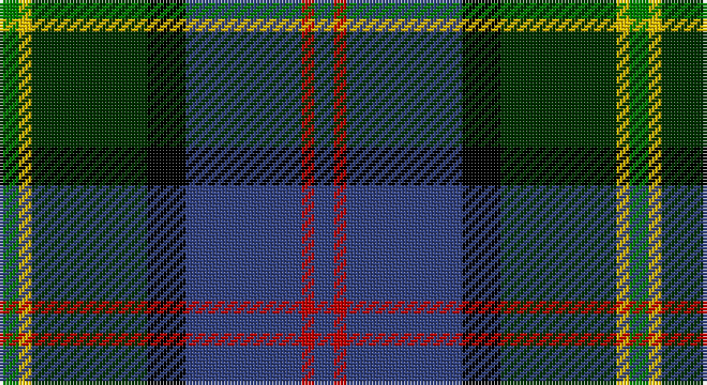

This page is one **sett** — a single exact thread-count. It belongs to the [tartan](/setts/db3r2db18k6dg18ly2g3/)
(the same proportion at any scale), whose colour order is pattern [BRBKGYG](/stripes/brbkgyg/).

Sourced from weddslist.  It is a [7 stripe tartan](/stripes/stripes7/).

Original link http://www.weddslist.com/cgi-bin/tartans/pg.pl?source=sts

## Thread count
G/6 Y4 DG36 K12 B36 R4 B/6

One full sett is **196 threads**.

## Palette

Palette: <strong>Ingles Buchan</strong> <small style="color:#888">(1 of 6 colours)</small>
<table><thead><tr><th>Colour</th><th>Threads</th><th>Shade</th><th>Base</th><th>OKLCh</th></tr></thead><tbody><tr><td>G/</td><td style="text-align:right;font-variant-numeric:tabular-nums">6</td><td><code style="background-color:#008000;">#008000</code> <small style="color:#888">#008000</small></td><td>G <code style="background-color:#006100;">#006100</code></td><td><small style="color:#888">oklch(52.0% 0.177 142.5)</small></td></tr><tr><td>Y</td><td style="text-align:right;font-variant-numeric:tabular-nums">4</td><td><code style="background-color:#F0C000;">#F0C000</code> <small style="color:#888">#F0C000</small></td><td>Y <code style="background-color:#F2BF00;">#F2BF00</code></td><td><small style="color:#888">oklch(82.7% 0.169 90.5)</small></td></tr><tr><td>DG</td><td style="text-align:right;font-variant-numeric:tabular-nums">36</td><td><code style="background-color:#003000;">#003000</code> <small style="color:#888">#003000</small></td><td>G <code style="background-color:#006100;">#006100</code></td><td><small style="color:#888">oklch(26.8% 0.091 142.5)</small></td></tr><tr><td>K</td><td style="text-align:right;font-variant-numeric:tabular-nums">12</td><td><code style="background-color:#000000;">#000000</code> <small style="color:#888">#000000</small></td><td>K <code style="background-color:#000000;">#000000</code></td><td><small style="color:#888">oklch(0.0% 0.000 0.0)</small></td></tr><tr><td>B</td><td style="text-align:right;font-variant-numeric:tabular-nums">36</td><td><code style="background-color:#304080;">#304080</code> <small style="color:#888">#304080</small></td><td>B <code style="background-color:#2A418A;">#2A418A</code></td><td><small style="color:#888">oklch(39.4% 0.109 270.2)</small></td></tr><tr><td>R</td><td style="text-align:right;font-variant-numeric:tabular-nums">4</td><td><code style="background-color:#C00000;">#C00000</code> <small style="color:#888">#C00000</small></td><td>R <code style="background-color:#CC0000;">#CC0000</code></td><td><small style="color:#888">oklch(50.7% 0.208 29.2)</small></td></tr><tr><td>B/</td><td style="text-align:right;font-variant-numeric:tabular-nums">6</td><td><code style="background-color:#304080;">#304080</code> <small style="color:#888">#304080</small></td><td>B <code style="background-color:#2A418A;">#2A418A</code></td><td><small style="color:#888">oklch(39.4% 0.109 270.2)</small></td></tr></tbody></table>

# Sample pattern

## Nearest tartans

The nearest existing variants by ΔTartan distance, with this tartan at the top so the swatches line up against it.

ΔTartan

Tartan

Sett

—

<a href="/ttd/edit/#slug=db3r2db18k6dg18ly2g3~x2">McComb</a> <a class="nn-out" href="/variants/s7/db3r2db18k6dg18ly2g3~x2/" title="open its dictionary page">↗</a>

0.67

<a href="/ttd/edit/#slug=r3g3db4g17k13dt26w3~x2&amp;base=db3r2db18k6dg18ly2g3~x2">Royal Burgh of Peebles (District)</a> <a class="nn-out" href="/variants/s7/r3g3db4g17k13dt26w3~x2/" title="open its dictionary page">↗</a>

0.72

<a href="/ttd/edit/#slug=db3r2db18k6gi18ly2g3~x2&amp;base=db3r2db18k6dg18ly2g3~x2">McComb (Personal)</a> <a class="nn-out" href="/variants/s7/db3r2db18k6gi18ly2g3~x2/" title="open its dictionary page">↗</a>

0.73

<a href="/ttd/edit/#slug=k29r3dt24n6k8w4n8o6~x2&amp;base=db3r2db18k6dg18ly2g3~x2">Yates (Personal)</a> <a class="nn-out" href="/variants/s8/k29r3dt24n6k8w4n8o6~x2/" title="open its dictionary page">↗</a>

0.79

<a href="/ttd/edit/#slug=w5k26ly2dg24dt7k3r3~x2&amp;base=db3r2db18k6dg18ly2g3~x2">Cornish Hunting District Tartan</a> <a class="nn-out" href="/variants/s7/w5k26ly2dg24dt7k3r3~x2/" title="open its dictionary page">↗</a>

0.80

<a href="/variants/s7/g16lb3g3ki10db12r2k3~x2/">MacLean, Donald Personal Tartan</a>

0.81

<a href="/ttd/edit/#slug=r2k6ly1dg12ly1db6lr2~x4&amp;base=db3r2db18k6dg18ly2g3~x2">James (Personal)</a> <a class="nn-out" href="/variants/s7/r2k6ly1dg12ly1db6lr2~x4/" title="open its dictionary page">↗</a>

0.85

<a href="/variants/s9/dy4db3ki18k3ki2g18dy3g2lb2~x4/">Tombow 21st School Memorial</a>

0.85

<a href="/ttd/edit/#slug=w2db20r3k10g20lo2~x2&amp;base=db3r2db18k6dg18ly2g3~x2">Morris of Eddergoll (Personal)</a> <a class="nn-out" href="/variants/s6/w2db20r3k10g20lo2~x2/" title="open its dictionary page">↗</a>

0.86

<a href="/ttd/edit/#slug=r3g2db27k19g27dp2ly3~x2&amp;base=db3r2db18k6dg18ly2g3~x2">Christian Hunting (Personal)</a> <a class="nn-out" href="/variants/s7/r3g2db27k19g27dp2ly3~x2/" title="open its dictionary page">↗</a>

0.91

<a href="/ttd/edit/#slug=db34w5db5r5db5dr26g33o6~x2&amp;base=db3r2db18k6dg18ly2g3~x2">Blairmore</a> <a class="nn-out" href="/variants/s8/db34w5db5r5db5dr26g33o6~x2/" title="open its dictionary page">↗</a>

## Neighbour map

Every grey dot is one of 14360 variants placed by the first two principal components of the ΔTartan feature space (44% of its variance). Red is this tartan; blue dots are its nearest — click one to open its page.

<svg viewBox="0 0 640 380" role="img" style="max-width:100%;height:auto;border:1px solid #e0e0e0;border-radius:4px;display:block" xmlns="http://www.w3.org/2000/svg"><image href="/nn/cloud.v1.png" width="640" height="380"/><a href="/variants/s7/r3g3db4g17k13dt26w3~x2/"><circle cx="155.6" cy="191.2" r="4" fill="#3465a4"><title>Royal Burgh of Peebles (District)</title></circle></a><a href="/variants/s7/db3r2db18k6gi18ly2g3~x2/"><circle cx="184.9" cy="185.1" r="4" fill="#3465a4"><title>McComb (Personal)</title></circle></a><a href="/variants/s8/k29r3dt24n6k8w4n8o6~x2/"><circle cx="174.5" cy="179.6" r="4" fill="#3465a4"><title>Yates (Personal)</title></circle></a><a href="/variants/s7/w5k26ly2dg24dt7k3r3~x2/"><circle cx="196.0" cy="164.1" r="4" fill="#3465a4"><title>Cornish Hunting District Tartan</title></circle></a><a href="/variants/s7/g16lb3g3ki10db12r2k3~x2/"><circle cx="129.8" cy="197.4" r="4" fill="#3465a4"><title>MacLean, Donald Personal Tartan</title></circle></a><a href="/variants/s7/r2k6ly1dg12ly1db6lr2~x4/"><circle cx="163.3" cy="170.6" r="4" fill="#3465a4"><title>James (Personal)</title></circle></a><a href="/variants/s9/dy4db3ki18k3ki2g18dy3g2lb2~x4/"><circle cx="155.6" cy="162.2" r="4" fill="#3465a4"><title>Tombow 21st School Memorial</title></circle></a><a href="/variants/s6/w2db20r3k10g20lo2~x2/"><circle cx="138.7" cy="182.4" r="4" fill="#3465a4"><title>Morris of Eddergoll (Personal)</title></circle></a><a href="/variants/s7/r3g2db27k19g27dp2ly3~x2/"><circle cx="174.9" cy="167.6" r="4" fill="#3465a4"><title>Christian Hunting (Personal)</title></circle></a><a href="/variants/s8/db34w5db5r5db5dr26g33o6~x2/"><circle cx="119.1" cy="180.2" r="4" fill="#3465a4"><title>Blairmore</title></circle></a><circle cx="177.1" cy="182.7" r="5" fill="#c00000"/></svg>

ID: /variants/s7/db3r2db18k6dg18ly2g3~x2/
