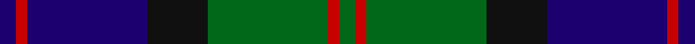
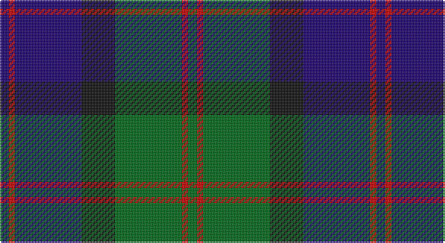

This page is one **sett** — a single exact thread-count. It belongs to the [tartan](/setts/db3r2db22k11g22r2g3/)
(the same proportion at any scale), whose colour order is pattern [BRBKGRG](/stripes/brbkgrg/).

Part of the [Gammell](/tartans/gammell/) tartan — the named design grouping this sett with its other cloths.

Sourced from register-of-tartans.  It is a [7 stripe tartan](/stripes/stripes7/).

Original link https://www.tartanregister.gov.uk/tartanDetails.aspx?ref=1312

2 attestations — the source records this cloth was collapsed from (oldest owns this page)

<ul>
<li>01/01/1978 — Gammell (1978) (Personal) (register-of-tartans, <a href="https://www.tartanregister.gov.uk/tartanDetails.aspx?ref=1312">record</a>)</li>
<li>pre 1978 — Gammell (1978) (Personal) (tartans-authority, <a href="http://www.tartansauthority.com/tartan-ferret/display/4970/">record</a>)</li>
</ul>

## Register references

External register numbers recorded for this tartan.

- Scottish Register of Tartans: [1312](https://www.tartanregister.gov.uk/tartanDetails.aspx?ref=1312)
- Scottish Tartans Authority (ITI): 4970

## Thread count
DB/6 R4 DB44 K22 G44 R4 G/6

One full sett is **248 threads**.

## Palette

Palette: <strong>Tartan Register</strong>
<table><thead><tr><th>Colour</th><th>Threads</th><th>Shade</th><th>Base</th><th>OKLCh</th></tr></thead><tbody><tr><td>DB/</td><td style="text-align:right;font-variant-numeric:tabular-nums">6</td><td><code style="background-color:#1C0070;">#1C0070</code> <small style="color:#888">#1C0070</small></td><td>B <code style="background-color:#2A418A;">#2A418A</code></td><td><small style="color:#888">oklch(26.3% 0.162 277.1)</small></td></tr><tr><td>R</td><td style="text-align:right;font-variant-numeric:tabular-nums">4</td><td><code style="background-color:#C80000;">#C80000</code> <small style="color:#888">#C80000</small></td><td>R <code style="background-color:#CC0000;">#CC0000</code></td><td><small style="color:#888">oklch(52.3% 0.215 29.2)</small></td></tr><tr><td>DB</td><td style="text-align:right;font-variant-numeric:tabular-nums">44</td><td><code style="background-color:#1C0070;">#1C0070</code> <small style="color:#888">#1C0070</small></td><td>B <code style="background-color:#2A418A;">#2A418A</code></td><td><small style="color:#888">oklch(26.3% 0.162 277.1)</small></td></tr><tr><td>K</td><td style="text-align:right;font-variant-numeric:tabular-nums">22</td><td><code style="background-color:#101010;">#101010</code> <small style="color:#888">#101010</small></td><td>K <code style="background-color:#000000;">#000000</code></td><td><small style="color:#888">oklch(17.3% 0.000 89.9)</small></td></tr><tr><td>G</td><td style="text-align:right;font-variant-numeric:tabular-nums">44</td><td><code style="background-color:#006818;">#006818</code> <small style="color:#888">#006818</small></td><td>G <code style="background-color:#006100;">#006100</code></td><td><small style="color:#888">oklch(45.0% 0.142 145.0)</small></td></tr><tr><td>R</td><td style="text-align:right;font-variant-numeric:tabular-nums">4</td><td><code style="background-color:#C80000;">#C80000</code> <small style="color:#888">#C80000</small></td><td>R <code style="background-color:#CC0000;">#CC0000</code></td><td><small style="color:#888">oklch(52.3% 0.215 29.2)</small></td></tr><tr><td>G/</td><td style="text-align:right;font-variant-numeric:tabular-nums">6</td><td><code style="background-color:#006818;">#006818</code> <small style="color:#888">#006818</small></td><td>G <code style="background-color:#006100;">#006100</code></td><td><small style="color:#888">oklch(45.0% 0.142 145.0)</small></td></tr></tbody></table>

# Sample pattern

## Compared to the master

This cloth is one sett of its design; the master sett (the exemplar the design is anchored on) is below for comparison.

<figure style="margin:0"><figcaption style="color:#888;font-size:smaller">this sett</figcaption></figure>
<figure style="margin:0"><figcaption style="color:#888;font-size:smaller"><a href="/setts/t32r3t3r3t3r10g24ri3/">master sett →</a></figcaption></figure>

## Nearest tartans

The nearest existing variants by ΔTartan distance, with this tartan at the top so the swatches line up against it.

ΔTartan

Tartan

Sett

—

<a href="/ttd/edit/#slug=db3r2db22k11g22r2g3~x2">Gammell (1978) (Personal)</a> <a class="nn-out" href="/variants/s7/db3r2db22k11g22r2g3~x2/" title="open its dictionary page">↗</a>

0.77

<a href="/ttd/edit/#slug=k2g10k9db9r1k1db2~x2&amp;base=db3r2db22k11g22r2g3~x2">Reid and Taylor</a> <a class="nn-out" href="/variants/s7/k2g10k9db9r1k1db2~x2/" title="open its dictionary page">↗</a>

0.79

<a href="/ttd/edit/#slug=k7g22k22db6r2db15r2~x2&amp;base=db3r2db22k11g22r2g3~x2">National Galleries of Scotland</a> <a class="nn-out" href="/variants/s7/k7g22k22db6r2db15r2~x2/" title="open its dictionary page">↗</a>

0.80

<a href="/ttd/edit/#slug=k4g21k10r2k10db21k4db4k4~x2&amp;base=db3r2db22k11g22r2g3~x2">Swallow Hotels (Corporate)</a> <a class="nn-out" href="/variants/s9/k4g21k10r2k10db21k4db4k4~x2/" title="open its dictionary page">↗</a>

0.81

<a href="/ttd/edit/#slug=r2g12k12g1db12g2~x2&amp;base=db3r2db22k11g22r2g3~x2">Gunn</a> <a class="nn-out" href="/variants/s6/r2g12k12g1db12g2~x2/" title="open its dictionary page">↗</a>

0.85

<a href="/ttd/edit/#slug=dg5dp3dg32k16db32dp3db5&amp;base=db3r2db22k11g22r2g3~x2">MacThomas LC</a> <a class="nn-out" href="/variants/s7/dg5dp3dg32k16db32dp3db5/" title="open its dictionary page">↗</a>

0.85

<a href="/ttd/edit/#slug=db30k10g10lb2g15lb2~x2&amp;base=db3r2db22k11g22r2g3~x2">MacRobart (Personal)</a> <a class="nn-out" href="/variants/s6/db30k10g10lb2g15lb2~x2/" title="open its dictionary page">↗</a>

0.86

<a href="/ttd/edit/#slug=db24k3db5k23ly2k11g22~x2&amp;base=db3r2db22k11g22r2g3~x2">Mowat (Clans Originaux)</a> <a class="nn-out" href="/variants/s7/db24k3db5k23ly2k11g22~x2/" title="open its dictionary page">↗</a>

0.89

<a href="/ttd/edit/#slug=db6k2db18k18g18k3r2~x2&amp;base=db3r2db22k11g22r2g3~x2">Renfrew</a> <a class="nn-out" href="/variants/s7/db6k2db18k18g18k3r2~x2/" title="open its dictionary page">↗</a>

0.91

<a href="/ttd/edit/#slug=k4g24db6dp3k6dp12g3dp4~x2&amp;base=db3r2db22k11g22r2g3~x2">Gary/Garry (Name)</a> <a class="nn-out" href="/variants/s8/k4g24db6dp3k6dp12g3dp4~x2/" title="open its dictionary page">↗</a>

0.93

<a href="/ttd/edit/#slug=db10k1db1k1db2k8dg10w1~x4&amp;base=db3r2db22k11g22r2g3~x2">Lamont</a> <a class="nn-out" href="/variants/s8/db10k1db1k1db2k8dg10w1~x4/" title="open its dictionary page">↗</a>

## Neighbour map

Every grey dot is one of 14360 variants placed by the first two principal components of the ΔTartan feature space (44% of its variance). Red is this tartan; blue dots are its nearest — click one to open its page.

<svg viewBox="0 0 640 380" role="img" style="max-width:100%;height:auto;border:1px solid #e0e0e0;border-radius:4px;display:block" xmlns="http://www.w3.org/2000/svg"><image href="/nn/cloud.v1.png" width="640" height="380"/><a href="/variants/s7/k2g10k9db9r1k1db2~x2/"><circle cx="221.4" cy="232.8" r="4" fill="#3465a4"><title>Reid and Taylor</title></circle></a><a href="/variants/s7/k7g22k22db6r2db15r2~x2/"><circle cx="218.5" cy="230.5" r="4" fill="#3465a4"><title>National Galleries of Scotland</title></circle></a><a href="/variants/s9/k4g21k10r2k10db21k4db4k4~x2/"><circle cx="224.7" cy="214.8" r="4" fill="#3465a4"><title>Swallow Hotels (Corporate)</title></circle></a><a href="/variants/s6/r2g12k12g1db12g2~x2/"><circle cx="216.6" cy="231.7" r="4" fill="#3465a4"><title>Gunn</title></circle></a><a href="/variants/s7/dg5dp3dg32k16db32dp3db5/"><circle cx="235.0" cy="224.6" r="4" fill="#3465a4"><title>MacThomas LC</title></circle></a><a href="/variants/s6/db30k10g10lb2g15lb2~x2/"><circle cx="264.1" cy="218.3" r="4" fill="#3465a4"><title>MacRobart (Personal)</title></circle></a><a href="/variants/s7/db24k3db5k23ly2k11g22~x2/"><circle cx="238.5" cy="232.6" r="4" fill="#3465a4"><title>Mowat (Clans Originaux)</title></circle></a><a href="/variants/s7/db6k2db18k18g18k3r2~x2/"><circle cx="219.4" cy="240.0" r="4" fill="#3465a4"><title>Renfrew</title></circle></a><a href="/variants/s8/k4g24db6dp3k6dp12g3dp4~x2/"><circle cx="213.8" cy="213.7" r="4" fill="#3465a4"><title>Gary/Garry (Name)</title></circle></a><a href="/variants/s8/db10k1db1k1db2k8dg10w1~x4/"><circle cx="244.1" cy="220.2" r="4" fill="#3465a4"><title>Lamont</title></circle></a><circle cx="231.6" cy="211.5" r="5" fill="#c00000"/></svg>

ID: /variants/s7/db3r2db22k11g22r2g3~x2/
