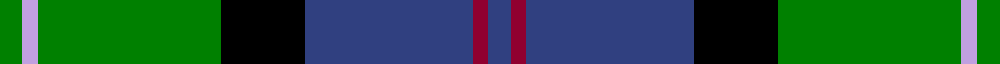
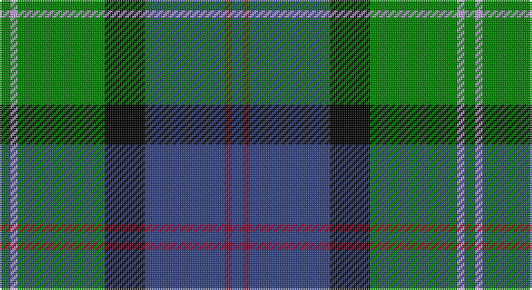

This page is one **sett** — a single exact thread-count. It belongs to the [tartan](/setts/db3r2db22k11g24lp2g3/)
(the same proportion at any scale), whose colour order is pattern [BRBKGWG](/stripes/brbkgwg/).

Part of the [MacThomas](/tartans/macthomas/) tartan — the named design grouping this sett with its other cloths.

Sourced from weddslist.  It is a [7 stripe tartan](/stripes/stripes7/).

Original link http://www.weddslist.com/cgi-bin/tartans/pg.pl?source=sts

## Thread count
G/6 LP4 G48 K22 B44 DR4 B/6

One full sett is **256 threads**.

## Palette

Palette: <strong>Ingles Buchan</strong> <small style="color:#888">(1 of 5 colours)</small>
<table><thead><tr><th>Colour</th><th>Threads</th><th>Shade</th><th>Base</th><th>OKLCh</th></tr></thead><tbody><tr><td>G/</td><td style="text-align:right;font-variant-numeric:tabular-nums">6</td><td><code style="background-color:#008000;">#008000</code> <small style="color:#888">#008000</small></td><td>G <code style="background-color:#006100;">#006100</code></td><td><small style="color:#888">oklch(52.0% 0.177 142.5)</small></td></tr><tr><td>LP</td><td style="text-align:right;font-variant-numeric:tabular-nums">4</td><td><code style="background-color:#C0A0E0;">#C0A0E0</code> <small style="color:#888">#C0A0E0</small></td><td>W <code style="background-color:#F7F7F7;">#F7F7F7</code></td><td><small style="color:#888">oklch(75.7% 0.096 307.0)</small></td></tr><tr><td>G</td><td style="text-align:right;font-variant-numeric:tabular-nums">48</td><td><code style="background-color:#008000;">#008000</code> <small style="color:#888">#008000</small></td><td>G <code style="background-color:#006100;">#006100</code></td><td><small style="color:#888">oklch(52.0% 0.177 142.5)</small></td></tr><tr><td>K</td><td style="text-align:right;font-variant-numeric:tabular-nums">22</td><td><code style="background-color:#000000;">#000000</code> <small style="color:#888">#000000</small></td><td>K <code style="background-color:#000000;">#000000</code></td><td><small style="color:#888">oklch(0.0% 0.000 0.0)</small></td></tr><tr><td>B</td><td style="text-align:right;font-variant-numeric:tabular-nums">44</td><td><code style="background-color:#304080;">#304080</code> <small style="color:#888">#304080</small></td><td>B <code style="background-color:#2A418A;">#2A418A</code></td><td><small style="color:#888">oklch(39.4% 0.109 270.2)</small></td></tr><tr><td>DR</td><td style="text-align:right;font-variant-numeric:tabular-nums">4</td><td><code style="background-color:#900030;">#900030</code> <small style="color:#888">#900030</small></td><td>R <code style="background-color:#CC0000;">#CC0000</code></td><td><small style="color:#888">oklch(41.6% 0.166 13.6)</small></td></tr><tr><td>B/</td><td style="text-align:right;font-variant-numeric:tabular-nums">6</td><td><code style="background-color:#304080;">#304080</code> <small style="color:#888">#304080</small></td><td>B <code style="background-color:#2A418A;">#2A418A</code></td><td><small style="color:#888">oklch(39.4% 0.109 270.2)</small></td></tr></tbody></table>

# Sample pattern

## Compared to the master

This cloth is one sett of its design; the master sett (the exemplar the design is anchored on) is below for comparison.

<figure style="margin:0"><figcaption style="color:#888;font-size:smaller">this sett</figcaption></figure>
<figure style="margin:0"><figcaption style="color:#888;font-size:smaller"><a href="/setts/dg5lp3dg32k16b32m3b5/">master sett →</a></figcaption></figure>

## Nearest tartans

The nearest existing variants by ΔTartan distance, with this tartan at the top so the swatches line up against it.

ΔTartan

Tartan

Sett

—

<a href="/ttd/edit/#slug=db3r2db22k11g24lp2g3~x2">MacThomas</a> <a class="nn-out" href="/variants/s7/db3r2db22k11g24lp2g3~x2/" title="open its dictionary page">↗</a>

0.68

<a href="/ttd/edit/#slug=k3r1ly1db11g13db5r1ly1~x2&amp;base=db3r2db22k11g24lp2g3~x2">Snodgrass</a> <a class="nn-out" href="/variants/s8/k3r1ly1db11g13db5r1ly1~x2/" title="open its dictionary page">↗</a>

0.72

<a href="/ttd/edit/#slug=g28k4g5dr4g5k19db19y2~x2&amp;base=db3r2db22k11g24lp2g3~x2">City of Guelph</a> <a class="nn-out" href="/variants/s8/g28k4g5dr4g5k19db19y2~x2/" title="open its dictionary page">↗</a>

0.79

<a href="/ttd/edit/#slug=g3db12lr1k12g13r2g2~x2&amp;base=db3r2db22k11g24lp2g3~x2">MacPhadran</a> <a class="nn-out" href="/variants/s7/g3db12lr1k12g13r2g2~x2/" title="open its dictionary page">↗</a>

0.84

<a href="/ttd/edit/#slug=g9t2g1k6db6r1db1~x2&amp;base=db3r2db22k11g24lp2g3~x2">MacTaggert</a> <a class="nn-out" href="/variants/s7/g9t2g1k6db6r1db1~x2/" title="open its dictionary page">↗</a>

0.86

<a href="/ttd/edit/#slug=db2r1db10w1y4g8g1g2~x4&amp;base=db3r2db22k11g24lp2g3~x2">Ayrshire</a> <a class="nn-out" href="/variants/s8/db2r1db10w1y4g8g1g2~x4/" title="open its dictionary page">↗</a>

0.89

<a href="/ttd/edit/#slug=k7m3g29db29w3~x2&amp;base=db3r2db22k11g24lp2g3~x2">Highlander, Highland Laddie Kilts</a> <a class="nn-out" href="/variants/s5/k7m3g29db29w3~x2/" title="open its dictionary page">↗</a>

0.89

<a href="/ttd/edit/#slug=db24k4r3k4g24k4lo4~x2&amp;base=db3r2db22k11g24lp2g3~x2">Skene</a> <a class="nn-out" href="/variants/s7/db24k4r3k4g24k4lo4~x2/" title="open its dictionary page">↗</a>

0.90

<a href="/ttd/edit/#slug=r3k2g15k10db20k2ly2~x2&amp;base=db3r2db22k11g24lp2g3~x2">MacLeod, Macleod of Harris</a> <a class="nn-out" href="/variants/s7/r3k2g15k10db20k2ly2~x2/" title="open its dictionary page">↗</a>

0.90

<a href="/ttd/edit/#slug=r2db23k14g16k2w2~x2&amp;base=db3r2db22k11g24lp2g3~x2">MacPhail, hunting</a> <a class="nn-out" href="/variants/s6/r2db23k14g16k2w2~x2/" title="open its dictionary page">↗</a>

0.93

<a href="/ttd/edit/#slug=w15dg98dt72r25dt8ly15&amp;base=db3r2db22k11g24lp2g3~x2">Afternoon Tea / Darjeeling</a> <a class="nn-out" href="/variants/s6/w15dg98dt72r25dt8ly15/" title="open its dictionary page">↗</a>

## Neighbour map

Every grey dot is one of 14360 variants placed by the first two principal components of the ΔTartan feature space (44% of its variance). Red is this tartan; blue dots are its nearest — click one to open its page.

<svg viewBox="0 0 640 380" role="img" style="max-width:100%;height:auto;border:1px solid #e0e0e0;border-radius:4px;display:block" xmlns="http://www.w3.org/2000/svg"><image href="/nn/cloud.v1.png" width="640" height="380"/><a href="/variants/s8/k3r1ly1db11g13db5r1ly1~x2/"><circle cx="221.6" cy="161.9" r="4" fill="#3465a4"><title>Snodgrass</title></circle></a><a href="/variants/s8/g28k4g5dr4g5k19db19y2~x2/"><circle cx="209.2" cy="180.2" r="4" fill="#3465a4"><title>City of Guelph</title></circle></a><a href="/variants/s7/g3db12lr1k12g13r2g2~x2/"><circle cx="168.6" cy="181.1" r="4" fill="#3465a4"><title>MacPhadran</title></circle></a><a href="/variants/s7/g9t2g1k6db6r1db1~x2/"><circle cx="144.7" cy="193.7" r="4" fill="#3465a4"><title>MacTaggert</title></circle></a><a href="/variants/s8/db2r1db10w1y4g8g1g2~x4/"><circle cx="177.2" cy="170.8" r="4" fill="#3465a4"><title>Ayrshire</title></circle></a><a href="/variants/s5/k7m3g29db29w3~x2/"><circle cx="198.1" cy="205.9" r="4" fill="#3465a4"><title>Highlander, Highland Laddie Kilts</title></circle></a><a href="/variants/s7/db24k4r3k4g24k4lo4~x2/"><circle cx="149.2" cy="183.6" r="4" fill="#3465a4"><title>Skene</title></circle></a><a href="/variants/s7/r3k2g15k10db20k2ly2~x2/"><circle cx="151.2" cy="180.6" r="4" fill="#3465a4"><title>MacLeod, Macleod of Harris</title></circle></a><a href="/variants/s6/r2db23k14g16k2w2~x2/"><circle cx="167.0" cy="187.3" r="4" fill="#3465a4"><title>MacPhail, hunting</title></circle></a><a href="/variants/s6/w15dg98dt72r25dt8ly15/"><circle cx="205.8" cy="188.4" r="4" fill="#3465a4"><title>Afternoon Tea / Darjeeling</title></circle></a><circle cx="195.0" cy="177.1" r="5" fill="#c00000"/></svg>

ID: /variants/s7/db3r2db22k11g24lp2g3~x2/
